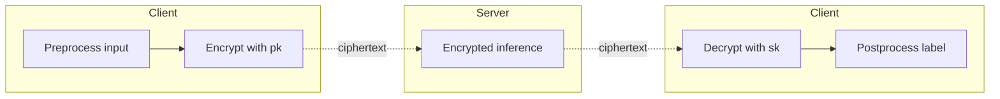
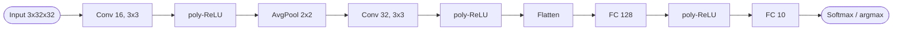
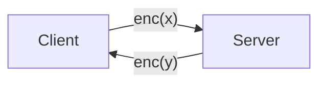
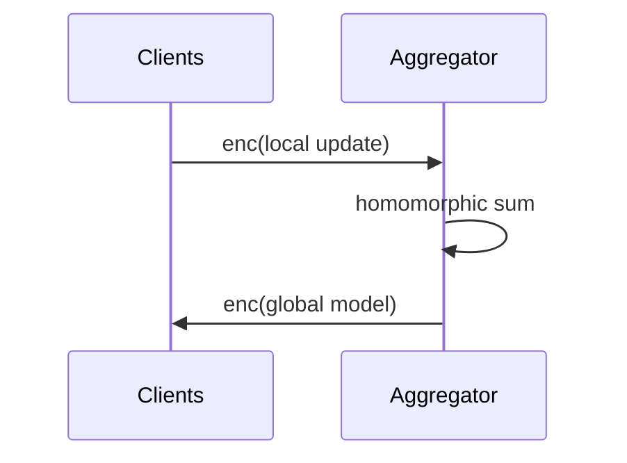

# Paper Extraction Template

Reusable template for summarizing **one** FHE + privacy-preserving ML paper into its own markdown file. One paper = one file. The files are the site's content: GitHub Pages renders the Mermaid blocks natively, so no build step is needed to see the diagrams.

## How to use

1. Copy this file to `summaries/<short-slug>.md` — one file per paper (e.g. `summaries/badawi-2021-hcnn.md`, `summaries/njungle-2025-activate-me.md`).
2. Read the source PDF in `papers/` and fill in every section below.
3. Rules:
   - If a section does not apply or the paper does not report it, write `Not reported` — do not delete the heading (the site renderer expects a stable structure across files).
   - Quote numbers exactly as given (include units, dataset split, and hardware where stated). Do not round.
   - Use the paper's own terminology for schemes and models (e.g. `CKKS`, not "an approximate scheme"); add a one-line gloss in parentheses on first use if the term is niche.
   - Diagrams are **Mermaid** code blocks (` ```mermaid `). GitHub renders them automatically on the Pages site. Keep node labels short (≤ 4 words) so the diagram stays readable on mobile. Prefer `flowchart LR` for pipelines/architectures and `sequenceDiagram` only when the client/server message order is the point.
   - Cite page or section numbers in square brackets for any non-trivial claim, e.g. `[§3.2]` or `[p. 7]`, so a reader can verify without re-reading the paper.
   - The `comparison:` block in the front matter is consumed by a build script to produce a cross-paper comparison table on the site. Keep keys and units consistent across papers — see the per-field rules below.

---

## Front matter

```yaml
---
title: <full paper title>
authors: [<author 1>, <author 2>, ...]
year: <YYYY>
venue: <conference / journal / preprint server>
doi_or_url: <DOI or stable URL, or "Not reported">
pdf: papers/<filename>.pdf
tags: [<fhe-scheme>, <ml-task>, <domain>, ...]   # e.g. [ckks, cnn, medical-imaging, inference]

# Fields aggregated into the site-wide comparison table.
# Use "N/A" (string) when the paper does not have a neural network or does not report the value.
# Keep units consistent: input/hidden node counts are integers, inference time is seconds (float).
comparison:
  title_link: <markdown link, e.g. "[Title](https://doi.org/...)">
  year: <YYYY>
  architecture: <e.g. "FCNN" | "CNN" | "ResNet" | "ResNet-20" | "Transformer" | "SVM" | "N/A">
  nn_layers: <integer total layer count, or "N/A">
  input_nodes: <integer; for images record both the shape and product, e.g. "3x32x32=3072">
  hidden_nodes_min: <integer min width across hidden layers, or "N/A">
  hidden_nodes_max: <integer max width across hidden layers, or "N/A">
  activation: <e.g. "ReLU" | "ReLU (poly-approx deg 4)" | "square" | "sigmoid (poly)" | "N/A">
  fhe_scheme: <e.g. "CKKS" | "BFV" | "BGV" | "TFHE" | "hybrid (CKKS+TFHE)">
  single_inference_seconds: <float seconds for ONE sample inference, or "N/A">
  single_inference_hardware: <one-line hardware string, e.g. "Intel Xeon Gold 6248 @ 2.5GHz, 1 thread">
---
```

### Notes on the comparison fields

- `nn_layers`: count what the paper itself calls a "layer". If ambiguous, count weight-bearing layers (Conv + FC) and add a short note in **ML setup** explaining the convention.
- `input_nodes`: keep the raw shape when the input is an image or tensor (e.g. `3x32x32=3072`) — the build script splits on `=` and uses the integer.
- `hidden_nodes_min` / `hidden_nodes_max`: range across all hidden layers (exclude input and output). If the paper has a single hidden layer, set both to the same value.
- `single_inference_seconds`: time for **one** encrypted sample end-to-end on the server side. If the paper only reports batch latency, divide and note "derived" in **Results**; if only amortized throughput is given, mark `N/A` and put the throughput number in **Results**.
- `single_inference_hardware`: paired with the time so the comparison table is interpretable. Without it, a 1 s number on a 64-core server and a 1 s number on a laptop look identical.

## TL;DR

One or two sentences. What the paper does and why it matters.

## Problem and motivation

What real-world gap or threat model the work addresses. Include the threat model assumptions (honest-but-curious server? malicious client? colluding parties?) if stated.

## Key contributions

Bullet list, in the authors' framing. Keep to 3–6 bullets.

## FHE setup

- **Scheme(s):** e.g. CKKS, BFV, BGV, TFHE, hybrid
- **Library / implementation:** e.g. Microsoft SEAL, OpenFHE, HElib, Concrete, TenSEAL, Lattigo, custom
- **Parameters:** polynomial degree, ciphertext modulus, scale, security level (e.g. 128-bit) — whatever is reported
- **Bootstrapping used:** yes / no / programmable
- **Packing / encoding strategy:** SIMD batching, coefficient packing, channel packing, etc.

## ML setup

- **Task:** classification / regression / segmentation / inference / training / federated round / etc.
- **Model architecture:** layer-by-layer if compact, otherwise summarize (e.g. "5-layer CNN: Conv-BN-ReLU×3 → FC×2")
- **Activation handling:** how nonlinearities (ReLU, softmax, sigmoid) are approximated under FHE — polynomial degree, range, training-aware?
- **Operates on:** plaintext model + encrypted data / encrypted model + plaintext data / both encrypted / federated aggregation only
- **Training vs inference:** which side runs under encryption

## Datasets

| Dataset | Task | Size (train/test) | Modality | Notes |
|---|---|---|---|---|
| <name> | <task> | <splits> | <e.g. images, tabular, EHR> | <preprocessing, normalization range, source> |

## Pipeline diagram

End-to-end ciphertext flow as a Mermaid `flowchart`. Group nodes by actor (client / server / aggregator) using `subgraph`. Use `-.->` for ciphertext transfers and `-->` for local operations. Keep labels short.



### Pipeline steps (text)

Numbered list mirroring the diagram, one imperative action per step. This is the accessible/fallback version and what a reader skims first.

1. <step>
2. <step>
3. <step>
...

## Architecture diagram

Layer-by-layer view of the model the paper actually runs under FHE (not a generic ResNet — the *exact* layers, widths, and activations used). One node per layer; annotate with shape on the edge where it changes.



If the paper compares several architectures, include one Mermaid block per architecture under sub-headings (`### ResNet-20`, `### CNN-5`, etc.).

## Results

Headline metrics with the comparison baseline (plaintext model, prior FHE work, etc.). Include latency, throughput, ciphertext size, and accuracy delta vs. plaintext where reported. Note the hardware used (CPU/GPU model, RAM, cores).

| Metric | This paper | Baseline | Hardware |
|---|---|---|---|
| <accuracy / latency / ...> | <value> | <value> | <hw> |

## Limitations and assumptions

What the authors flag, plus anything obviously load-bearing that they downplay (e.g. unrealistic batch size, ignored communication cost, requires offline preprocessing).

## Related work it compares against

Short list of prior systems it benchmarks against or positions against (paper names or system names like CryptoNets, Gazelle, nGraph-HE, etc.).

## Code and artifacts

Repo URL or "Not released". Note license if given.

## Extra diagrams (optional)

The **Pipeline diagram** and **Architecture diagram** above are required. Add any of the following Mermaid blocks only if the paper genuinely warrants them — do not pad. Drop unused sub-headings.

### Threat model

Use when the paper has a non-trivial multi-party setup (federated learning, MPC-style splits, key-switching parties). One node per party, edges labelled with what is sent.



### Federated round

Use only for federated-learning papers — one round of the protocol.



### Activation approximation

Use when the paper introduces or evaluates a new polynomial activation. Plot the approximation vs. the true function as ASCII or describe it; if too detailed for Mermaid, write `See Figure N in paper` and skip the block.

## Open questions

Anything that was unclear after reading. These become TODOs to either re-read or flag on the site as caveats.
