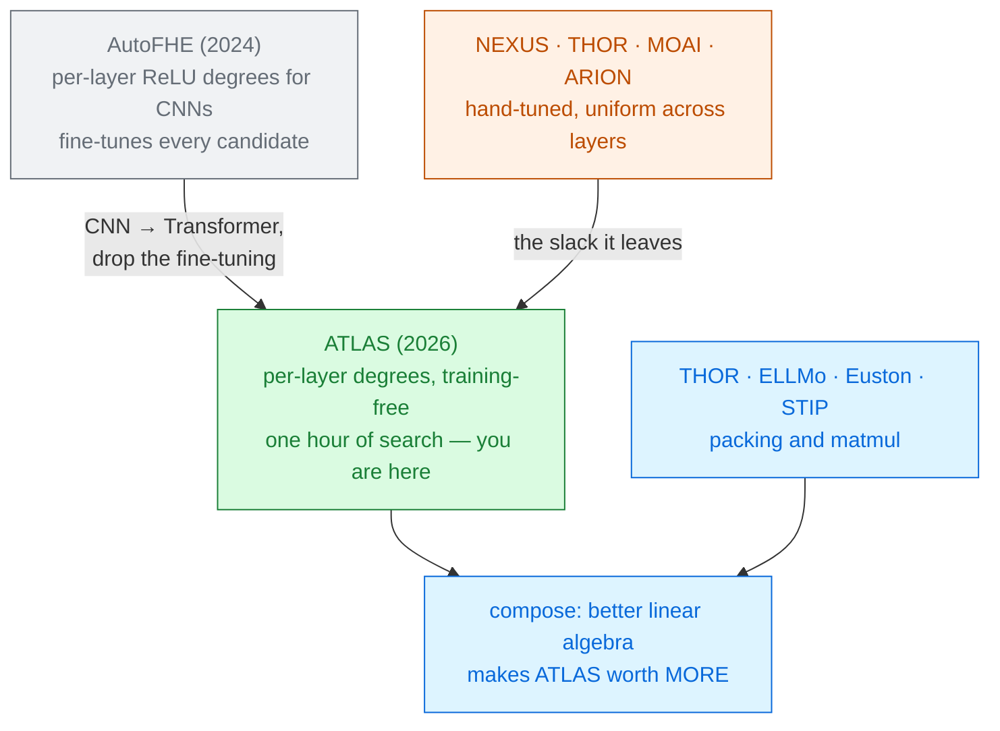

# ATLAS

Jianhang Xie · Sicheng Tan · Vishnu Naresh Boddeti · Zhichao Lu 
City University of Hong Kong · Shandong University · Michigan State University · arXiv 2607.23478 · 2026

Every deck in this module hand-picked its polynomial degrees and iteration counts, then applied them
**uniformly to every layer**. ATLAS points out that this is a search problem with about $10^{85}$
solutions, and solves it in **under an hour** — no retraining, no new cryptography, and a 35% cut in
depth and latency.

Read <a href="../nexus-2024/">NEXUS</a> and <a href="../thor-2024/">THOR</a> first · Module 2

---

# The problem, in plain words

a machine shop where every part is cut to the tolerance the hardest part needs. The one component
that must be precise sets the price of all ninety-five that do not.

<v-clicks>

- Every approximation in this literature has **hyperparameters**: how many Goldschmidt iterations,
  what Chebyshev degree, how many normalize-and-square rounds.
- Current practice picks one setting **per function type** and uses it in all 12 (or 32) layers.
  That setting must satisfy the most demanding layer — *"so every other layer pays for precision it
  does not use"* [§1].
- And the price is depth. On a BERT baseline, non-linear operations **and the bootstrapping they
  force** account for **578 s of 1054 s** — 55% of the run [Fig. 2, §4.2.1].

</v-clicks>

The precision slack in a hand-tuned configuration is not a rounding error. It is a third of the
runtime.

---

# What you need to know first

<v-clicks>

**Every non-linear approximation is a family, not a function.** Iterative softmax has $k$ rounds,
each with an inverse-square-root polynomial of some degree. LayerNorm has an inverse-square-root
degree. GELU has a Chebyshev degree. Pick numbers and you have fixed the depth.

**Depth is the right currency to optimise.** It is decided entirely by those numbers — independent
of packing, backend and hardware — whereas latency depends on all three
[§4.1].

**AutoFHE** (2024) already automated this for **CNNs**: per-layer ReLU degrees, found by
multi-objective search. But it **fine-tunes the network for every candidate**, which is impossible
at 8 billion parameters, and CNNs have only one non-linearity to configure.

</v-clicks>

ATLAS is **training-free**. It never touches the weights — it re-configures the approximations
around a frozen pre-trained model. That is what makes LLaMA3-8B reachable.

---

# The one big idea

Stop asking *"what is the best polynomial for GELU?"* and start asking *"how should a fixed depth
budget be **allocated across all the non-linearities in all the layers**, to minimise end-to-end
error?"* — then let a multi-objective evolutionary search answer it.

<v-clicks>

The formulation that makes it tractable [Eq. 6]:

$$\min_{\lambda}\; \Big(\text{Mul\_Depth}(\tilde f_\lambda),\;\; \text{MAE}(f, \tilde f_\lambda)\Big)$$

- **Depth**, not latency — because depth is backend-independent, so one search transfers everywhere.
- **MAE against the cleartext model**, not task accuracy — because accuracy is too insensitive to
  small output deviations to guide a search.
- **Two objectives, not a constraint.** A tolerance $\epsilon$ calibrated on one task is
  miscalibrated on the next; a **Pareto front** lets the operating point be chosen after the search.

</v-clicks>

---

# Step 1 — what actually gets searched

Each of the $L$ layers gets **eight integers** [Eq. 7].

<strong class="ct">Softmax — 5 variables</strong> 
$p_1 \in [1,7]$, $p_2..p_5 \in [0,7]$. 
Iteration $j$ uses a Chebyshev inverse-square-root of degree $2^{p_j}-1$. 
A zero skips that iteration <em>and every one after it</em> — so the number
of rounds is searched too.

<strong class="ct">Normalisation — 2 variables</strong> 
$p_{\text{attn}}, p_{\text{mlp}} \in [1,9]$, giving inverse-square-root degrees $2^{p}-1$. 
The two LayerNorms in a layer are configured <em>separately</em>.

<strong class="ct">Activation — 1 variable</strong> 
$p_{\text{act}} \in [1,9]$, a single Chebyshev polynomial of degree $2^{p}-1$ for GELU or SiLU.

<v-clicks>

- Read one: $p = (4,3,0,0,0)$ means **two** softmax iterations, at degrees 15 and 7. $(7,7,7,7,7)$
  means five iterations at degree 127 each.
- $8L$ variables in total: **96** for BERT and ViT, **256** for LLaMA3-8B.

</v-clicks>

---

# A tiny worked example — count the space by hand

<v-clicks>

**One layer.** Softmax: $\sum_{k=1}^{5} 7^k = 7+49+343+2{,}401+16{,}807 = \mathbf{19{,}607}$.
Normalisation: $9\times 9 = \mathbf{81}$. Activation: $\mathbf{9}$.

$$|S_{\text{layer}}| = 19{,}607 \times 81 \times 9 = 14{,}293{,}503 \approx 1.43\times 10^{7}$$

**That is the space a human is already choosing from**, when they pick "degree 511 GELU, five
softmax iterations" — and they pick *one* point in it, by hand.

**Twelve layers, independently:** $\;(1.43\times10^{7})^{12} \approx 7.3\times 10^{85}$.

**LLaMA3-8B's thirty-two layers:** $\;(1.43\times10^{7})^{32} \approx 9.2\times 10^{228}$.

</v-clicks>

$10^{85}$ is more than the number of atoms in the observable universe. But the *uniform* space is
only $1.4\times10^{7}$ — small enough to search properly. That gap is the whole design of the
algorithm.

Arithmetic worked here; the totals match Eq. 11.

---

# Step 2 — three reasons this search should not work

### It is NP-hard
The problem generalises multi-dimensional knapsack and per-layer precision assignment. No exact
polynomial-time algorithm is expected [§3.3].

### Evaluation is slow
Scoring **one** candidate — in **cleartext**, not under encryption — takes
**77.5 s** for BERT, **117.9 s** for ViT, **1006.9 s** for LLaMA3-8B [Fig. 3a].

### The space is mostly void
Only **10–15%** of configurations return a finite MAE. The other 85–90% push an approximation
outside its valid domain and return **NaN** [Fig. 3b].

<v-clicks>

Put those together: a naive NSGA-II run over the full budget would take **14.7 days** for BERT
[§4.3.2] — and BERT is the cheap one.

</v-clicks>

The 85–90% NaN rate is worth pausing on. It is not a quirk of the search; it is a property of this
whole field. Most combinations of "reasonable-looking" approximation settings **silently produce
garbage**, because each approximation is valid only on a domain the previous one has to respect.

---

# Step 3 — search the small space first

<v-clicks>

**Stage 1 — the LayerProblem.** Force every layer to share one configuration. The space collapses
from $10^{85}$ to $1.4\times10^{7}$. Population 48, 50 generations = **2,448 evaluations**, about a
tenth of the budget.

**Stage 2 — the NetworkProblem.** Release the constraint. Seed the population with Stage 1's Pareto
set plus a few random configurations, and refine per layer. Population 96, 225 generations =
**21,696 evaluations**.

The algorithm is **NSGA-II**: rank by Pareto dominance, break ties by crowding distance so the front
stays spread out. Two-point crossover at $p = 0.9$; integer step mutation at rate $1/n_{\text{var}}$.

</v-clicks>

Warm-starting matters more than anything else in the algorithm: two-stage reaches the same quality
in **~14,000** evaluations that single-stage needs **~100,000** for — a **7×** reduction — and
single-stage then plateaus *lower* anyway [§4.3.1].

---

# Step 4 — 14.7 days to 22 minutes

Three accelerations, each stacked on the last [§3.5, Fig. 8b]:

<CostBars unit="hours" log :items="[
  { label: 'Plain two-stage NSGA-II', value: 352.8, note: '14.7 days' },
  { label: '+ data-subset surrogate (10 samples)', value: 4.3, note: '82×' },
  { label: '+ early-layer proxy', value: 3.6, note: '1.2× more' },
  { label: '+ 8 GPUs in parallel', value: 0.372, note: '22.3 min — ~950× overall', highlight: true },
]" caption="wall-clock to reach a target hypervolume on BERT" />

<v-clicks>

- **Data-subset surrogate:** compute MAE on **10 sentences** instead of the validation set. Spearman
  rank correlation with the full-set MAE: **0.9987** on BERT. It only has to *rank* candidates
  correctly, not score them.
- **Early-layer proxy:** stop the forward pass at layer 3. Valid only in Stage 1, where all layers
  are identical — disabled in Stage 2.
- Of the final 22.3 minutes, **Stage 1 takes about two**; the rest is per-layer refinement.

</v-clicks>

---

# Threat model

Unchanged from the rest of the module, and deliberately so [§2.4].

| Party | Sees | Never sees |
|---|---|---|
| Client | its own input, the final answer | the model weights |
| Server | one ciphertext, the model | the input, the answer |
| Network observer | two messages | contents |

<v-clicks>

- ATLAS changes **no cryptography**. Same RNS-CKKS parameters ($N = 2^{16}$, budget $D=28$,
  bootstrapping costs $K=14$ levels, 128-bit security), same packing, same protocol.
- It is a **post-processing** step on a frozen model, so it composes with any of the systems in this
  module. The authors are explicit that it is *"orthogonal to the design of efficient packing and
  MM"* [§5.2].

</v-clicks>

Which makes ATLAS unusual here: it is the only paper in the module that could, in principle, be
applied to every other paper in the module.

---

# Results — BERT, and the same search on three backends

SST-2, against the hand-tuned iterative-softmax baseline [Table 1]:

| Config | Depth | Phantom-FHE GPU | Desilo GPU | Desilo CPU | Bootstraps |
|---|---|---|---|---|---|
| IS baseline | 1212 | 1054 s | 489 s | 12,067 s | 600 |
| **ATLAS-S1** | **771** | 779 s (−26.1%) | **288 s (−41.1%)** | 6,814 s (−43.5%) | **372** |
| **ATLAS-S6** | 845 | 809 s (−23.2%) | 315 s (−35.6%) | 7,413 s (−38.6%) | 399 |

<v-clicks>

- At matched cleartext accuracy: **30.7% less depth, 36.1% less latency**, averaged over the three
  tasks. S6 matches the cleartext SST-2 score **exactly** (93.23%).
- **The depth reduction transfers unchanged across backends** (30.3–36.4%) because depth is a
  property of the configuration. The *latency* reduction does not: 23–26% on the authors' own
  system, 39–46% on Desilo CPU.
- Why? Their own unoptimised matmul is 460 s of the 1054 s baseline. **The better your linear
  algebra, the more ATLAS is worth** — it compounds with THOR, ELLMo and STIP.

</v-clicks>

---

# Results — the front has a different shape on every task

Three Pareto fronts on BERT, spanning comparable cost (61–74 levels, 12–29 s)
[§4.2.1]:

<CostBars unit="pp accuracy given up" :items="[
  { label: 'SST-2', value: 0.80, note: 'all 6 configs fit a 1 pp budget' },
  { label: 'RTE', value: 3.25, note: 'only 2 of 6 fit' },
  { label: 'QNLI', value: 4.77, note: 'only 2 of 4 fit' },
]" caption="accuracy relinquished across the front — a 6× spread for the same depth range" />

This is the empirical argument for the **multi-objective** formulation: fix a tolerance $\epsilon$
on SST-2 and it is wrong on QNLI. The best configuration differs by task too — S6, Q4, R6 — *"a
task-specific preference that no single hand-tuned configuration can express"*.

Note the authors' restraint: one config exceeds cleartext RTE accuracy by 0.36 pp, and they write
that this *"corresponds to one additional correct prediction out of 277 and is therefore best
interpreted as parity"*.

---

# Results — how far it generalises, and what the ablation shows

### Other architectures

<v-clicks>

- **ViT-Base / ImageNet-1K**: matches the baseline within **0.03 pp** at 11.5% lower depth
  (2259 s vs 2654 s). But ViT tolerates far less approximation — its whole non-dominated set spans
  **six levels**.
- **LLaMA3-8B / MMLU**: depth cut **25–27%** from 3104, at parity. Latency is *not* reported — an
  end-to-end FHE pass of a 32-layer 8B decoder *"exceeds our single-GPU budget"*.

</v-clicks>

### The ablation's real finding

<v-clicks>

Tuning the three approximation blocks **one at a time**, freezing the others, is beaten by tuning
them **jointly** — at every budget [Fig. 8a].

Grid search needs ~21,000 evaluations to reach a hypervolume of ~310; two-stage joint reaches ~420
in ~14,000.

</v-clicks>

Softmax, LayerNorm and GELU share one depth budget, so their settings are **interdependent** and
cannot be tuned in isolation.

---

# What it costs

<v-clicks>

- **An hour of GPU search per model and task family** — cheap next to fine-tuning, but not zero, and
  it needs 8 GPUs to be an hour rather than four.
- **Trust in a 10-sample surrogate.** The rank correlation is 0.9987 on BERT but only **0.727** for
  LLaMA3-8B's early-layer proxy. The bigger the model, the weaker the shortcut.
- **A heterogeneous configuration** — 96 or 256 numbers rather than three — which must be shipped,
  version-controlled and reproduced alongside the model.
- **Higher MAE at the fast end.** ATLAS-S1 has MAE 0.188 against the baseline's 0.007 on Phantom-FHE
  — 27× worse output deviation, for the same task accuracy. The Pareto front is real: pick S6 if you
  want the error too.
- **Depth, not latency, is what is optimised.** They correlate, but the conversion ratio ranges from
  0.72 to 1.24 depending on the backend.

</v-clicks>

---

# What it does not solve

<v-clicks>

- **Nothing about the cryptography.** No new packing, no new matmul, no bootstrapping improvement.
  ATLAS reallocates depth; it does not create it.
- **The comparison to NEXUS and THOR is indicative, not rigorous** — and the authors say so. Their
  recipes were re-implemented inside ATLAS's system, with ATLAS's packing, matmul and bootstrap
  placement, so the numbers *"characterize the approximation hyperparameters alone"*
  [§4.2.1]. THOR's reported RTE accuracy also comes from fine-tuned weights
  that were never released.
- **The evaluation system is deliberately unoptimised** — plain row packing, chosen for transparency
  [§5.2]. So the absolute latencies here are not competitive with THOR,
  Euston or STIP, and are not meant to be.
- **LLaMA3-8B is never run end to end under encryption.** Depth only.
- **The search overfits if you let it.** Ten proxy samples, non-overlapping with evaluation — a
  discipline the paper follows and a reader should check for.
- **No generation, no long context, no malicious adversaries** — as everywhere in this module.

</v-clicks>

---

# Where it sits

Primer strategy <strong>A</strong> — and the only deck in the module whose contribution is a <em>search procedure</em> rather than a system.

---

# Key terms

<dl class="glossary">
<dt>Approximation hyperparameter</dt><dd>The degree or iteration count fixing how precisely a non-linearity is approximated — and its depth cost.</dd>
<dt>Depth as an objective</dt><dd>Backend- and packing-independent, so one search transfers everywhere.</dd>
<dt>MAE</dt><dd>Mean absolute error against the cleartext model's outputs. The search's accuracy proxy.</dd>
<dt>Pareto front</dt><dd>Configurations where nothing is better on both objectives at once.</dd>
<dt>Hypervolume</dt><dd>How much objective space a front dominates. Used to compare search strategies.</dd>
<dt>NSGA-II</dt><dd>The multi-objective genetic algorithm: rank by dominance, break ties by crowding distance.</dd>
<dt>LayerProblem / NetworkProblem</dt><dd>Stage 1's uniform space (10⁷) and Stage 2's per-layer space (10⁸⁵).</dd>
<dt>Data-subset surrogate</dt><dd>Scoring on 10 samples — valid because it preserves the ranking (ρ ≈ 0.999).</dd>
<dt>Training-free</dt><dd>The weights are never touched. What makes an 8B-parameter model reachable.</dd>
</dl>

---

# Check yourself

**1. Why does ATLAS optimise multiplicative depth rather than latency, when latency is what users care about?**

<v-click>

Because depth is a property of the configuration alone, while latency also depends on backend,
packing, bootstrap placement and hardware. The measured depth reduction is 30.3–36.4% on all three
backends; the latency reduction ranged from 23% to 46%. A latency-driven search would have produced
a different answer for each backend.

</v-click>

**2. 85–90% of configurations return NaN. Why is that a fact about the field and not about the search?**

<v-click>

Because each approximation is valid only on a bounded domain set by the previous operator's output
range. Leave values outside the inverse square root's fitted interval and the forward pass is
garbage. Hand-tuned recipes hide this with *"a significant safety margin"* — exactly the slack
ATLAS reclaims, and exactly why reclaiming it is risky without a validity check.

</v-click>

**3. ATLAS's absolute latencies are worse than THOR's or STIP's. Does that make it a weaker paper?**

<v-click>

No — it is not competing on that axis. ATLAS's system uses plain row packing deliberately, for
transparency, and its matmul is 460 s of a 1054 s baseline. The depth reduction is backend-invariant
and its latency payoff is **larger** on faster backends, so ATLAS multiplies with THOR, Euston and
STIP. A contribution can be orthogonal to a benchmark.

</v-click>

---
layout: center
---

# Where to go next

**The hand-tuned recipes ATLAS reclaims slack from**
[NEXUS (2025)](../nexus-2024/) · [THOR (2024)](../thor-2024/) — read either and count the magic
numbers.

**What ATLAS composes with**
[Euston (2026)](../euston-2026/) · [STIP (2026)](../stip-2026/) · [ELLMo (2026)](../ellmo-2026/) —
better linear algebra makes the depth savings worth more, not less.

**The alternative to searching approximations**
[PowerSoftmax (2024)](../power-softmax-2024/) and
[Polynomial Transformers (2023)](../polynomial-transformers-2023/) — change the operator so there is
less to approximate, at the cost of retraining.

**For calibration on the whole module**
[SoK on approximate HE (2026)](../sok-approx-he-llm-2026/).

← back to <a href="../../slides/">all decks</a>

