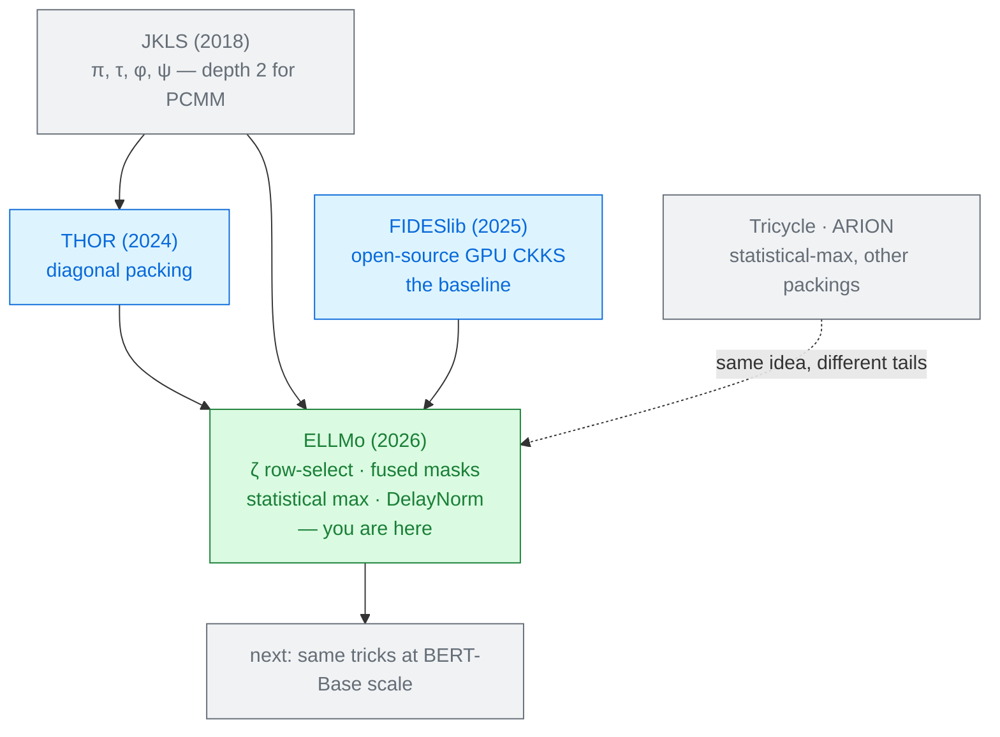

# ELLMo

Seyda Nur Guzelhan · Lohit Daksha · Carlos Agulló Domingo · Gilbert Jonatan ·
John Kim · José L. Abellán · David Kaeli · Ajay Joshi 
Boston University · Universidad de Murcia · KAIST · Northeastern University · 2026

Four optimisations, all following from one measured fact: **an operation on a ciphertext costs about
ten times the same operation on a plaintext**. Move work across that line wherever the algebra
allows, and BERT-Tiny gets 1.4× faster with **46% fewer bootstraps**.

Read <a href="../nexus-2024/">NEXUS</a> and <a href="../thor-2024/">THOR</a> first · Module 2

---

# The problem, in plain words

two workshops sharing a job. One charges ten times the other's rate. Any task that can legally be
moved to the cheap shop should be — and quite a lot of the algebra says it can.

<v-clicks>

- Under CKKS, a rotation on a **ciphertext** needs a **key switch**, the most expensive primitive
  there is. A rotation on a **plaintext** is a re-indexing of an array.
- Transformers rotate constantly, because they keep reshaping data: multi-head attention splits into
  heads, the feed-forward block expands to $4d$ and shrinks back.
- Meanwhile the non-linear layers eat **depth**, and depth spent is bootstrapping owed.

</v-clicks>

Prior work optimised packing *or* depth. ELLMo's claim is that they are one problem: the packing
decides the transforms, the transforms decide the depth, and the depth decides the bootstrapping.

---

# What you need to know first

<v-clicks>

**JKLS** (Jiang–Kim–Lauter–Song, 2018) is the standard homomorphic matrix multiplication. It defines
four permutations, $\pi, \tau, \phi, \psi$, so that
$A\times B = \sum_k \left[\phi^k\!\circ\!\pi(A)\right] \odot \left[\psi^k\!\circ\!\tau(B)\right]$ —
all the products at once, element-wise. It costs **two** levels for plaintext × ciphertext and
**three** for ciphertext × ciphertext.

**Baby-step giant-step** turns $O(d)$ rotations into $O(\sqrt{d})$ by splitting the rotation index
into $b$ small steps and $g$ large ones.

**Head splitting** isolates each attention head by multiplying by a plaintext mask — and a mask
multiply costs a level.

</v-clicks>

The budget is the tightest in this module: $L = 26$, but only **$L_{\text{eff}} = 10$ levels remain
after a bootstrap** [§5.1]. THOR had 13, NEXUS 21. Every level matters.

---

# The one big idea

JKLS treats both operands **symmetrically** — the same kind of transform on each. But in
plaintext × ciphertext, the two sides do not cost the same. ELLMo redesigns the identity so that
the **ciphertext side needs no transform at all**.

### Cost asymmetry
`Rot` on a ciphertext ≈ **10×** `PtRot` on a plaintext [§3.1].

### Pre-encoding transforms
A plaintext transform can be applied **before encoding** — so it becomes ordinary floating-point
work on a real vector, and costs nothing at run time.

<v-click>

Two more consequences of the same instinct: **fuse the head mask into a transform that was already
multiplying by a mask**, and **do not divide when you can defer the division to a layer that will
cancel it anyway**.

</v-click>

---

# Step 1 — shallow PCMM: delete a transform

<v-clicks>

JKLS needs $\pi$ on the ciphertext $A$ and $\tau$ then $\psi$ on the plaintext $B$. ELLMo replaces
$\psi$ with a **row-select** transform $\zeta$:

$$\zeta^k(B)_{i,j} = B_{k,j}$$

— take row $k$ and replicate it down the whole matrix. Then [Prop. 3.1]:

$$A\times B = \sum_{k=0}^{d-1}\phi^k(A)\;\odot\;\zeta^k\!\left(\tau(B)\right)$$

- **$\pi$ on the ciphertext is gone.** $\zeta$ aligns with $\phi(A)$ directly.
- **$\tau$ on the plaintext is gone too** — precompute it before encoding (`pack`$_\tau$).
- One transform on each side. **Depth 2 → 1**, key switches $\approx 6\sqrt{d} \to 3\sqrt{d}$.

</v-clicks>

---

# The same 2×2 product, a third way

The [THOR deck](../thor-2024/) worked $A = \begin{pmatrix}1&2\\3&4\end{pmatrix}$,
$B = \begin{pmatrix}5&6\\7&8\end{pmatrix}$, $AB = \begin{pmatrix}19&22\\43&50\end{pmatrix}$ through
diagonals. Now through ELLMo's identity.

<v-clicks>

- Precompute on the plaintext, before encryption: $\tau(B)_{i,j} = B_{i+j,\,j}$, so
  $\tau(B) = \begin{pmatrix}5&8\\7&6\end{pmatrix}$.
- Row-select: $\zeta^0 = \begin{pmatrix}5&8\\5&8\end{pmatrix}$,
  $\;\zeta^1 = \begin{pmatrix}7&6\\7&6\end{pmatrix}$. Free — it is plaintext.
- Column-shift the **ciphertext**: $\phi^0(A) = \begin{pmatrix}1&2\\3&4\end{pmatrix}$,
  $\;\phi^1(A) = \begin{pmatrix}2&1\\4&3\end{pmatrix}$. Two rotations, and that is the entire
  ciphertext-side cost.
- Multiply and add: $\begin{pmatrix}5&16\\15&32\end{pmatrix} + \begin{pmatrix}14&6\\28&18\end{pmatrix}
  = \begin{pmatrix}19&22\\43&50\end{pmatrix}$ ✓

</v-clicks>

Same answer as THOR's diagonals, same number of ciphertext rotations — but every reshuffle of $B$
happened **before encryption**, in ordinary arithmetic.

Worked here from Prop. 3.1; the paper's Fig. 3 shows the 3×3 case without numbers.

---

# Step 2 — masked CCMM: two masks for the price of one

When both operands are encrypted there is no plaintext side to hide in. So ELLMo looks for
**redundant work** instead.

<v-clicks>

- Extracting head $h$ costs a mask multiply: $Q_h = M_h \odot Q$ — one level.
- The JKLS $\pi$ transform is *also* a masked rotate-and-sum:
  $\pi(Q) = \sum_j \text{Rot}_j(Q)\odot M_{\pi_j}$ — another level.
- **These can be the same multiplication.** Because rotation is a ring automorphism,
  $\text{Rot}_j(M \odot X) = \text{PtRot}_j(M)\odot \text{Rot}_j(X)$ [Lemma 3.1].
  So fold the head mask into the transform mask, in plaintext:
  $M^{h,\pi_j} = \text{PtRot}_j(M_h)\odot M_{\pi_j}$.

</v-clicks>

$\pi^h(Q) = \pi(Q_h)$ [Prop. 3.2] — the head split becomes free.
Masked ciphertext × ciphertext drops from **depth 4 to depth 3**.

---

# Step 3 — a maximum you never compute

Softmax subtracts the row maximum before exponentiating, so nothing overflows. Under encryption
that subtraction is the problem.

<strong class="cost">Compute it</strong> 
A comparison tree of depth $O(\log T)$, each comparison a high-degree sign polynomial.
Exhausts the budget.

<strong class="leak">Look it up</strong> 
Use a maximum measured on the training data, or on part of the input.
Leaks. Violates the confidentiality claim.

<strong class="win">Estimate it</strong> 
$\max \approx \mu + p\sigma$, from a distribution model.
Depth 0, no data leaves.

<v-clicks>

- Which distribution? Attention logits are dot products of sub-Gaussian vectors, so each *term* is
  **sub-exponential** and the sum has heavier-than-Gaussian tails. ELLMo models them as **Laplace**
  [§4.1].
- That gives a closed form: $\Pr(|X|\le p\sigma)\approx 1-e^{-\sqrt{2}p}$, so one-sided coverage is
  $\text{DistCov}(p)=0.5+\tfrac12\!\left(1-e^{-\sqrt{2}p}\right)$.
- Check it: $p = 1.63$ gives $0.5 + \tfrac12(1-e^{-2.31}) = 0.95$. **95% of logits land below zero.**

</v-clicks>

The heads are also packed into one vector and softmaxed in a single pass, by keeping every
rotate-and-sum inside a length-$T$ block. Twelve polynomial evaluations become one.

---

# Break it — the U-shaped curve

$p$ is the one dial. Turn it and watch the encrypted model's logits drift away from the plaintext
model's [Fig. 5].

<v-clicks>

- **$p$ too small** (coverage < 80%): the shift is not enough, many logits stay positive, and
  $e^{x}$ overflows.
- **$p$ too large** ($p > 2.5$, coverage > 95%): everything is pushed far below zero, the
  exponentials all underflow toward the same tiny number, and the distribution flattens — *"sharp
  confidence degradation"*.
- **The safe window is $p \in [1,2]$**, roughly 88–97% coverage. Inside it the discrepancy is
  minimal and flat.

</v-clicks>

And notice the shape of the risk. This is an **assumption about the user's data**. If some real
input produces logits with a heavier tail than Laplace, the estimated maximum is too small,
exponentials overflow, and the answer is wrong — silently, because nothing under encryption can
detect it. The dataset dependence is measured (SST-2 tolerant, MRPC sharper) but not bounded.

---

# Step 4 — DelayNorm: divide later, or never

$\text{LN}(x) = \gamma\frac{x-\mu}{\sigma}+\beta$ needs $1/\sigma$ — a high-degree polynomial plus
Newton–Raphson iterations. ELLMo's observation: **LayerNorm does not care about scale**.

<v-clicks>

$\text{LN}(\alpha x) = \text{LN}(x)$ for any $\alpha>0$ [Lemma 4.1], because
$\mu$ and $\sigma$ scale with the input.

So define $\text{DN}(\tilde x)=\gamma(\tilde x-\mu)+\beta\sigma = \sigma\cdot\text{LN}(\tilde x)$ —
**multiply by $\sigma$ instead of dividing by it**, and carry the factor forward. Scale the residual
by $\sigma$ too, and the *next* LayerNorm cancels it [Prop. 4.1].

The division is replaced by **one ciphertext multiply and three plaintext multiplies**.

</v-clicks>

Read the proof's small print. It omits the output projection $O$ and **GELU** *"for simplicity of
discussion"*, deferring them to Appendix C — and GELU is emphatically **not** scale-invariant. The
main-text argument is clean; the appendix is where the real work is.

---

# Threat model

Semi-honest cloud, encrypted user input, **plaintext model weights** [§2.1].

| Party | Sees | Never sees |
|---|---|---|
| Client | its own input, the final answer | nothing withheld — the weights are the server's, in the clear |
| Server | one ciphertext, its own weights | the input, the answer |
| Network observer | two messages | contents |

A deliberately **one-sided** privacy model: the query is protected, the model is not. Everything
here depends on that asymmetry — shallow PCMM works *because* the weights are plaintext.

Statistical-max is the security-relevant contribution. Every other way to skip the comparison tree
imports a number derived from real data; ELLMo's comes from a distribution assumption, which is
weaker mathematically but leaks nothing.

---

# Results — the rotations, which are the point

Key-switching calls per linear layer [Table 3]:

| Config | Layer | FIDESlib | THOR | **ELLMo** | cut |
|---|---|---|---|---|---|
| BERT-Tiny ($d=128$, $H=2$) | Q/K/V | 60 | 76 | **30** | 50% |
| | O | 46 | 32 | **23** | 50% |
| | D/G (feed-forward) | 184 | 128 | **92** | 50% |
| BERT-Base ($d=768$, $H=12$) | Q/K/V | 549 | 460 | **279** | 49% |
| | D/G (feed-forward) | 552 | 488 | **392** | 29% |

<v-clicks>

- Between **28% and 50%** fewer rotations than the best prior method, and the advantage **holds as
  the model grows** — evidence that the technique is structural, not tuned.
- These are **counts** derived from the algorithms, not timings: the cleanest comparison in this
  module, precisely because no hardware is involved.

</v-clicks>

---

# Results — latency and accuracy

<CostBars unit="s" log :items="[
  { label: 'Tricycle (CPU)', value: 322.0, note: 'not the same hardware' },
  { label: 'FIDESlib (H200 GPU)', value: 11.63, note: 'the real baseline' },
  { label: 'ELLMo (H200 GPU)', value: 8.19, note: '1.42× · 46% fewer bootstraps', highlight: true },
]" caption="encrypted BERT-Tiny, end to end [Table 5]" />

**BERT-Tiny**: 2 layers, hidden 128. Do not put 8.19 s beside THOR's 602 s — that was BERT-Base,
12 layers, hidden 768. The paper says so itself and declines the comparison.

### Plaintext, both model sizes [Table 4]

| Task | Tiny base | Tiny +SS+DN | Base base | Base +SS+DN |
|---|---|---|---|---|
| SST-2 | 83.01 | 82.89 | 92.42 | 92.32 |
| MRPC (F1) | 0.830 | 0.822 | 0.904 | 0.900 |
| RTE | 63.18 | 62.45 | 67.15 | 67.15 |

Encrypted BERT-Tiny: **no loss** on SST-2, **−1%** MRPC, **−1.5%** RTE.

One finding to enjoy and distrust: statistical-max costs 0.34% on SST-2 and DelayNorm **recovers it
exactly**. The authors suggest the errors cancel; on one dataset at one size, that is a coincidence
until reproduced.

---

# What it costs

<v-clicks>

- **A distributional assumption about user data.** Laplace tails, with a hand-tuned $p$. Outside
  $p\in[1,2]$ the model degrades, and there is no runtime check.
- **The tightest depth budget in the module** — 10 effective levels — which forces every polynomial
  degree in Table 2 to be chosen against it (GELU at 119, tanh at 200, softmax's exponential at 59).
- **Architectural rewiring for DelayNorm**: $\beta$ and the residual must be pre-scaled by $\sigma$,
  and the scale must be tracked correctly through the output projection and GELU.
- **A one-sided threat model.** The model owner gets nothing.
- **Power-of-two dimensions** for the packing to be efficient.
- **About 1–1.5 accuracy points** on the harder GLUE tasks under encryption.

</v-clicks>

---

# What it does not solve

<v-clicks>

- **Scale, in the encrypted setting.** All encrypted results are **BERT-Tiny**. BERT-Base appears
  only in *plaintext*, to show that DelayNorm and statistical-max do not hurt accuracy at that size —
  which is not the same as showing they are fast at that size.
- **1.4×.** An honest, incremental speedup on top of a strong GPU baseline — not an order of
  magnitude. Encrypted inference stays orders of magnitude behind plaintext.
- **Bootstrapping.** Cut by 46%, not removed. It remains the dominant cost.
- **Generation and long context.** Classification on three GLUE tasks, encoder only.
- **Head-to-head comparison.** The paper explicitly cannot compare with NEXUS, THOR or de Castro et
  al. because they target different model sizes [§5.2.4]. That is candid,
  and it is also a gap the field has not closed.
- **Model privacy**, malicious servers, and anything the output itself reveals.

</v-clicks>

---

# Where it sits

Primer strategy <strong>A</strong> — no retraining; every change is to the <em>evaluation</em>, not the model.

---

# Key terms

<dl class="glossary">
<dt>JKLS</dt><dd>The standard homomorphic matrix multiplication, built from four permutations of the operands.</dd>
<dt>Key switching</dt><dd>The costly step inside every ciphertext rotation. The unit of account for this whole paper.</dd>
<dt>Cost asymmetry</dt><dd>A ciphertext operation costs about 10× the same plaintext operation — the premise ELLMo builds on.</dd>
<dt>Shallow PCMM</dt><dd>Plaintext-ciphertext matmul with the ζ row-select transform, needing one level instead of two.</dd>
<dt>ζ (row-select)</dt><dd>Takes row k of a matrix and replicates it. Replaces JKLS's ψ and removes the need for π on the ciphertext.</dd>
<dt>packτ</dt><dd>Applying the τ transform to the plaintext weights before they are encoded, so it is free at run time.</dd>
<dt>Masked CCMM</dt><dd>Folding the attention head mask into the transform mask, so head splitting costs no extra level.</dd>
<dt>Statistical-max</dt><dd>Estimating softmax's row maximum as μ + pσ from a Laplace model, instead of computing or looking it up.</dd>
<dt>DelayNorm</dt><dd>Multiplying by σ and letting the next LayerNorm cancel it, instead of dividing by σ now.</dd>
<dt>L_eff</dt><dd>Levels available after a bootstrap. Ten here — the constraint behind every polynomial degree in the paper.</dd>
</dl>

---

# Check yourself

**1. ELLMo removes the π transform from the ciphertext. Where did that work go?**

<v-click>

Into the plaintext. The new $\zeta$ transform acts on $B$, which is a weight matrix in the clear, and
$\tau$ is applied before encoding at all. The total amount of *permuting* is unchanged — what
changed is which side of the encryption boundary it happens on, where it costs a tenth as much and
consumes no level. Almost every optimisation in this deck has that shape.

</v-click>

**2. Statistical-max avoids computing the maximum. What is the risk, and why can you not detect it at run time?**

<v-click>

It assumes the attention logits follow a Laplace distribution with a known $\sigma$, so that
$\mu+p\sigma$ is above almost every logit. If a real input has heavier tails, some logits stay
positive after the shift and their exponentials overflow. Nothing inside the computation can notice:
the server holds only ciphertexts, and CKKS gives no error signal — the answer simply comes back
wrong. The mitigation is empirical (keep $p\in[1,2]$), not a bound.

</v-click>

**3. ELLMo runs BERT-Tiny in 8.19 s; THOR runs BERT-Base in 602 s. Which is faster?**

<v-click>

Unanswerable — and refusing the comparison is what ELLMo's authors do. BERT-Tiny is 2 layers of
width 128; BERT-Base is 12 of width 768, on different GPUs and libraries. The comparable numbers are
ELLMo's **rotation counts**, computed for both sizes and holding up at both.

</v-click>

---
layout: center
---

# Where to go next

**The packing lineage**
[THOR (2024)](../thor-2024/) — diagonal encoding, the method ELLMo measures itself against ·
[STIP (2026)](../stip-2026/) for another compact-packing answer.

**The other route to fewer bootstraps**
[PowerSoftmax (2024)](../power-softmax-2024/) — change the operator so it needs less depth, rather
than changing how the operator is evaluated.

**Where the depth accounting started**
[NEXUS (2024)](../nexus-2024/) — the paper that first published the bootstrapping share.

**If the GPU is the interesting part**
[EncryptedLLM (2025)](../encryptedllm-2025/) · [AEGIS (2026)](../aegis-2026/) — hardware, rather
than algebra, applied to the same bill.

← back to <a href="../../slides/">all decks</a>

