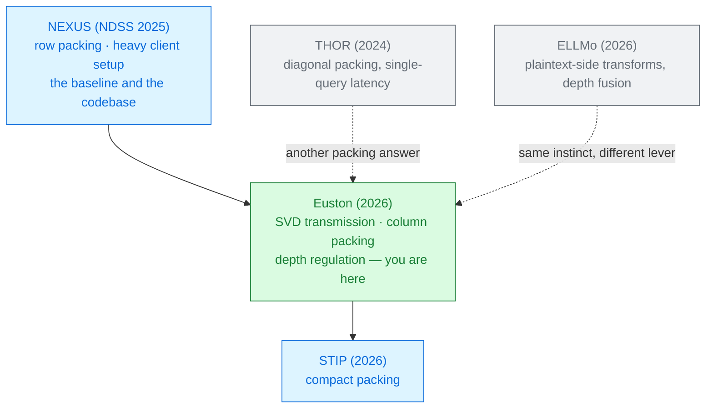

# Euston

Xinwen Gao · Shaojing Fu · Lin Liu · Zhuotao Liu · Yuchuan Luo · Yongjun Wang 
National University of Defense Technology · Tsinghua University · 2026

Every non-interactive system so far has quietly charged the **client** for its setup phase —
hours of compute and hundreds of megabytes of storage that never appear in the results table.
Euston sends the singular values instead of the matrix, turns every ciphertext on its side, and
makes the client's share almost disappear.

Read <a href="../nexus-2024/">NEXUS</a> first — this deck is a direct reply to it · Module 2

---

# The problem, in plain words

a restaurant that advertises a fast main course, having sent you home the night before to peel the
potatoes.

<v-clicks>

- [NEXUS](../nexus-2024/) is non-interactive **per inference**. But its offline phase has the client
  decompress encrypted weights and compute masked products — *"hour-level computational costs and
  hundreds of MB storage footprints per user"* [§1].
- That is fine on a workstation. It is disqualifying on a phone, a hospital terminal, or anything at
  the edge — which is where private inference is supposed to matter.
- Second complaint, more technical: NEXUS evaluates its non-linear functions on **row-packed**
  ciphertexts, so every row-wise sum needs rotations — and the paper *"lacks explicit clarification"*
  about how that format arises from the preceding matrix multiply [§1].

</v-clicks>

Both complaints have the same answer: **choose the packing first, and let everything else follow.**

---

# What you need to know first

<v-clicks>

**Singular value decomposition.** Any $A \in \mathbb{R}^{m\times n}$ factors as $A = UDV^\top$ with
$U, V$ orthonormal and $D$ **diagonal**. All the "size" information sits in $m$ numbers on that
diagonal; $U$ and $V$ are pure rotations of the coordinate frame.

**Packing formats.** A matrix can be laid into ciphertexts by **rows**, by **columns**, or by
**diagonals**. This is not a detail — it decides which sums need rotations and which do not.

**Secure compression / decompression** — NEXUS's trick of packing $N$ values into one polynomial's
coefficients and unpacking them server-side with substitutions. Euston keeps it, and gives it much
less to carry.

</v-clicks>

And one number to remember: a homomorphic **rotation** requires a **key switch**, which injects
noise bounded by $B_{ks} = 8\sigma N/\sqrt{3}$ [§5.4]. Rotations are not
only slow — they are the main source of error.

---

# The one big idea

Two reorientations. **Send the singular values, not the matrix** — so the client encrypts $m$
numbers instead of $m\times n$. And **pack by column, not by row** — so a row-wise sum becomes
vector addition, and every rotation in the non-linear layers disappears.

### The user's side
SVD the one-time-pad matrix. Encrypt only $D$. Ship $U$ and $H$ in the clear.

3100× less preprocessing compute.

### The server's side
Column- and diagonal-packed formats throughout, chosen so the matmuls hand the non-linear layers
exactly the format they want.

No rotations in GELU, LayerNorm or softmax.

Euston is built **on** NEXUS's codebase, uses NEXUS's compression, NEXUS's CKKS parameters
($N=2^{16}$, 1763-bit modulus, $L=35$ with 14 for bootstrapping) and NEXUS's libraries (SEAL on CPU,
Phantom on GPU). The delta is the packing and the transmission protocol — nothing else changed.

---

# Step 1 — send the singular values

<v-clicks>

**Offline.** The client draws a random $R \in \mathbb{R}^{m\times n}$ — its one-time pad — and
decomposes it: $R = U D H$. It then sends the server **plaintext $U$ and $H$**, plus a **single
ciphertext** holding the compressed diagonal $d = (d_1,\dots,d_m)$
[§4.1.1].

**Server-side.** The server rebuilds what it needs homomorphically —
$\llbracket E \rrbracket = U \boxtimes \llbracket D \rrbracket$ — and precomputes the products of the
mask with each weight matrix.

**Online.** The client sends $X = A - R$. That is a one-time pad, so it reveals nothing; the server
combines it with the precomputed ciphertexts and returns the encrypted answer. Still one message
each way.

</v-clicks>

For BERT-Base's $128\times768$ input, NEXUS must encrypt **98,304** values; Euston encrypts **128**.
The measured saving is 4.4×, not 768×, because $U$ and $H$ still travel — in plaintext, which is
where the asymmetry pays.

---

# Step 2 — turn the matrix on its side

Every non-linear layer in a transformer needs a **row-wise sum**: softmax's denominator, LayerNorm's
mean and variance.

### Row-packed horizontal
One ciphertext per row. A row sum lives **inside** one ciphertext, spread across its slots — so it
needs `SIMD slot folding`: $\log n$ rotations, each a key switch, each adding noise.

### Column-packed vertical
One ciphertext per column. A row sum is the **sum of the ciphertexts** — pure addition.

Zero rotations. Zero key switches. Zero added noise.

<v-clicks>

- The paper claims this as *"the first proposal of a vertical approach for approximating homomorphic
  matrix nonlinear functions"* [§5.4].
- It also explains the accuracy result on the next slide: fewer key switches means less noise, so
  Euston is **both faster and more precise** than NEXUS on every non-linear function.

</v-clicks>

The catch is stated too: column packing only pays when the matrix has **many rows**, or the slots sit
empty. Euston's answer is to batch several inputs into one matrix — which is why every headline
number is amortised over a batch.

---

# A tiny worked example — one row sum, two ways

Attention scores $X = \begin{pmatrix}1&2&3\\4&5&6\\7&8&9\end{pmatrix}$. Softmax needs the row sums
$(6, 15, 24)$.

**Row-packed** — three ciphertexts

$\llbracket 1,2,3 \rrbracket$, $\llbracket 4,5,6 \rrbracket$, $\llbracket 7,8,9 \rrbracket$

Fold inside each: rotate by 1, add; rotate by 2, add.
**2 rotations × 3 ciphertexts = 6 key switches.**

**Column-packed** — three ciphertexts

$\llbracket 1,4,7 \rrbracket$, $\llbracket 2,5,8 \rrbracket$, $\llbracket 3,6,9 \rrbracket$

$c_0 \boxplus c_1 \boxplus c_2 = \llbracket 6, 15, 24 \rrbracket$
**2 additions. 0 key switches.**

<v-clicks>

- Both give all three row sums. The column version gives them **already aligned** with their rows,
  ready to divide — no repacking.
- Scale up: at $n = 128$ the row version needs $7$ rotations per ciphertext, $128$ ciphertexts, and
  every one of them adds key-switching noise. The column version still needs **zero**.

</v-clicks>

Worked here from §5.2; the paper states the principle without a numeric example.

---

# Step 3 — three ways to not spend a level

<v-clicks>

**Fold a constant into the scaling factor.** GELU is evaluated as $x\cdot\text{sigmoid}(1.702x)$, and
that $1.702$ is a multiplication that costs a level. Instead, pre-set the ciphertext's CKKS scaling
factor to $\lambda\cdot 1.702^{-1}$. The constant multiply becomes **free**, and the error drops from
multiplication noise to mere scaling error [§5.3].

**Adapt the iteration counts to the data.** The exponential uses $\tau$ squarings and the inverse
uses $\theta$ Newton steps. Euston picks them per call — a smaller $\tau$ when the inputs are already
small (keeping $x/2^\tau > -5$), a smaller $\theta$ when the input is already near 1.

**Evaluate polynomials by binary exponentiation**, taking a degree-$N$ polynomial from depth $O(N)$
to $O(\log N)$.

</v-clicks>

None of these is a new approximation. They are three ways of noticing that the **parameters** of an
approximation are themselves a design surface.

---

# The result: cheaper *and* more accurate

Depth consumed and measured error, against NEXUS on the same operators
[Table 3]:

| Function | NEXUS depth | Euston depth | NEXUS error | Euston error |
|---|---|---|---|---|
| GELU | 14 | **12** | 7.80 × 10⁻³ | **3.70 × 10⁻⁴** |
| LayerNorm | 16 | **9** | 5.00 × 10⁻⁵ | **2.20 × 10⁻⁵** |
| Softmax | 16 | **10** | 5.90 × 10⁻² | **2.50 × 10⁻⁵** |

<v-clicks>

- Softmax: **6 fewer levels and 2,360× less error.** Those are not two independent wins — the error
  fell *because* the rotations went away, and the depth fell because of the regulation tricks.
- Six levels saved on softmax and seven on LayerNorm is a bootstrap not taken. Measured effect on
  the bootstrapping phase: **1.25× (CPU), 1.3× (GPU)** [§6.5].

</v-clicks>

In plaintext machine learning, faster usually means less accurate. Under FHE the two often move
together, because both are paid for in operations.

---

# Threat model

Semi-honest on **both** sides: the server wants the input $A$, the client wants the model $M$
[§3.1].

| Party | Sees | Never sees |
|---|---|---|
| Client | its own input, the answer, $U$, $H$, $R$ | the model weights |
| Server | $X = A - R$, plaintext $U$ and $H$, one ciphertext | the input, the answer |
| Network observer | two messages | contents |

Euston proves **MM-IND security** — the server cannot distinguish a real run from one on a random
matrix — from three assumptions [§4.1.3]: **IND-CPA** for the FHE scheme,
**one-time-pad** security for $X = A-R$, and **Haar-measure indistinguishability** for $U$.

That third one is new and load-bearing: $U$ and $H$ travel **in the clear**, safe only because they
are the singular vectors of a *freshly random* matrix. Reuse $R$ and the argument collapses — it is
a **one-time** pad.

---

# Results — the client's bill

Amortised offline cost for one BERT-Base-shaped input, against NEXUS
[§6.4.2, Fig. 4]:

<CostBars unit="× better than NEXUS" log :lower-is-better="false" :items="[
  { label: 'Preprocessing runtime (CPU)', value: 3100, note: '330× on GPU', highlight: true },
  { label: 'Communication volume', value: 4.4, note: '⟦D⟧+U+H  vs  ⟦W⟧+⟦RW⟧' },
  { label: 'Storage footprint', value: 2.2, note: 'the client keeps only R' },
]" caption="log scale — ratios, not absolute times, as reported in §6.4.2" />

<v-clicks>

- **The client's work no longer depends on the batch size** — it is a function of the matrix
  dimensions alone. NEXUS's grows.
- **Storage**: NEXUS's client caches encrypted model weights; Euston's keeps one random matrix.
- On the input–weight matmul itself: **90× (CPU) / 9.2× (GPU)** faster at small batch, and 2.8× less
  communication.

</v-clicks>

---

# Results — operators, end to end, and accuracy

### Speedup over NEXUS [§6.4.3, §6.5]

| Operator (batch ≥ 256) | CPU | GPU |
|---|---|---|
| GELU | 17.7× | 2.7× |
| LayerNorm | 27.7× | 18.1× |
| Softmax | 109.9× | **165.7×** |
| **End to end** (32×128 tok) | | |
| BERT-Base | 3.5× | 2.1× |
| GPT-2 1.5B | 5.5× | 2.5× |
| Llama-3-8B | **8.8×** | 3.7× |

### Accuracy [Table 4]

| Model · task | Plain | NEXUS | Euston |
|---|---|---|---|
| BERT · RTE | 70.04 | 69.88 | **70.04** |
| BERT · SST-2 | 93.23 | 92.98 | 93.12 |
| Llama · RTE | 82.75 | 81.24 | 81.56 |
| Llama · SST-2 | 94.94 | 94.46 | 94.67 |

Beats NEXUS on every task — consistent with the error column.

The advantage **grows with model size** — LayerNorm alone improves 26.9× on BERT and 52.8× on Llama.
And Euston's Llama runs **128 tokens** where NEXUS's ran **8** [Fig. 6].

---

# What it costs

<v-clicks>

- **Batching is mandatory.** Column packing needs many rows to fill the slots. Below batch 256 the
  advantage shrinks, and at $t=64$ Euston's GPU GELU is **30% *slower* than NEXUS**
  [§6.4.3] — a negative result the authors report themselves.
- **A fresh random matrix per inference**, with a fresh SVD. Cheap, but not free, and the Haar
  argument depends on never reusing it.
- **Four different matrix-multiplication primitives**, each for a specific pair of packing formats.
  The complexity moved rather than vanished.
- **A LAN assumption.** All measurements are at 3 Gbps / 0.8 ms; no wide-area numbers are reported.
- **Same absolute regime as NEXUS.** These are 2–9× improvements on something that remains orders of
  magnitude slower than plaintext.

</v-clicks>

---

# What it does not solve

<v-clicks>

- **The comparison is partly reconstructed.** NEXUS *"only releases partially code for key
  algorithms"*, so several NEXUS numbers — the hidden-state matmuls especially — were **estimated
  from the published paper**, not measured [§6.2, fn. 6]. The authors say so
  and argue those phases are a small share of runtime. Believe the direction; hold the multipliers
  loosely.
- **The plaintext baselines drift.** Euston reports BERT-Base SST-2 plaintext accuracy as 93.23%
  where NEXUS reported 92.36% for the same benchmark. Different fine-tuning runs, and a reminder
  that even the *reference* column is not shared across papers.
- **Generation** is still one token: Llama-3-8B produces a single output, as in NEXUS.
- **Bootstrapping** is improved by 1.25–1.3×, not removed.
- **Model privacy** is unchanged, and the threat model remains semi-honest.

</v-clicks>

---

# Where it sits

Primer strategy <strong>A</strong> — no retraining, and the only deck in this module that treats the <em>client's</em> cost as a first-class metric.

---

# Key terms

<dl class="glossary">
<dt>User-side overhead</dt><dd>The client's offline compute, bandwidth and storage. Usually omitted from results tables; this paper's main target.</dd>
<dt>SVD transmission</dt><dd>Encrypting only the diagonal singular values of the mask matrix, and sending its singular vectors in plaintext.</dd>
<dt>Column (vertical) packing</dt><dd>One ciphertext per matrix column, so a row-wise sum is an addition of ciphertexts rather than a rotation.</dd>
<dt>Row (horizontal) packing</dt><dd>NEXUS's format. Row sums need SIMD slot folding, and every fold is a key switch.</dd>
<dt>Key-switching noise</dt><dd>Error injected by every rotation, bounded by 8σN/√3. Why fewer rotations means more accuracy.</dd>
<dt>Depth regulation</dt><dd>Folding constants into the scaling factor, adapting iteration counts to the data, and binary polynomial evaluation.</dd>
<dt>IWMM / HSMM</dt><dd>Input-weight and hidden-state matrix multiplication. Euston supplies primitives for both; NEXUS documented only the first.</dd>
<dt>MM-IND security</dt><dd>The server cannot distinguish the real protocol from one run on a random matrix.</dd>
<dt>Haar measure</dt><dd>The uniform distribution on orthonormal matrices. Why U and H can travel in the clear — once.</dd>
</dl>

---

# Check yourself

**1. Euston's softmax is faster than NEXUS's *and* 2,360× more accurate. In plaintext ML that combination is suspicious. Why is it ordinary here?**

<v-click>

Because the cost being removed is also the error being removed. Row-wise summation on row-packed
ciphertexts needs rotations; each rotation is a key switch; each key switch adds noise bounded by
$8\sigma N/\sqrt3$. Column packing replaces all of them with additions, which are nearly noiseless.
Under FHE, time and error are both paid in operations, so removing operations buys both.

</v-click>

**2. Euston sends $U$ and $H$ unencrypted. Why is that safe, and when would it stop being safe?**

<v-click>

They are singular vectors of a **freshly random** $R$, so by the Haar argument they are uniformly
distributed and independent of $A$ — which is masked separately as $A-R$. It stops being safe the
moment $R$ is reused: two inputs under the same pad let the server compute $A_1 - A_2$.

</v-click>

**3. Why does the advantage grow from 3.5× on BERT-Base to 8.8× on Llama-3-8B?**

<v-click>

Because what it optimised scales with the model: larger hidden dimensions mean larger row-wise
reductions in LayerNorm and softmax — the operations whose cost went from $\log n$ rotations to
zero. An advantage that grows with scale is structural; one that shrinks is a constant factor in
disguise.

</v-click>

---
layout: center
---

# Where to go next

**The paper this one answers**
[NEXUS (2025)](../nexus-2024/) — read it first; Euston is unintelligible without it, and shares its
code, parameters and libraries.

**The other packing answers**
[THOR (2024)](../thor-2024/) chose diagonals · [ELLMo (2026)](../ellmo-2026/) moved the transforms
to the plaintext side · [STIP (2026)](../stip-2026/) compacts the packing further.

**If the client-side cost interested you**
[Medical and federated decks](../../slides/) — where the client really is a hospital laptop, and
the offline phase decides whether anything can be deployed.

**For the unfinished part**
[Cachemir (2026)](../cachemir-2026/) — one output token is still one output token.

← back to <a href="../../slides/">all decks</a>

