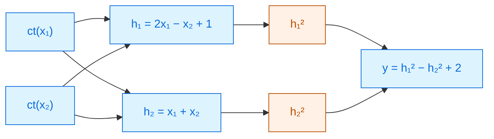

# FHE by hand

Build the cipher yourself. Break it. Fix it. Then run a neural network inside it.

Every box in this deck is **live**. Drag the sliders, press the buttons, and make the
decryption fail on purpose — that is the fastest way to understand why encrypted machine
learning costs what it costs.

PREMAL · read the <a href="../primer-fhe-transformers/">Primer</a> for the map, this deck for the mechanism

---

# Where we are going

### Part 1 — the cipher

<v-clicks>

1. Invent a homomorphic cipher in one line
2. Break it in two lines
3. Fix it properly — and meet **noise**
4. Watch noise decide whether your answer survives
5. Fit thousands of numbers into one ciphertext

</v-clicks>

### Part 2 — the network

<v-clicks>

6. Do a dot product with no indexing
7. Run a two-layer network on encrypted inputs
8. Discover why the **activation** ruins everything
9. Count the cost, then scale it to a real model

</v-clicks>

Numbers are kept tiny on purpose — everything here can be checked on paper. Real parameters are
the same ideas with 15-digit numbers.

---

# Attempt 1 — a homomorphic cipher in one line

Pick a secret number $s$. To encrypt a message $m$, just add it:

$\mathsf{Enc}(m) = m + s \bmod q$

<v-clicks>

Take $q = 10$, secret $s = 7$. Encrypt $m_1 = 3$ and $m_2 = 4$:

- $c_1 = 3 + 7 = 0$, and $c_2 = 4 + 7 = 1$ (both mod 10).
- The server adds the ciphertexts without knowing anything: $c_1 + c_2 = 1$.
- You decrypt by subtracting the secret **twice**: $1 - 14 = 7 \bmod 10$. And $3 + 4 = 7$. ✓

</v-clicks>

That is genuinely homomorphic addition. The server computed on data it could not read.

---

# Attempt 1, broken

<v-clicks>

**Multiplication does not survive.** Multiply the two ciphertexts:

$c_1 \cdot c_2 = (m_1 + s)(m_2 + s) = m_1 m_2 + s(m_1 + m_2) + s^2$

To recover $m_1m_2$ you must subtract $s(m_1{+}m_2)$ — which needs $m_1 + m_2$, the very thing you
are trying to hide.

**And it leaks.** The cipher is deterministic: the same message always gives the same ciphertext.
A server that sees two equal ciphertexts learns the two inputs were equal.

</v-clicks>

Both problems have the same root: the mask $s$ is **rigid**. It sits in a fixed relationship to
the message, so arithmetic drags it along in a predictable way.

The fix is to make the mask **different every time** and slightly **wrong** on purpose.

---

# Attempt 2 — the real thing

Keep the secret as a *vector* $\mathbf{s}$. For every encryption, draw a fresh random vector
$\mathbf{a}$, and add a small error $e$:

$\mathsf{ct} = (\mathbf{a},\; b)$ where $b = \langle \mathbf{a}, \mathbf{s}\rangle + \Delta \cdot m + e \bmod q$

<v-clicks>

- $\langle \mathbf{a}, \mathbf{s}\rangle$ is the mask. Without $\mathbf{s}$ it is indistinguishable
  from noise — that is the **Learning With Errors** assumption, and it is what the security rests on.
- $\Delta$ scales the message away from the error, so the two can be separated later.
- To decrypt: subtract the mask, divide by $\Delta$, and **round**. The rounding is what erases $e$.

</v-clicks>

$\Delta = q/p$, where messages live in $0 \ldots p-1$. Decryption is correct exactly when
$|e| < \Delta/2$ — the error must be smaller than half a step.

---

# Hands-on — encrypt and decrypt

Drag $m$ and $e$. Watch the arithmetic, and push the noise past $\Delta/2 = 8$ to break it.

<LweDemo :show-ops="false" />

$q = 64$, $p = 4$, so $\Delta = 16$. Real CKKS uses a ring dimension of $2^{16}$ and a modulus of
several hundred bits — the same three lines of arithmetic, with numbers you cannot hold in your head.

---

# Hands-on — the noise budget

Now do some homomorphic work. Every operation costs noise. **Press "× ciphertext" twice.**

<LweDemo />

Notice what "× ciphertext" does that "× plaintext" does not: it <strong>squares</strong> the noise.
Two ciphertext multiplications in a row are usually fatal at these parameters — which is precisely
why depth, not addition count, is the currency of this field.

---

# The three rules, and why depth is scarce

| Operation | What happens to the value | What happens to the noise |
|---|---|---|
| ct **+** ct | messages add | noises **add** — cheap |
| ct **×** plaintext $k$ | message scales by $k$ | noise **scales by $k$** — affordable |
| ct **×** ct | messages multiply | noises **multiply** — brutal |

<v-clicks>

- Addition is nearly free. You can do thousands.
- Multiplying by a known weight is fine, and it is what a neural network mostly does.
- Multiplying two *secrets* together is the expensive case — and it also produces a longer
  ciphertext that must be shrunk again by **relinearisation**.

</v-clicks>

"Multiplicative depth" is just: how many ct×ct multiplications can you chain before the noise
crosses $\Delta/2$?

---

# Bootstrapping — the reset button

When the budget is gone you have two options: stop, or **bootstrap**.

<DepthBar :total="16" :steps="[
  { label: 'fresh ciphertext', cost: 0 },
  { label: 'layer 1 (2 multiplies)', cost: 6, expensive: true },
  { label: 'layer 2 (2 multiplies)', cost: 6, expensive: true },
  { label: 'bootstrap', bootstrap: true },
  { label: 'layer 3', cost: 6, expensive: true },
]" caption="the budget drains, gets refilled, and drains again" />

<v-clicks>

- Bootstrapping runs the *decryption circuit itself* homomorphically. The ciphertext comes out
  holding the same value with the noise reset — without anyone ever seeing the plaintext.
- It is the single most expensive operation in FHE: seconds per ciphertext on a CPU, and under
  10 ms on a multi-GPU cluster in the best 2026 systems
  [SoK 2026, §1].

</v-clicks>

---

# One ciphertext, thousands of numbers

Encrypting one number at a time would be hopeless. A CKKS ciphertext is a **vector of slots**, and
every operation applies to all of them at once.

<SlotGrid :values="[3,1,4,1,5,9,2,6]" label="ct_x" :total-slots="8192" />

<v-clicks>

- One multiplication multiplies **8,192 pairs** of numbers. This is what makes FHE machine
  learning conceivable at all.
- But there is no `x[3]`. You cannot read, write or branch on a single slot.
- The only way to move data between slots is to **rotate** the whole vector.

</v-clicks>

So "how do I add up the numbers inside one ciphertext?" is a real problem — and the answer is on
the next slide.

---

# Hands-on — a dot product with no indexing

To sum 8 slots, fold the vector onto itself: rotate by 4 and add, then 2, then 1.

<RotateSum :values="[3,1,4,1,5,9,2,6]" />

$\log_2(8) = 3$ rotations instead of 8 additions — and for 8,192 slots, **13 rotations instead of
8,191**. Every "packing" contribution in this collection is an argument about this picture.

---
layout: center
---

# Part 2

## Now put a neural network inside it

Everything from here on uses only the three rules you already know.

---

# The tiniest useful network

Two inputs, two hidden neurons, one output. The **client's data is encrypted**; the
**server's weights are not**.

**Blue — easy.** Every linear layer is ct × plaintext weight, then ct + ct. Noise scales and adds.
No ct×ct anywhere.

**Orange — the problem.** Squaring an encrypted value is ct × ct. It is the only place in this
network where noise *multiplies*.

---

# Hands-on — run it encrypted

Set the inputs, then decrypt. Then raise the fresh noise $e_0$ to 2 and try again.

<TinyNet />

At $e_0 = 1$ the answer survives. At $e_0 = 2$ it does not — and look at <em>where</em> it dies:
the square takes the noise from 8 to 64 in one step. The two linear layers around it barely
matter.

---

# Why the activation is the whole problem

The network above used $x^2$ as its activation. Real networks use ReLU, GELU or softmax — and FHE
**cannot compute any of them**, because it has no comparison and no division.

<PolyPlot />

<v-click>

So you approximate. A polynomial that fits well over $[-4, 4]$ is worthless at $x = 9$ — and an
encrypted network cannot notice that it has gone out of range, let alone clamp.

</v-click>

---

# What it costs, in one picture

Every non-linearity you approximate is depth spent, and depth is the thing you run out of.

<DepthBar :total="24" :steps="[
  { label: 'linear layer (ct × plaintext)', cost: 1 },
  { label: 'square activation (ct × ct)', cost: 1, expensive: true },
  { label: 'degree-16 GELU polynomial', cost: 4, expensive: true },
  { label: 'softmax (exp + division)', cost: 9, expensive: true },
  { label: 'LayerNorm (inverse square root)', cost: 6, expensive: true },
]" caption="one transformer layer's worth of non-linearity against a 24-level budget" />

<v-clicks>

- A **higher-degree** polynomial fits better and costs more depth: roughly $\log_2(\text{degree})$
  levels.
- Run out of levels and you must bootstrap — seconds, per ciphertext.

</v-clicks>

---

# From this toy to a real model

| | This deck | A real CKKS transformer |
|---|---|---|
| Modulus $q$ | 64 | several hundred bits |
| Slots per ciphertext | 8 | 8,192 or 16,384 |
| Levels | 4–24 | tens, refilled by bootstrapping |
| Activation | $x^2$ | degree-16+ polynomials, Newton iterations |
| Network | 2 layers, 5 neurons | BERT-Base: 12 layers, 110M parameters |

Nothing in the mechanism changes — only the scale, and the fact that a compiler now manages the
noise budget instead of your eye.

The best encrypted language models in 2026 are about **10,000× slower** than the same model in the
clear [SoK 2026]. You have just seen exactly where that factor comes from.

---

# What you can now read

Every paper in this collection is an attack on something you have now done by hand.

**"We improved packing"** 
→ fewer rotations in the fold you just clicked through

**"We reduced multiplicative depth"** 
→ the budget bar drains more slowly

**"We approximate softmax efficiently"** 
→ a better curve on the plot you just dragged

**"We are non-interactive"** 
→ they never asked the client to decrypt mid-way

There is no fifth idea. Everything else is engineering on top of these four.

---

# Key terms

<dl class="glossary">
<dt>Homomorphic</dt><dd>An operation on ciphertexts that corresponds to a meaningful operation on the hidden values.</dd>
<dt>Mask</dt><dd>The ⟨a,s⟩ term that hides the message. Fresh and random for every encryption.</dd>
<dt>LWE</dt><dd>Learning With Errors — the assumption that a masked, slightly-wrong linear equation is unsolvable without the key.</dd>
<dt>Δ (scaling factor)</dt><dd>How far apart messages are spaced, so the noise can be rounded away.</dd>
<dt>Noise / error</dt><dd>The deliberate small wrongness in every ciphertext. It grows as you compute.</dd>
<dt>Noise budget</dt><dd>How much noise you can accumulate before decryption returns the wrong answer: |e| &lt; Δ/2.</dd>
<dt>Level</dt><dd>One unit of the multiplication budget. Each ct×ct multiplication spends one.</dd>
<dt>Multiplicative depth</dt><dd>The longest chain of ciphertext×ciphertext multiplications the parameters allow.</dd>
<dt>Relinearisation</dt><dd>Shrinking a ciphertext back to normal size after multiplying two ciphertexts.</dd>
<dt>Bootstrapping</dt><dd>Homomorphically evaluating decryption to reset the noise. Correct, and very slow.</dd>
<dt>Slot / SIMD packing</dt><dd>One ciphertext holds a whole vector; one operation processes every slot at once.</dd>
<dt>Rotation</dt><dd>Cyclically shifting the slots — the only way to move data between them.</dd>
</dl>

---

# Check yourself

**1. Why does adding a *plaintext* constant cost no noise, while adding a ciphertext does?**

<v-click>

A plaintext has no error term. Adding $\Delta \cdot b$ shifts the message and leaves $e$ exactly as
it was. Adding a ciphertext brings its own $e'$ along, so the errors add.

</v-click>

**2. In the network demo, the two linear layers changed the noise far less than the single squaring did. Why?**

<v-click>

Linear layers multiply the ciphertext by *known* weights, so the noise is scaled by a small
constant. Squaring multiplies a ciphertext by a ciphertext, so the two errors multiply — noise 8
becomes 64. Depth is spent by secret×secret operations, not by arithmetic in general.

</v-click>

**3. You need the largest value in an encrypted vector. Why is that hard, and what would you actually do?**

<v-click>

There is no comparison and no indexing — you cannot ask which slot is bigger, or read a slot at
all. In practice you approximate the sign function with a high-degree polynomial and fold the
vector with rotations, spending depth for each fold. That is exactly what NEXUS's log-depth argmax
does.

</v-click>

---
layout: center
---

# Where to go next

**The map of the field**
[Primer — why transformers are hard to encrypt](../primer-fhe-transformers/) · then
[A Survey on Private Transformer Inference](../survey-private-transformer-inference-2024/)

**How much of this is actually solved**
[SoK: Private LLM Inference using Approximate HE](../sok-approx-he-llm-2026/)

**Papers that improve the exact things you clicked on**
[NEXUS](../nexus-2024/) — packing and a log-depth argmax ·
[THOR](../thor-2024/) — fewer rotations ·
[Power-Softmax](../power-softmax-2024/) — a softmax built to be cheap

**If you would rather choose a technology than optimise one**
[FHE vs garbled circuits](../fhe-vs-garbled-circuits-2025/) ·
[A pragmatic comparison](../pragmatic-crypto-comparison-2026/)

← back to <a href="../../slides/">all decks</a>

