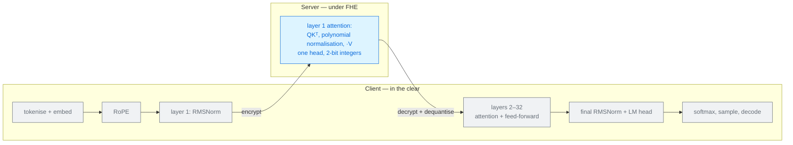
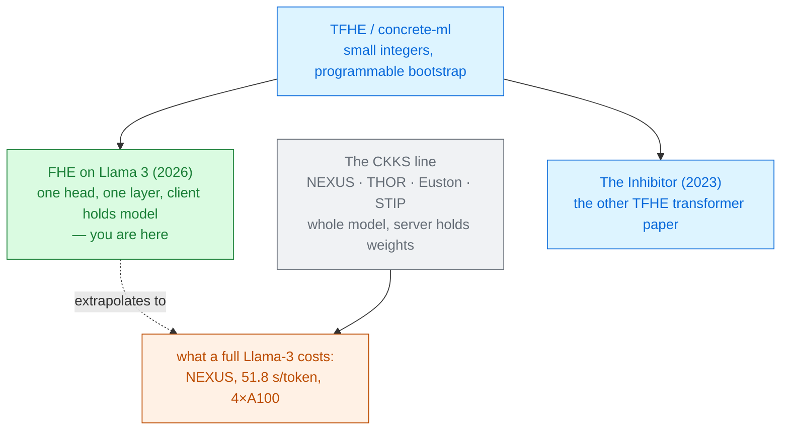

# Fully Homomorphic Encryption on Llama 3

Anes Abdennebi · Nadjia Kara · Laaziz Lahlou 
École de Technologie Supérieure, Montreal · arXiv 2604.12168 · April 2026

The only deck in this module that does **not** use CKKS, and the only one that asks a different
question: rather than *"how do we encrypt the whole model?"*, it asks **"what if we encrypt only the
part that matters, and leave the rest in the clear?"**

Read the <a href="../primer-fhe-transformers/">Primer</a> and <a href="../nexus-2024/">NEXUS</a> first — and read this deck's slide 5 before quoting any number from this paper

---

# The problem, in plain words

a safe deposit box for the one document that matters, rather than an armoured building for the whole
office.

<v-clicks>

- The authors' motivation is **post-quantum**: today's encryption will fall to quantum computers,
  and lattice-based FHE will not. Every scheme in this module is post-quantum, but this paper is the
  one that makes it the headline.
- Their second motivation is **cost discipline**: *"attempting to secure an LLM internally within
  its attention mechanism should be approached carefully, and only the concerned components should
  be secured to avoid unnecessary overhead"* [§1].
- Funded by Canada's Department of National Defence, which shows in the framing — a good deal of the
  paper is about **which attacks encryption actually stops**.

</v-clicks>

That last part is the most useful thing here, and slide 10 is about it.

---

# What you need to know first — TFHE, not CKKS

Every other deck in this module uses CKKS. This one uses **TFHE**, via Zama's `concrete-ml`. The
difference decides everything downstream.

### CKKS everywhere else
Packs ~32,000 real numbers per ciphertext. Non-linear functions must be **approximated by
polynomials**, and depth is the currency. Bootstrapping is rare and enormous.

### TFHE here
Works on **small integers**. Its bootstrap is **programmable** (PBS): while refreshing the noise it
can evaluate an arbitrary look-up table for free — so non-linearities are exact, not approximated.
But it bootstraps constantly, and packs far less.

<v-clicks>

- So the currency changes from **multiplicative depth** to **PBS count**. That is the number to
  watch in this paper.
- And because TFHE wants small integers, everything must be **quantised**. This paper uses
  **2 bits** [§4].

</v-clicks>

---

# The one big idea

Do not encrypt the model. Encrypt **one attention head, in one transformer layer**, and run the
other thirty-one layers in plaintext on the client.

<v-clicks>

- The `QLlamaLMHeadModel` class substitutes the attention module **in a designated transformer
  layer** — the paper uses the first — and leaves everything else alone
  [§3.4].
- *"The SingleHeadQLlamaModel model does not mean running it with only one layer, instead,
  **encrypting one layer, while keep the rest (31 layers) in plain**"* [§3.5].
- `SingleHead` encrypts one attention head of that layer; `MultiHeads` duplicates the structure for
  several heads of the same layer.

</v-clicks>

This is a legitimate engineering result and the paper states it plainly. But it means every number
in the abstract — 98% accuracy, 237 ms, 80 tokens/s — describes **one encrypted attention head**,
not an encrypted Llama-3. Slide 8 works out what the difference is worth.

---

# Where the work actually happens

<v-clicks>

- The **client holds all 32 layers of weights** and runs 31 of them. The feed-forward blocks, the
  RMSNorms, the embeddings and the output softmax are never encrypted [Fig. 6].
- So this is the mirror image of every other paper in the module: there, the server has the model
  and the client has the data. Here the client has both, and outsources one head.

</v-clicks>

---

# The three modes — and why they matter for reading the results

`concrete-ml` offers a toggle, and the paper reports all three [§3.3]:

<strong class="pt">disable</strong> 
No quantisation, no encryption. The plain model.

<strong class="cost">simulate</strong> 
Runs the <em>quantised</em> circuit on <strong>clear data</strong>, to estimate accuracy without
paying for encryption.

<strong class="win">execute</strong> 
Real encryption, real PBS operations. The only mode that is actually private.

<v-clicks>

- Compilation happens once, before any inference: a **cleartext calibration pass** fixes the scaling
  factors and zero points, and the compiler decides statically **where every PBS goes**
  [§3.4]. Compile time is 3.5–8 s (single head) or 12–26 s (multi-head).
- Now look at the results tables: **accuracy is identical in `simulate` and `execute`**, and
  identical on all three machines. That is a genuine correctness result — FHE execution reproduces
  the cleartext quantised computation — but it also tells you the reported accuracy curve is a
  property of **quantisation and decoding**, not of encryption.

</v-clicks>

---

# A tiny worked example — what one head costs, and what 32 layers would

Programmable bootstraps per generated token, on machine M3 [Table 5]:

<v-clicks>

- **One head, one layer:** 137.62 PBS/token, and about **0.237 s** per run.
- **All heads, still one layer:** **13,067.62** PBS/token — **95× more** — at about **1.24 s**.
- Llama-3-8B has **32** layers. Scaling the measured one-layer cost:
  $32 \times 13{,}068 \approx \mathbf{418{,}000}$ PBS per token, and $32 \times 1.24 \approx
  \mathbf{40}$ **seconds per token** — *before* the feed-forward blocks, the RMSNorms, the
  embeddings and the LM head, none of which are encrypted here.

</v-clicks>

40 s per token is not an embarrassment — it is **exactly the regime everyone else reports**.
[NEXUS](../nexus-2024/) measures 51.84 s for one Llama-3-8B token on four A100 GPUs. The
extrapolation lands in the right place, which is the best evidence that the 237 ms was never the
price of private Llama-3.

Extrapolation worked here from Table 5 and Table 3; the paper does not make this estimate, and it is a lower bound.

---

# Threat model — and the inversion

The paper's stated assumptions [§5]: lattice hardness (LWE); a **trusted
client** holding the public and private keys; the evaluation key given to the server; the server
executes deterministically without tampering; decryption happens in a trusted environment.

| Party | Sees | Never sees |
|---|---|---|
| Client | its input, **all 32 layers of weights**, every intermediate, the answer | — |
| Server | one head's encrypted activations, for one layer | those activations in the clear |
| Network observer | two messages per token | contents |

<v-clicks>

- **There is no model privacy**, because the client is running the model. The property protected is
  that a *particular* outsourced computation does not reveal its inputs.
- Which makes this a different deployment story: not "use someone else's private model", but
  "offload part of your own model to a machine you do not trust".

</v-clicks>

---

# The best part of the paper — what encryption does not stop

Rare honesty, and worth memorising [Table 6]:

| Attack | Protected? | Why |
|---|---|---|
| Prompt / context leakage | **Yes** | states stay encrypted — unless outputs or side channels leak them |
| Output reconstruction | **Yes** | ciphertexts reveal nothing, absent bugs or timing metadata |
| Gradient leakage | **Conditional** | protected in flight; any step that decrypts reopens it |
| Data poisoning | **Partial** | an authorised adversary can still poison; auditing gets *harder* |
| Side channels (timing, cache) | **No** | FHE is not constant-time; needs hardening or a TEE |
| Model extraction | **No** | black-box querying works unless outputs are restricted |
| Adversarial examples | **No / partial** | query-based attacks are unaffected |

Three "no"s in a table published by the technique's own advocates. **Encryption protects data in
transit and in use; it does not protect a model from its own answers.**

---

# Results — accuracy, and what it measures

Generation agreement with the plain Llama-3, over 79 prompts, five repeats
[Tables 2–4]:

<CostBars unit="% agreement" :lower-is-better="false" :items="[
  { label: '1 token generated', value: 47.2, note: 'single head' },
  { label: '10 tokens', value: 81.7 },
  { label: '70 tokens', value: 91.3 },
  { label: '500 tokens', value: 98.2, note: 'the abstract\'s 98%', highlight: true },
]" caption="single-head model; the multi-head model runs 51.6 → 87.4 → 94.7 → 97.7 over the same range" />

<v-clicks>

- The metric rises with the **number of tokens generated**, which is counter-intuitive — drift
  usually compounds. The authors' explanation is *"statistical smoothing of attention over many
  steps"*, with short generation being *"a stringent test of per-step numerical fidelity"*
  [§4.1, §4.3].
- At one token the encrypted model agrees with the plain one **47% of the time**. That is the number
  to carry away, not the 98%: it is the regime where classification and short answers live.

</v-clicks>

---

# Results — latency, throughput, and a unit to check

### Per-run latency, `execute` mode [Tables 2–3]

| Machine | Single head | Multi-head |
|---|---|---|
| M1 · EPYC 7413, 2.65 GHz | ~0.52–0.62 s | ~1.53–1.64 s |
| M2 · i7-12700K, 3.6 GHz | ~0.26 s | ~0.88–1.08 s |
| M3 · i9-14900K | **~0.237 s** | ~1.05–1.26 s |

CPU only, no GPU. Latency tracks **clock frequency and memory latency**, not core count — the
24-core EPYC is the slowest of the three.

### Efficiency metrics, M3 [Table 5]

| | Single | Multi |
|---|---|---|
| "Throughput" | 77.26 | 8.91 |
| PBS / token | 137.62 | 13,067.62 |
| Memory / token | 2.02 kB | 1.12 kB |

Check the units: Eq. 7 defines throughput as *tokens-per-second **divided by** execution time*. Read
that column as an index, not a rate — and treat the abstract's "80 tokens per second" the same way.

One clean comparison the paper does make: 6 tokens need **5,208** PBS operations here, against
**11,622** reported for an FHE GPT-2 in `concrete-ml`'s own work [§4.6].

---

# What it costs

<v-clicks>

- **2-bit quantisation** of the encrypted attention. The paper reports no accuracy loss from it —
  plausible when the quantised part is one head of one layer out of 32.
- **A client that can run Llama-3-8B.** The whole premise assumes the user already has the weights
  and the hardware; the server is an accelerator, not a service.
- **Per-token round trips.** The encrypted head sits inside the autoregressive loop, so every
  generated token is an encrypt–evaluate–decrypt cycle. This is an interactive protocol.
- **A cleartext calibration pass** before compilation, which fixes the quantisation parameters — and
  therefore assumes representative data is available in the clear.
- **Worse cache behaviour**: the FHE-quantised models show 2–3× higher L1d miss rates than the plain
  model [App. B].

</v-clicks>

---

# What it does not solve — and how to read the headline

<v-clicks>

- **It does not run Llama-3 under encryption.** One attention head, in one of 32 layers. The paper
  says so in §3.5; the abstract does not. When you see this work cited, check which claim is being
  carried.
- **It does not protect the model**, because the client holds it.
- **The accuracy metric is agreement with the plain model**, not task accuracy, and it is identical
  in `simulate` and `execute` mode — so it measures quantisation, not encryption.
- **No comparison with any system in this module.** No NEXUS, no THOR, no Powerformer. The one
  external comparison is a PBS count against `concrete-ml`'s GPT-2 example.
- **No security proof and no formal threat model** in the sense the other papers give one — the
  assumptions are listed prose in §5.
- **The 79 prompts are not described**, nor is the agreement metric defined precisely. Both would be
  needed to reproduce the accuracy column.

</v-clicks>

---

# Where it sits

Primer strategy <strong>A</strong>, applied to one layer rather than the model — <strong>partial</strong> encryption, with a different threat model from the rest of the module.

---

# Key terms

<dl class="glossary">
<dt>TFHE</dt><dd>The FHE scheme for small integers and boolean circuits. Bootstraps constantly, but each bootstrap is cheap and can compute a look-up table.</dd>
<dt>Programmable bootstrapping (PBS)</dt><dd>A noise refresh that also evaluates an arbitrary function. Under TFHE it is the unit of cost, as depth is under CKKS.</dd>
<dt>concrete-ml</dt><dd>Zama's open-source library. Compiles a quantised PyTorch model into a TFHE circuit.</dd>
<dt>simulate vs execute</dt><dd>Running the quantised circuit in the clear, versus actually encrypting. Identical accuracy here.</dd>
<dt>2-bit quantisation</dt><dd>Four levels per value, so TFHE's integer arithmetic can handle it.</dd>
<dt>Calibration pass</dt><dd>A cleartext run fixing scaling factors and zero points before the circuit is compiled.</dd>
<dt>Partial encryption</dt><dd>Protecting one component rather than the whole pipeline. This paper's actual contribution.</dd>
<dt>Generation agreement</dt><dd>The fraction of generated tokens matching the plain model. This paper's "accuracy".</dd>
</dl>

---

# Check yourself

**1. The paper reports 237 ms for "FHE Llama-3" and NEXUS reports 51.8 s for one Llama-3 token. Is this paper 200× faster?**

<v-click>

No — they measure different computations. This paper encrypts **one attention head in one of 32
layers**; the rest runs in plaintext on the client, which also holds the weights. Scaling its own
Table 5 to 32 layers gives roughly 40 s per token — the same order as NEXUS. Always ask *what
fraction of the model is encrypted*.

</v-click>

**2. Accuracy is identical in `simulate` (no encryption) and `execute` (real encryption) mode. Good news or bad?**

<v-click>

Both. It is a genuine **correctness** result — the TFHE circuit reproduces the cleartext quantised
computation exactly, which programmable bootstrapping guarantees and CKKS cannot. But it also means
the accuracy column says nothing about encryption: it measures 2-bit quantisation and decoding,
which need no cryptography to evaluate.

</v-click>

**3. Table 6 says FHE gives no protection against model extraction. Why not, if the model is encrypted?**

<v-click>

Because extraction works through the **outputs**, not the internals. Anyone who can query the
system and read decrypted answers can fit a substitute model, exactly as against a plaintext API.
FHE hides the computation from whoever performs it; it says nothing about what the answer reveals.
That holds for every paper in the module — this one is just forthright about it.

</v-click>

---
layout: center
---

# Where to go next

**What a full encrypted Llama-3 actually costs**
[NEXUS (2025)](../nexus-2024/) — 51.8 s for one token on four A100s, with all 32 layers encrypted
and the server holding the weights.

**The other TFHE route**
[The Inhibitor (2023)](../inhibitor-2023/) — ReLU-and-addition attention designed for TFHE on the
torus, rather than a CKKS model retrofitted onto it.

**If the attack table was the interesting part**
[On the (In-)Security of the Shuffling Defense (2026)](../shuffling-defense-insecurity-2026/) — what
happens when a cheap protection is tested properly.

**For calibration before citing anything here**
[SoK on approximate HE (2026)](../sok-approx-he-llm-2026/) and
[the EDBT tutorial](../private-llm-inference-edbt-2026/) — both give the scoreboard this paper is
missing.

← back to <a href="../../slides/">all decks</a>

