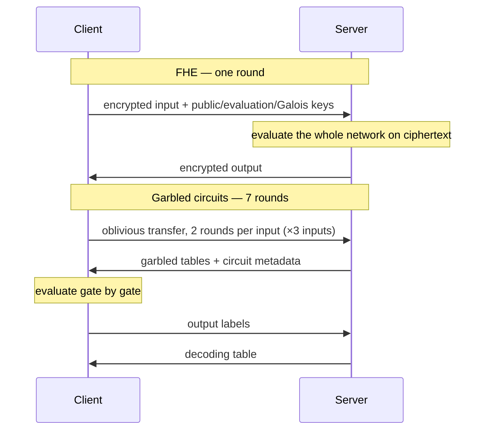
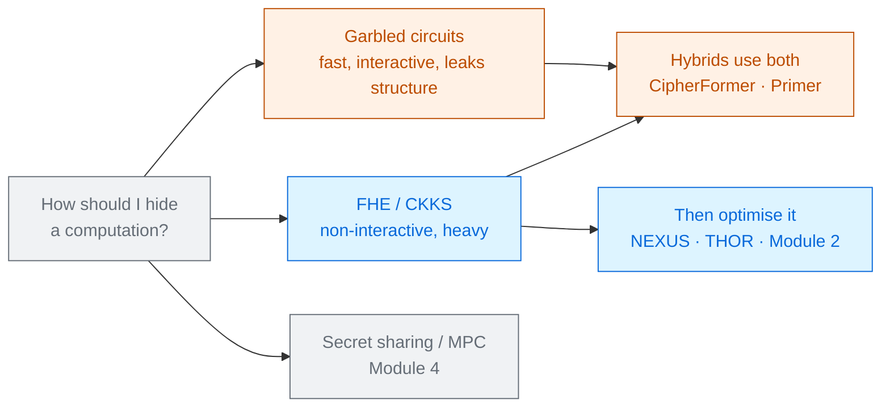

# FHE vs Garbled Circuits

Kalyan Cheerla · Lotfi Ben Othmane · Kirill Morozov 
University of North Texas · IEEE SecDev 2025 · arXiv 2510.07457

One tiny neural network, built twice — once with **CKKS encryption**, once with a **garbled
circuit** — and measured on the same machine. The cleanest side-by-side of the two paradigms in
this collection.

Read the <a href="../primer-fhe-transformers/">Primer</a> first · a small paper that answers a big question

---

# The problem, in plain words

two ways to have a stranger do your arithmetic. Either you lock the numbers in a box and let them
work on the box (FHE), or you hand them a scrambled instruction sheet and answer their questions as
they go (garbled circuits).

<v-clicks>

- Every other paper in this collection assumes you already picked one paradigm and then optimises it.
- This one asks the earlier question: **for the same network, which paradigm should you pick, and
  what exactly do you give up?**
- Their answer is not "FHE" or "GC". It is a list of four numbers that move in opposite directions.

</v-clicks>

The network is deliberately trivial — two layers,
$y = \sigma\!\left(W_2 \cdot \mathrm{ReLU}(W_1x + b_1) + b_2\right)$ — so nothing but the
cryptography differs [§III.A].

---

# What you need to know first

You know FHE from the [Primer](../primer-fhe-transformers/). Garbled circuits are the other family.

<v-clicks>

- Write the computation as a **Boolean circuit** — AND and XOR gates on bits.
- The server ("garbler") replaces every wire value with a random **label**, and every gate with an
  encrypted truth table. The circuit still computes, but no label reveals a bit.
- The client ("evaluator") gets its input labels through **oblivious transfer** — it learns the
  label for its own bit and nothing else — then evaluates gate by gate.
- At the end the two sides decode the output labels together.

</v-clicks>

Two structural differences to hold on to. Garbling is **symmetric-key cryptography**, so it is fast
per gate, but the tables must be **sent** — and a fresh circuit is needed for **every** inference.

---

# The one big idea

Neither technique is faster. **GC moves the cost into the network and into interaction; FHE moves
it into the server's CPU and memory.** Which one wins is decided by your deployment, not by the
mathematics.

### Garbled circuits
<v-clicks>

- **×161** slower than plaintext
- **7 rounds** per inference
- 11 MB memory — about **2×** plaintext
- Fresh circuit **every** inference

</v-clicks>

### CKKS / FHE
<v-clicks>

- **×20,912** slower than plaintext
- **1 round** — client can go offline
- **1,054 MB** on the server
- Keys sent **once**, reused after

</v-clicks>

Same network, same machine, same threat model [Fig. 4–6].

---

# Step 1 — how each protocol actually runs

Six of GC's seven rounds are just getting the client's three input values in [§IV.C].

---

# Step 2 — what each one does to the activations

Both have to get rid of the non-linear functions, and they do it differently
[Table I]:

| | Plaintext | FHE (CKKS) | Garbled circuit |
|---|---|---|---|
| Input | floating point | encrypted floating point | scaled to fixed point |
| ReLU | $\max(0,x)$ | $\approx x^2$ | $\max(0,x)$ — **exact** |
| Sigmoid | $1/(1+e^{-x})$ | $\approx 0.5 + 0.197x - 0.004x^2$ | same approximation |

<v-clicks>

- GC keeps ReLU **exactly** — comparison is easy in Boolean logic, and this is the one thing GC is
  simply better at.
- FHE must replace ReLU with $x^2$, because it cannot compare.
- Both approximate the sigmoid, so GC's only error is fixed-point rounding plus that one polynomial.

</v-clicks>

---

# Step 3 — the CKKS parameters, and one honest mistake

<v-clicks>

- Polynomial modulus degree $N = 16384$, which allows a **438-bit** coefficient budget at 128-bit
  security. They use a chain of $[60,40,40,40,30,30] = 240$ bits — about **five multiplication
  levels** [§III.B, Table II].
- That ciphertext has **8,192 slots**. The input vector has **three numbers**. The other 8,189 slots
  are padded with zeros.

</v-clicks>

So this FHE implementation throws away the single biggest advantage CKKS has — **SIMD batching**.
The authors say so plainly: the slowdown is worsened by "the lack of batching"
[§IV.A].

Read the ×20,912 as *the cost of FHE used naively*. Almost every paper in Module 2 of this
collection is an argument about how to fill those 8,192 slots.

---

# A tiny worked example — the crossover point

The paper gives the two cost formulas. Put numbers in them
[§IV.F]:

<v-clicks>

- **GC:** every inference needs a fresh circuit → cost $O(n \cdot C)$. Measured: ~1.8 MiB per
  layer, ~3.76 MiB for the whole two-layer run.
- **FHE:** keys once, then a small ciphertext each time → $O(S + n\varepsilon)$. Measured:
  $S \approx 150$ MiB of setup, then ~1 MiB per inference.

</v-clicks>

| Inferences | GC total | FHE total |
|---|---|---|
| 1 | **3.8 MiB** | 151 MiB |
| 40 | **150 MiB** | 190 MiB |
| 1,000 | 3,760 MiB | **1,150 MiB** |

GC wins for one-off inference. FHE wins once you use the service repeatedly — on these
measurements the lines cross at roughly **54 inferences** ($3.76n = 150 + n$).

---

# Threat model

Semi-honest on both sides — everyone follows the protocol and only snoops
[§I].

| Party | Sees | Never sees |
|---|---|---|
| Client | its own input, the final answer | the weights (both) |
| Server | ciphertexts (FHE) or labels (GC), the model | the client's input |
| Network observer | message sizes and rounds | contents |

**One asymmetry that matters.** FHE hides the model completely. GC leaks the model's
**structure** — the sequence of garbled tables and metadata reveals the topology, including the
number of layers. Universal Circuits can hide it, at extra cost
[§IV.E].

So GC's speed advantage is partly bought with a weaker privacy promise. That is not visible in any
of the four performance charts.

---

# Results — four measurements, two directions

<CostBars unit="×" log :items="[
  { label: 'GC: round-trip time', value: 161, note: '0.039 s vs 0.00024 s plain' },
  { label: 'FHE: round-trip time', value: 20912, note: '5.08 s', highlight: true },
  { label: 'GC: communication', value: 110000, note: '3.76 MiB' },
  { label: 'FHE: communication', value: 4400000, note: '151.5 MiB, mostly one-time keys', highlight: true },
]" caption="slowdown and blow-up relative to the plaintext baseline, log scale [Fig. 4, Fig. 6]" />

<v-clicks>

- Memory tells the opposite story: GC **11 MB**, FHE **1,054 MB** on the server and 705 MB on the client.
- Accuracy too: GC's worst deviation from plaintext was **23.5%**, FHE's **121.7%** — because FHE
  approximates *both* activations and rescales after every multiply [§IV.D].

</v-clicks>

---

# What it costs

<v-clicks>

- **Choosing GC** costs you: the client must stay online for 7 rounds, a fresh circuit per
  inference, and the model's shape leaks.
- **Choosing FHE** costs you: a gigabyte of server memory, a 5-second inference, and 120% output
  deviation from two crude polynomial approximations.
- **Both** cost you the non-linear functions. Neither can evaluate a sigmoid honestly.

</v-clicks>

One encouraging measurement: in the FHE run, **setup dominates at ~4.8 s** while each layer adds
only **~0.02 s**. Depth is comparatively cheap; the fixed cost is what hurts. That is the opposite
of GC, where every layer adds ~1.7 MiB of traffic [§IV.F].

---

# What it does not solve

<v-clicks>

- **Two layers, three inputs.** No transformer, no attention, no LayerNorm. The four hard operators
  never appear.
- **Both parties ran on the same virtual machine**, so network latency is essentially zero. GC's
  seven rounds are free here and would not be over the internet — the paper is explicit that RTT
  therefore measures computation only.
- **No batching in the FHE build**, which flatters GC substantially.
- **No bootstrapping**, so the FHE side cannot scale past five multiplications anyway.
- The 121.7% output deviation is a property of the *approximations chosen*, not of FHE. A better
  polynomial changes that number and nothing else in the paper.

</v-clicks>

Take the *shape* of the trade-off from this paper, not the magnitudes.

---

# Where it sits

This deck is the "why CKKS?" answer that the rest of the collection assumes.

---

# Key terms

<dl class="glossary">
<dt>Garbled circuit (GC)</dt><dd>A Boolean circuit whose wire values are replaced by random labels, so it can be evaluated without revealing them.</dd>
<dt>Garbler / evaluator</dt><dd>The two roles in GC: one encrypts the circuit, the other runs it.</dd>
<dt>Garbled table</dt><dd>One gate's encrypted truth table. These are what must be transmitted.</dd>
<dt>Oblivious transfer (OT)</dt><dd>Fetching the label for your own input bit without the sender learning which one you asked for.</dd>
<dt>Round</dt><dd>One change of direction in the conversation. GC needs 7 here; FHE needs 1.</dd>
<dt>Universal Circuit</dt><dd>A programmable circuit that hides which function it computes — GC's fix for structure leakage, at a cost.</dd>
<dt>Polynomial modulus degree</dt><dd>CKKS's N. Sets slot count, depth budget, security and cost all at once. 16384 here.</dd>
<dt>Modulus chain</dt><dd>The list of primes a ciphertext descends as it is rescaled. One prime per multiplication.</dd>
<dt>Rescaling</dt><dd>Shrinking a ciphertext's scale after a multiply. Consumes one level.</dd>
<dt>MaxRSS</dt><dd>Peak resident memory — the metric used here for the memory comparison.</dd>
</dl>

---

# Check yourself

**1. GC is ×161 slower than plaintext and FHE is ×20,912. Why is that not the end of the argument?**

<v-click>

Because both parties were on one machine, so GC's seven rounds cost nothing; because the FHE build
used 3 of 8,192 slots and no batching; and because GC needs a fresh circuit for every inference
while FHE's 150 MiB is a one-time key setup. Change the deployment and the ranking changes.

</v-click>

**2. Why can GC compute ReLU exactly while CKKS has to use $x^2$?**

<v-click>

ReLU is a comparison, and a comparison is easy as Boolean logic — a garbled circuit just has gates
for it. CKKS offers only addition and multiplication on encrypted reals, so a comparison has to be
faked by a polynomial.

</v-click>

**3. Which technique would you choose for a hospital running a thousand scans a day, and why?**

<v-click>

FHE. The key setup amortises across inferences (~1 MiB each afterwards, versus a fresh 3.8 MiB
circuit per GC run), the client need not stay online, and the model's structure stays hidden. You
would pay for it in server memory and latency — and you would fix the batching the paper skipped.

</v-click>

---
layout: center
---

# Where to go next

**The same comparison at a larger scale**
[A Pragmatic Comparison of Cryptographic Computation Technologies (2026)](../pragmatic-crypto-comparison-2026/)

**Systems that use garbled circuits inside a transformer**
[CipherFormer](../cipherformer-2024/) · [Primer](../primer-2023/)

**What happens when you use those 8,192 slots properly**
[NEXUS](../nexus-2024/) · [THOR](../thor-2024/) · [ELLMo](../ellmo-2026/)

**The wider map**
[A Survey on Private Transformer Inference](../survey-private-transformer-inference-2024/)

← back to <a href="../../slides/">all decks</a>

