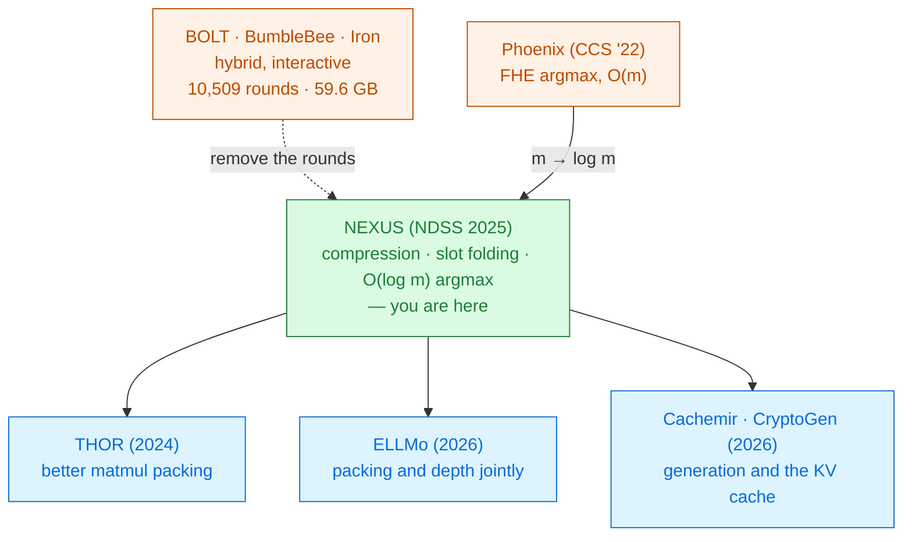

# NEXUS

Jiawen Zhang · Xinpeng Yang · Lipeng He · Kejia Chen · Wen-jie Lu · Yinghao Wang ·
Xiaoyang Hou · Jian Liu · Kui Ren · Xiaohu Yang 
Zhejiang University · University of Waterloo · NDSS 2025

Take a **pre-trained** BERT, change nothing about it, and run it under encryption with the client
sending **one message and receiving one message**. The contribution is not a better approximation —
it is the packing, the rotations, and an argmax that stopped being linear.

Read the <a href="../primer-fhe-transformers/">Primer</a> first · the landmark of Module 2

---

# The problem, in plain words

a phone call versus a letter. The interactive protocols make you stay on the line for ten thousand
exchanges. NEXUS posts one envelope and gets one back.

<RoundTrip :rounds="4" real-rounds="10,509" label="BOLT (Oakland '24)" note="59.61 GB per inference" />

<RoundTrip :rounds="1" non-interactive label="NEXUS" note="164 MB, client may go offline" />

<v-clicks>

- Rounds are not free: on a wide-area link the **latency dominates**, and hardware acceleration
  becomes pointless because the machine is waiting for the network.
- The money is real too. At AWS prices, BOLT costs **\$5.44 per reply token**
  [§I].
- And an online client cannot do anything else while it waits — which rules out exactly the
  batch settings (data warehousing, hospital diagnosis) where slow answers would be acceptable.

</v-clicks>

---

# What you need to know first

The [Primer](../primer-fhe-transformers/) covers CKKS, slots and depth. Three additions.

<v-clicks>

- **RNS-CKKS** — the residue-number-system variant of CKKS that all fast implementations use. Same
  ideas, engineered arithmetic.
- **The sign function is the workhorse.** Comparison is impossible in FHE, so NEXUS approximates
  $\text{SGN}(x)$ as $f^{d_f}(g^{d_g}(x))$ with both $f$ and $g$ of degree 9, $d_f=d_g=2$,
  $\alpha=20$ [§II-D]. Given a sign, you can build max, comparison,
  piecewise functions and argmax.
- **`SUBS`** — substitution, which maps a ciphertext of $p(x)$ to one of $p(x^k)$. Costs about the
  same as a rotation, and is the engine of the compression trick.

</v-clicks>

$\text{SGN}$ only works on inputs in $[-1,1]$, so every use must be preceded by a normalisation
$\Delta = \max\{|a_{\max}|,|a_{\min}|\}$. Remember this — it is where the accuracy goes.

---

# The one big idea

Two things about transformers, and not about CNNs, had made non-interactive inference impossible:
**matrix × matrix** products that waste most of every ciphertext, and an **argmax over the
vocabulary** whose cost was linear in 30,522. NEXUS fixes both, and everything else follows.

### Difference 1 — matrix × matrix
Earlier work (Gazelle, Cheetah, Iron) computed matmuls by inner products with **sparse packing**, so
most slots in the output ciphertext were empty and got transmitted anyway
[§I].

### Difference 2 — argmax over a vocabulary
CNNs pick from 1,000 ImageNet classes. A transformer picks from **30,522** (BERT) or **128,256**
(Llama-3-8B) tokens. Phoenix (CCS '22) needs $m$ sign evaluations and $m$ rotations.

Note what is *not* the delta. The polynomial approximations of GELU and the exponential are taken
from BumbleBee and PUMA. The bootstrapping is FHE-MP-CNN's. NEXUS's own inventions are **ciphertext
compression**, **SIMD slot folding**, and **logarithmic argmax**.

---

# Step 1 — stop wasting slots

The client must get $m\times n$ scalars to the server, each needing to be broadcast across all
slots. Sending them one ciphertext at a time is absurd.

<v-clicks>

- **Compress:** pack $[a_0, \dots, a_{N'-1}]$ as the *coefficients* of one polynomial
  $p(x)=a_0+a_1x+\dots$ and send **a single ciphertext** [§III-B].
- **Decompress:** the server recovers each $a_i$ on its own. Because $x^{N'} \equiv -1$,
  the substitution $\text{SUBS}(\tilde p, N'+1)$ negates every odd-degree term — so
  $\tilde p \boxplus \text{SUBS}(\tilde p, N'+1)$ **deletes all odd terms at once**.
- Repeat $\log N'$ times and you have isolated every coefficient. Total: $2N'$ substitutions, no
  communication [Alg. 1].

</v-clicks>

For BERT-base parameters this takes the ciphertexts that must be transmitted from Iron's **111** and
BOLT's **52** down to **5** [Table II]. That single table is most of the
372× bandwidth headline.

---

# Step 2 — the offline phase, and an asterisk

Different inputs get multiplied by the *same* weights, so the weight-dependent work can be done in
advance [§III-C].

<v-clicks>

- **Once per model:** the server sends compressed encrypted weights; the client decompresses,
  samples a random mask $U$, computes $V = U W$ homomorphically and returns it re-encrypted.
- **Per inference:** the client sends only $(A' - U)$ — a one-time pad — and the server computes
  $(A'-U)W \boxplus V = A'W$. One message.
- Amortised over 256 inputs, one $\mathbb{R}^{128\times768}\times\mathbb{R}^{768\times768}$ matmul
  takes **1.31 s**: 3.3× faster than BumbleBee, 1.3× than Iron, 1.2× than BOLT
  [§VI-C].

</v-clicks>

The asterisk. NEXUS is non-interactive **per inference**, and the paper is explicit and correct
about that. But the client does real cryptographic work in a setup phase, must store $U$, and must
redo the phase whenever the model changes. "Client can go offline" is true of the inference, not of
the deployment.

---

# Step 3 — SIMD slot folding: $n-1$ rotations become $\log n$

To reduce across the slots of one ciphertext (a sum, a maximum), the obvious method rotates $n-1$
times and combines. NEXUS builds a **binary tree** instead.

<v-clicks>

- Combine $\tilde a$ with $\text{ROTL}(\tilde a, 1)$; then that with its own rotation by 2; then by
  4, 8, ... Each level doubles the reach.
- Key observation: the right child of each node is just the left child rotated by $2^i$, so it never
  has to be computed separately [§IV-A].
- Works for **any associative** $f$. With $+$ it is `QuickSum`; with $\max$ it is `QuickMax`, using
  $\max(a,b) = \tfrac{a+b+(a-b)\cdot\text{SGN}(a-b)}{2}$.

</v-clicks>

`QuickSum` is then reused everywhere: the denominator of softmax, the mean and the variance in
LayerNorm. One primitive, four uses — which is why the deck spends a slide on it.

---

# Step 4 — argmax without touching every token

The output layer must return a one-hot selection vector over the vocabulary, without revealing the
probabilities — leaking them enables membership-inference attacks [§IV-A].

### Phoenix (CCS '22)
Compare every element with every other by rotating and taking signs.
$m$ sign evaluations, $m$ rotations.

$m = 30{,}522$ for BERT.
$m = 128{,}256$ for Llama-3-8B.

### NEXUS the delta
Find the maximum once with `QuickMax`, then

$$b_i = \text{SGN}(a_i - a_{\max}) + 1$$

$\log m + 1$ sign evaluations and rotations.

<v-clicks>

- Measured: **3004 s → 54 s**, a **55.6×** speedup at BERT's vocabulary, and up to **136.5×** at
  Llama-3-8B's [§VI-C, Fig. 10].
- It is also *more accurate*, and for a structural reason: Phoenix's error is
  $m\cdot(e_{\text{sgn}}+e_{\text{ks}}) \approx 1.18\times10^{-2}$; NEXUS's is
  $\log m \cdot(\dots) \approx 6.91\times10^{-4}$ [§VI-E].

</v-clicks>

Fewer operations means less accumulated noise. Under FHE, faster and more accurate are often the
same optimisation.

---

# Step 5 — the other three non-linearities

### GELU 4 pieces
Piecewise: $0$ / cubic / degree-6 / $x$, with breakpoints at $-4$, $-1.95$, $3$
[Eq. 3].

Three $\text{SGN}$ calls produce four indicator bits; the answer is their weighted sum.

Average error $<10^{-4}$ on $[-8,8]$.

### Softmax $r=8$
$\exp(x)\approx\left(1+\frac{x}{2^r}\right)^{2^r}$ — eight squarings, error $<10^{-5}$.

Then `QuickSum` for the denominator and **Goldschmidt** for the division.

### LayerNorm rewritten
Algebraically rearranged so only `QuickSum` and one **inverse square root** (Newton's iteration)
remain [Eq. 5].

$$y_i = \gamma\sqrt{n}\cdot\frac{z_i}{\sqrt{\sum z_i^2}}+\beta$$

Two shortcuts to hold on to. Softmax normally subtracts the row maximum for numerical stability;
NEXUS **takes $a_{\max}$ as a constant** rather than computing it, on the grounds that softmax is
shift-invariant so the value does not change the result — but a badly chosen constant does change
the *numerical range* the Taylor form sees. And the GELU pieces are valid on $[-8,8]$, justified by
a footnote saying all observed inputs fell in that range [§IV-B, fn. 3].

---

# A tiny worked example — fold, then argmax

Four logits in one ciphertext: $\tilde a = \text{ENC}([\,2,\;-1,\;3,\;1\,])$. The paper's own toy case.

<v-clicks>

**Fold for the maximum** — two rotations, not three:

- $\text{ROTL}(\tilde a,1) = [-1,\,3,\,1,\,2]$; element-wise max → $[\,2,\,3,\,3,\,2\,]$
- $\text{ROTL}(\cdot,2) = [\,3,\,2,\,2,\,3\,]$; element-wise max → $[\,3,\,3,\,3,\,3\,]$ ✓

**Then argmax in one more line:**

- $\tilde a \boxminus \tilde a_{\max} = [-1,\,-4,\,0,\,-2]$
- $\text{SGN}(\cdot) = [-1,\,-1,\,0,\,-1]$, add 1 → $[\,0,\,0,\,1,\,0\,]$ ✓ the selection vector

</v-clicks>

Now scale it. At $m=4$ the tree saves one rotation. At BERT's $m = 30{,}522$ it is **15 rotations
instead of 30,521**. The same three lines; the saving is the whole paper.

Values follow §IV-A's example; the arithmetic is worked here.

---

# The depth ledger — and why bootstrapping is placed where it is

One feed-forward block, exact levels from the paper's own breakdown
[Table IV]:

<DepthBar :total="17" :steps="[
  { label: 'FFN up-projection (768→3072)', cost: 1 },
  { label: 'GELU (3 SGN + degree-6)', cost: 14, expensive: true },
  { label: 'FFN down-projection (3072→768)', cost: 1 },
  { label: 'bootstrap', bootstrap: true },
]" caption="levels available for computation: 21 total, 14 reserved for bootstrapping itself (L = 35, K = 14)" />

<v-clicks>

- Softmax spends **16 levels** (19 → 3) and LayerNorm another **16** (17 → 1). Four bootstraps are
  needed per layer.
- **Where** you bootstrap matters as much as how often. GELU's output is
  $\mathbb{R}^{128\times3072}$ — 12 ciphertexts — but the next matmul shrinks it to 3. Bootstrap
  *after* the matmul and you refresh a quarter as many ciphertexts [§V].

</v-clicks>

---

# Threat model

Semi-honest, two-party, computationally bounded — with a formal proof in Appendix D
[§II-A].

| Party | Sees | Never sees |
|---|---|---|
| Client | its own input, the final **label** | the model weights, the logits |
| Server | one masked matrix, ciphertexts, the model | the input, the answer |
| Network observer | two messages, 164 MB | contents |

<v-clicks>

- Note the second row of column two: because argmax runs **under encryption**, the client receives a
  one-hot vector and not a probability distribution. That is a deliberate defence against
  membership inference, and it is why argmax had to be made cheap.
- **Sequence length and vocabulary size are public.** So is the number of generated tokens.

</v-clicks>

The setup phase gives the client the model's *encrypted* weights to decompress. They stay encrypted
under the server's key, so nothing leaks — but it is a assumption worth naming when you compare
NEXUS's threat model with a system that never ships weights at all.

---

# Results — the operators, priced honestly

WAN at 100 Mbps and 80 ms round trip — the setting where non-interactivity earns its keep
[Table III]:

| Operator | Iron | BOLT | BumbleBee | **NEXUS (CPU)** | **NEXUS (GPU)** |
|---|---|---|---|---|---|
| GELU | 4118 s · 93.3 GB | 774 s · 17.2 GB | 338 s · 3.3 GB | **44 s · 0 GB** | **2.1 s** |
| Softmax | 1900 s · 42.1 GB | 775 s · 16.9 GB | 241 s · 1.7 GB | **47 s · 0 GB** | **1.2 s** |
| LayerNorm | 1158 s · 20.4 GB | 914 s · 14.0 GB | — | **32 s · 0 GB** | **2.0 s** |
| Argmax | — | — | — | **54 s** (Phoenix: 3004 s) | **2.5 s** |

<v-clicks>

- The zeroes are the point: NEXUS's non-linear evaluation sends **nothing**.
- On a **LAN** the story changes completely — BOLT's GELU is 14 s against NEXUS's 44 s. The
  advantage is a wide-area advantage [Table III].
- Accuracy is comparable, not better: NEXUS's GELU error is $7.7\times10^{-4}$ against BOLT's
  $9.8\times10^{-4}$; on softmax BOLT is *more* accurate ($1.4\times10^{-6}$ vs $3.1\times10^{-5}$).

</v-clicks>

---

# Results — end to end, and how to read the headline

BERT-base, 128 input tokens, amortised over batched inputs [§VI-D]:

<CostBars unit="MB" log :items="[
  { label: 'Iron', value: 284900, note: '1737.5× more' },
  { label: 'BOLT', value: 60450, note: '368.6× more' },
  { label: 'BumbleBee', value: 8807, note: '53.7× more' },
  { label: 'NEXUS', value: 164, note: 'and 1 round', highlight: true },
]" caption="bandwidth for one inference, log scale — ratios as reported in §VI-D" />

<v-clicks>

- Runtime: **14.8×** faster than Iron, **3.6×** than BOLT, **1.8×** than BumbleBee. Cost: **$0.05**
  per token on GPU against BOLT's $5.44.
- **The 37.3 s headline is amortised over 32 batched inputs on four A100 GPUs.** The single-machine
  CPU figure in the same table is **857 s** [Table IV]. Both are honest;
  they answer different questions.
- A small thing worth noticing: the abstract claims 372.5× over BOLT, §VI-D says 368.6×. Even
  careful papers drift. Cite the section, not the abstract.

</v-clicks>

---

# Results — where 857 seconds go, and what accuracy survives

<CostBars unit="s" :items="[
  { label: 'Bootstrapping (×4 per layer)', value: 534, note: '62.3%', highlight: true },
  { label: 'All matrix multiplications', value: 138, note: '16%' },
  { label: 'Argmax', value: 54, note: '6%' },
  { label: 'Softmax', value: 47, note: '5%' },
  { label: 'GELU', value: 44, note: '5%' },
  { label: 'LayerNorm (×2)', value: 32, note: '4%' },
]" caption="BERT-base CPU, per input over 32 batched inputs [Table IV]" />

### Accuracy [Table V]

| Model · task | Plaintext | NEXUS |
|---|---|---|
| BERT · SST-2 | 92.36 | 92.11 |
| BERT · QNLI | 90.30 | 89.90 |
| Llama-3-8B · SST-2 | 94.94 | 94.46 |

No retraining, no fine-tuning — an off-the-shelf checkpoint [§VI-B]. The
quiet advantage over every approximation-aware method here.

**Bootstrapping is the bill** — not softmax, not GELU.

---

# What it costs

<v-clicks>

- **Depth, and therefore bootstrapping.** $L=35$ with $K=14$ reserved, leaving 21 usable levels —
  and four bootstraps per transformer layer to keep going.
- **A setup phase** with real client compute and storage, repeated whenever the model changes.
- **Four A100 GPUs** for the headline number, and 32 batched inputs to amortise over.
- **Latency in absolute terms.** 37 s for one BERT-base answer is roughly $10^{3}$–$10^{4}$× a
  plaintext forward pass, and the LAN comparison against BOLT is not flattering.
- **Approximation error that is merely competitive**, not better — and worse than BOLT's on softmax.
- **A constant standing in for $a_{\max}$** in softmax, valid only while the score range behaves.

</v-clicks>

---

# What it does not solve

<v-clicks>

- **Generation.** Table IV measures *"generating a one word output"*. The Llama-3-8B column is 8
  input tokens producing one token in 51.84 s on 4 GPUs. There is no KV cache and no multi-token
  decoding — see [Cachemir](../cachemir-2026/) and [CryptoGen](../cryptogen-2026/).
- **Long context.** 128 tokens throughout. Softmax cost grows quadratically in sequence length.
- **Bootstrapping.** Identified as 62.3% of the runtime and left as the next paper's problem —
  which is exactly what [ELLMo](../ellmo-2026/) and [THOR](../thor-2024/) pick up.
- **The LAN regime.** Where bandwidth is cheap, interactive systems still win on wall-clock.
- **Malicious adversaries.** Semi-honest only, like everything else in this literature.
- **What the client does with the label.** Argmax under encryption blocks membership inference from
  the probability vector, not from the answer itself.

</v-clicks>

---

# Where it sits

Primer strategy <strong>A</strong>, done without touching the model — the only paper in this module that needs no training at all.

---

# Key terms

<dl class="glossary">
<dt>Non-interactive</dt><dd>One message from client to server, one back. No rounds in between.</dd>
<dt>RNS-CKKS</dt><dd>The residue-number-system variant of CKKS used by every fast implementation.</dd>
<dt>SGN</dt><dd>A polynomial approximation of the sign function. The primitive behind max, comparison and argmax.</dd>
<dt>SUBS (substitution)</dt><dd>Maps an encryption of $p(x)$ to one of $p(x^k)$. Costs about a rotation.</dd>
<dt>Ciphertext compression</dt><dd>Packing many values as polynomial coefficients into one ciphertext, and recovering them server-side with SUBS.</dd>
<dt>SIMD slot folding</dt><dd>Reducing across all slots with a binary tree: log n rotations instead of n − 1.</dd>
<dt>QuickSum / QuickMax</dt><dd>Slot folding instantiated with + and with max. Used by softmax, LayerNorm and argmax.</dd>
<dt>Goldschmidt division</dt><dd>Division by iterated multiplication. Used for softmax's denominator.</dd>
<dt>Offline–online</dt><dd>Weight-dependent work done once per model, so each inference is a single message.</dd>
<dt>Amortised latency</dt><dd>Total time ÷ number of batched inputs. NEXUS's headline 37.3 s is amortised over 32.</dd>
</dl>

---

# Check yourself

**1. NEXUS's GELU takes 44 s and BOLT's takes 14 s. Why is NEXUS's the better number?**

<v-click>

Because BOLT's 14 s is on a **LAN**. Move to 100 Mbps with 80 ms latency — an ordinary internet
link — and BOLT's same GELU takes **774 s**, because 17.2 GB has to cross the wire. NEXUS's 44 s is
unchanged, because it sends nothing. Ask of any secure-inference number: *whose network?*

</v-click>

**2. Why did making argmax faster also make it more accurate?**

<v-click>

Each homomorphic operation adds noise, so error accumulates with the *number* of operations.
Phoenix does $m$ sign evaluations and inherits $m\cdot e_{\text{sgn}}$; NEXUS does $\log m$ and
inherits $\log m \cdot e_{\text{sgn}}$ — a factor of 2,000 fewer at BERT's vocabulary. Under FHE,
an algorithmic speedup is usually an accuracy improvement too.

</v-click>

**3. Bootstrapping is 62.3% of the runtime. Where would you spend the next research year?**

<v-click>

Not on softmax. Either cut the *number* of bootstraps by lowering the depth each operator consumes
(softmax spends 16 of 21 levels — that is where the pressure is), or cut the *cost* of each one
with better placement and packing so fewer ciphertexts get refreshed. Both routes are taken:
[PowerSoftmax](../power-softmax-2024/) for the first, [ELLMo](../ellmo-2026/) for the second.

</v-click>

---
layout: center
---

# Where to go next

**The systems NEXUS is measured against**
[BOLT](../bolt-2023/) · [BumbleBee](../bumblebee-2023/) · [Iron](../iron-2022/) — the interactive
side of the ledger, and why 10,509 rounds is a design and not an accident.

**Attacking what NEXUS left expensive**
[THOR (2024)](../thor-2024/) for matrix multiplication ·
[ELLMo (2026)](../ellmo-2026/) for packing and depth together ·
[PowerSoftmax (2024)](../power-softmax-2024/), which claims a 9.7× cheaper softmax than this one.

**The missing capability**
[Cachemir (2026)](../cachemir-2026/) and [CryptoGen (2026)](../cryptogen-2026/) — encrypted
generation with a KV cache.

**For calibration**
[SoK on approximate HE (2026)](../sok-approx-he-llm-2026/) — how the 37.3 s reads two years later.

← back to <a href="../../slides/">all decks</a>

