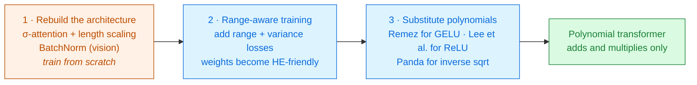
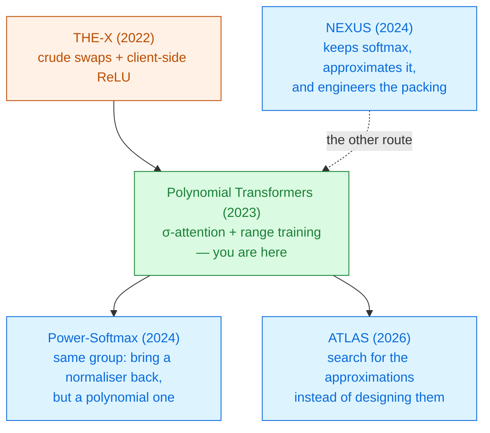

# Converting Transformers to Polynomial Form

Itamar Zimerman · Moran Baruch · Nir Drucker · Gilad Ezov · Omri Soceanu · Lior Wolf 
IBM Research · Tel-Aviv University · Bar-Ilan University · arXiv 2311.08610 · November 2023

The first transformer made entirely of additions and multiplications — **no client, no rounds, no
exceptions**. It gets there by changing the architecture until softmax is not needed, not by
approximating softmax better.

Read the <a href="../primer-fhe-transformers/">Primer</a> and <a href="../thex-2022/">THE-X</a> first · Module 2

---

# The problem, in plain words

a machine shop that owns exactly two tools — an adder and a multiplier. You may build anything you
like out of those two. You may not send a part out for grinding.

<v-clicks>

- [THE-X](../thex-2022/) got a transformer *almost* there, then handed each ReLU back to the client.
- Send anything back to the client and you have a **protocol**: rounds, latency, an online client,
  and intermediate activations leaving the server.
- So: can a transformer be made of polynomials **all the way through**, and still work?

</v-clicks>

Before this paper, nobody had shown one. Polynomial versions of ResNet-152 and ConvNeXt existed;
transformers were "a notable exception" [§2.2].

---

# What you need to know first

Three results from before this paper that explain *why* it is hard.

<v-clicks>

- **Polynomials do not saturate.** ReLU and GELU flatten; $x^2$ does not. Goyal et al. showed
  gradients in a depth-$l$, degree-$d$ polynomial network **explode exponentially in the network's
  total degree** [§2.2].
- **So deep polynomial networks are unstable**, and the instability *grows* with depth and width
  (Zhou et al.) — the opposite of what you want for a transformer.
- **Range is everything.** Approximation error grows with the width of the interval you approximate
  over. A polynomial fitted on $[-20,20]$ needs far lower degree than one fitted on $[-70,70]$,
  and degree is depth, and depth is money.

</v-clicks>

One word to keep straight. **BatchNorm** can be folded into a constant affine transform at
inference time, so it is *free* under encryption. **LayerNorm** cannot — it divides by a standard
deviation computed from the data at run time.

---

# The one big idea

Do not ask "what polynomial approximates softmax?" Ask **"what would an attention mechanism look
like if it had been designed for a machine that can only add and multiply?"** — then train the
network so the remaining non-polynomial pieces only ever see a small range of inputs.

### What is inherited
CKKS. Remez fitting. Polynomial ReLU (Lee et al. 2021). Inverse-square-root polynomials
(Panda 2022). Range-minimisation loss for *activations* (Baruch et al. 2023).

### What is new here the delta
**Scaled σ-attention** — softmax removed, replaced by a pointwise activation plus a length scale.
And range minimisation extended from activations to **LayerNorm's variance**.

The trick that makes the whole thing tractable: σ-attention turns *"approximate a vector-valued
function"* into *"approximate a scalar activation"* — a problem the CNN literature had already
solved [§4.1].

---

# Step 1 — delete softmax

$$\text{Attention}_\sigma(Q,K,V) = \sigma\!\left(\frac{QK^{\top}}{\sqrt{d_k}}\right)V
\qquad\text{where }\sigma\text{ is }\textbf{pointwise}$$

<v-clicks>

- Softmax is **vector-wise**: every output depends on every score in the row, through an $\exp$ and
  a division by their sum.
- $\sigma$ is **element-wise**: GELU or ReLU, applied to each score independently. Nothing is
  shared, nothing is divided.
- The attention mask stops being an additive $-\infty$ and becomes an **element-wise multiply by a
  binary mask** $M$ [Eq. 9] — which is free under encryption, and sidesteps
  the numerical cliff that bit THE-X.

</v-clicks>

Notice what is lost. Softmax guarantees the attention weights are **positive and sum to one**, so
the output is a weighted average of the value vectors and cannot grow. $\sigma$ guarantees nothing
of the kind.

---

# Step 2 — it explodes, and here is the fix

<v-clicks>

**Break it first.** Train a transformer with plain σ-attention and *"the model's weights explode in
the initial epochs of training"* [§5.2]. Not a small accuracy loss — a
divergence.

**Diagnose it.** The row of $\sigma$ values sums to something that grows with the sequence length
$L$, and that sum multiplies $V$. Every layer amplifies. Softmax's division by the sum was doing
load-bearing work that had nothing to do with attention.

**Fix it.** Put the missing scale back by hand:

</v-clicks>

$$\text{Attention}_{\sigma\text{-scale}}(Q,K,V) = \frac{1}{S(L)}\,\sigma\!\left(\frac{QK^{\top}}{\sqrt{d_k}}\right)V,
\qquad S(L)=\sqrt{L}\ \text{ or }\ L$$

Four placements were tried — before the activation, after it, both, with $1/\sqrt{L}$ and with
$1/L$. **Post-activation scaling by $1/\sqrt{L}$ wins**; pre- *and* post-scaling by $1/L$ fails to
converge and collapses [§5.2, Fig. 4]. The theoretically tidy normaliser is
not the one that works.

---

# How much does that one scale factor buy?

Vision transformer, GELU attention, with and without length scaling:

<CostBars unit="% accuracy" :lower-is-better="false" :items="[
  { label: 'CIFAR-10 · vanilla softmax', value: 92.70, reference: true },
  { label: 'CIFAR-10 · σ-attention, no scaling', value: 81.17, note: '−11.53' },
  { label: 'CIFAR-10 · σ-attention + 1/√L', value: 92.31, note: 'gap closed to 0.39', highlight: true },
  { label: 'CIFAR-100 · vanilla softmax', value: 72.08, reference: true },
  { label: 'CIFAR-100 · σ-attention, no scaling', value: 68.41, note: '−3.67' },
  { label: 'CIFAR-100 · σ-attention + 1/√L', value: 70.87, note: '+2.46', highlight: true },
]" caption="Table 3 — ViT backbone, BatchNorm throughout, post-activation scaling" />

One division by $\sqrt{L}$, no learnable parameters, **+11.14 points** on CIFAR-10. Cheap fixes to
range problems are the recurring theme of this whole module.

---

# Step 3 — normalisation, and the fork in the road

LayerNorm needs $1/\sqrt{\mathrm{Var}[x]}$. The obvious move is to swap in BatchNorm, which folds
into a constant at inference time and is therefore free.

### Vision — BatchNorm works ✓

<v-clicks>

But only with two props [§4.2]:

- an extra BatchNorm inside the MLP of each block, and
- a **BatchNorm 2D across the attention heads**, which is where the instability actually lives.

</v-clicks>

### Language — BatchNorm fails ✗

<v-clicks>

*"Models with σ-attention and BatchNorm completely failed"*, even with published stabilisers
[§4.2].

So for NLP the inverse square root must be approximated after all — and the measured variances
span **1 to $10^{9}$**. No polynomial covers nine orders of magnitude.

</v-clicks>

This split is worth remembering: **a technique that works on images may not survive the move to
text**, because the activation statistics are different. Several papers in this module report
vision numbers only.

---

# Step 4 — if the range is the problem, train the range

Rather than fitting a better polynomial over $[1, 10^9]$, add a loss term that **shrinks the
interval** [Eq. 11]:

$$\mathcal{L} = \alpha\,\mathcal{L}_{\text{range-min}} + \beta\,\mathcal{L}_{\text{variance-min}} + \mathcal{L}_{\text{original}}$$

<v-clicks>

- $\mathcal{L}_{\text{range-min}}$ penalises large inputs to the **activation** layers (inherited
  from Baruch et al. 2023).
- $\mathcal{L}_{\text{variance-min}}$ penalises large **variance** at each LayerNorm — this is the
  paper's extension, and it is what makes NLP possible at all.
- Measured effect [§5.2, Fig. 5]: variance ceiling **3300 → 300**;
  activation range **70 → 20**.

</v-clicks>

Approximation error and polynomial degree both fall with the width of the interval. Shrinking the
domain by 11× is worth more than any amount of cleverness in the fitting.

---

# The recipe, in order

<v-clicks>

- Stages 1 and 2 involve **training**; stage 3 is pure substitution, no training at all.
- The substitution is only accurate *because* stage 2 guaranteed the inputs stay in the fitted range.
  Do stage 3 without stage 2 and the polynomials are being asked about inputs they never saw.

</v-clicks>

---

# A tiny worked example — one attention row by hand

Sequence length $L=4$. One row of scaled scores: $s = [\,2,\;1,\;0,\;-1\,]$.

**Softmax** — the original

$e^s = [7.39,\;2.72,\;1.00,\;0.37]$, sum $= 11.47$

$w = [\,0.644,\;0.237,\;0.087,\;0.032\,]$

All positive. Sums to exactly 1.

**σ-attention with GELU**, then $\times\,1/\sqrt{4}$

$\sigma(s) = [\,1.955,\;0.841,\;0,\;-0.159\,]$, sum $= 2.637$

$w = [\,0.977,\;0.421,\;0,\;-0.079\,]$, sum $= 1.319$

One weight is negative. The sum is not 1.

<v-click>

Now see why the scale factor is not optional. Without it the row sums to 2.637 — every layer
multiplies the signal by roughly that, and six layers give $2.6^6 \approx 320\times$. With
$1/\sqrt{L}$ it sums to 1.319 instead. (Worked by hand from Eqs. 4–7; the paper
gives no numeric example.)

</v-click>

<v-click>

Attention does not need a probability distribution. It needs a **bounded** re-weighting.

</v-click>

---

# Threat model

The client encrypts, sends, and may then go offline. Nothing comes back until the answer.

| Party | Sees | Never sees |
|---|---|---|
| Client | its own input, the final answer | the model weights |
| Server | one ciphertext, the model | the input, the answer, any intermediate value |
| Network observer | two message sizes and the total time | contents |

<v-clicks>

- This is the honest version of what [THE-X](../thex-2022/) promised: **zero client involvement**,
  because there is nothing left that a polynomial cannot compute.
- The authors make the point directly — interactive protocols *"increase communication overhead and
  the potential for vulnerability to man-in-the-middle attacks"* [§2.4].

</v-clicks>

What still leaks: the **sequence length**. Length scaling divides by $\sqrt{L}$ and the packing is
sized for $L$, so the number of tokens is a structural parameter, not a secret.

---

# Results — accuracy

### Language — Wikitext-103, perplexity (lower better)

| Depth | Params | Original | Poly | Gap |
|---|---|---|---|---|
| 6 | 53.3M | 18.98 | **19.89** | +0.91 |
| 12 | 95.8M | 16.89 | **18.91** | +2.02 |

[Table 1]

### Vision — accuracy (higher better)

| Model · data | Original | Poly | Gap |
|---|---|---|---|
| ViT · CIFAR-100 | 73.4 | **70.8** | −2.6 |
| Swin · Tiny-ImageNet | 59.4 | **58.9** | −0.5 |

[Table 2]

<v-clicks>

- Where does the loss occur? **At least 80% of it is in the final polynomial substitution**, not in
  the architecture change — 0.74 of the 0.91 at 6 layers, 1.76 of the 2.02 at 12
  [§5.1]. Better polynomials would recover most of it.
- Read the two depths together: the gap **more than doubles** from 6 layers to 12. The paper does
  not test 24.

</v-clicks>

---

# Results — the first real latency number in this module

<CostBars unit="s" :items="[
  { label: 'Polynomial transformer, 6 layers, 53.3M params', value: 305, note: '128 tokens, one inference', highlight: true },
  { label: 'ResNet-152, 60M params (prior state of the art for CNNs)', value: 432, note: 'same SDK, same machine' },
]" caption="HElayers 1.52 over HEaaN · AMD EPYC 7763 (32 cores) + NVIDIA A100 80GB · 128-bit security [§5.3]" />

<v-clicks>

- Parameters: ciphertexts with $2^{15}$ coefficients, **multiplicative depth 12**, 42-bit fractional
  and 18-bit integer precision, giving **9 multiplications before a bootstrap is required**
  [§5.3].
- This is the comparison the authors chose, and it is a fair one: a transformer of comparable size
  is now **cheaper** under encryption than the best encrypted CNN.

</v-clicks>

But note what it is *not* compared against: no hybrid system, no [THE-X](../thex-2022/) (which
reports no time at all), no plaintext baseline on the same machine. 305 s is a data point, not a
ranking.

---

# What it costs

<v-clicks>

- **You train from scratch.** This is the big one. There is no pre-trained checkpoint to convert —
  stage 1 changes the architecture, so the model is trained from zero on your data and your budget.
- **Two extra loss terms with two hyperparameters** ($\alpha$, $\beta$) that trade accuracy against
  approximability, tuned per task.
- **The vision and language recipes differ.** BatchNorm for one, approximated LayerNorm for the
  other. It is not one method.
- **Depth-12 CKKS parameters and a bootstrap every 9 multiplications** — the cost is real, and it
  is why 128 tokens takes five minutes on an A100.
- **Accuracy**, in the currency of the task: +0.91 to +2.02 perplexity, −0.5 to −2.6 accuracy points.

</v-clicks>

---

# What it does not solve

<v-clicks>

- **Scale.** The largest model is **95.8M parameters** and the largest vision backbone is 7.13M
  [Tables 5–6]. BERT-Base is 110M; Llama-3-8B is eighty times larger.
- **Depth.** The accuracy gap grew from 0.91 to 2.02 when depth went 6 → 12. The trend line points
  the wrong way and the paper stops there.
- **Pre-trained models.** Every checkpoint in the world stays unusable until retrained. Compare
  [ATLAS](../atlas-2026/), which converts an existing model.
- **Generation.** Next-token prediction as a *training objective*, evaluated by perplexity — not
  autoregressive decoding with a KV cache.
- **The instability is managed, not removed.** Weight explosion, collapsed variants, a failed
  BatchNorm path in NLP: the paper is candid that these models sit close to the edge.
- **No adversarial or out-of-distribution evaluation** — the authors list it as future work
  [§6].

</v-clicks>

---

# Where it sits

Primer strategy <strong>A</strong> and <strong>C</strong> at once: approximate everything, and redesign the model so there is less to approximate.

---

# Key terms

<dl class="glossary">
<dt>Polynomial transformer</dt><dd>A transformer whose every operation is an addition or a multiplication, so CKKS can run it unaided.</dd>
<dt>σ-attention</dt><dd>Attention with softmax replaced by a pointwise activation applied to each score independently.</dd>
<dt>Length scaling</dt><dd>Dividing the attention output by √L (or L) to restore the bound that softmax's normalisation used to provide.</dd>
<dt>Range minimisation</dt><dd>A training loss that penalises large inputs to layers that will later be replaced by polynomials.</dd>
<dt>Variance minimisation</dt><dd>The same idea applied to LayerNorm's variance — this paper's extension.</dd>
<dt>Remez algorithm</dt><dd>The standard method for finding the best polynomial of a given degree over a given interval.</dd>
<dt>BatchNorm vs LayerNorm</dt><dd>BatchNorm folds into a constant at inference and is free under HE; LayerNorm divides by run-time data and is not.</dd>
<dt>HElayers / HEaaN</dt><dd>IBM's HE software stack and the CKKS library underneath it. The paper's runtime.</dd>
<dt>Multiplicative depth 12</dt><dd>This paper's CKKS setting; 9 multiplications are available before a bootstrap is needed.</dd>
</dl>

---

# Check yourself

**1. σ-attention removes a division. Then the method adds a division by √L back. What was actually gained?**

<v-click>

The division that was removed was **data-dependent** — by the sum of exponentials of the actual
scores, which is a different number for every row and only known at run time. The division that was
added is by $\sqrt{L}$, a **constant fixed before encryption**, so it is a plaintext multiply by
$1/\sqrt{L}$ and costs nothing. Same algebraic shape, entirely different cost under FHE.

</v-click>

**2. Range minimisation cut the variance ceiling from 3300 to 300, and the paper calls this the key step. Why is an 11× narrower interval worth so much?**

<v-click>

Because polynomial degree *is* depth, and depth is bootstrapping. Error grows with interval width,
so a wide interval forces a higher degree for the same accuracy — out of a budget of 9
multiplications. Narrowing the domain buys accuracy *and* speed at once.

</v-click>

**3. The 6-layer model loses 0.91 perplexity, the 12-layer model 2.02. What do you predict at 24 layers?**

<v-click>

Worse than 4.0, on the naive extrapolation — and consistent with the known result that polynomial
instability grows with depth. But it is two points from one architecture on one dataset. The honest
answer is that the paper does not test the direction that matters.

</v-click>

---
layout: center
---

# Where to go next

**The same group's next move**
[Power-Softmax (2024)](../power-softmax-2024/) — having removed softmax entirely here, they put a
normaliser back, this time one that is polynomial by construction.

**The opposite bet**
[NEXUS (2024)](../nexus-2024/) — keep softmax, approximate it, and win on packing and engineering
instead of architecture.

**If "train from scratch" is a dealbreaker**
[ATLAS (2026)](../atlas-2026/) — automated approximation of an existing transformer.

**Where the machinery came from**
[The Primer](../primer-fhe-transformers/) on depth and bootstrapping ·
[SoK on approximate HE (2026)](../sok-approx-he-llm-2026/) for how this line of work aged.

← back to <a href="../../slides/">all decks</a>

