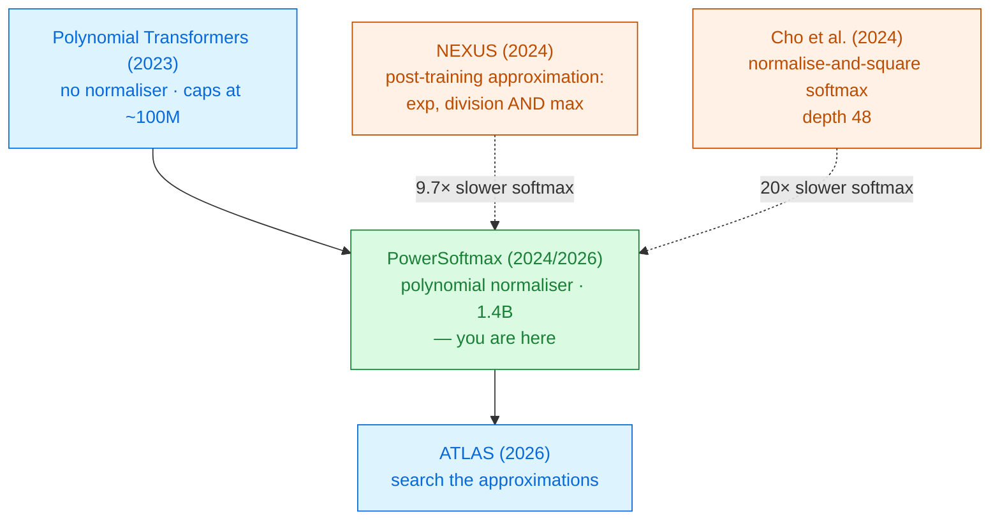

# PowerSoftmax

Itamar Zimerman · Allon Adir · Ehud Aharoni · Matan Avitan · Moran Baruch · Nir Drucker ·
Jenny Lerner · Ramy Masalha · Reut Meiri · Omri Soceanu 
IBM Research · AISTATS 2026 · arXiv 2410.09457

Softmax does three jobs at once. Two of them are cheap under encryption and one is ruinous. Keep
the cheap two, replace the third with a **power**, and a **1.4-billion-parameter** polynomial
language model becomes trainable.

Read <a href="../polynomial-transformers-2023/">Polynomial Transformers</a> first — this is the same group's answer to its own limits

---

# The problem, in plain words

a committee vote where every member's influence must add up to 100%. Softmax runs the vote by
exponentiating each opinion and dividing by the total. Under encryption, the exponential and the
division are both forbidden.

<v-clicks>

- [Polynomial Transformers (2023)](../polynomial-transformers-2023/) removed the vote entirely —
  pointwise σ-attention, no normalisation at all. It works up to about 100M parameters.
- Then it stops working. The authors of *this* paper — the same group — report they *"were unable
  to successfully train deep transformers with 32 layers"* with that method
  [§5.3].
- Their diagnosis: *"their pointwise attention lacks score normalisation, resulting in training
  instability"* [§5.3].

</v-clicks>

The normalisation was not decoration. Removing it caps you at small models.

---

# What you need to know first

Softmax, decomposed. This paper's whole design follows from asking which parts you actually need.

<v-clicks>

Softmax does **three separate things** [§4.1]:

1. **Normalisation** — outputs land in $[0,1]$ and sum to 1, so the attention output is a bounded
   weighted average.
2. **Exponential scaling** — it *amplifies* the gap between high and low scores, so attention is
   selective rather than diffuse.
3. **Order preservation** — a higher score always gets a higher weight.

</v-clicks>

Under CKKS, job 1 costs a **division**, job 2 costs an **exponential**, and job 3 is free. The
2023 paper dropped all three. This paper asks whether a cheaper function can do 1 and 2 well enough.

One more inherited tool: **Goldschmidt's algorithm** (1964) computes $1/x$ by iterated
multiplication — a polynomial procedure, but only accurate over a **bounded** input domain. Keep
that word "bounded" in mind; three of this paper's four tricks exist to supply it.

---

# The one big idea

$$\text{PowerSoftmax}(x)_j = \frac{x_j^{\,p}}{\sum_i x_i^{\,p}}\qquad p\text{ a positive even integer}$$

A **power** instead of an exponential. Both are super-linear, so both amplify differences — but
$x^4$ is a polynomial, and $e^x$ is not.

<v-clicks>

- **Normalisation** kept exactly: even $p$ makes every term non-negative, so weights sum to 1.
- **Amplification** approximated: polynomial growth mimics exponential over the range that matters
  [Fig. 1].
- **Order** is *broken*, deliberately. The worked example shows how.

</v-clicks>

The delta in one line: **one non-polynomial operation per attention row** — the division — where
[NEXUS](../nexus-2024/) needs three high-degree approximations per attention layer (exponential,
division, and the row maximum) [§5.3].

---

# Step 1 — the general form, so the choice is visible

Write both mechanisms in one frame: an element-wise activation $\sigma$, then a normaliser $N$
[Eqs. 3–4].

$$\text{Generalized Attn}(Q,K,V) = N\!\left(\sigma\!\left(\frac{QK^{\top}}{\sqrt{d_k}}\right)\right)V,
\qquad N(x)_j = \frac{|x_j|}{\lVert x\rVert_1}$$

<strong class="pt">Softmax</strong> 
$\sigma_e(x)=e^{x}$, with $N$ 
exp + division

<strong class="ct">σ-attention (2023)</strong> 
$\sigma$ = GELU, <strong>no</strong> $N$ 
no division · no bound

<strong class="win">PowerSoftmax</strong> 
$\sigma_p(x)=x^{p}$, with $N$ 
division only

<v-clicks>

- The 2023 paper bought its freedom by deleting $N$ — and paid for it with the instability that
  capped it at 100M parameters.
- This paper keeps $N$ and makes $\sigma$ cheap instead. Attention masks become an element-wise
  product $QK^{\top}\odot M$ rather than an additive $-\infty$ [Eq. 11].

</v-clicks>

---

# Step 2 — the last non-polynomial operation, made easy

Division survives. $1/x$ blows up near zero, and PowerSoftmax's denominator **can** reach zero
(unlike softmax's, which is a sum of strictly positive exponentials).

$$N_\epsilon(x)_j = \frac{|x_j|}{\epsilon + \lVert x \rVert_1}\qquad \text{(e.g. }\epsilon=10^{-3}\text{)}$$

<v-clicks>

- With $\epsilon$ in the denominator, $1/x$ is bounded by $1/\epsilon$ and the map is
  $\frac{1}{\epsilon^2}$-**Lipschitz** — no discontinuity for a polynomial to chase.
- The usual reason to add an $\epsilon$ is numerical hygiene. Here it is deliberately **much
  larger**, to cut approximation depth [§4.2].
- Measured: Goldschmidt's error **falls as $\epsilon$ rises** [Figs. 5, 7].

</v-clicks>

Deliberately making the function *less exact* makes the encrypted model *more* accurate, because
the polynomial that approximates it is so much better behaved. This trade shows up all over the
module.

---

# Step 3 — two different forms, for two different jobs

The mechanism used during **training** is not the one used during **encrypted inference**
[Fig. 2].

### Training — the stable variant

$$\text{PowerSoftmax}\!\left(\frac{x}{c}\right),\quad c = \lVert x\rVert_\infty + \delta$$

<v-clicks>

- Raising to the 4th power overflows if $|x|>1$ and underflows if $|x|<1$.
- Dividing by the row's largest magnitude forces every entry into $(0,1)$.
- Legitimate because PowerSoftmax is **invariant** to dividing its input by a positive constant —
  the exact analogue of softmax's shift invariance.

</v-clicks>

### Inference — the length-agnostic variant

$$\frac{x_j^{p}}{\text{Mean}_{i\le L}\, x_i^{p}}$$

<v-clicks>

- The **sum** $\sum_i x_i^p$ grows linearly with sequence length $L$, so its domain is unbounded and
  Goldschmidt cannot cover it.
- The **mean** converges to $\mu$ as $L\to\infty$ by the law of large numbers
  [Eq. 8] — a bounded target.
- Legitimate because **$L$ is not a secret**: $1/L$ is a public constant the client can precompute.

</v-clicks>

Read that last point twice. The method is efficient *because* it leaks the sequence length — an
assumption, not a free lunch.

---

# Step 4 — the escape from "train from scratch"

The 2023 method's worst cost was that no pre-trained checkpoint could be reused. This paper fixes it.

<v-clicks>

- Softmax attention and PowerSoftmax attention have **exactly the same trainable parameters** —
  $W_Q$, $W_K$, $W_V$ — and compute similar things.
- So: initialise from a released checkpoint, swap the attention, and **continually pre-train**
  briefly [§4.5].
- Done for **Pythia-1.4B** ($p=4$, continual pre-training on the Pile) and for **RoBERTa-Base**
  ($p=6$, on OpenWebText) [App. A].

</v-clicks>

This is what turns an architecture idea into a scalable method. Approximation-aware training was
stuck at 100M parameters not because of mathematics but because retraining is expensive. Reuse the
pre-training and the ceiling moves by 14×.

---

# A tiny worked example — one attention row, $p=4$

Four scaled scores: $x = [\,2,\;1,\;0,\;-1\,]$.

**PowerSoftmax**, $p = 4$ — $x^4 = [\,16,\;1,\;0,\;1\,]$, sum $=18$

$w = [\,0.889,\;0.056,\;0,\;0.056\,]$ — sums to exactly 1 ✓

**Softmax** — $e^x = [\,7.39,\;2.72,\;1.00,\;0.37\,]$, sum $=11.47$

$w = [\,0.644,\;0.237,\;0.087,\;0.032\,]$ — softer, nothing is zero

<v-clicks>

- **Sharper**: 0.889 against 0.644 on the winner — the 4th power amplifies harder than $e^x$ here.
- **Order is broken**: the score $-1$ gets the *same* weight as $+1$, because $(-1)^4=1^4$. The
  order of **magnitudes** is preserved, not of values [§4.1].
- **The invariance checks out**: divide by $c=\lVert x\rVert_\infty=2$ first and
  $[1,0.5,0,-0.5]^4$ over $1.125$ returns the identical weights.

</v-clicks>

Worked by hand from Eqs. 2 and 6; the paper gives no numeric example.

---

# Choosing $p$ — and what it does to attention

### The window is narrow [App. D]

<v-clicks>

- $p = 2$: **too flat.** The super-linear trend is *"overly conservative"* and the model cannot
  express sharp attention.
- $p > 8$: **oscillating perplexity** — numerical instability during training, only partly rescued
  by the stable variant.
- $4 \le p \le 8$ works. **$p=4$ is used for every model** in the paper, for depth as well as
  quality.

</v-clicks>

### $p$ is an inductive bias, not just a knob

<v-clicks>

- Higher $p$ makes attention **more local** — a visibly stronger diagonal at $p=12$ than at $p=4$
  [Fig. 13].
- In both PowerSoftmax and softmax models, **later layers attend further** — the known pattern from
  interpretability work survives the swap.

</v-clicks>

That last finding is the reassuring one: the polynomial model is not merely scoring well, it is
behaving like a transformer.

---

# Threat model

A semi-honest server runs inference for a data owner whose query stays encrypted throughout
[App. H].

| Party | Sees | Never sees |
|---|---|---|
| Client | its own input, the final answer | the model weights |
| Server | one ciphertext, the model | the input, the answer, any intermediate |
| Network observer | two messages and their sizes | contents |

<v-clicks>

- **Genuinely non-interactive**: one message each way, and the client may go offline in between.
- The model weights may themselves be **encrypted** if the model owner does not trust the server —
  the method is *"orthogonal to this choice, affecting only latency"* [App. H].

</v-clicks>

Two structural leaks. **Sequence length** $L$ is public by design — the length-agnostic variant
divides by it. And **$p$** is a property of the deployed model, not a secret.

---

# Results — does the polynomial model still think?

### Pythia-1.4B, zero-shot [Table 1]

| Benchmark | Original | Poly |
|---|---|---|
| LAMBADA | 0.610 | 0.607 |
| PIQA | 0.720 | 0.710 |
| WinoGrande | 0.566 | 0.562 |
| ARC-Easy | 0.617 | 0.602 |
| ARC-Challenge | 0.272 | 0.265 |
| SciQ | 0.865 | **0.873** |

### RoBERTa-Base on GLUE [Table 2]

| Model | SST-2 | QNLI | MNLI |
|---|---|---|---|
| RoBERTa | 94.80 | 92.80 | 87.60 |
| Poly-RoBERTa | 93.35 | 91.62 | 86.93 |
| NEXUS (BERT) | 92.11 | 89.90 | — |

<v-clicks>

- **The first polynomial language model with in-context learning and reasoning** — five-shot
  results track the original too. That is the claim that makes this paper matter.
- GLUE degradation is about **1 point**; the 2023 method never attempted a model this size.
- Honest reading: the gaps are small but **almost all in the same direction**.

</v-clicks>

---

# Results — a controlled comparison, for once

Cost of the **softmax operation alone**, same library, same single A100, same parameters — so the
only thing varying is the algorithm [Table 5]:

<CostBars unit="s" log :items="[
  { label: 'Square strategy (Cho et al. 2024)', value: 173.4, note: 'depth 48' },
  { label: 'Taylor + Goldschmidt (NEXUS-style)', value: 83.9, note: 'deg-8 Taylor for exp' },
  { label: 'PowerSoftmax', value: 8.6, note: '20× and 9.7× faster', highlight: true },
]" caption="Pythia 70M, 6 layers, 1024 tokens, HElayers 1.5.4 over HEaaN, one A100 80GB" />

<v-clicks>

- At **128** tokens the gap is far smaller — 7.42 / 3.6 / **2.7** s. The advantage is a
  **long-context** advantage: softmax cost grows quadratically in $L$ while everything else grows
  linearly, so it dominates as context grows [§5.1].
- Llama-7B shape, 32 layers, 128 tokens: 84.05 / 46.1 / **16.6** s [Table 5].

</v-clicks>

This is the most trustworthy chart in the module so far: one machine, one library, one variable.
Almost every other comparison in this literature is between papers, not between algorithms.

---

# Results — where 93 seconds actually go

Polynomial **Pythia-70M**, 128 tokens, one A100, end to end [App. G]:

<CostBars unit="s" :items="[
  { label: 'Plaintext-matrix multiplies (PMM)', value: 28, note: '30%' },
  { label: 'Bootstrapping (outside other nodes)', value: 18.6, note: '19.4%' },
  { label: 'Ciphertext-matrix multiplies (CMM)', value: 17, note: '18%' },
  { label: 'Adds, rescales, repacking', value: 15, note: '16%' },
  { label: 'PowerSoftmax (all 6 layers)', value: 8.8, note: '9.5%', highlight: true },
  { label: 'GELU + inverse-sqrt (all layers)', value: 7.7, note: '8%' },
]" caption="93 s total. Counted by FHE primitive instead: bootstrap 33 s (34%), encoding 25 s (27%), rotation 13.6 s (14%)." />

<v-clicks>

- **The non-linearities are no longer the bottleneck.** PowerSoftmax plus GELU plus inverse-square-root
  is 17.5% of the run. Matrix multiplication and bootstrapping are 67%.
- Correctness under encryption was checked directly: maximum MSE of **0.005** between encrypted and
  plaintext outputs over 100 samples, with the predicted token unchanged in **99%** of cases.

</v-clicks>

---

# What it costs

<v-clicks>

- **Continual pre-training**, per model. Cheaper than from scratch, not cheap.
- **A broken invariant.** Attention no longer preserves the order of signed scores, only of
  magnitudes. Nothing goes wrong empirically — but nothing guarantees it will not.
- **An architectural hyperparameter, $p$**, with a narrow working window (4–8) and a real effect on
  what the model attends to.
- **Two extra approximation tricks** ($\epsilon$-Lipschitz division, length-agnostic normalisation)
  that must be configured together with the CKKS parameters.
- **Public sequence length.** Structural, not incidental.
- **About 1 GLUE point**, and a small consistent drop across the LLM benchmarks.

</v-clicks>

---

# What it does not solve

<v-clicks>

- **The 1.4B model was never run end to end under encryption.** What was measured under HE is
  **Pythia-70M** at 93 s per sample, plus the *isolated* PowerSoftmax operator at larger scales
  [§5.1, Table 5]. "1.4B polynomial LLM" means trainable, not deployed.
- **Generation is untested.** The authors state plainly that *"a full evaluation of the
  auto-regressive generative abilities ... has not yet been conducted"* [§6].
  No KV cache, no sequential decoding, encrypted or otherwise.
- **128 tokens** is the tested context in the end-to-end run, following prior work. The long-context
  advantage is argued from operator-level measurements.
- **Matrix multiplication and bootstrapping are now the problem** — 67% of the runtime — and this
  paper does nothing about either. That is [THOR](../thor-2024/)'s and
  [ELLMo](../ellmo-2026/)'s territory.
- **Latency, in absolute terms.** 93 s for one 70M-parameter forward pass over 128 tokens is
  roughly four orders of magnitude off plaintext.

</v-clicks>

---

# Where it sits

Primer strategy <strong>C</strong> — redesign the model — done with enough care that strategy A becomes affordable.

---

# Key terms

<dl class="glossary">
<dt>PowerSoftmax</dt><dd>$x_j^p / \sum_i x_i^p$ for even $p$. Keeps softmax's normalisation, replaces its exponential with a power.</dd>
<dt>AAT / PTA</dt><dd>Approximation-aware training (change the model, then train) versus post-training approximation (fit polynomials to a fixed model).</dd>
<dt>Goldschmidt's algorithm</dt><dd>Computes $1/x$ by repeated multiplication. Polynomial, but only over a bounded domain.</dd>
<dt>ε-Lipschitz division</dt><dd>Adding a deliberately large ε to the denominator so $1/x$ is bounded and easy to approximate.</dd>
<dt>Stable variant</dt><dd>Dividing each attention row by its largest magnitude before the power, to avoid overflow. Does not change the result.</dd>
<dt>Length-agnostic variant</dt><dd>Normalising by the mean instead of the sum, so the domain does not grow with sequence length.</dd>
<dt>Continual pre-training</dt><dd>Swapping the attention in a released checkpoint and briefly re-training, instead of training from scratch.</dd>
<dt>In-context learning (ICL)</dt><dd>Learning a task from examples in the prompt. The capability this paper's models are the first polynomial ones to show.</dd>
<dt>PMM / CMM</dt><dd>Plaintext- and ciphertext-matrix multiplication. Together, 48% of the encrypted runtime.</dd>
</dl>

---

# Check yourself

**1. PowerSoftmax gives the score −1 the same weight as +1. Why does the model still work?**

<v-click>

Because the model is **trained with** PowerSoftmax, so $W_Q$ and $W_K$ learn to produce scores in a
regime where the collision does not hurt — the mechanism is not being asked to imitate softmax, it
is being asked to be a usable attention. Note this only holds under approximation-aware training: bolt
PowerSoftmax onto a frozen softmax checkpoint and the sign collision is a real bug.

</v-click>

**2. Why does the paper divide by the mean of $x^p$ rather than the sum, when the two differ only by the public constant $L$?**

<v-click>

Because the constant is exactly the point. The sum grows linearly with $L$, so the polynomial
approximating $1/x$ would have to be accurate over an interval that widens with every extra token.
The mean converges to a fixed value. Same arithmetic, a bounded domain instead of an unbounded one —
and it is only legal because $L$ is not secret.

</v-click>

**3. The softmax operation is 9.5% of the encrypted runtime. Was replacing softmax worth it?**

<v-click>

Yes, but read the causation backwards: it is 9.5% *because* it was replaced. Table 5 says the
NEXUS-style softmax alone would take 83.9 s where PowerSoftmax takes 8.6 s at 1024 tokens. The
9.5% is the result, not the opportunity — and it tells you the *next* paper should attack matrix
multiplication and bootstrapping instead.

</v-click>

---
layout: center
---

# Where to go next

**The method this one replaced**
[Polynomial Transformers (2023)](../polynomial-transformers-2023/) — same group, no normaliser, and
the scaling wall that motivated PowerSoftmax.

**The rival philosophy**
[NEXUS (2024)](../nexus-2024/) — approximate a pre-trained model rather than retrain one. Slower
softmax, but no training at all.

**What the profile says to fix next**
[THOR (2024)](../thor-2024/) for the matrix multiplications ·
[ELLMo (2026)](../ellmo-2026/) for packing and depth together.

**The unfinished business**
[Cachemir (2026)](../cachemir-2026/) — generation and the encrypted KV cache, which this paper lists
as future work.

← back to <a href="../../slides/">all decks</a>

