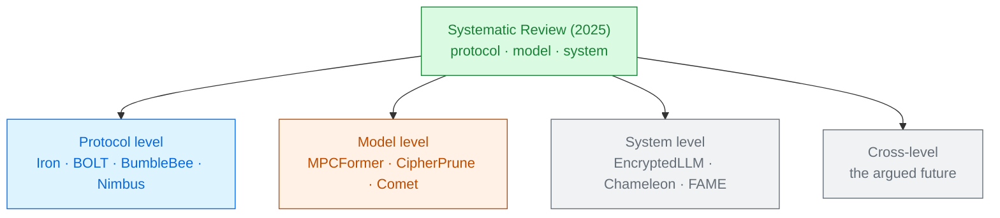

# Towards Efficient Privacy-Preserving Machine Learning

Wenxuan Zeng · Tianshi Xu · Yi Chen · Yifan Zhou · Mingzhe Zhang · Jin Tan · Cheng Hong · Meng Li 
Peking University and Ant Group · arXiv 2507.14519 · 2025

The engineer's map. It cuts the field into three layers — **protocol**, **model**, **system** —
and argues that optimising any one of them alone has already hit its ceiling.

Read the <a href="../primer-fhe-transformers/">Primer</a> first · the broadest survey in the collection

---

# The problem, in plain words

a slow website. You can rewrite the database queries, redesign the pages, or buy a bigger server.
Teams that only ever do one of the three keep hitting the same wall.

<v-clicks>

- Private inference is **orders of magnitude** slower than plaintext. Everyone agrees.
- But the papers that try to fix it are written by three different communities that rarely read
  each other: cryptographers, ML researchers, and systems people.
- This survey puts all three in one taxonomy and asks what is left on the table **between** them.

</v-clicks>

Scope note: this one is about **two-party** private inference generally — CNNs as well as
transformers — so it reaches further back than the transformer-only surveys
[§1].

---

# What you need to know first

Two conventions from this paper that make every other paper's numbers readable.

<v-clicks>

**The standard network settings.** Almost every benchmark you will read reports two numbers:

- **LAN** — 377 MB/s, 0.3 ms round-trip.
- **WAN** — 40 MB/s, 80 ms round-trip [§2.4.1].

**The two metrics.** Latency (seconds) and communication (bytes). A protocol can be excellent at
one and hopeless at the other, so a paper that reports only one is hiding something.

</v-clicks>

Why the gap between those two settings is so large: an interactive protocol pays the **80 ms**
once per round, and there can be thousands of rounds. Same code, same maths, 100× the wall clock.

---

# The one big idea

Three levels of optimisation, and the returns from each one alone are running out. The remaining
wins are **cross-level** — protocol and model designed together, protocol and system designed
together.

<strong class="ct">Protocol level</strong> the cryptography

Better encodings for matrix multiplication, cheaper comparison protocols, moving work into a pre-processing phase.

<strong class="cost">Model level</strong> the network itself

Pruning ReLU and GELU, quantisation, architecture search, distillation — changing what has to be computed at all.

<strong class="win">System level</strong> the machinery

HE compilers, automatic packing and bootstrap placement, GPU acceleration, libraries.

Every paper in this collection sits in one of these three boxes. Naming the box is the fastest way
to understand what a paper is claiming.

---

# Step 1 — protocol level: how you pack a matrix

The single most consequential protocol choice is how a tensor is mapped into a polynomial
[§3.1.2].

<v-clicks>

- **SIMD encoding** (Gazelle). Weights on the diagonals, inputs rotated to line up. Natural, and
  **rotations dominate the cost**.
- **Coefficient encoding** (Cheetah, Iron). Uses polynomial multiplication itself to do the
  convolution — **zero rotations**. The catch: the output comes out in a different layout from the
  input.
- **Nested encoding** (BumbleBee, Neujeans). A middle path that keeps rotation counts sublinear
  while restoring layout consistency.

</v-clicks>

**Encoding consistency** is the hidden criterion. If a layer's output is not encoded the same way
as its input, the next layer cannot start without a re-encoding — and re-encoding a *ciphertext*
is expensive. A protocol that is fastest per layer can lose over a whole network.

---

# Step 2 — model level: change what must be computed

<v-clicks>

- **Prune the non-linearities.** In a CNN, ReLUs dominate the encrypted cost, so replace or delete
  most of them. In a transformer the same logic points at GELU — GPT-2 needs roughly
  **3.9 million point-wise GELU evaluations** for one inference [§6.3].
- **Quantise.** Fewer bits, less work.
- **Search the architecture.** Neural architecture search and distillation, aimed at a
  crypto-friendly network rather than an accurate one.

</v-clicks>

And the survey's sharpest warning: **quantisation does not automatically help**. Under a protocol,
narrower values bring their own costs — bit-width extension, truncation, re-quantisation — which
can eat the entire saving [§6.1].

A model optimisation that ignores the protocol is a guess. That is the paper's central claim.

---

# Step 3 — system level: compilers and GPUs

<v-clicks>

- **HE compilers** exist because hand-writing FHE is brutal: you must juggle correctness, noise
  growth, packing and latency at once. Compilers automate packing, scale management and
  **bootstrap placement**.
- **GPUs** give the biggest raw speed-ups, and Module 6 of this collection is entirely about them.

</v-clicks>

But the survey flags two mismatches worth remembering:

- Compiler-driven packing almost always assumes **SIMD encoding**, so the coefficient-encoding
  wins from the protocol level are invisible to it.
- Modern GPUs accelerate ML with **tensor cores**, which are low precision. HE needs
  **high-precision modular arithmetic**, so the fastest part of the GPU is the part FHE cannot use
  [§6.1].

---

# A tiny worked example — why one level is not enough

Follow a single ReLU-pruning idea through the levels:

<v-clicks>

1. **Model level.** Delete 80% of the ReLUs. Online cost drops sharply. Paper published.
2. **Protocol level.** But most protocols move work into a **pre-processing** phase, and pruning
   ReLUs does not shrink *that*. Total cost — the thing a cloud provider actually pays — barely
   moves.
3. **Cross-level.** CoPriv combines Winograd convolution protocols, ReLU pruning and layer fusion,
   and reduces both linear and non-linear costs together [§6.1].

</v-clicks>

"Numerous studies focus on ReLU/GeLU pruning for lower online costs; however, they all ignore the
importance of reducing total costs." Online latency is what papers report. Total cost is what
service providers pay.

---

# Threat model

The survey is explicit that the whole field lives in the easier of two worlds
[§2.3.1].

| Party | Sees | Never sees |
|---|---|---|
| Client | its own input, the final answer | the model weights |
| Server | ciphertexts or shares, the model | the input, the answer |
| Network observer | message sizes, rounds, timing | contents |

<v-clicks>

- **Semi-honest**: everyone follows the protocol and only snoops. Nearly all PPML research.
- **Malicious**: a party may deviate arbitrarily. More realistic, much more expensive, and
  represented by only a handful of systems — ABY3, Falcon, FLASH, SWIFT, Trident, Tetrad, all
  three-party.

</v-clicks>

So essentially every latency number in this collection assumes an adversary who will not cheat.
Worth remembering before quoting one to a hospital's risk officer.

---

# Results — the scale of the problem

<CostBars unit="s" log :items="[
  { label: 'CryptoNets — 4096 MNIST images', value: 250, note: '~370 MB, batched' },
  { label: 'CrypTFlow2 — ResNet-50, ImageNet (WAN)', value: 3611, note: '370.84 GB of traffic' },
  { label: 'PUMA — one token from a 4-token prompt', value: 122, note: '0.9 GB per token', highlight: true },
]" caption="representative costs across a decade of PPML [§2.4.2, §6.3]" />

<v-clicks>

- CrypTFlow2's **370 GB** for a single image classification is the number to remember about
  interactive protocols on a slow link.
- PUMA's row is the one that should worry you: **122 s and 0.9 GB per generated token**, for a
  four-token prompt. A hundred-token answer is three hours and 90 GB.

</v-clicks>

---

# What it costs

The survey's own list of what still hurts in the LLM era [§6.3]:

<v-clicks>

- **Large-scale linear layers.** CNNs needed matrix–vector products; transformers need
  matrix–matrix. GPT-2's feed-forward up-projection alone is a
  $(\#\mathrm{tokens} \times 768 \times 3072)$ multiplication, in every layer.
- **Complicated non-linear layers.** ReLU is one comparison; softmax, GELU and SiLU need
  exponentials, tanh and division protocols.
- **Optimisation itself is harder.** Naive KV-cache compression does *not* deliver the expected
  saving under a protocol — the compression has to be designed against the protocol's cost model.
- **Retraining is not affordable.** For LLMs, the survey argues that training-free methods —
  post-training quantisation, sparsity, decomposition — must be prioritised.

</v-clicks>

---

# What it does not solve

<v-clicks>

- **It is a map, not a measurement.** Comparisons are drawn from reported numbers, on different
  hardware and network settings.
- **Two-party focus.** Three-party and honest-majority systems are mentioned only in passing,
  which is where several of the fastest numbers live.
- **CNN-heavy heritage.** Much of the protocol-level material is written for convolutions;
  transformers are covered but not centred.
- **The best open question is left open.** §6.2 asks: can HE evaluate a non-linear layer
  *without* polynomial approximation at all? The honest answer given is "this is still
  underexplored".
- **Cross-level optimisation is advocated, not demonstrated.** The paper argues for it and points
  at examples; it does not build one.

</v-clicks>

The authors maintain a live paper tracker at
github.com/PKU-SEC-Lab/Awesome-PPML-Papers, which ages better than the PDF.

---

# Where it sits

Use it as the index: identify a paper's level first, then read it.

---

# Key terms

<dl class="glossary">
<dt>Protocol level</dt><dd>Optimising the cryptography itself — encodings, comparison protocols, pre-processing.</dd>
<dt>Model level</dt><dd>Optimising the network — pruning, quantisation, architecture search, distillation.</dd>
<dt>System level</dt><dd>Optimising the machinery — compilers, packing, bootstrap placement, GPUs.</dd>
<dt>SIMD encoding</dt><dd>Values in ciphertext slots; needs rotations to align them. Gazelle's approach.</dd>
<dt>Coefficient encoding</dt><dd>Values as polynomial coefficients, so polynomial multiplication does the work. No rotations — but the output layout changes.</dd>
<dt>Encoding consistency</dt><dd>Whether a layer's output is packed the same way as its input. Without it, layers cannot be chained cheaply.</dd>
<dt>Pre-processing phase</dt><dd>Work done before the input arrives. Cuts online latency, but still costs the provider.</dd>
<dt>LAN / WAN</dt><dd>The two standard benchmark networks: 377 MB/s at 0.3 ms, and 40 MB/s at 80 ms.</dd>
<dt>Malicious threat model</dt><dd>An adversary who may deviate from the protocol. Rarely supported; far more expensive.</dd>
<dt>Tensor core</dt><dd>The fast low-precision unit in a modern GPU — and the part HE cannot use.</dd>
<dt>Cross-level optimisation</dt><dd>Designing protocol, model and system together. The survey's central recommendation.</dd>
</dl>

---

# Check yourself

**1. A paper prunes 80% of a network's ReLUs and reports 5× lower online latency. What should you check?**

<v-click>

The pre-processing cost. Most protocols push work into an offline phase that ReLU pruning does not
touch, so total cost — what the provider pays across online and offline — may be almost unchanged.
Online latency is the metric that flatters this class of paper.

</v-click>

**2. Coefficient encoding needs zero rotations. Why isn't everyone using it?**

<v-click>

Because its output is not packed the same way as its input. Chaining layers then needs a
re-encoding of a ciphertext, which is expensive — so a per-layer win can become a whole-network
loss. That is what "encoding consistency" measures.

</v-click>

**3. Why can't PPML just ride the GPU wave that made plaintext ML fast?**

<v-click>

Because the speed in a modern GPU lives in low-precision tensor cores, and homomorphic encryption
needs high-precision modular arithmetic. The hardware's fastest path is the one FHE cannot take —
which is why the survey calls for protocol–hardware co-design rather than porting.

</v-click>

---
layout: center
---

# Where to go next

**The transformer-specific maps**
[A Survey on Private Transformer Inference (2024)](../survey-private-transformer-inference-2024/) ·
[SoK: Private LLM Inference (2026)](../sok-approx-he-llm-2026/)

**Protocol level, in this collection**
[Iron](../iron-2022/) · [BOLT](../bolt-2023/) · [BumbleBee](../bumblebee-2023/) ·
[Nimbus](../nimbus-2024/) · [Reducing Key-Switching Overhead](../key-switching-overhead-2026/)

**Model level**
[MPCFormer](../mpcformer-2023/) · [CipherPrune](../cipherprune-2025/) · [Comet](../comet-2025/) ·
[Encryption-Friendly LLM Architecture](../encryption-friendly-llm-2024/)

**System level**
[EncryptedLLM](../encryptedllm-2025/) · [Chameleon](../chameleon-2024/) · [FAME](../fame-2025/) ·
[Dataflow-Oriented Classification of GPU-Accelerated HE](../gpu-he-dataflow-2026/)

← back to <a href="../../slides/">all decks</a>

