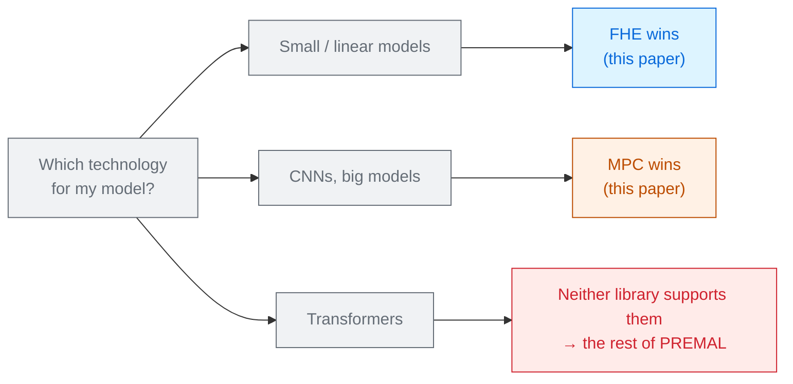

# A Pragmatic Comparison of Cryptographic Computation Technologies

Marcus Taubert · Adam Skuta · Thomas Lorünser 
AIT Austrian Institute of Technology, Vienna · arXiv 2605.04858 · 2026

Written for the engineer who has to **pick one**. Two production libraries — one FHE, one MPC —
run the same models, and the answer turns out to depend on the *shape* of the model, not its size.

Read the <a href="../primer-fhe-transformers/">Primer</a> first · pairs with the <a href="../fhe-vs-garbled-circuits-2025/">FHE vs GC deck</a>

---

# The problem, in plain words

choosing between an electric car and a diesel. Neither is "better". One wins on short trips in the
city, the other on long motorway runs — and a review that only drives one route tells you nothing.

<v-clicks>

- Most papers optimise **inside** one technology. A practitioner has to choose **between** them
  first, and there is very little to go on.
- FHE and MPC rest on completely different assumptions — lattice hardness versus non-collusion —
  yet from a user's seat they do the same job.
- So: benchmark both, on the same models, and report where each one wins.

</v-clicks>

The authors call this the first step towards **technology-agnostic** benchmarking of secure
computation for machine learning [§1.1].

---

# What you need to know first

Two things that differ from the rest of this collection.

<v-clicks>

**The FHE here is TFHE, not CKKS.** Concrete-ML (Zama) uses TFHE, which computes on **integers**
via table look-ups and **programmable bootstrapping**. Because look-ups are limited to 16-bit
integers, everything is **quantised to 8 bits or fewer**. That is a very different machine from the
CKKS systems in Module 2.

**The MPC here is SecretFlow-SPU.** Models are written in JAX and compiled to a multi-party
protocol. It needs **several servers** that do not collude.

</v-clicks>

Consequence to keep in mind all deck: the FHE side is **quantised to 6–8 bits** and runs on a
**15-core CPU with no GPU**. Both facts move every number.

---

# The one big idea

The two technologies have **opposite cost curves**. MPC's cost tracks the **amount of data moved**;
FHE's cost tracks the **number of hard operations** — comparisons, non-linearities, parameters.

### MPC (SPU) — flat
<v-clicks>

- Matrix multiply 10×10 → 100×100: **0.059 s → 0.078 s**
- Activations: **constant** in vector size
- Linear regression: **0.079 s** whatever the feature count

</v-clicks>

### FHE (Concrete-ML) — steep
<v-clicks>

- Matrix multiply 10×10 → 100×100: **0.028 s → 2.79 s**
- Activations: **2.5 s → 8.1 s** as the vector grows
- Linear regression: **0.005 s → 0.078 s** with features

</v-clicks>

Notice both left-hand columns start with FHE **ahead** [Tables 2–4].

---

# Step 1 — the crossover on one operation

Matrix multiplication, the operation every network is mostly made of
[Table 2]:

| Matrix | MPC (SPU) | FHE (Concrete-ML) |
|---|---|---|
| 10 × 10 | 0.059 s | **0.028 s** |
| 50 × 50 | **0.063 s** | 0.613 s |
| 100 × 100 | **0.078 s** | 2.79 s |

<v-clicks>

- FHE is **2× faster** at 10×10 and **36× slower** at 100×100.
- MPC barely notices the size change: 100× more arithmetic, 32% more time. The cost is in the
  protocol's fixed round-trips, not the multiplications.

</v-clicks>

For MPC, arithmetic is nearly free and **talking** is expensive. For FHE, there is no talking and
**arithmetic** is expensive. Every result in the paper is a consequence of that one sentence.

---

# Step 2 — activations, and a surprise

<v-clicks>

- FHE times are **identical for ReLU, GELU and sigmoid** — about 2.5 s at vector size 8, 8.1 s at
  size 32 [Table 3].
- MPC times differ slightly *between* functions (ReLU 0.048 s, GELU 0.064 s, sigmoid 0.078 s) but
  are **flat in vector size**.

</v-clicks>

Why doesn't TFHE care which function it is? Because it does not evaluate the function at all — it
does a **table look-up** through programmable bootstrapping. One bootstrap per value, and the
bootstrap costs the same whatever the table contains.

That is the cleanest illustration in this collection of how differently TFHE and CKKS think.
In CKKS, GELU is cheap and softmax is agony. In TFHE, every non-linearity costs exactly one
bootstrap.

---

# Step 3 — where FHE's cost actually lands

The paper's most useful finding is that the curves **flip** between plaintext and encrypted.

| Model | In plaintext, cost grows with… | Under FHE, cost grows with… |
|---|---|---|
| Random forest | number of **features** | number of **trees** |
| Dense network (MLP) | number of **layers** | number of **parameters** |

<v-clicks>

- A random forest is traversed by **comparisons**, and comparisons are the expensive thing under
  encryption. More trees, more comparisons — features barely matter.
- In a dense network, FHE cost tracks parameters because each one needs its own encrypted
  operation; depth adds much less.

</v-clicks>

So the intuitions you carry from plaintext ML — "wide is cheap, deep is expensive" — are not just
wrong under encryption, they are **reversed** [§4.2–4.3].

---

# A tiny worked example — the regression that FHE wins

Linear regression inference, seconds [Table 4]:

| Features | Plaintext | MPC (SPU) | FHE (Concrete-ML) |
|---|---|---|---|
| 10 | 0.00015 | 0.0791 | **0.0046** |
| 100 | 0.00023 | 0.0786 | **0.0158** |
| 500 | 0.00018 | 0.0794 | **0.0777** |

<v-clicks>

- At 10 features FHE is **17× faster** than MPC. At 500 they meet.
- MPC's 0.079 s is almost exactly constant — and that is still **~600× slower than plaintext**.
- Extrapolate the two columns and FHE overtakes MPC somewhere just past 500 features.

</v-clicks>

For small models, the non-interactive technology is also the **faster** one. That is not the story
the transformer literature tells, and the difference is model size.

---

# Threat model

The two technologies do not make the same promise, and the paper is careful about it.

| | FHE (Concrete-ML) | MPC (SPU) |
|---|---|---|
| Parties needed | client + **one** server | client + **several non-colluding** servers |
| Security rests on | lattice hardness (LWE) | **non-collusion** between servers |
| Client online during compute | no | yes |
| Sensitive to the network | no | **very** — packet loss and latency dominate |

<v-clicks>

- Both are analysed in the standard semi-honest setting.
- MPC "can be used for all use cases", the authors say — but "is difficult to set up because one
  needs multiple servers" [§5].

</v-clicks>

An assumption you cannot satisfy is not a security guarantee. If you have nobody to run the second
server, MPC's benchmark numbers are not available to you at any price.

---

# Results — who wins what

<CostBars unit="s" log :items="[
  { label: 'Linear regression, 10 features — FHE', value: 0.0046, note: '17× faster than MPC', highlight: true },
  { label: 'Linear regression, 10 features — MPC', value: 0.0791 },
  { label: 'Matmul 100×100 — MPC', value: 0.078, note: 'flat in size', highlight: true },
  { label: 'Matmul 100×100 — FHE', value: 2.79 },
  { label: 'Random forest — FHE', value: 20, note: '5–20+ s, grows with tree count' },
  { label: 'Small CNN — FHE', value: 10800, note: 'up to 3+ hours on 8×8–32×32 images' },
]" caption="log scale; every FHE number is 6–8-bit quantised on a 15-core CPU with no GPU" />

The last bar is the headline. A convolutional network on <strong>8×8 pixel images</strong> took
hours; 112×112 was abandoned as infeasible. MPC handled CNNs "with no problem"
[§4.3, §5].

---

# What it costs

<v-clicks>

- **Choose FHE** and you pay in: quantisation to 8 bits or fewer, no support for LSTMs or
  transformers in this library, and a hard wall at convolutional models.
- **Choose MPC** and you pay in: several servers you must own or trust, a client that stays online,
  and total dependence on the network — "we advise using close proximity networks or very fast
  channels".
- **Either way** you pay ~600× over plaintext for even the most trivial model.

</v-clicks>

The authors' own summary: FHE for **regressions, simple dense models, hybrid splits and anything
with a GPU**; MPC for **CNNs and larger models, on a fast local network**
[§5].

---

# What it does not solve

<v-clicks>

- **No transformers at all.** Concrete-ML does not support them, which is itself the finding: the
  most usable FHE library in 2026 cannot express the models this whole collection is about.
- **CPU only.** No GPU, no FHE accelerator — and the authors name this as the biggest gap in their
  own work. Module 6 of this collection is entirely about what changes when you add GPUs.
- **One library per technology.** Concrete-ML is TFHE; a CKKS library would produce a different
  shape of answer entirely.
- **Quantisation confounds the comparison.** The FHE models ran at 6 bits because the compiler
  could not find valid parameters at higher precision. Accuracy is not compared.
- **Localhost benchmarks**, so MPC's network sensitivity — the thing they warn about — is never
  actually measured.

</v-clicks>

---

# Where it sits

Read it beside the <a href="../fhe-vs-garbled-circuits-2025/">FHE vs garbled circuits deck</a> — same question, different tools, and the two disagree in an instructive way.

---

# Key terms

<dl class="glossary">
<dt>SMPC / MPC</dt><dd>Secure multi-party computation. Several servers hold shares of the data and compute together.</dd>
<dt>Non-collusion</dt><dd>MPC's core assumption: the servers do not conspire. Not a mathematical guarantee — an organisational one.</dd>
<dt>TFHE</dt><dd>An FHE scheme for integers, built around fast bootstrapping and table look-ups. Not CKKS.</dd>
<dt>Programmable bootstrapping</dt><dd>TFHE's trick: refresh a ciphertext and apply an arbitrary function from a table in the same step.</dd>
<dt>Quantisation</dt><dd>Rounding weights and activations to few bits — 8 or fewer here, because look-up tables cap at 16-bit integers.</dd>
<dt>Concrete-ML</dt><dd>Zama's TFHE machine-learning library. ~600k lines; excellent documentation; no transformer support.</dd>
<dt>SecretFlow-SPU</dt><dd>The MPC framework used here. Models are written in JAX; ~150k lines.</dd>
<dt>Estimator</dt><dd>One tree in a random forest. Under FHE, the thing that actually drives the cost.</dd>
<dt>Hybrid model</dt><dd>Splitting inference so the client computes part in the clear and the server the rest encrypted.</dd>
</dl>

---

# Check yourself

**1. MPC's matrix multiply barely slows down from 10×10 to 100×100. Why?**

<v-click>

Because its cost is dominated by fixed protocol overhead — rounds and message setup — not by the
multiplications themselves. A hundred times the arithmetic added about 32% to the time. FHE, which
sends nothing, pays for every multiplication and got 100× slower.

</v-click>

**2. Under TFHE, ReLU, GELU and sigmoid all cost the same. Why is that not true under CKKS?**

<v-click>

TFHE evaluates any function as a table look-up via programmable bootstrapping — one bootstrap per
value, regardless of the function. CKKS has no look-ups; it must approximate each function with a
polynomial, and the degree needed differs sharply (GELU is mild, softmax is not).

</v-click>

**3. This paper finds FHE beating MPC, while the transformer literature finds the opposite. Is one of them wrong?**

<v-click>

No — they measure different regimes. FHE wins where the model is small and the network matters
(linear regression, tiny matrices); MPC wins where there is a lot of computation to amortise over
its fixed round costs (CNNs, transformers). Model size is the variable that flips the answer.

</v-click>

---
layout: center
---

# Where to go next

**The same question with different tools**
[Comparison of FHE and Garbled Circuit Techniques (2025)](../fhe-vs-garbled-circuits-2025/) —
CKKS instead of TFHE, and garbled circuits instead of secret sharing.

**What the missing GPUs are worth**
[EncryptedLLM](../encryptedllm-2025/) · [Chameleon](../chameleon-2024/) ·
[A Scalable Multi-GPU Framework](../multi-gpu-encrypted-2025/)

**The transformer neither library supports**
[A Survey on Private Transformer Inference](../survey-private-transformer-inference-2024/) ·
[SoK: Private LLM Inference](../sok-approx-he-llm-2026/)

**TFHE done properly for a transformer**
[The Inhibitor](../inhibitor-2023/) — an architecture designed for exactly this scheme.

← back to <a href="../../slides/">all decks</a>

