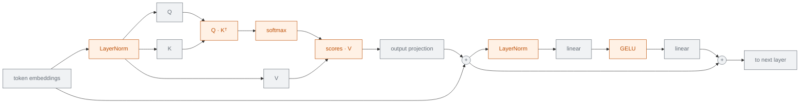

# Why transformers are hard to encrypt

**Start here.** Everything else in this collection is an answer to this one question.

PREMAL · Transformer + Fully Homomorphic Encryption reading collection

---

# The question this collection answers

You want to send a private message to a language model — a patient record, a legal
document, a company secret — and get an answer back.

<v-clicks>

The model runs on **someone else's computer**{.pt}. You do not want them to read your input.

Encrypting the message in transit does not help: the server has to **decrypt it to compute on it**{.leak}.

So: *can the server run the model on your data while your data stays locked?*

</v-clicks>

Yes — with Fully Homomorphic Encryption. But a transformer is about 10,000× slower this way.
The 60 papers in this collection are all attempts to close that gap.

---

# Computing on locked data

a glovebox in a laboratory. You lock your sample inside. The technician reaches in through
sealed gloves, rearranges the contents, and hands the box back — still locked. They did the work.
They never touched the sample directly, and they never saw it.

**Fully Homomorphic Encryption (FHE)** is that glovebox for arithmetic.

<v-clicks>

- You encrypt a number $x$ into a **ciphertext**{.ct} $\mathsf{ct}(x)$.
- The server can compute $\mathsf{ct}(x) + \mathsf{ct}(y)$ and $\mathsf{ct}(x) \times \mathsf{ct}(y)$.
- It gets back $\mathsf{ct}(x+y)$ and $\mathsf{ct}(x \cdot y)$ — **without ever decrypting**{.win}.
- Only you hold the secret key, so only you can open the result.

</v-clicks>

The server learns nothing about $x$ — not its value, not its sign, not whether two ciphertexts
hold the same number. It only learns how big the message is.

---

# CKKS: the scheme almost everyone here uses

Different FHE schemes are good at different things. Machine learning needs **decimal numbers**,
so nearly every paper in this collection uses **CKKS**.

**What CKKS gives you**

<v-clicks>

- Arithmetic on **real numbers**, not just integers
- **Approximate** results — a tiny error is baked in, like floating point
- One ciphertext holds a **whole vector** of numbers, not one number

</v-clicks>

**What that last point buys**

<v-clicks>

- Thousands of numbers, added or multiplied in **one operation**
- This is called **SIMD packing** — single instruction, multiple data
- A typical ciphertext holds **8,192 or 16,384 slots**

</v-clicks>

"Approximate" is not a bug here. Neural networks already tolerate noise — that is exactly why CKKS
and machine learning fit together, and why CKKS is a poor choice for, say, banking.

---

# Packing, and the price of packing

One ciphertext is a row of slots. Operations apply to **every slot at once**.

<SlotGrid :values="[3,1,4,1,5,9,2,6]" label="ct_x" :total-slots="8192" />

<v-click>

Adding two ciphertexts adds them slot by slot. Cheap, and free of charge in depth.

</v-click>

<v-click>

But you **cannot read slot 3**. There is no indexing. To bring a value from one slot to another
you must **rotate**{.cost} the whole ciphertext — and rotation is one of the more expensive
operations in FHE.

<SlotGrid :values="[3,1,4,1,5,9,2,6]" label="rot(ct_x, 2)" :rotate="2" :highlight="[0]" />

</v-click>

<v-click>

Almost every "packing" contribution you will read in this collection is really an argument about
**how to lay data out so that fewer rotations are needed**.

</v-click>

---

# Noise, levels, and the depth budget

Every ciphertext carries a little **noise**. Multiplication makes the noise grow.

<v-clicks>

- A fresh ciphertext starts with a fixed number of **levels** — say 24.
- Each multiplication **spends one level**.
- At zero levels, the noise swamps the value and the result is garbage.

</v-clicks>

The number of multiplications you can chain is called **multiplicative depth**.
It is a budget, and it is the scarcest resource in this whole field.

<DepthBar :total="24" :steps="[
  { label: 'Q · Kᵀ', cost: 1 },
  { label: 'softmax (degree-32 poly)', cost: 5, expensive: true },
  { label: 'scores · V', cost: 1 },
  { label: 'LayerNorm (inv-sqrt)', cost: 6, expensive: true },
  { label: 'GELU (degree-16 poly)', cost: 4, expensive: true },
]" caption="one transformer layer can exhaust a 24-level budget on its own" />

---

# Bootstrapping: refilling the budget

When you run out of levels, you can **bootstrap** — an operation that takes an exhausted
ciphertext and returns a fresh one holding the same value.

<DepthBar :total="24" :steps="[
  { label: 'layer 1', cost: 17, expensive: true },
  { label: 'bootstrap', bootstrap: true },
  { label: 'layer 2', cost: 17, expensive: true },
  { label: 'bootstrap', bootstrap: true },
]" caption="a 12-layer BERT needs this roughly a dozen times over" />

<v-clicks>

- Bootstrapping is what makes encryption *fully* homomorphic — unlimited computation.
- It is also, typically, **the single most expensive operation**{.cost} in the system — often
  seconds per ciphertext on a CPU.

</v-clicks>

So there are two ways to go faster: **bootstrap less often** (spend depth carefully) or
**bootstrap faster** (GPUs, FPGAs). Module 6 of this collection is entirely the second option.

---

# What is easy and what is impossible

FHE gives you exactly two operations: **add** and **multiply**.

### Easy ✓

- Addition, subtraction
- Multiplication
- Anything built from those: **polynomials**
- Matrix multiplication
- Convolutions

### Not possible, directly ✗

- Comparison: is $x > y$?
- Division: $1/x$
- $\exp(x)$, $\log(x)$, $\sqrt{x}$
- $\max$, $\mathrm{ReLU}$, $\mathrm{sign}$
- Any branch: `if … then … else`

The only escape is to **replace the impossible operation with a polynomial that behaves almost the
same** over the range of values you actually expect. Higher accuracy needs a higher degree; higher
degree costs more depth. That trade is the recurring drama of this field.

---

# Now look at a transformer

Grey boxes are just matrix multiplies — FHE handles those.
Orange boxes are the problem.

---

# The four hard operators

Remember these four. Every paper in this collection attacks at least one of them — and three
of them are **global**, mixing information across the whole sequence, so they cannot be handled
slot by slot.

| Operator | Why it is hard | How bad |
|---|---|---|
| **Softmax** | needs $\exp$ **and** a division, over a range that depends on the data | worst |
| **LayerNorm** | needs $1/\sqrt{x}$, again data-dependent | bad |
| **GELU** | not a polynomial — but smooth and bounded, so easy to fit | mild |
| **Attention matmul** | **ciphertext × ciphertext**, unlike the weight matmuls | structural |

<v-click>

The last row is subtle. In **Q·Kᵀ** and **scores·V**, *both* operands are encrypted — everywhere
else one operand is a plaintext weight. Ciphertext × ciphertext costs far more depth, needs
**relinearisation**{.cost}, and forces rotations to align the slots.

</v-click>

---

# Three ways out

### A · Approximate everything
Replace every hard operator with a polynomial. Run the whole network on the server.

<RoundTrip :rounds="1" non-interactive label="FHE-native" note="client can go offline" />

One round. Client does nothing. 
Costs depth → bootstrapping.

### B · Split the work
HE for the matmuls, an interactive protocol (MPC) for the hard operators.

<RoundTrip :rounds="3" real-rounds="10,509" label="hybrid HE+MPC" />

Much faster in wall-clock. 
Client must stay online; rounds leak structure.

### C · Redesign the model
Change the architecture so the hard operators are never there in the first place.

<RoundTrip :rounds="1" non-interactive label="HE-friendly model" />

No approximation error. 
Needs retraining; least explored.

Every deck in this collection belongs to A, B or C. Knowing which one you are reading tells you
most of what to expect before you start.

---

# Where the field actually stands

Encrypted BERT-base inference, one input, as reported by each paper:

<CostBars unit="s" log :items="[
  { label: 'plaintext (GPU)', value: 0.01, note: 'reference point', reference: true },
  { label: 'BOLT (2024, hybrid)', value: 185, note: '59.6 GB · 10,509 rounds' },
  { label: 'NEXUS (2025, FHE-only)', value: 37.3, note: '164 MB · 1 round', highlight: true },
  { label: 'NEXUS on GPU', value: 0.88, note: '42.3× its own CPU run', highlight: true },
]" caption="each paper on its own hardware — not a controlled comparison" />

Read charts like this one carefully. Every paper uses different hardware and sequence lengths, and
some count different phases. The <a href="../sok-approx-he-llm-2026/">SoK deck</a> exists precisely
because these numbers are <em>not</em> directly comparable — and its honest summary is that
encrypted inference now works up to 8-billion-parameter models, but stays roughly
<strong class="cost">10,000× slower</strong> than plaintext.

---

# Key terms

<dl class="glossary">
<dt>FHE</dt><dd>Fully Homomorphic Encryption — compute on encrypted data without decrypting it.</dd>
<dt>CKKS</dt><dd>The FHE scheme built for approximate arithmetic on real numbers. The default choice for ML.</dd>
<dt>Ciphertext</dt><dd>An encrypted value. In CKKS it holds a whole vector, not a single number.</dd>
<dt>Slot</dt><dd>One position in that vector. A ciphertext typically has 8,192 or 16,384 slots.</dd>
<dt>SIMD packing</dt><dd>Using the slots so one operation processes thousands of values at once.</dd>
<dt>Rotation</dt><dd>Cyclically shifting the slots. The only way to move data between slots — and it is expensive.</dd>
<dt>Level</dt><dd>One unit of the multiplication budget. Each multiply spends one.</dd>
<dt>Multiplicative depth</dt><dd>How many multiplications can be chained before the result is unusable.</dd>
<dt>Bootstrapping</dt><dd>Refreshing an exhausted ciphertext back to full levels. Correct, and very slow.</dd>
<dt>Relinearisation</dt><dd>A clean-up step needed after multiplying two ciphertexts together.</dd>
<dt>MPC</dt><dd>Secure Multi-Party Computation — an interactive alternative to FHE. Fast, but the client must stay online.</dd>
<dt>Non-interactive</dt><dd>The client sends one message and receives one message. Nothing in between.</dd>
</dl>

---

# Check yourself

**1. Why can't the server just look at slot 5 of a ciphertext?**

<v-click>

Because a ciphertext is one sealed object, not an array. There is no indexing operation — only
whole-ciphertext add, multiply, and rotate. Getting slot 5 into position 0 means rotating the
entire ciphertext by 5.

</v-click>

**2. A paper approximates GELU with a degree-16 polynomial instead of degree-4. What did it buy, and what did it pay?**

<v-click>

It bought accuracy — the fit is closer over a wider input range. It paid depth: roughly
$\log_2(16) = 4$ levels instead of 2, which brings the next bootstrap sooner and slows the whole
network down.

</v-click>

**3. Why is `scores · V` harder than the output projection, even though both are matrix multiplies?**

<v-click>

The output projection multiplies an encrypted activation by a *plaintext* weight matrix.
`scores · V` multiplies two *encrypted* things. Ciphertext × ciphertext costs more depth,
needs relinearisation afterwards, and requires rotations to line the slots up.

</v-click>

---
layout: center
---

# Where to go next

**If you want to see the mechanism, not the map**
[FHE by hand](../fhe-by-hand/) — build the cipher, break it, then run a small network on
encrypted inputs. Interactive.

**If you want the map of the whole field**
[A Survey on Private Transformer Inference (2024)](../survey-private-transformer-inference-2024/) —
the best taxonomy, then
[SoK: Private LLM Inference (2026)](../sok-approx-he-llm-2026/) for the honest scorecard.

**If you want strategy (a) — approximate everything**
[Converting Transformers to Polynomial Form](../polynomial-transformers-2023/) →
[NEXUS](../nexus-2024/) → [THOR](../thor-2024/)

**If you want strategy (b) — split the work**
[Iron](../iron-2022/) → [BOLT](../bolt-2023/) → [BumbleBee](../bumblebee-2023/) →
[BLB](../blb-2025/)

**If you want strategy (c) — redesign the model**
[The Inhibitor](../inhibitor-2023/) ·
[Power-Softmax](../power-softmax-2024/) ·
[Encryption-Friendly LLM Architecture](../encryption-friendly-llm-2024/)

**If you care about medicine**
[MedBlindTuner](../medblindtuner-2024/) ·
[Federated ViT with Lightweight HE](../federated-vit-medical-2025/)

← back to <a href="../../slides/">all decks</a>

