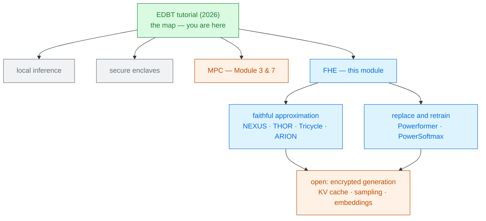

# Private LLM Inference with Homomorphic Encryption

Lawrence Lim · Divyakant Agrawal · Amr El Abbadi 
University of California, Santa Barbara · EDBT 2026, Tampere · a 90-minute tutorial

Not a system and not a survey — a **map**. Five pages that name the four ways to keep an LLM query
private, say which choices every FHE system has to make, and put five headline latencies side by
side so you can see they measure five different things.

The gentle second stop after the <a href="../primer-fhe-transformers/">Primer</a> · Module 2

---

# The problem, in plain words

a hospital wanting to ask a consultant about a patient — where the consultant must not learn who
the patient is, and the hospital must not learn the consultant's methods.

<v-clicks>

- The authors' framing is a **database** one: query processing is absorbing LLMs, so a query now
  reaches beyond the closed database into general knowledge [§2].
- Their running example: *"healthcare practitioners might want to query an LLM agent to summarize a
  patient's clinical history without revealing private information to the LLM provider."*
- That is the same problem the rest of this module attacks — but arriving from data management
  rather than from cryptography, which changes what counts as an answer.

</v-clicks>

Worth reading for that reason alone. A tutorial written for a database audience states assumptions
that cryptography papers leave implicit.

---

# What you need to know first

Nothing new. This deck assumes only the [Primer](../primer-fhe-transformers/) — and the tutorial
assumes even less.

<v-clicks>

- It is *"designed to be accessible to researchers from both academia and industry, **without
  requiring prior expertise in cryptography or machine learning**"* [§1].
- Three CKKS operations carry everything: **Add**, **Multiply**, **Rotate**. Every technique in this
  module is a way of arranging those three.
- One cost ordering to memorise: **bootstrapping** is the most expensive operation, then
  **ciphertext × ciphertext multiplication** and **rotation** — both because of **key switching**
  [§3].

</v-clicks>

From which the tutorial derives the two rules that govern every design in this module:
**(1) minimise multiplicative depth** to avoid bootstrapping, and **(2) minimise key switches** by
packing well.

---

# The one big idea — four ways, and why this module picked one

<strong class="pt">1 · Run it locally</strong> 
Nothing leaves the device. Perfect privacy — and it needs the model weights to be <em>released</em>
and your laptop to be able to run them. Two assumptions that usually fail together.

<strong class="cost">2 · Secure enclaves</strong> 
Trusted execution on the server's hardware. Practical enough that it is <strong>already
deployed</strong> — Duality, NEAR.AI, Tinfoil — but you are trusting a chip vendor.

<strong class="cost">3 · Multi-party computation</strong> 
Split the work between client and server. Fast arithmetic, but *"significant communication
overhead, making them challenging to scale"*.

<strong class="win">4 · Fully homomorphic encryption</strong> 
The server computes blind. <strong>No trust in the server at all</strong> — and the highest
computational cost. Industry interest: Cornami, Zama.

Read the axis, not the boxes. The four options trade **who you must trust** against **what it
costs** — and FHE is the corner where you trust nobody and pay for it in compute.

---

# The tutorial's own shape is a finding

Ninety minutes, allocated [§1]:

<CostBars unit="min" :lower-is-better="false" :items="[
  { label: 'Matrix multiplications in HE', value: 25, note: 'packing, rotations, key switching', highlight: true },
  { label: 'Nonlinear layers in HE', value: 25, note: 'softmax, LayerNorm, GELU', highlight: true },
  { label: 'Motivation and system model', value: 10 },
  { label: 'Homomorphic encryption basics', value: 10 },
  { label: 'Transformer models', value: 10 },
  { label: 'End-to-end systems and future directions', value: 10 },
]" caption="the two shaded blocks are 56% of the tutorial" />

<v-clicks>

- **Cryptography gets ten minutes; matrix multiplication gets twenty-five.** That ratio is the
  honest state of the field: the hard problems are engineering ones now, not cryptographic ones.
- And it matches the runtime profiles you have already seen — matmul and the non-linearities, plus
  the bootstrapping they force, are where the seconds go.

</v-clicks>

---

# Fork 1 — batch across users, or don't

The tutorial's sharpest observation, and one the systems papers tend to leave in a footnote
[§5].

### Batch several inputs per ciphertext
**NEXUS · MOAI · ARION**

Pack independent queries into the same ciphertext. Far fewer rotations per input, so **amortised**
latency drops sharply.

*"It relies on strong assumptions, such as several users sharing a cryptographic key or a single
user submitting several queries simultaneously."*

### One input at a time
**THOR · Tricycle · Powerformer · Rovida et al. · Garimella et al.**

No cross-input packing. What you measure is what one user waits.

Slower on paper, and the only setting that matches "a doctor asks one question".

Several users **sharing a key** is not a small assumption — it means any of them could decrypt the
others' answers. Every amortised number in this module rests on this fork, and this tutorial is
where it is said out loud.

---

# A tiny worked example — the bicyclic encoding

The tutorial's representative single-input packing [§5]. Take

$$A = \begin{pmatrix}1&2&3&4\\5&6&7&8\\9&10&11&12\end{pmatrix}
\;\longrightarrow\; (1,\,6,\,11,\,4,\,5,\,10,\,3,\,8,\,9,\,2,\,7,\,12)$$

<v-clicks>

- What is the rule? Slot $k$ holds $A[\,k \bmod 3\,][\,k \bmod 4\,]$. Check a few:
  $k{=}0 \to A[0][0]=1$; $\;k{=}5 \to A[2][1]=10$; $\;k{=}9 \to A[0][1]=2$. ✓
- It works because $\gcd(3,4)=1$: by the **Chinese Remainder Theorem** one index $k$ determines the
  pair $(k \bmod m,\, k \bmod n)$ uniquely, so $k = 0 \dots mn-1$ visits every cell exactly once.
- Hence *bi*-cyclic — the matrix is a single cycle in two dimensions at the same time. And hence the
  restriction: **the dimensions must be coprime**, which [THOR](../thor-2024/) names as a limitation
  of this family.

</v-clicks>

The payoff: a matrix product becomes a sum of element-wise products over rotated ciphertexts, at
**multiplicative depth one** — the minimum possible.

Rule derived here; the tutorial gives the encoded vector without stating the index map.

---

# The optimisation vocabulary

Five names that recur across every paper in this module [§5]. Learn them
once.

<v-clicks>

- **Multi-head packing** — several attention heads in one ciphertext, evaluated in parallel.
  Tricycle generalises bicyclic encodings to three-dimensional tensors to get it.
- **Baby-step giant-step** — restructures a sum of rotated ciphertexts so $O(d)$ rotations become
  $O(\sqrt d)$.
- **Hoisting** and **double hoisting** — a rotation's expensive part is shared work; compute it once
  and reuse it across several rotations of the same ciphertext.
- **Lazy relinearisation** — defer the clean-up after ciphertext × ciphertext multiplication until
  several have accumulated. [THOR](../thor-2024/)'s technique.
- **Complexification** — use the imaginary half of every CKKS slot, doubling packing density. This
  is what [STIP](../stip-2026/) builds its whole design on.

</v-clicks>

Every one of these is a way of paying for fewer **key switches**. If you remember one word from this
deck, that is the word.

---

# Fork 2 — retrain the model, or approximate it faithfully

### Replace the operator
**Powerformer · Encryption-Friendly LLM**

Swap softmax or LayerNorm for something cheap under encryption.

<v-clicks>

- Much lower cost.
- *"It requires retraining the model ... which limits compatibility with existing pretrained
  models."*

</v-clicks>

### Approximate the operator
**NEXUS · THOR · Tricycle · ARION**

Fit the real function with minimax, Chebyshev or Taylor polynomials; Newton's iteration for
inverses.

<v-clicks>

- Works on any released checkpoint.
- *"Higher approximation accuracy requires higher-degree polynomials, which in turn increases
  multiplicative depth."*

</v-clicks>

This is the primer's **A versus C** in one sentence, and it is the single question to ask of any
paper in this module: *did they change the model, or only how it is evaluated?*

---

# Softmax's numerical trap, and the three ways out

$$\text{Softmax}(x_i) = \frac{e^{x_i}}{\sum_j e^{x_j}}\qquad\text{— an exponential \emph{and} a division}$$

<v-clicks>

- The exponential is approximated by Chebyshev or minimax polynomials, or by
  $e^{x}\approx\left(1+\tfrac{x}{2^k}\right)^{2^k}$ with $k \in \{7,8\}$ — which reduces it to a
  sequence of squarings.
- The reciprocal by Newton's iteration: $x_{k+1} = x_k(2 - a x_k)$. Each round is more accurate and
  one level deeper.
- **The trap:** exponentiation amplifies large positive inputs and crushes large negative ones
  toward zero, *"which can exacerbate CKKS noise growth and cause small values to be subsumed by
  encryption noise"* [§6].

</v-clicks>

Three mitigations, and you have met all three: subtract a **constant offset**
([NEXUS](../nexus-2024/)) · subtract an **estimated maximum** (Tricycle, ARION — and
[ELLMo](../ellmo-2026/)'s statistical max) · **iterative normalisation**
(Cho et al., [THOR](../thor-2024/)).

---

# System model — and what is still in the clear

The tutorial's setting is the module's: an untrusted server evaluates the model on ciphertext.

| Party | Sees | Never sees |
|---|---|---|
| Client | its own input, the answer | the model weights |
| Server | ciphertexts, the model | the input, the answer |

<v-clicks>

- One assumption is stated plainly and is shared by **every** system in the module:
  *"tokenization and embedding are performed **locally on the client device before encryption**"*
  [§4].
- So the tokenizer and the embedding table are effectively **public**, and the client must hold and
  run them. That is a real deployment requirement, not a footnote.
- And in the batching branch, several users may **share a cryptographic key** — which changes the
  threat model rather than merely the performance.

</v-clicks>

Two things this tutorial does not claim to cover: what the *output* leaks, and adversaries who
deviate from the protocol. Both remain open across the whole literature.

---

# The scoreboard — five numbers that are not comparable

The tutorial's closing summary of the state of the art [§7]:

<CostBars unit="s" :items="[
  { label: 'THOR — BERT-Base, GPU, faithful approximation', value: 602, note: 'one input' },
  { label: 'Powerformer — BERT-Base, GPU, retrained model', value: 344, note: 'one input' },
  { label: 'Tricycle — BERT-Tiny, CPU, faithful', value: 322, note: 'a 2-layer model' },
  { label: 'MOAI — GPU, input batching', value: 284, note: 'amortised' },
  { label: 'ARION — CPU, input batching', value: 225, note: 'amortised' },
]" caption="each row measures a different thing — read the notes, not the bars" />

<v-clicks>

- Different **models**, **hardware**, **methods** and **metrics** — single-query latency against
  amortised throughput, BERT-Base against a 2-layer BERT-Tiny.
- One reassuring finding does survive: *"polynomial approximations introduce only minimal end-to-end
  accuracy degradation."*

</v-clicks>

---

# What this tutorial is, and is not

<v-clicks>

- **It is five pages.** A tutorial abstract for a 90-minute lecture — the taxonomy, the vocabulary
  and the scoreboard, with the derivations left to the papers.
- **It has a stake.** The first author was the primary developer of Tricycle, one of the systems on
  the scoreboard, and of the Hyperion token-sampling work in the future-directions section
  [§8]. Nothing here is unfair; it is worth knowing.
- **It is not a benchmark.** No system is re-run; the numbers are as reported by their authors, on
  their own hardware.
- **It stops where the papers get hard.** No packing diagrams, no depth accounting, no proofs.
- **Its bibliography is the real deliverable** — 32 references covering the whole module, current to
  late 2025.

</v-clicks>

---

# What it does not solve — the open problems it names

<v-clicks>

- **End-to-end private text generation remains open.** Everything in this module produces
  essentially **one token**.
- Getting past that needs three pieces that do not yet exist together:
  - a **private KV cache**, so attention over earlier tokens is reused rather than recomputed;
  - **token sampling under encryption** — picking from a distribution without decrypting it
    (Hyperion, and Rho et al.'s traveling-salesman token ordering);
  - an **embedding layer evaluated under HE**, so the client no longer has to hold the table.
- *"Realizing these components within a single system will require new algorithmic techniques"* —
  the tutorial's own closing sentence, and a fair summary of where the field is.

</v-clicks>

Encrypted **classification** works. Encrypted **generation** has not been built.

---

# Where it sits

Not a strategy A, B or C paper — the deck that tells you which of the three you are reading.

---

# Key terms

<dl class="glossary">
<dt>Secure enclave</dt><dd>Trusted execution hardware on the server. Practical and deployed, but the trust moves to a chip vendor.</dd>
<dt>Bicyclic encoding</dt><dd>Packing a matrix by traversing it with one index modulo each dimension. Depth-one matrix products; needs coprime dimensions.</dd>
<dt>Multi-head packing</dt><dd>Several attention heads in one ciphertext, evaluated together.</dd>
<dt>Baby-step giant-step</dt><dd>Turns O(d) rotations into O(√d) when summing rotated ciphertexts.</dd>
<dt>Hoisting</dt><dd>Sharing a rotation's expensive intermediate work across several rotations of the same ciphertext.</dd>
<dt>Lazy relinearisation</dt><dd>Deferring the clean-up after ciphertext × ciphertext multiplication until several have accumulated.</dd>
<dt>Complexification</dt><dd>Using both the real and imaginary halves of a CKKS slot to double packing density.</dd>
<dt>Faithful approximation</dt><dd>Fitting the real softmax, LayerNorm and GELU. Works on any released checkpoint.</dd>
<dt>Input batching</dt><dd>Packing several queries into one ciphertext. Improves amortised latency; assumes shared keys or a multi-query user.</dd>
<dt>Private KV cache</dt><dd>The missing piece for encrypted generation: reusing earlier attention across decoding steps, under encryption.</dd>
</dl>

---

# Check yourself

**1. MOAI reports 284 s and THOR 602 s. What single question decides whether MOAI is twice as fast?**

<v-click>

"How many inputs?" MOAI's figure is **amortised over a batch in one ciphertext**; THOR's is one
query. The tutorial names what batching assumes: users sharing a key, or one user with several
simultaneous queries. In the doctor-asking-one-question setting, the amortised number does not exist.

</v-click>

**2. Why does the bicyclic encoding need the matrix dimensions to be coprime?**

<v-click>

Because slot $k$ maps to cell $(k \bmod m,\, k \bmod n)$, and that is a bijection onto the $mn$
cells only when $\gcd(m,n)=1$ — the Chinese Remainder Theorem. Share a factor and the single cycle
breaks into shorter ones, visiting some cells twice and others never. Transformer dimensions are
powers of two, so this is a real constraint.

</v-click>

**3. The tutorial says accuracy degradation is minimal across all these systems. Why is that not the good news it sounds like?**

<v-click>

Because accuracy is no longer the binding constraint, so it can no longer be traded for speed — and
speed is still three to four orders of magnitude short. A field whose approximations have stopped
hurting has run out of that free lunch, and must now attack bootstrapping, packing and hardware.

</v-click>

---
layout: center
---

# Where to go next

**The systems on the scoreboard**
[THOR (2024)](../thor-2024/) at 602 s · [NEXUS (2025)](../nexus-2024/), the batching branch's
founder · [STIP (2026)](../stip-2026/), which is complexification taken all the way.

**The other side of fork 2**
[PowerSoftmax (2024)](../power-softmax-2024/) and
[Polynomial Transformers (2023)](../polynomial-transformers-2023/) — replace and retrain.

**The open problem it ends on**
[Cachemir (2026)](../cachemir-2026/) and [CryptoGen (2026)](../cryptogen-2026/) — the encrypted KV
cache the tutorial says is missing.

**If you want the survey rather than the map**
[A Survey on Private Transformer Inference (2024)](../survey-private-transformer-inference-2024/) ·
[SoK on approximate HE (2026)](../sok-approx-he-llm-2026/).

← back to <a href="../../slides/">all decks</a>

