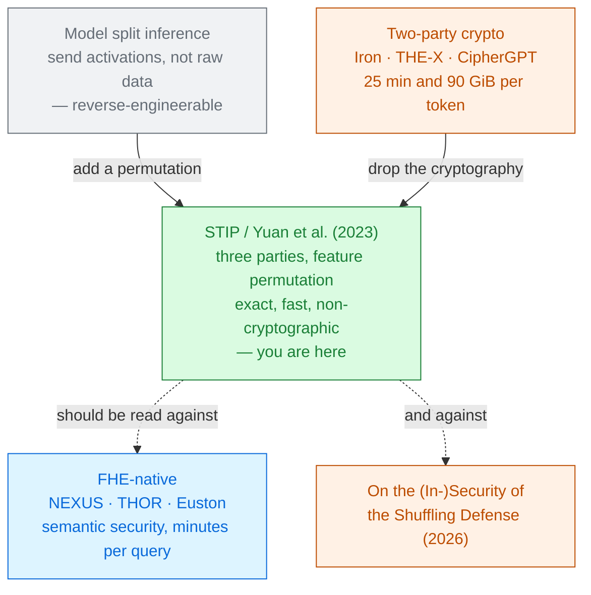

# Secure Transformer Inference Protocol

Mu Yuan · Lan Zhang · Xiang-Yang Li 
University of Science and Technology of China · arXiv 2312.00025 · 2023, revised 2024

The odd one out. **No homomorphic encryption anywhere** — just a shuffle of the feature dimensions,
with the shuffle known to the model's developer and not to the cloud renting it hardware. Exact
arithmetic, 70-billion-parameter models, production frameworks, and a security guarantee of an
entirely different kind.

**Name collision.** The authors also call this **STIP**. It is unrelated to
[STIP (2026)](../stip-2026/), the CKKS packing paper by Wang et al. Check the year and the authors.

---

# The problem, in plain words

renting a warehouse, and shuffling the labels on every crate before the movers arrive. They can move
the crates perfectly well. They just cannot read the inventory.

<v-clicks>

- The authors start from a measurement, not a theory: **CipherGPT takes 25 minutes and 90 GiB of
  traffic to generate one GPT-2 token** [§1].
- Their diagnosis is unusual — the bottleneck is not the cryptography but *"the two-party
  assumption"* it is built to satisfy.
- And their evidence is operational. Running two real services (a campus security chatbot and a
  vehicle-cabin assistant), they found the same thing both times: **the model developer is not the
  model server** [§2.3]. Even OpenAI runs on Microsoft Azure.

</v-clicks>

If the party that owns the model and the party that owns the hardware are already different, then
two-party cryptography is solving a problem nobody has.

---

# What you need to know first

No CKKS, no depth, no bootstrapping. Two facts about **permutation matrices** carry the whole paper.

<v-clicks>

- A permutation matrix $\pi$ is a square binary matrix with exactly one 1 per row and column. For
  $x \in \mathbb{R}^{n\times d}$, $\;\pi x$ shuffles the **tokens** and $x\pi$ shuffles the
  **features**.
- $\pi \pi^{\top} = I$. That single identity is the entire equivalence proof.
- Applying one costs **$O(d)$ movement of memory pointers** — it is not arithmetic at all.

</v-clicks>

And one property to hold onto, because it will come back twice: **mean and variance do not care
about order.** $\mu(x\pi) = \mu(x)$ and $\sigma(x\pi) = \sigma(x)$. That is why LayerNorm survives
the shuffle — and, on slide 10, why the shuffle leaks.

---

# The one big idea

Split the "model owner" in two. A **model developer** who trains and owns the weights, and a
**model server** who owns the GPUs. Assume they **do not collude** — and suddenly the developer can
hand the server a scrambled model that computes the right answer without the server ever
understanding it.

<strong class="win">P₁ · Model developer</strong> 
owns $\theta$ and every permutation matrix. <em>e.g. a lab, a startup, OpenAI</em>

<strong class="cost">P₂ · Model server</strong> 
owns the hardware, runs the scrambled model. <em>e.g. Azure</em>

<strong class="ct">P₃ · Data owner</strong> 
owns the prompt and the answer. <em>the user</em>

The non-collusion assumption is not a detail — it **is** the contribution. *"Any collaboration
between these entities would lead to a regression to the classic two-party setting"*
[§2.3]. Give the server the permutations and the protection is gone
entirely.

---

# Step 1 — why shuffling the tokens does not work

The obvious move is to permute the **sequence**: send $\pi x$ instead of $x$. Attention is known to
be equivariant to that, so $f(\pi x) = \pi f(x)$.

<v-clicks>

- **The causal mask breaks it.** A decoder adds a lower-triangular mask $M$ before softmax, and
  $\text{softmax}(\pi Q K^\top \pi^\top + M) \neq \pi\,\text{softmax}(QK^\top + M)\,\pi^\top$ unless
  the mask is permuted too.
- Permuting the mask does not help either: $M$'s structure is **publicly known** — it is a triangle
  of zeros and $-\infty$ — so from $M' = \pi M \pi^\top$ the cloud simply reads off $\pi$
  [§5.1].
- And even if it worked, the space is only $n!$ — with a short prompt, small enough to brute-force.

</v-clicks>

So permute the **features** instead. $d! $ possibilities, with $d = 4096$ for Llama-2-7B — and no
mask in the feature dimension to give the game away.

---

# Step 2 — scramble the weights to match

The developer draws a permutation for every place one is needed, and rewrites the weights so the
answer comes out right anyway [§5.1]:

$$W_q' = \pi^{\top} W_q \pi_{i,1},\quad W_k' = \pi^{\top} W_k \pi_{i,1},\quad
W_v' = \pi^{\top} W_v \pi_{i,2},\quad W_o' = \pi_{i,2}^{\top} W_o \pi$$
$$W_1' = \pi^{\top} W_1 \pi_{i,3},\quad W_2' = \pi_{i,3}^{\top} W_2 \pi,\quad
\gamma' = \gamma\pi,\;\;\beta' = \beta\pi,\quad W_c' = \pi^{\top} W_c \pi_c$$

<v-clicks>

**Theorem 1:** $\;F_{\theta'}(x\pi)\,\pi_c^{\top} = F_\theta(x)$ — the answer is **exactly** the
original one [§5.1].

Note what this buys that no other paper in this module has: **no approximation, no retraining, no
change to the architecture**, and therefore *"no loss of accuracy"* as a theorem rather than a
measurement.

</v-clicks>

---

# A tiny worked example — why it works, in two lines

<v-clicks>

**The matmuls.** The user sends $x\pi$. The server computes

$$(x\pi)\,(\pi^{\top} W_q \pi_{i,1}) \;=\; x\,(\pi\pi^{\top})\,W_q \pi_{i,1} \;=\; x W_q \pi_{i,1}
\;=\; Q\,\pi_{i,1}$$

The scrambling cancels. Every linear layer works this way.

**LayerNorm.** $\mu$ and $\sigma$ are computed over the feature dimension — and they are
**permutation-invariant**, so $\mu(v\pi)=\mu(v)$ and $\sigma(v\pi)=\sigma(v)$. The normalised vector
is therefore just the permuted normalised vector, and setting $\gamma'=\gamma\pi$, $\beta'=\beta\pi$
lines the affine part back up.

**Softmax** is applied across the *sequence*, not the features, so the feature permutation never
touches it.

</v-clicks>

Three cases, one reason: **everything a transformer does is either linear in the features, or
indifferent to their order.** That is a real fact about the architecture, and it is what makes the
trick possible at all.

---

# Step 3 — one permutation is not enough

<v-clicks>

**The attack.** Suppose the server ever learns one pair $(x, x\pi)$ — a known-plaintext attack. It
recovers $\pi$ by **$d$ column matchings** [§5.3], then inverse-transforms
every weight and the whole model is in the clear.

**The fix — a semi-symmetric set.** Use $3L+2$ matrices: $\{\pi, \pi_c\}$ plus
$\{\pi_{i,1},\pi_{i,2},\pi_{i,3}\}$ for each of the $L$ layers. Share **only $\pi$ and $\pi_c$**
with the user; the developer keeps the $3L$ intermediate ones.

</v-clicks>

| Scheme | Data | Parameters | Brute force | Known plaintext |
|---|---|---|---|---|
| Sequence permutation | $n!$ | 1 | ✗ | ✗ |
| Feature permutation, one $\pi$ | $d!$ | $d!$ | ✓ | ✗ |
| **Feature permutation, $\{\pi_1 \dots \pi_{3L}\}$** | $d!$ | $(d!)^{3L}$ | ✓ | ✓ |

[Table 2]

Cracking $\pi$ still exposes that user's embeddings, so the paper recommends **rotating the
permutation set periodically** — in the limit, one set per session. It is a key, and it has all a
key's operational burdens.

---

# Threat model

Semi-honest everywhere, with one extra assumption that carries the whole design.

| Party | Sees | Must not learn |
|---|---|---|
| P₁ developer | $\theta$, all of $\Pi$ | the user's $x$ and output $o$ — protected because it never sees $x\pi$ |
| P₂ server | scrambled weights $\theta'$, $x\pi$, every intermediate | $\theta$, $x$, $o$ |
| P₃ user | $\pi$, $\pi_c$, the embedding weights | $\theta$ |

Only the **embedding module** runs on the device. Splitting *before* it would send one-hot vectors,
whose structure trivially reveals the permutation; splitting *after* more layers costs latency and
hands the user more weights [§5.3, Fig. 9].

**If P₁ and P₂ collude, everything is exposed** — the weights, every user's embeddings, every
answer. There is no cryptographic fallback, because there is no cryptography.

---

# Break it — what a permutation cannot hide

The equivalence works *because* the statistics are order-invariant. That is also the leak.

<v-clicks>

- **The multiset survives.** The server holding $x\pi$ holds exactly the same $d$ numbers as $x$,
  in a different order. Every order-independent quantity — the mean, the variance, the norm, the
  sparsity, the maximum, the whole histogram — passes through **unchanged**, at every layer.
- **The attention scores are not protected at all.** From the paper's own transformation,
  $Q' = Q\pi_{i,1}$ and $K' = K\pi_{i,1}$, so
  $$Q'(K')^{\top} = Q\,\pi_{i,1}\pi_{i,1}^{\top}\,K^{\top} = QK^{\top}$$
  The server computes the **true, unpermuted attention matrix** on every head of every layer.
  (Derived here from §5.1; the paper's leakage analysis measures the transformed
  activations, not the attention maps.)

</v-clicks>

The paper's answer is empirical: **distance correlation** between $x$ and the transformed data falls
from **0.14 to 0.017** as hidden size grows, and is bounded by the leakage of a one-dimensional
random projection [§5.3, §7.3]. A real result — but a *statistical* bound,
not semantic security.

---

# Results — the two claims that are unambiguous

### Exactness [Table 5]

**100% top-1 accuracy on every model**, 10,000 samples each: GPT-2 (124M–1.5B), Llama-2 (7B/13B/70B),
ViT, BERT, LLaVA-13B, Mixtral-47B.

Sum of absolute differences: $3\times10^{-4}$ to $0.051$ — *"attributable to inherent
floating-point operation errors"*.

No other paper in this module can write "100%". They all approximate something.

### Throughput [§7.4]

<CostBars unit="token/s" log :lower-is-better="false" :items="[
  { label: 'CipherGPT (GPT2-124m)', value: 0.00067, note: '25 min/token' },
  { label: 'STIP (GPT2-124m)', value: 45366, note: '6.7 × 10⁷×', highlight: true },
]" caption="baseline inferred from its paper; no open-source code available" />

Largest model served: **70B**, against 336M for the two-party baselines — a 208× increase in reach.

Read the comparison for what it is. STIP is being measured against systems that provide
**cryptographic** confidentiality; it provides **combinatorial obfuscation** under a non-collusion
assumption. A seven-order-of-magnitude speedup over a different guarantee is not a speedup.

---

# Results — what it actually costs

The honest baseline is not CipherGPT. It is **unprotected full-cloud inference** — and the paper
says the two overlap so closely that its own chart had to omit one of them.

<v-clicks>

- **Latency breakdown** for one pass: STIP adds **1.7 ms** on the device, and *reduces* on-cloud
  time from 12 ms to 11 ms. The real cost is **communication** [Fig. 7d].
- **Why:** the device now sends an intermediate embedding — a $\text{batch}\times n\times d$ tensor —
  instead of the raw text. For GPT2-124m that is **5.8 MiB in and 7.5 MiB out** per round, against
  CipherGPT's 95,151 MiB.
- **Generation is interactive.** Producing $n$ tokens takes **$n$ rounds**, because the user must
  re-embed each new token locally. Slopes per token: full-cloud **12 ms**, STIP wired **30 ms**,
  STIP wireless **510 ms** [§7.4].
- 100 tokens in about **3 s** wired — *"2 s more for 100 tokens"* than unprotected serving.

</v-clicks>

On a wireless link the same protocol is **17× slower per token**. As with every hybrid system in
this collection, the number is a property of the network.

---

# What it costs

<v-clicks>

- **A non-collusion assumption**, unenforceable by any mechanism in the protocol.
- **Statistical rather than semantic security.** A bounded distance correlation, not a reduction to
  a hard lattice problem — and no protection at all for the attention matrices.
- **Key management.** $3L+2$ permutation matrices, distributed to users, rotated periodically, with
  every operational problem a key distribution has.
- **A per-token round trip** and 5–8 MiB of embedding traffic per round.
- **Embedding weights on every device**, plus 903 MiB of memory for Llama-2-70B's embedding table.
- **A device that can embed** — modest, but not nothing.

</v-clicks>

---

# What it does not solve

<v-clicks>

- **It is not encryption**, and the paper does not claim it is — but readers who see it beside
  NEXUS and THOR on a latency chart will draw the wrong conclusion. This is the single thing to
  carry away.
- **It fails when the cloud provider builds its own models.** The authors name it themselves: for
  Google serving Gemini on Google Cloud, *"the inherent challenge lies in establishing a trustworthy
  environment"* [§8].
- **Training is out of scope** — forward pass only; gradients would leak differently.
- **Baselines are not re-run.** Iron, THE-X and CipherGPT *"lack open-source code"*, so their
  numbers are taken from their papers [§7.4].
- **Attention-map leakage is not analysed.** The distance-correlation study covers the transformed
  embeddings.
- **Filed under the wrong heading.** This module is "FHE-native, non-interactive inference"; this
  paper uses no FHE and needs one round per generated token. It sits here as the module's
  *protocol-level counterpoint*, not as a member of it.

</v-clicks>

---

# Where it sits

None of the primer's three ways out — a fourth option that trades a cryptographic guarantee for an organisational one.

---

# Key terms

<dl class="glossary">
<dt>Three-party threat model</dt><dd>Splitting the model owner into a developer (owns weights) and a server (owns hardware), assumed not to collude.</dd>
<dt>Feature-space permutation</dt><dd>Shuffling the hidden dimensions of every activation. d! possibilities, and no mask to give it away.</dd>
<dt>Sequence-level permutation</dt><dd>Shuffling tokens instead. Only n! options, and the causal mask makes it non-equivalent.</dd>
<dt>Semi-symmetric scheme</dt><dd>3L+2 permutations, of which the user receives only two. What makes the parameters resist a known-plaintext attack.</dd>
<dt>Known-plaintext attack</dt><dd>Recovering the transformation from one matched (plain, transformed) pair — here, d column matchings.</dd>
<dt>Computational equivalence</dt><dd>Theorem 1: the scrambled model on scrambled input gives exactly the original answer.</dd>
<dt>Distance correlation</dt><dd>The paper's leakage metric — 0.14 falling to 0.017 as hidden size grows.</dd>
<dt>Semantic security</dt><dd>What FHE gives and permutation does not: ciphertexts indistinguishable from random, under a hardness assumption.</dd>
</dl>

---

# Check yourself

**1. STIP reports a 6.7 × 10⁷× throughput gain over CipherGPT. Why is that not the headline it looks like?**

<v-click>

Because they give different guarantees. CipherGPT gives **semantic security** from a hard lattice
problem, assuming nothing about who talks to whom. STIP gives a permutation anyone holding it can
undo, resting entirely on non-collusion. Ask which guarantee your deployment needs.

</v-click>

**2. Permutation works because transformers are order-indifferent in the features. What does that property cost you?**

<v-click>

Everything order-independent passes through visible: the server holding $x\pi$ holds the same
multiset as $x$, so mean, variance, norm, sparsity and histogram are exposed at every layer — and
because $\pi_{i,1}$ cancels in $Q'(K')^\top$, the true attention matrix is computed in the clear.
The invariance that makes the equivalence hold is the invariance that leaks.

</v-click>

**3. Why does STIP need one round per generated token, when it claims to avoid interaction?**

<v-click>

Because the **embedding runs on the device**. Each new token must be embedded and permuted locally
before being fed back, so autoregression forces one round trip per token — 30 ms wired, 510 ms
wireless. The paper calls this *"inevitable ... preserving the confidentiality of inference
output"*: the alternative hands the cloud the answer.

</v-click>

---
layout: center
---

# Where to go next

**The obvious companion, and read it next**
[On the (In-)Security of the Shuffling Defense (2026)](../shuffling-defense-insecurity-2026/) — a
permutation-based protection for transformer inference, tested by people trying to break it.

**What the guarantee costs when you insist on cryptography**
[NEXUS (2025)](../nexus-2024/) · [THOR (2024)](../thor-2024/) — semantic security, minutes per query.

**The baselines this paper is arguing with**
[THE-X (2022)](../thex-2022/) · [Iron (2022)](../iron-2022/) · [CipherGPT (2023)](../ciphergpt-2023/).

**Where the taxonomy lives**
[A Survey on Private Transformer Inference (2024)](../survey-private-transformer-inference-2024/) —
on how extra parties buy speed, and what they cost in deployability.

← back to <a href="../../slides/">all decks</a>

