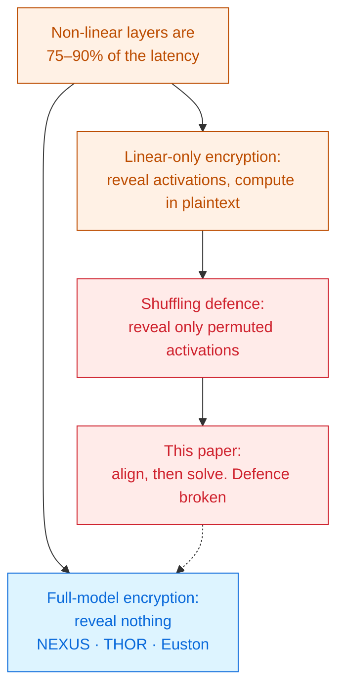

# On the (In-)Security of the Shuffling Defense

Zhengyi Li · Yakai Wang · Kang Yang · Yu Yu · Jiaping Gui · Yu Feng · Ning Liu · Minyi Guo · Jingwen Leng 
Shanghai Jiao Tong University · arXiv 2605.04901 · 2026

A popular shortcut hands the client **shuffled** intermediate activations, on the grounds that a
random permutation of 100 numbers is unguessable. This paper steals the model weights anyway —
for about **one dollar** in API queries.

Read the <a href="../primer-fhe-transformers/">Primer</a> first · the deck to read before you accept a shortcut

---

# The problem, in plain words

a locked filing cabinet, where the clerk keeps handing you the pages with the page numbers torn
off. Nothing is missing. Only the order is gone.

<v-clicks>

- Under real encryption, the non-linear layers — softmax, GELU, LayerNorm — take
  **75–90% of the total time** [§1].
- So some systems cheat: send the activations **to the client in the clear** and let the client
  compute the non-linear part on its own CPU. Two rounds instead of tens. Tens of times faster.
- But activations plus their inputs let a client **solve for the weights**. So those systems
  **shuffle** the activations first.

</v-clicks>

The defence sounds airtight. A vector of $h$ numbers has $h!$ orderings; for $h \geq 100$ that is
more than $10^{157}$. Guessing is hopeless — and prior work showed shuffled activations correlate
so poorly with the originals that black-box attacks fail [§2.2].

---

# What you need to know first

Two ways to run a transformer privately. This paper attacks only the second.

### FME — full-model encryption safe here

Everything stays encrypted end to end. The client sees **only the final answer**.

This is what NEXUS, THOR and the rest of Module 2 do. Not attacked in this paper.

### LOE — linear-only encryption the target

Only the **linear** layers are protected. Intermediate activations are revealed to the client, who
computes softmax and GELU in plaintext and sends the result back.

Fast, and the shuffling is what is supposed to make it safe.

A **permutation** just reorders a vector: $\mathrm{sf}(\mathbf{x}, \pi) = \mathbf{x}\pi$. It changes
no value. That single fact is the whole paper.

---

# The one big idea

Shuffling hides **where** each number sits. It does not hide **what** the numbers are. Ask the
model two nearly identical questions, and the two shuffled answers can be matched up value by
value — without ever learning either permutation.

Two activation vectors from two near-identical prompts, each shuffled differently:

<SlotGrid :values="[0.71, 0.12, 0.44, 0.90]" label="query a (shuffled by πa)" />
<SlotGrid :values="[0.45, 0.89, 0.70, 0.13]" label="query b (shuffled by πb)" />

<v-click>

Sort both, or match each value to its nearest partner, and the correspondence falls out:

$0.71 \leftrightarrow 0.70$ · $0.12 \leftrightarrow 0.13$ ·
$0.44 \leftrightarrow 0.45$ · $0.90 \leftrightarrow 0.89$

Both vectors are now in the <em>same unknown</em> order. That is all the attacker needs.

</v-click>

---

# Step 1 — making two answers that are almost the same

The attacker needs activation vectors that are numerically close. Neural networks hand them over.

<v-clicks>

- Networks are **Lipschitz continuous**: if two inputs are close, the activations they produce are
  close. Formally $\lVert \mathbf{x}_a - \mathbf{x}_b \rVert \le L \lVert S_a - S_b \rVert$
  [§4.2].
- So the attacker sends $n$ prompts that differ only slightly, and collects $n$ shuffled activation
  vectors that differ only slightly.
- Secure inference uses **fixed-point** arithmetic — 18 bits by default in SecretFlow-SPU. The
  attack exploits that rounding to make inputs that differ by less than the model can even notice.

</v-clicks>

Nothing here is a protocol flaw. Every ingredient — continuity, fixed-point rounding, choosing
your own prompts — is a normal, harmless property of the system.

---

# Step 2 — aligning the shuffles

<v-clicks>

- Line up all $h$ values of vector $a$ against all $h$ values of vector $b$, and score each pair by
  distance: $D[i,j] = (x'_a[i] - x'_b[j])^2$.
- Find the one-to-one matching with the smallest total distance. This is the classical
  **assignment problem**, solved exactly by the **Hungarian algorithm** — polynomial time, not
  $h!$ guesswork [§4.1].
- Repeat across all queried vectors, and every activation now sits in one common — still
  unknown — order.

</v-clicks>

The defence assumed the attacker had to *identify* the permutation. They only had to
*cancel* it.

Measured accuracy of that matching: fewer than **2% of elements mismatched**, with mean squared
error between $10^{-9}$ and $10^{-6}$ against a perfect alignment [§5.2].

---

# Step 3 — from aligned activations to stolen weights

<v-clicks>

- For a linear layer, output $=$ input $\times$ **W**. The attacker now has many aligned
  input/output pairs, so **W** is the unknown in an ordinary linear system.
- Query enough times and the system is solvable. The paper uses **16× the layer's largest
  dimension** to keep the numerics stable: **32,768 queries** for Pythia-70m, **49,512** for GPT-2
  [§5.1].
- The recovered weights come out **permuted** — rows and columns shuffled by the unknown $\pi$.

</v-clicks>

And that does not matter. A consistently permuted weight matrix computes **the same forward
pass**. The attacker gets a working copy of the model without ever undoing the shuffle.

One numerical caveat the authors are open about: near-identical inputs make the system
ill-conditioned, so small singular values are truncated at a condition-number threshold of $10^7$
[§5.4].

---

# A tiny worked example — why permuted weights still work

Suppose the true layer is $\mathbf{y} = \mathbf{x}\mathbf{W}$ with a 3-slot input.

<v-clicks>

- The server always shuffles by the same secret $\pi$, so the attacker sees
  $\mathbf{x}' = \mathbf{x}\pi$ and $\mathbf{y}' = \mathbf{y}\pi$.
- Solving with those gives $\mathbf{W}' = \pi^{-1}\mathbf{W}\pi$ — the true weights with rows and
  columns reordered.
- Feed a shuffled input into the shuffled weights: $\mathbf{x}'\mathbf{W}' = \mathbf{x}\pi\,
  \pi^{-1}\mathbf{W}\pi = (\mathbf{x}\mathbf{W})\pi = \mathbf{y}'$.

</v-clicks>

The permutations cancel. The stolen model is functionally the real model, in a costume.

---

# Threat model

The attacker is the **client** — the party the protocol was built to serve.

| Party | Sees | Never sees |
|---|---|---|
| Client | its input, the answer, **every shuffled activation** | the permutation, the weights (in theory) |
| Server | ciphertexts of the linear layers | the client's plaintext input |
| Network observer | message sizes and timing | contents |

<v-clicks>

- The attacker needs only what an ordinary paying customer has: **free choice of prompts** and a
  **mild number of queries**.
- No collusion, no protocol deviation, no side channel. The client follows the rules exactly.

</v-clicks>

Cost of the attack at commercial API prices: **under one dollar**. The attack is independent of the
response, so each query can be answered with a single "yes" [§5.1].

---

# Results — how good is the stolen model?

Perplexity on WikiText — lower is better [Table 2]:

<CostBars unit="" :lower-is-better="true" :items="[
  { label: 'GPT-2, original', value: 21.11, reference: true },
  { label: 'GPT-2, stolen weights', value: 47.92, note: 'straight out of the attack' },
  { label: 'GPT-2, stolen + 6 min fine-tune', value: 21.15, note: 'matches the original', highlight: true },
  { label: 'Pythia-70m, original', value: 31.81, reference: true },
  { label: 'Pythia-70m, stolen + fine-tune', value: 32.43, highlight: true },
]" caption="stolen weights land within 0.04 perplexity of GPT-2 after at most six minutes of fine-tuning" />

Read the third bar carefully. The raw theft is mediocre — but it is a good enough
<strong>starting point</strong> that six minutes of ordinary training closes the gap. A black-box
attack has become a white-box one [§5.5].

---

# What it costs — for the attacker

<v-clicks>

- **Tens of thousands of queries** — 32,768 for Pythia-70m, 49,512 for GPT-2. Detectable, if
  anyone is looking.
- **A pile of near-identical prompts**, which is an odd traffic pattern.
- **Numerical care**: the alignment degrades at lower fixed-point precision, and the linear system
  is ill-conditioned by construction.
- The result is **permuted** weights — fine for running the model, awkward for reading individual
  neurons.

</v-clicks>

Against these costs: under a dollar, no special access, and a near-perfect copy of a private model.
The economics are not close.

---

# What it does not solve

<v-clicks>

- **Full-model encryption is untouched.** If the client only ever sees the final output, there are
  no activations to align. Everything in Module 2 of this collection is out of range.
- **Evaluated on small models** — Pythia-70m and GPT-2. The authors note attack difficulty grows
  with layer input dimension, so larger models are harder, not impossible.
- **No fix is proposed.** The paper calls for re-evaluation of the shuffling defence; it does not
  offer a replacement.
- **Query volume is the obvious defence** — rate limits, duplicate-prompt detection — but earlier
  query-limiting defences were already shown insufficient [§1].

</v-clicks>

The useful takeaway is a habit, not a patch: when a paper reveals *something* to speed things up,
ask what an adversary can accumulate over many queries — not what they learn from one.

---

# Where it sits

Read this deck as the price tag on the shortcut the rest of the collection refuses to take.

---

# Key terms

<dl class="glossary">
<dt>FME</dt><dd>Full-model encryption — the whole network runs encrypted; the client sees only the output.</dd>
<dt>LOE</dt><dd>Linear-only encryption — only linear layers are protected; activations are revealed so the client can do the non-linear parts in the clear.</dd>
<dt>Activation</dt><dd>The intermediate values flowing between layers. Together with inputs, they determine the weights.</dd>
<dt>Permutation</dt><dd>A reordering of a vector's entries. Changes positions, never values.</dd>
<dt>Shuffling defence</dt><dd>Revealing activations only in random order, on the assumption that h! orderings are unguessable.</dd>
<dt>Lipschitz continuity</dt><dd>Close inputs produce close outputs, with a bounded ratio. What makes the attack's near-identical queries work.</dd>
<dt>Assignment problem</dt><dd>Matching two sets one-to-one at minimum total cost. Solved exactly by the Hungarian algorithm.</dd>
<dt>Fixed-point precision</dt><dd>How many bits secure protocols keep after the point — 18 by default in SPU. Its rounding is what the attack exploits.</dd>
<dt>Condition number</dt><dd>How much a linear system amplifies numerical error. Near-identical queries make it large.</dd>
<dt>Model extraction</dt><dd>Recovering a private model's weights through ordinary queries.</dd>
</dl>

---

# Check yourself

**1. Why does the $10^{157}$ argument not protect the shuffling defence?**

<v-click>

Because the attacker never guesses the permutation. Two shuffled vectors of nearly equal values can
be matched to each other by distance, putting both into the same unknown order. Cancelling a
permutation is far easier than identifying it.

</v-click>

**2. The stolen weights are scrambled by an unknown permutation. Why is the model still usable?**

<v-click>

Because the input is scrambled by the same permutation. In $\mathbf{x}\pi \cdot \pi^{-1}\mathbf{W}\pi$
the permutations cancel and the output is the true output, also permuted. A consistent relabelling
of every dimension changes nothing about the function computed.

</v-click>

**3. Which systems in this collection are immune, and why?**

<v-click>

The full-model-encryption ones — NEXUS, THOR, Euston, STIP and the rest of Module 2. The attack
needs intermediate activations, and those systems never release any. The speed they give up is
exactly the thing being sold here for a dollar.

</v-click>

---
layout: center
---

# Where to go next

**The systems that do not reveal activations**
[NEXUS](../nexus-2024/) · [THOR](../thor-2024/) · [Euston](../euston-2026/) ·
[STIP](../stip-2026/)

**Another paper that trades information for speed — judge it with this deck in hand**
[Comet](../comet-2025/), which predicts and skips sparse activations.

**Where the 75–90% figure comes from**
[A Survey on Private Transformer Inference](../survey-private-transformer-inference-2024/) ·
[SoK: Private LLM Inference](../sok-approx-he-llm-2026/)

← back to <a href="../../slides/">all decks</a>

