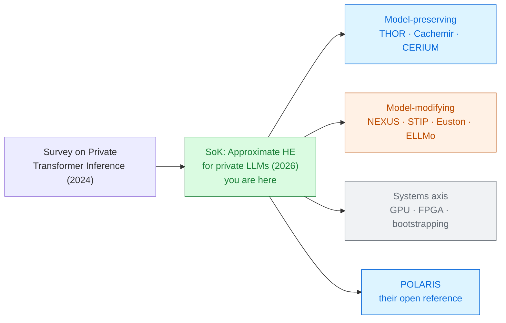

# SoK: Private LLM Inference using Approximate HE

Ahmad Al Badawi · Andreea Alexandru · Yuriy Polyakov · Vinod Vaikuntanathan 
Duality Technologies and MIT · 2026

Twenty groups now claim to run a language model under encryption. This paper asks the two
questions that decide whether any of it counts: **is it still your model**, and **how much
slower is it, really?**

Read the <a href="../primer-fhe-transformers/">Primer</a> first · the honest scorecard for the whole collection

---

# The problem, in plain words

twenty car makers all advertising "0–60 in 4 seconds" — one downhill, one with a lighter driver,
one measuring from 10 mph, one with a car that is not quite the car you can buy.

<v-clicks>

- Encrypted inference **works** now: BERT-Tiny in 2022, Llama-3-8B by 2026 [§1].
- But every paper picks its own model, hardware, batch size, encryption parameters and metric.
- So the published numbers cannot be compared, and nobody can tell how far the field actually is.

</v-clicks>

Earlier surveys concluded FHE simply *could not* evaluate the non-linear parts of a modern
network. Twenty CKKS frameworks have since done it. The question has moved from "is it possible"
to "is it honest, and is it usable" [abstract].

---

# What you need to know first

CKKS, slots, depth and bootstrapping — all in the [Primer](../primer-fhe-transformers/). Two new
words for this deck:

<v-clicks>

**Non-interactive.** The client sends one message and gets one back. No rounds, no online client,
no privacy budget, no trusted hardware. This paper covers *only* such systems — no MPC hybrids
[§1].

**Model-preserving.** The framework runs the **standard, unmodified model**: no retraining, no
distillation, no swapping softmax for something friendlier. If a framework changes the
architecture to make encryption easier, it is **model-modifying**.

</v-clicks>

That distinction is not academic. A model-modifying result tells you what *a different model*
can do under encryption. It does not tell you that *your* model will work.

---

# The one big idea

Sort the field by whether the encrypted model is still the model you started with. Do that, and
**only 6 of 30 implementations — 20% — survive** [§6].

### Class N-PRE — model-preserving 20%

Approximate the *real* softmax, the *real* GELU, numerically. Nothing is retrained.

THOR · CACHEMIR · CERIUM · CEP · POLARIS

### Class N-MOD — model-modifying 80%

Replace the hard operator with something FHE likes, then retrain to recover the loss.

NEXUS · MOAI · STIP · ELLMo · Euston · Powerformer · Polyformer

Neither class is cheating. But a table that mixes them is comparing two different promises.

---

# Step 1 — the model-level axis

How the model is laid out in ciphertext slots, and what happens to the four hard operators.

<v-clicks>

**Linear blocks — the packing layout.** Four families [§4.1.1]:
`L-ROW` pack by token/row · `L-COL` by column or diagonal · `L-CYC` cyclic/complex encoding ·
`L-ALG` algorithmic shortcuts. The choice sets how many **rotations**{.cost} the matrix
multiplications need, and rotations are the bill.

**Non-linear blocks — preserve or modify.** The `N-PRE` / `N-MOD` split from the previous slide.

</v-clicks>

The SoK's advice for linear blocks is worth memorising: handle both ciphertext×ciphertext and
ciphertext×plaintext matrix products, make transposition cheap, minimise **rotation count and the
number of distinct rotation keys** (the server stores these per client, and they are large), and
keep slots full so the ciphertext count stays low [§4.1.1].

---

# Step 2 — how a model-preserving framework survives softmax

The impossible functions, done numerically instead of replaced [§4.1.2]:

<v-clicks>

- **Softmax → normalize-and-square.** Scale the input down by a negative power of two until
  $\exp$ is stable, then square repeatedly to climb back to the original range. Used by
  SplitPrompt; THOR adds Goldschmidt division to cut the depth.
- **$1/\sqrt{x}$ in LayerNorm → Newton–Raphson.** Iterate rather than approximate in one shot.
- **GELU, tanh, SiLU → high-degree polynomials.** THOR composes small polynomials instead of
  fitting one big one, which is cheaper for the same accuracy.
- **argmax → NEXUS's slot-folding.** Fold the ciphertext in half repeatedly instead of comparing
  every pair: $O(V)$ becomes $O(\log V)$ for vocabulary size $V$.

</v-clicks>

Every one of these is a way to spend **depth** instead of spending **the model**.

---

# Step 3 — the system-level axis

Where the engineering, rather than the mathematics, buys speed [§4.2].

<v-clicks>

- **Bootstrapping placement.** Most frameworks bootstrap when the budget runs dry. Smarter ones
  place it deliberately: NEXUS bootstraps *after* dimension-reducing steps; MOAI moves it inside
  softmax, just before the division.
- **Hardware and compilers.** CPU libraries (OpenFHE, SEAL, Lattigo) or GPU ones (Phantom,
  Liberate.FHE, FIDESLib, HEaaN). GPU bootstrapping has fallen from **tens of seconds** on CPU to
  **under 10 ms** on a multi-GPU cluster.
- **Hybrid public–private execution.** Encrypt only part of the prompt. Much faster — and a
  weaker promise.

</v-clicks>

<DepthBar :total="20" :steps="[
  { label: 'MOAI: softmax as usual', cost: 20, expensive: true },
  { label: 'bootstrap placed inside softmax', bootstrap: true },
]" caption="MOAI's placement cuts softmax from 20 levels to 10 — and the matmuls before it then run at lower levels, where multiplication is faster [§4.2.1]" />

---

# A tiny worked example — two rows of the same table

Both rows say "BERT-Base". They do not say the same thing [Table 2].

| | THOR | NEXUS |
|---|---|---|
| Latency | **602 s** | **37 s** |
| Metric | unamortised, **1 sequence** | amortised, **32 sequences batched** |
| Hardware | 1 × A100 | **4 × A100** |
| Non-linear | model-**preserving** | model-**modifying** |

<v-clicks>

- NEXUS looks 16× faster. Four times the GPUs and 32 inputs share the fixed cost.
- And NEXUS's model was changed to get there; THOR's was not.
- Same task, same model name, two different claims.

</v-clicks>

This is exactly why the paper proposes a reporting standard rather than a ranking.

---

# Threat model

Semi-honest, one round-trip, server does everything [§2.3.2].

| Party | Sees | Never sees |
|---|---|---|
| Client | its own prompt, the final answer | the model weights |
| Server | ciphertexts, the model | the prompt, the output tokens |
| Network observer | two messages and their size | contents |

<v-clicks>

- The server follows the protocol exactly and only tries to learn from what it receives.
- **Public by design:** embedding size, layer count, vocabulary size, input language.
- The client is assumed to be the only consumer of the result.

</v-clicks>

Watch for the **relaxed** setting. SplitPrompt encrypts only the last 128 tokens of a
4096-token prompt and computes the rest in the clear. Its 33 s is real — but 97% of the prompt was
never hidden. The SoK puts it in its own band for this reason [Table 3].

---

# Results — the gap, measured properly

One BERT-Base sequence classification, 128 tokens, same class of GPU:

<CostBars unit="s" log :items="[
  { label: 'cleartext FP16 (A100)', value: 0.0032, note: '1.0–3.2 ms', reference: true },
  { label: 'CERIUM (2026, model-preserving)', value: 66, note: 'A100', highlight: true },
  { label: 'THOR (2024, model-preserving)', value: 602, note: 'A100, batch 1' },
  { label: 'Llama-3-8B prefill, CERIUM', value: 698, note: 'vs 12 ms in the clear' },
]" caption="§6 — encrypted vs optimized cleartext on comparable hardware" />

<v-clicks>

- THOR sits **5–6 orders of magnitude** above cleartext; the best 2026 systems, about **4**.
- Accuracy, meanwhile, is fine: model-preserving frameworks stay within **0.5%** of plaintext
  accuracy all the way up to **Llama-3-8B**.

</v-clicks>

---

# What it costs — and what to demand of the next paper

The SoK's answer to fragmentation is the **Private LLM Card System (PLCS)** — four cards that
every paper should fill in [§5.2]:

<strong class="ct">Model</strong> 
exact architecture, parameter count, sequence length, and <em>whether it was retrained</em>

<strong class="ct">Cryptographic</strong> 
ring dimension $N$, modulus chain, scale $\Delta$, levels $L$, security level

<strong class="ct">System</strong> 
hardware, FHE library, number of GPUs, memory

<strong class="ct">Application</strong> 
task, dataset, batch size, and <em>amortised or not</em>

If a paper will not tell you all four, you cannot place its number. That is a finding about the
literature, not a formality.

---

# What it does not solve

<v-clicks>

- **It re-reads reported numbers; it does not re-run them.** POLARIS, the authors' own reference
  framework, is the only system measured under their control — and only for BERT-Tiny and
  BERT-Mini (18 s and 83 s on an A100).
- **CKKS only, non-interactive only.** Every hybrid HE+MPC system in Module 3 of this collection is
  out of scope by construction.
- **Semi-honest only.** A server that actively cheats is not considered anywhere.
- **The gap is not going away by itself.** The authors are blunt: four orders of magnitude will
  not be eliminated "unless a major breakthrough in bootstrapping is achieved" — hence the hope
  placed on custom FHE chips, estimated at four to five orders over CPU [§6].
- **Robustness is untouched.** Nothing here says the encrypted answer is a *good* answer.

</v-clicks>

---

# Where it sits

The 2024 survey maps who tried what. This one says which attempts still run your model.

---

# Key terms

<dl class="glossary">
<dt>Non-interactive</dt><dd>One message each way. No rounds, and the client can go offline.</dd>
<dt>Model-preserving (N-PRE)</dt><dd>Runs the standard model unchanged — no retraining, no substituted operators.</dd>
<dt>Model-modifying (N-MOD)</dt><dd>Changes the architecture to suit encryption, then retrains to recover accuracy.</dd>
<dt>Packing layout</dt><dd>How the model's matrices are arranged in ciphertext slots. Decides the rotation bill.</dd>
<dt>Rotation key</dt><dd>A large key the server needs for each rotation amount. Storing many of them is a real cost.</dd>
<dt>Normalize-and-square</dt><dd>Softmax trick: shrink the input until exp is stable, then square repeatedly to restore the range.</dd>
<dt>Newton–Raphson</dt><dd>Iterative method used here to get 1/√x for LayerNorm without dividing.</dd>
<dt>Bootstrapping placement</dt><dd>Choosing <em>where</em> in the network to bootstrap, not just when the budget empties.</dd>
<dt>Amortised latency</dt><dd>Total time ÷ number of inputs batched. Always check which one a table reports.</dd>
<dt>TPOT / TTFT</dt><dd>Time per output token / time to first token — the two metrics for generation.</dd>
<dt>PLCS</dt><dd>The four-card reporting scheme this paper proposes: model, cryptographic, system, application.</dd>
<dt>POLARIS</dt><dd>The authors' open-source model-preserving reference implementation.</dd>
</dl>

---

# Check yourself

**1. A paper reports Llama-3-8B under encryption in 33 seconds. What do you ask before believing it?**

<v-click>

Whether the whole prompt was encrypted. SplitPrompt's 33 s encrypts only the last 128 tokens of
4096 — the other 97% runs in the clear. Then ask: amortised or not, how many GPUs, and was the
model retrained.

</v-click>

**2. Why does the SoK care so much about "model-preserving" when the modified models score well?**

<v-click>

Because a modified model is a different product. If a hospital wants *its* fine-tuned model run
privately, a framework that requires retraining with substituted operators changes what is being
deployed — and the accuracy numbers no longer transfer.

</v-click>

**3. Accuracy loss is under 0.5% even at 8 billion parameters, yet the paper calls the field impractical. Why?**

<v-click>

Because the barrier is not quality, it is time. Encrypted inference is roughly 10,000× slower than
the same model in the clear on the same hardware. The maths is solved; the economics are not.

</v-click>

---
layout: center
---

# Where to go next

**The other map**
[A Survey on Private Transformer Inference (2024)](../survey-private-transformer-inference-2024/) —
includes the hybrid HE+MPC systems this SoK leaves out.

**The model-preserving line**
[THOR](../thor-2024/) · [Cachemir](../cachemir-2026/) — approximate the real function, keep the model.

**The model-modifying line**
[NEXUS](../nexus-2024/) · [STIP](../stip-2026/) · [Euston](../euston-2026/) ·
[ELLMo](../ellmo-2026/) — change the model, then win on speed.

**The systems axis, where the four orders of magnitude will be fought**
[EncryptedLLM](../encryptedllm-2025/) · [AEGIS](../aegis-2026/) · [FAME](../fame-2025/)

← back to <a href="../../slides/">all decks</a>

