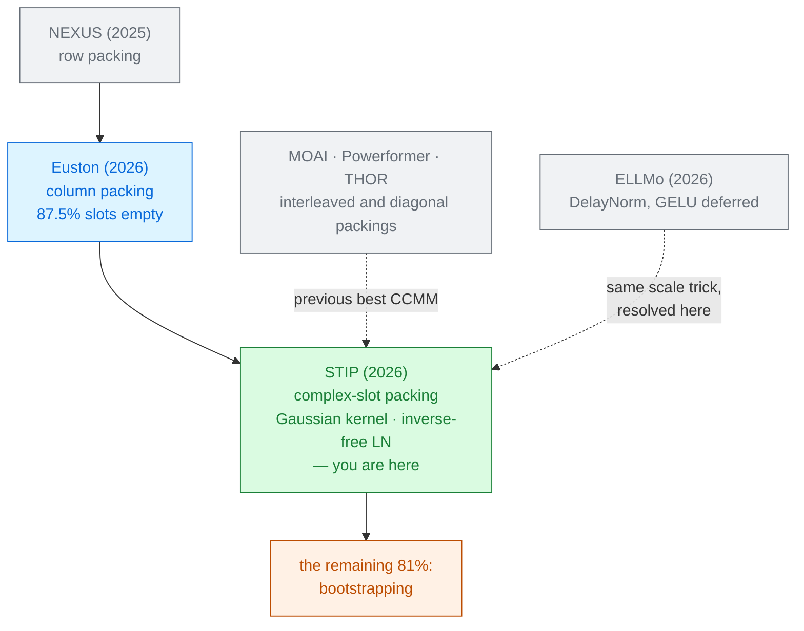

# STIP

Zihao Wang · Rongmao Chen · Xinwen Gao · Yi Wang · Lin Liu · Zixin Lan ·
Zhaoyu Wang · Shaojing Fu · Qiong Wang · Xinyi Huang 
National University of Defense Technology · Shanghai Jiao Tong · NUAA · 2026

CKKS has been encrypting **complex** numbers all along, and this whole literature has been using
only the real half. STIP fills the imaginary half — and gets two results out of every
multiplication.

**Name collision.** Unrelated to
[STIP, the Secure Transformer Inference Protocol (2023)](../secure-transformer-protocol-2023/) by
Yuan et al., which uses permutations rather than encryption. Check the year and the authors.

Read <a href="../nexus-2024/">NEXUS</a> and <a href="../euston-2026/">Euston</a> first · Module 2

---

# The problem, in plain words

a delivery van that has been driving around half-empty for years because nobody checked the back
half of the cargo bay.

<v-clicks>

- [Euston](../euston-2026/)'s column packing made the non-linear layers rotation-free. But it puts
  **one column in each ciphertext**, and under BERT-Base settings that leaves **87.5% of the slots
  empty** [§1].
- Consequences: sparse packing needs **8× more ciphertexts** (2,304 against 288 for $Q,K,V$),
  which is GPU memory; and the fixed per-operation cost is paid whether the slots are full or not,
  so small batches suffer badly.
- Meanwhile the **ciphertext × ciphertext** multiplies — $QK^\top$ and $SV$ — became the dominant
  rotation cost, at $2(m-1)d'$ rotations each.
- And a column layout **cannot compute the row maximum**, so Euston substitutes a constant — which
  *"often leads to exponential overflow or underflow"* [§1].

</v-clicks>

---

# What you need to know first

One fact about CKKS that the rest of this deck depends on.

<v-clicks>

**CKKS slots hold complex numbers, not real ones.** The encoding maps $\mathbb{C}^{N/2} \to R_Q$.
Machine-learning workloads store real values and leave the imaginary component at zero — half the
capacity, unused.

**Conjugation is a homomorphic operation.** Given $\llbracket z \rrbracket = \llbracket a+ib\rrbracket$:

$$\tfrac{1}{2}\!\left(z + \overline{z}\right) = a, \qquad -\tfrac{i}{2}\!\left(z - \overline{z}\right) = b$$

so both halves can be recovered afterwards, cheaply.

**Complex multiplication mixes them usefully.** If $q$ is real,
$q\cdot(k + ik') = qk + i\,(qk')$ — **two independent real products from one multiplication.**

</v-clicks>

Nothing is free. Conjugate unpacking needs a slightly longer modulus chain: STIP runs its
micro-benchmarks at $L=4$–$6$ where the baselines use $L=3$. The paper reports this each time.

---

# The one big idea

Three packing strategies, one instinct. **Put a second useful value in the imaginary component**
(RIHP for the attention matmuls, DHP for the projections), and **stop leaving slots empty**
(AMCP). Then remove the two operations that column packing had made awkward — the row maximum and
the inverse — by changing the operators rather than the packing.

<strong class="win">RIHP</strong> real-imaginary hybrid 
two output diagonals per multiply → <strong>~50% fewer rotations</strong> in $QK^\top$ and $SV$

<strong class="win">DHP</strong> dual-head 
adjacent heads in real and imaginary parts → <strong>2× projection throughput</strong>

<strong class="win">AMCP</strong> adaptive multi-column 
four heads per ciphertext → <strong>75% less memory</strong>

Everything else is inherited: RNS-CKKS at $N=2^{16}$, 128-bit security, Euston's bootstrapping,
Phantom on GPU and SEAL on CPU, and NEXUS's sign-function parameters ($d_f=d_g=2$, $\alpha=20$).

---

# Step 1 — two diagonals from one multiplication

Build a **hybrid key matrix** by folding the key's own rotation into its imaginary part
[Eq. 31–32]:

$$\hat{k}_l \;=\; k_l \;+\; i\cdot\text{RotL}_{m/2}(k_l)$$

<v-clicks>

- Then $\llbracket C_r \rrbracket = \sum_l \llbracket q_l \rrbracket \boxtimes \text{RotL}_r(\llbracket \hat k_l \rrbracket)$
  encrypts **two diagonals of $QK^\top$ at once**:
  $\;\llbracket C_r \rrbracket = \llbracket P_r \rrbracket + i\,\llbracket P_{r+m/2}\rrbracket$.
- Because rotation is linear over $\mathbb{C}$ and
  $\text{RotL}_a(\text{RotL}_b(v)) = \text{RotL}_{a+b}(v)$, the two halves separate cleanly at the end.
- So $r$ only has to run over **half** the diagonals. Rotations halved, no approximation, no
  accuracy cost.

</v-clicks>

A **second** RIHP strategy folds the *feature* dimension instead — $\hat q_j = q_j + i\,q_{j+d'/2}$ —
and is used for the L2-norm and for $SV$, taking key switches from $(m-1)d'$ to
$(m+1)d'/2 + 2(m-1)$ [Alg. 4].

---

# A tiny worked example — the imaginary half, by hand

Take $m=4$ (so $m/2 = 2$) and one feature column: $q = [1,2,3,4]$, $k = [5,6,7,8]$.

<v-clicks>

- Build the hybrid key: $\hat k = k + i\cdot\text{RotL}_2(k) = [\,5{+}7i,\; 6{+}8i,\; 7{+}5i,\; 8{+}6i\,]$.
- One multiplication, $r=0$: $\;q \boxtimes \hat k = [\,5{+}7i,\;12{+}16i,\;21{+}15i,\;32{+}24i\,]$.
- **Real part** $= [5,\,12,\,21,\,32] = q_i k_i$ — that is diagonal 0 of $QK^\top$. ✓
- **Imaginary part** $= [7,\,16,\,15,\,24] = q_i\,k_{i+2 \bmod 4}$ — that is diagonal 2. ✓

</v-clicks>

Two of the four diagonals, from one multiply and one rotation. Run $r=1$ for the other two and the
whole attention score matrix costs **two** rotations where the real-only method needs four.

Worked here from Eqs. 31–37; the paper proves the identity without a numeric instance.

---

# Steps 2 and 3 — fill the van

### DHP — two heads per ciphertext
Map attention head $h$ to the real component and head $h{+}1$ to the imaginary one. The projection
$XW_Q$ then computes both at once.

<v-clicks>

- Input and output projections stop scaling linearly with the head count.
- Measured: **46.1% / 57.7%** less GPU time than Euston / NEXUS [Fig. 6b].

</v-clicks>

### AMCP — four heads per ciphertext
Pack several feature columns, from several heads, into one ciphertext, chosen adaptively so the
slots are actually full.

<v-clicks>

- Memory for $Q,K,V$ at 12 heads: **576 MB against Euston's 2,304 MB** — a 75% cut, matching BOLT's
  compact packing [Fig. 6d].
- The point is **small batches**: STIP holds a constant 3.84 ms per non-linear layer down to batch
  64, where Euston's amortised cost spikes.

</v-clicks>

Sparse packing is not just wasted memory. It is wasted *time*, because a homomorphic operation
costs the same whether its slots are full or empty.

---

# Step 4 — replace softmax with a distance

Column packing cannot compute a row maximum. So do not need one.

$$S(Q,K)_{ij} \;=\; \exp\!\left(-\tfrac{1}{2\sqrt{d}}\,\lVert Q_{i,:} - K_{j,:}\rVert_2^2\right)$$

<v-clicks>

- **A Gaussian kernel, not softmax.** The exponent is a squared Euclidean distance, so it is always
  $\le 0$ and the output lands in $(0,1]$ **by construction** — no maximum needed to prevent overflow
  [§5.1].
- The normaliser depends only on $d$, which is public. **The homomorphic inverse disappears**,
  replaced by multiplication by a constant.
- The cost moves to computing $\lVert Q_i - K_j \rVert^2$ under column packing — which is where the
  second RIHP strategy earns its keep.

</v-clicks>

Be clear about what this is: not an approximation of softmax, but a **different attention
mechanism**. It must be trained or fine-tuned with the kernel in place, and it has its own accuracy
profile — see the results slide, where the plaintext baseline itself changes.

---

# Step 5 — an inverse-free LayerNorm, and its price

Euston's LayerNorm still costs **9 levels** for the inverse square root. STIP multiplies the whole
equation through by $\sigma$ [Eq. 28]:

$$\hat y_i = \gamma z_i\sqrt{n\lambda} + \beta\sigma \;=\; \sigma\, y_i$$

<v-clicks>

- Scale the following layer's **bias** by $\sigma$ too, so
  $\hat z = W\hat y + \sigma b = \sigma(Wy+b)$, and the **next** LayerNorm cancels $\sigma$ by scale
  invariance [Eq. 30]. Depth **9 → 5**.
- This works only if everything in between is **homogeneous**: $f(\alpha x) = \alpha f(x)$.
- **GELU is not homogeneous. ReLU is.** So STIP replaces GELU with ReLU
  [§5.2].

</v-clicks>

This is the honest resolution of a gap [ELLMo](../ellmo-2026/) left open — its DelayNorm proof also
deferred GELU. Deferring a scale through a network requires the network to be linear in scale, and
buying that means changing the activation.

---

# Threat model

Semi-honest on both sides, as everywhere in this module [§3.1].

| Party | Sees | Never sees |
|---|---|---|
| Client | its own input, the final answer | the model weights |
| Server | ciphertexts, the model | the input, the answer |
| Network observer | two messages | contents |

<v-clicks>

- Non-interactive: one encrypted request, one encrypted response.
- The **model has changed** — Gaussian-kernel attention and ReLU rather than softmax and GELU.
  Nothing about that weakens the cryptography, but it does mean the deployed model is not the
  released checkpoint.

</v-clicks>

Worth noticing what *improved*: Euston's constant substitute for the row maximum was a numerical
liability, not a security one, but it could distort the attention distribution silently. The
Gaussian kernel is bounded by construction, so that failure mode is gone.

---

# Results — the counts, and the memory

### Key switches for $QK^\top$ [Table 2]
BERT-Base, amortised per batch

| Scheme | Key switches |
|---|---|
| Euston | 762 |
| Powerformer | 486 |
| THOR | 460 |
| MOAI | 381 |
| **STIP** (RIHP 1) | **195** |
| **STIP** (RIHP 2) | **197** |

### Depth consumed [§6.2]

| Layer | NEXUS | Euston | STIP |
|---|---|---|---|
| Non-linear activation | 18 | 12 | **7** |
| LayerNorm | 20 | 11 | **6** |

Memory for $Q,K,V$ at 12 heads: **576 MB** against Euston's **2,304 MB**.

**3.9× fewer key switches than Euston**, and roughly half of MOAI — from the complex trick alone,
with no approximation involved. Fewer levels consumed is also fewer bootstraps needed.

---

# Results — the ledger, end to end

BERT-Base, GPU (A100 80 GB), 32 batched inputs of 128 tokens [Table 5]:

<CostBars unit="s" :items="[
  { label: 'Euston — total', value: 103.1, note: 'bootstrapping 70.1 s = 68%' },
  { label: 'STIP — total', value: 64.23, note: 'bootstrapping 51.8 s = 81%', highlight: true },
]" caption="1.6× end to end; 1.57× on Llama-3-8B (641.4 s → 406.6 s) and 1.58× on GPT-2 1.5B" />

<v-clicks>

- Where it comes from: STIP's **attention layer** drops from Euston's 33.44 s to **2.92 s**, an
  **11.5×** improvement [§6.4]. Attention score alone: 7.74 s → 0.18 s.
- Now look at the notes. STIP made everything else so much faster that **bootstrapping is 81% of its
  runtime**, up from Euston's 68%.

</v-clicks>

Four papers into this module, the same sentence keeps arriving: whatever you optimise, the answer
comes back *bootstrapping*. NEXUS 62%, THOR 56%, and now 81%. The share rises as everything else
improves.

---

# Results — accuracy, and how to read it

| Model · task | Softmax + GELU: plaintext | NEXUS | Euston | **GK + ReLU: plaintext** | **STIP** |
|---|---|---|---|---|---|
| BERT · RTE | 70.76 | 70.60 | 70.76 | **72.20** | **72.06** |
| BERT · SST-2 | 92.66 | 92.41 | 92.55 | 92.73 | 92.62 |
| BERT · QNLI | 91.67 | 91.27 | 91.52 | **91.21** | **91.06** |
| Llama-3-8B · RTE | 82.75 | 81.24 | 81.56 | 82.46 | 81.32 |

<v-clicks>

- **STIP has its own plaintext column, and it should.** Gaussian-kernel attention with ReLU is a
  different model, so the fair question is the gap to *its* baseline: −0.14 on RTE, −0.11 on SST-2,
  −0.15 on QNLI. The encryption costs almost nothing.
- But the **model swap** is not free and is task-dependent: GK+ReLU gains 1.44 points on RTE and
  **loses 0.46** on QNLI, before any encryption happens.
- Third warning: this is the **third** set of "plaintext BERT" numbers in this module. NEXUS,
  Euston and STIP each report a different reference. Compare gaps, never absolute accuracies, across
  papers.

</v-clicks>

---

# What it costs

<v-clicks>

- **A longer modulus chain.** Conjugate unpacking needs $L=4$–$6$ where baselines use $L=3$. The
  speedups are net of this, but it eats budget.
- **A different model.** Gaussian-kernel attention and ReLU, needing their own fine-tuning, with a
  task-dependent accuracy shift of roughly ±1 point before encryption.
- **Three packing strategies and a workflow that switches between formats** — column → diagonal →
  diagonal → column — each transition with its own algorithm.
- **The comparison is partly reimplemented.** NEXUS does not release its ciphertext × ciphertext
  code, so STIP implemented it from the paper's description; NEXUS's PCMM is reported from its
  *offline* protocol only [§6.2, fn. 3–4].
- **Batching still matters**, even though AMCP was designed to reduce the dependence.

</v-clicks>

---

# What it does not solve

<v-clicks>

- **Bootstrapping**, now 81% of the runtime and untouched. Every algorithmic win in this module
  makes that share larger, not smaller.
- **The absolute regime.** 64 s for one batched BERT-Base inference, 407 s for Llama-3-8B — still
  three to four orders of magnitude from plaintext.
- **Generation.** Llama-3-8B produces a single token, as in NEXUS and Euston.
- **The activation choice is now load-bearing.** Inverse-free LayerNorm *requires* a homogeneous
  activation. Any future work wanting GELU back must pay the inverse again.
- **Model privacy and malicious adversaries** — unchanged.
- **A field-wide problem, visible here:** five papers, five sets of baselines, partial code releases,
  and reimplementations of competitors. Nobody has run these systems side by side.

</v-clicks>

---

# Where it sits

Primer strategies <strong>A</strong> and <strong>C</strong>: the evaluation is re-engineered <em>and</em> the model's attention and activation are changed.

---

# Key terms

<dl class="glossary">
<dt>RIHP</dt><dd>Real-Imaginary Hybrid Packing — carrying a second real value in a ciphertext's imaginary component.</dd>
<dt>DHP</dt><dd>Dual-Head Packing — adjacent attention heads in the real and imaginary parts of the same ciphertext.</dd>
<dt>AMCP</dt><dd>Adaptive Multi-Column Packing — several columns and heads per ciphertext, so slots are actually full.</dd>
<dt>Homomorphic conjugate</dt><dd>Separates the real and imaginary halves again after the computation.</dd>
<dt>Gaussian kernel attention</dt><dd>exp(−‖Qᵢ − Kⱼ‖²/2√d) instead of softmax. Bounded in (0,1], so no maximum and no inverse.</dd>
<dt>Inverse-free LayerNorm</dt><dd>Multiplying by σ and letting the next LayerNorm cancel it. Depth 9 → 5.</dd>
<dt>Homogeneity</dt><dd>f(αx) = αf(x). ReLU has it, GELU does not — which is why STIP switches activation.</dd>
<dt>Slot occupancy</dt><dd>The fraction of slots carrying real data. Euston's column packing: 12.5%.</dd>
<dt>MOAI</dt><dd>A concurrent system with interleaved packing; the previous best for ciphertext × ciphertext multiplication.</dd>
</dl>

---

# Check yourself

**1. RIHP halves the rotations in $QK^\top$ with no approximation. Why has nobody done this before?**

<v-click>

Because machine learning is real-valued, so every earlier system treated CKKS's complex slots as if
they were real ones and left the imaginary component at zero. The capacity was always there. What
had to be invented was the *encoding* — building $\hat k = k + i\,\text{RotL}_{m/2}(k)$ so that the
two halves of one product are two useful diagonals, and proving they separate cleanly afterwards.

</v-click>

**2. STIP scores 72.06 on RTE and Euston scores 70.76. Has STIP made encrypted inference more accurate?**

<v-click>

No. STIP's *plaintext* baseline is 72.20, because Gaussian-kernel attention with ReLU is a different
model that happens to be better at RTE. The encryption gap is what to compare: −0.14 for STIP,
−0.00 for Euston. And on QNLI the model swap goes the other way, losing 0.46 points before
encryption. The right question is always "gap to its own baseline", not "bigger number".

</v-click>

**3. Bootstrapping was 62% of NEXUS, 56% of THOR, and 81% of STIP. Is STIP's bootstrapping worse?**

<v-click>

No — in absolute terms it is lower (51.8 s against Euston's 70.1 s on the same machine). The
*share* rose because everything else got faster. That is what progress looks like when one cost is
untouched: it becomes an ever larger fraction until it is all that is left.

</v-click>

---
layout: center
---

# Where to go next

**The two papers this one is built on**
[NEXUS (2025)](../nexus-2024/) for the primitives · [Euston (2026)](../euston-2026/) for the column
packing STIP both inherits and repairs.

**The unresolved gap it closes**
[ELLMo (2026)](../ellmo-2026/) — the same scale-propagation idea, with GELU deferred to an appendix.
STIP's answer is to change the activation.

**Where the remaining 81% goes**
[EncryptedLLM (2025)](../encryptedllm-2025/) · [AEGIS (2026)](../aegis-2026/) ·
[Chameleon (2024)](../chameleon-2024/) — bootstrapping as a hardware problem.

**Still missing**
[Cachemir (2026)](../cachemir-2026/) and [CryptoGen (2026)](../cryptogen-2026/) — more than one
output token.

← back to <a href="../../slides/">all decks</a>

