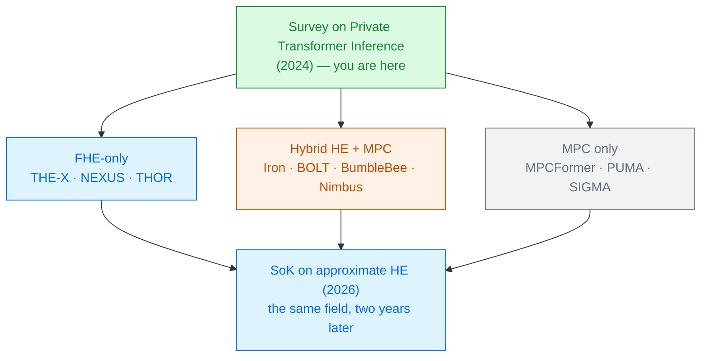

# A Survey on Private Transformer Inference

Yang Li · Xinyu Zhou · Yitong Wang · Liangxin Qian · Jun Zhao 
Nanyang Technological University · arXiv 2412.08145 · December 2024

It collects three years of work on running a transformer without either side giving up its secret,
and sorts it by the one choice that decides everything else: **who is in the room**.

Read the <a href="../primer-fhe-transformers/">Primer</a> first · PREMAL deck 1 of 60

---

# The problem, in plain words

a pharmacy that will read your prescription and hand back the right medicine — but it will not
let you see its recipe book, and you will not let it keep your prescription.

<v-clicks>

- The **client** has a private input $x$ — a message, a document, a patient record.
- The **server** has a model $\mathcal{M}$ that cost millions to train and is not for sharing.
- Both want the client to end up holding $\mathcal{M}(x)$, and nothing else to change hands.

</v-clicks>

Today's machine-learning-as-a-service does not do this. You upload the prompt in the clear and
trust the terms of service. The survey's opening example is Italy's temporary ban of ChatGPT
[§1].

---

# What you need to know first

Everything in the [Primer deck](../primer-fhe-transformers/) — ciphertexts, slots, depth,
bootstrapping — plus one new word.

<v-clicks>

**MPC (secure multi-party computation)** is the other way to hide a computation. Instead of
encrypting a value, you **split** it into shares. The client holds one share, the server holds the
other, and neither share alone means anything.

- Addition is nearly free: each side adds its own shares.
- Anything harder needs the two sides to **talk to each other** — that is a *round*.
- So MPC trades FHE's slow arithmetic for **network traffic and waiting**.

</v-clicks>

Almost every system in this survey is FHE, MPC, or a mix. The mix is the interesting part.

---

# The one big idea

Before you compare speeds, ask **how many parties the protocol assumes**. That single assumption
decides which operations are cheap, what the security promise is worth, and whether the system
could ever be deployed.

<strong class="ct">2PC</strong> client + server

🧑 ↔ 🖥️

Realistic. Matrix multiplication needs HE and becomes the bottleneck.

<strong class="ct">2PC-Dealer</strong> plus an offline helper

🧑 ↔ 🖥️ ⇠ 🎲

Helper ships randomness in advance. Matmul stops hurting; softmax is all that is left.

<strong class="ct">3PC</strong> three non-colluding servers

🖥️ 🖥️ 🖥️

Fastest numbers in the survey — and the strongest assumption.

The extra parties make the cryptography much cheaper — and the deployment story much harder [§4.2].

---

# Step 1 — where the time actually goes

A transformer has two kinds of layer, and both are awkward, for different reasons.

### Linear layers big

<v-clicks>

- **Large matrix × matrix** products, not the matrix × vector of older CNN work.
- Twelve blocks of them in BERT-Base.
- Under 2PC these need HE, and naive protocols are "unaffordable" [§4.1].

</v-clicks>

### Non-linear layers worse

<v-clicks>

- **Softmax**, **GELU**, **LayerNorm** — the survey's three chapters.
- CNN work only ever had to handle ReLU and max-pooling, which are far friendlier.
- These take **most of the total runtime**, for MPC and HE alike [§6].

</v-clicks>

The whole field is a fight over four operations. Nothing else is contested.

---

# Step 2 — the two ways to fake a non-linear function

<v-clicks>

**Polynomial approximation.** Fit a polynomial to the function over the range you expect.
FHE can evaluate it directly, so no messages are sent — but every extra degree costs
**depth**{.cost}, and the fit fails outside the range you planned for.

**Look-up tables (LUT).** Pre-agree a table of answers and have the two parties look up an entry
without either learning the index. Very fast — but the table has to be **communicated**{.cost},
so bandwidth explodes.

</v-clicks>

The survey states the trade-off plainly: LUTs "significantly reduce the computation time but
typically incur a higher communication overhead" [§6.1]. That one
sentence explains most of the disagreement between the papers in this collection.

A third option is to **not fake it** — change the model so the hard function is never there.
That is what MPCFormer's distillation and THE-X's retraining do, and they pay in accuracy.

---

# Step 3 — the same operator, priced three ways

One softmax over a $128 \times 128$ attention matrix — the survey's own comparison table:

<CostBars unit="MB" log :items="[
  { label: 'NEXUS (FHE-only)', value: 0.001, note: 'nearly communication-free', highlight: true },
  { label: 'SIGMA (LUT, 2PC-dealer)', value: 266 },
  { label: 'BumbleBee (hybrid)', value: 162 },
  { label: 'BOLT (hybrid)', value: 1448 },
  { label: 'Iron (hybrid)', value: 3596 },
]" caption="communication for ONE softmax, log scale — NEXUS's true value is 0 MB, drawn tiny so the bar is visible [Table 8]" />

Now the other half of the same table. NEXUS sends nothing — and takes **242 s** for that one
softmax. Iron sends 3.6 GB and takes **60 s** on a 3 Gbps link, but **1900 s** on a 100 Mbps one.
[Table 8]

---

# A tiny worked example — reading one row honestly

Take Iron's softmax row and follow the numbers [Table 8]:

<v-clicks>

- Input: one attention matrix, $128 \times 128$ — that is **16,384 numbers**.
- Communication: **3,596 MB**. So roughly **220 kB of network traffic per number**.
- On a 3 Gbps LAN that is **60 s**. On a 100 Mbps link the *same protocol* takes **1900 s**.

</v-clicks>

A hybrid system's speed is a property of the **network**, not of the algorithm. Move it to a real
internet connection and it is 30× slower. An FHE-only system does not care.

This is why the collection keeps score in two columns — seconds *and* bytes — and why a paper that
reports only one of them is hard to place.

---

# Threat model

Every system in the survey assumes the parties **follow the protocol** and only snoop
[§3].

| Party | Sees | Never sees |
|---|---|---|
| Client | its own input, the final answer | the model weights |
| Server | ciphertexts or shares, the model | the input, the answer |
| Network observer | message sizes and timing | contents |

<v-clicks>

- **Semi-honest** (almost everything here): parties are honest but curious. Nobody cheats.
- **Honest-majority** (PrivFormer, PPTIF): 3 parties, at most one misbehaves.

</v-clicks>

Two limits the survey is explicit about. Attacks that use only the **output** — model inversion,
membership inference — are **out of scope**: the protocol hands the client $\mathcal{M}(x)$ and
what they infer from it is their business [§2.1]. And the 2PC-Dealer and
3PC setups need a trusted dealer or non-colluding servers, which the survey itself calls
"sometimes considered unrealistic in practice" [§4.2].

---

# Results — one BERT-Base inference, end to end

<CostBars unit="s" log :items="[
  { label: 'PUMA (3PC)', value: 33.9, note: '10.8 GB · 5 Gbps' },
  { label: 'MPCFormer (2PC-dealer)', value: 55.3, note: '12.1 GB · 5 Gbps' },
  { label: 'BOLT (hybrid 2PC)', value: 185, note: '25.7 GB · 3 Gbps' },
  { label: 'Iron (hybrid 2PC)', value: 475, note: '281 GB · 3 Gbps' },
  { label: 'NEXUS (FHE-only)', value: 1125, note: '0.16 GB · 100 Mbps', highlight: true },
]" caption="Table 12 — every row on different hardware and a different network" />

Read the notes, not the bars. NEXUS is the slowest here and sends <strong>1,600× less data</strong>
than Iron — over a link 30× slower than anyone else's. The three parties are not competing in the
same event.

---

# What it costs — including the cost of trusting the table

<v-clicks>

- **PUMA looks fastest** because a third non-colluding server is doing the hard part. That
  assumption is the price, and it is not visible in the number.
- **Iron and BOLT need the client online** for the whole inference, on a fat link.
- **NEXUS asks for one message each way** and pays with an hour of server compute.

</v-clicks>

And one number to be careful with. Table 12 gives NEXUS **1125 s** for BERT-Base. The NEXUS paper
headlines **37.34 s** — because that is the *amortised* cost when **32 inputs are batched
together**, measured on its own hardware. Both numbers are honest. They answer different questions.
[Table 12; NEXUS Table VI]

Ask of every latency in this field: one input or many? whose network? which phase?

---

# What it does not solve

<v-clicks>

- **It is a catalogue, not a benchmark.** No system is re-run on common hardware, so no ranking in
  the paper is a fair comparison — and the survey says so.
- **It stops at 2024**, before the GPU work, encrypted KV caches, and the 2026 non-interactive
  systems that follow in this collection.
- **Training and fine-tuning are out of scope** — inference only. Module 5 covers the rest.
- **Attacks are out of scope.** Nothing here tells you whether the *answer* leaks the input.
- The arXiv version is rough: its concluding section is empty and several cross-references are
  unresolved. Use it as a reference table, not as a narrative.

</v-clicks>

None of this makes it less useful. It is the best available map of who tried what, and the
per-operator tables in §5 and §6 are worth more than the end-to-end ones.

---

# Where it sits

Start here for the taxonomy; go to the <a href="../sok-approx-he-llm-2026/">2026 SoK</a> for what survived.

---

# Key terms

<dl class="glossary">
<dt>Private inference</dt><dd>The server learns nothing about the input; the client learns nothing about the model beyond the answer.</dd>
<dt>MLaaS</dt><dd>Machine-learning-as-a-service — the arrangement this field is trying to replace.</dd>
<dt>MPC</dt><dd>Secure multi-party computation. Values are split into shares instead of encrypted.</dd>
<dt>Secret sharing</dt><dd>Splitting a value so that each share alone reveals nothing.</dd>
<dt>Round</dt><dd>One back-and-forth between client and server. Rounds cost latency, and there can be thousands.</dd>
<dt>2PC</dt><dd>Two-party: just the client and the server. The realistic setting, and the hardest.</dd>
<dt>2PC-Dealer</dt><dd>Two parties plus an offline helper that hands out correlated randomness in advance.</dd>
<dt>3PC</dt><dd>Three servers that are assumed not to collude with each other.</dd>
<dt>Semi-honest</dt><dd>Everyone follows the protocol exactly, but tries to learn what they can from what they see.</dd>
<dt>Honest-majority</dt><dd>Security holds as long as most parties behave.</dd>
<dt>Look-up table (LUT)</dt><dd>Precomputed answers, fetched obliviously. Fast to compute, expensive to send.</dd>
<dt>Amortised latency</dt><dd>Total time divided by the number of inputs processed together. Not the same as latency for one input.</dd>
</dl>

---

# Check yourself

**1. Two papers report BERT-Base inference: 33.9 s and 1125 s. Why might the slower one be the better system?**

<v-click>

Because the fast one (PUMA) assumes three non-colluding servers and sends 10.8 GB over a 5 Gbps
link, while the slow one (NEXUS) needs two parties, one message each way, and 0.16 GB over a
100 Mbps link. Latency alone hides the assumption and the bandwidth.

</v-click>

**2. Why does a look-up table make a protocol fast on a LAN and useless over the internet?**

<v-click>

The work moves from computation into communication. Iron's softmax takes 60 s on 3 Gbps and
1900 s on 100 Mbps — same protocol, same arithmetic, 30× the wall clock, because the bytes have
to cross a slower link.

</v-click>

**3. The survey groups papers by setup (2PC / dealer / 3PC) before grouping them by technique. Why is that the right order?**

<v-click>

Because the setup decides what is expensive. With a helper party, matrix multiplication stops
being a bottleneck and softmax becomes the whole problem; in plain 2PC, the matrix multiplications
need HE and dominate again. The technique is a consequence of the setup, not a free choice.

</v-click>

---
layout: center
---

# Where to go next

**The other half of the map**
[SoK: Private LLM Inference using Approximate HE (2026)](../sok-approx-he-llm-2026/) — the same
question asked two years later, with an honest scorecard.

**The systems this survey ranks**
[Iron](../iron-2022/) · [BOLT](../bolt-2023/) · [BumbleBee](../bumblebee-2023/) ·
[NEXUS](../nexus-2024/) · [PUMA](../puma-2023/) · [SIGMA](../sigma-2023/)

**If the per-operator tables were the interesting part**
[Power-Softmax](../power-softmax-2024/) for softmax ·
[Converting Transformers to Polynomial Form](../polynomial-transformers-2023/) for all four

← back to <a href="../../slides/">all decks</a>

