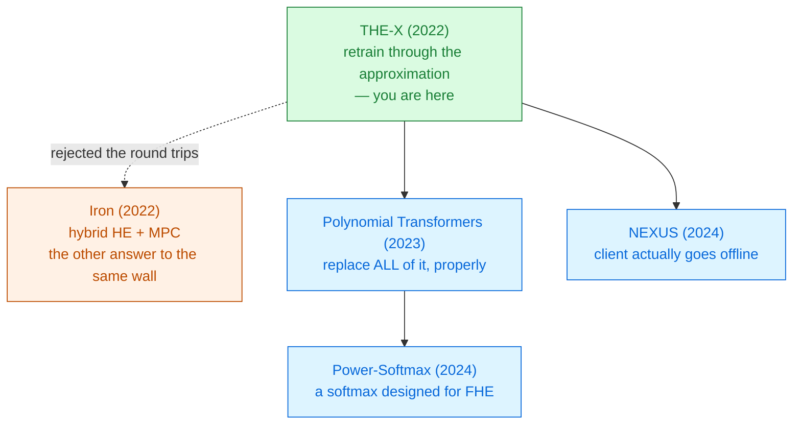

# THE-X

Tianyu Chen · Hangbo Bao · Shaohan Huang · Li Dong · Binxing Jiao · Daxin Jiang · Haoyi Zhou · Jianxin Li · Furu Wei 
Beihang University · Microsoft Research · Findings of ACL 2022 · arXiv 2206.00216

Do not approximate the transformer. **Retrain the transformer to accept the approximation** —
swap out every non-polynomial piece, then fine-tune the network until it stops minding.

Read the <a href="../primer-fhe-transformers/">Primer</a> first · Module 2 — FHE-native inference

---

# The problem, in plain words

posting a letter to a translator who works inside a sealed box. Addition and multiplication fit
through the slot. The word "maximum" does not.

<v-clicks>

- A fine-tuned BERT sits on someone else's cloud. You want its answer on your medical record.
- Homomorphic encryption gives you **addition and multiplication**{.ct} on ciphertexts, and nothing else.
- A transformer block contains **GELU**{.cost}, **softmax**{.cost} and **LayerNorm**{.cost} — an
  exponential, a division, and a square root. None of them is a polynomial.

</v-clicks>

So the pipeline stops at the first activation function. THE-X is the first attempt to get a whole
pre-trained transformer past that wall [§1].

---

# What you need to know first

Everything in the [Primer](../primer-fhe-transformers/) — ciphertexts, slots, depth. Then three
facts about *this* paper's setting.

<v-clicks>

- The backend is **Intel's HE-transformer for nGraph** over **Microsoft SEAL**, running **CKKS**.
  A 2019-era research tool, not a production stack [§2.2].
- The model is **BERT-tiny**: **2 layers, hidden size 128** [§4.2]. This
  is not BERT-Base, and the difference matters for every claim in the paper.
- **Knowledge distillation** — training a small or altered network to imitate the outputs of the
  original — is the tool that makes the swap survivable.

</v-clicks>

One more, and it is easy to miss: THE-X keeps a **ReLU**, and ReLU needs a maximum, which
homomorphic encryption cannot do. Hold that thought until slide 10.

---

# The one big idea

Every earlier attempt asked *"which polynomial best matches this function?"* THE-X asks a different
question: *"if I replace the function with something crude, can I **fine-tune the network** until
the crudeness stops mattering?"*

### The old question
Fit $\text{GELU}$ to within $\epsilon$ on $[-5, 5]$.
The network is fixed; the polynomial does the work.

High degree → deep circuit.

### THE-X's question
Put **ReLU**{.win} there instead and retrain.
The polynomial is crude; the **weights** do the work.

Shallow circuit, 1.48% accuracy lost.

The delta is the **workflow**, not any single approximation. Every piece THE-X uses was known;
what is new is training the model *through* the replacements, in a specific order.

---

# Step 1 — GELU becomes ReLU

$$G(x) = 0.5x\left(1+\tanh\left[\sqrt{2/\pi}\,(x+0.044715x^3)\right]\right)$$

<v-clicks>

- $\tanh$ is not a polynomial. Neither is the Gaussian it stands in for.
- But look at the two curves: outside a narrow band around zero, **GELU and ReLU agree**
  [Fig. 3].
- So THE-X does not fit GELU at all. It **deletes** GELU and puts ReLU in its place, then
  fine-tunes.

</v-clicks>

On the named-entity task this swap did not cost accuracy — it **gained** 0.12 F1
[Table 2].

The authors call the gain "unexpected bias" and do not explain it. Treat it as noise on a 2-layer
model, not as evidence that ReLU is better.

ReLU is $\max(0, x)$. A maximum is a **comparison**, and comparison is exactly what CKKS cannot do.
THE-X's answer is on slide 10, and it is the most consequential design decision in the paper.

---

# Step 2 — softmax becomes a tiny neural network

Softmax needs $\exp$ *and* a division. THE-X replaces both at once
[Eq. 4]:

$$S(x_i) = x_i \cdot T\!\left(\sum_j \text{ReLU}\left(\left(\tfrac{x_j}{2}+1\right)^{3}\right)\right)$$

<v-clicks>

- $\left(\tfrac{x}{2}+1\right)^{3}$, clipped at zero, is the **stand-in for $\exp$** — cheap, and
  exactly cubic in depth.
- $T$ is a **three-layer linear network** that learns the **reciprocal**, replacing the division.
  Trained for 100k steps to an MSE of $10^{-6}$ against real softmax scores on inputs in $[-3,3]$
  [§3.1.2].
- The numerator is $x_i$ itself — **not** the exponential stand-in. Remember that; slide 9 pulls on it.

</v-clicks>

The $\sqrt{d_k}$ scaling is folded into the query projection weights, so no division survives there
either [§3.1.4].

---

# Step 3 — LayerNorm becomes a scale and a shift

$$y=\frac{x-\mathbb{E}[x]}{\sqrt{\mathrm{Var}[x]+\epsilon}}\cdot\gamma+\beta
\qquad\Longrightarrow\qquad \hat{y}= x\circ\gamma' + \beta$$

<v-clicks>

- The mean and the variance both need a **division**, and the variance needs a **square root**.
  All three are gone.
- What is left is an element-wise multiply and an add — the two operations FHE has.
- $\gamma'$ is **learned by distillation**: freeze everything else, and train $\gamma'$ to minimise
  the mean-squared error against the *original* LayerNorm's output, layer by layer
  [Alg. 1, lines 6–11].

</v-clicks>

This is the expensive swap. Of THE-X's total 1.48% accuracy loss, **1.08% comes from LayerNorm
alone** — against **0.09%** for softmax [§4.3]. The scariest-looking
operator was not the costly one.

---

# Step 4 — the order of the surgery is itself a result

**THE-X's schedule** [Fig. 2]

1. Drop the pooler (it uses $\tanh$).
2. Replace GELU and softmax. **Keep** the real LayerNorm.
3. Fine-tune normally on the task.
4. *Now* add the LayerNorm approximation and distil into it, everything else frozen.
5. Drop the original LayerNorm. Compile to HE.

**Why not do it all at once?**

<v-clicks>

- The authors tried. Jointly fine-tuning the softmax estimator *and* the LayerNorm replacement is
  worse on every task [Fig. 6].
- On the STS-B regression task the joint schedule **collapses to 0.4%** — a total training failure,
  not a small regression [§4.6].
- Their diagnosis: two approximations learning at once is a **bi-level optimisation problem**, and
  neither converges.

</v-clicks>

Approximate one thing, retrain, then approximate the next. Sequence, not simultaneity.

---

# A tiny worked example — run the softmax stand-in by hand

Three attention scores: $x = [\,2,\; 0,\; -2\,]$. Work Equation 4 left to right.

<v-clicks>

- The $\exp$ stand-in, $\left(\tfrac{x}{2}+1\right)^{3}$, then ReLU:
  $\;2^{3}=8\;$, $\;1^{3}=1\;$, $\;0^{3}=0\;$ → mass $\Sigma = 9$.
- If $T$ has learned the reciprocal exactly, $T(9)=\tfrac{1}{9}=0.111$.
- Multiply by each $x_i$: $S = [\,0.222,\; 0,\; -0.222\,]$.
- Real softmax of the same input: $[\,0.867,\; 0.117,\; 0.016\,]$.

</v-clicks>

These are not close, and one "attention weight" is **negative**. Worse: because the numerator is
$x_i$, the three outputs sum to $T(\Sigma)\sum_i x_i = 0$, not to 1. It is not a probability
distribution and does not try to be. (Worked by hand from Eq. 4; the paper gives
no numeric example.)

And it still loses only **0.09%** accuracy. What the attention layer needs is not softmax — it is
*some* monotone re-weighting that the rest of the network can be trained against.

---

# Break it — the two numerical cliffs

### Masked positions −∞

Real transformers mask padding by setting scores to $-\infty$ before softmax.

<v-clicks>

- Put $-10^{9}$ into $\left(\tfrac{x}{2}+1\right)^{3}$ and you get $-10^{26}$. CKKS has a fixed
  scale; the ciphertext is ruined [§4.4].
- The paper's fix is empirical: mask with a value between **−2 and −5**.
- *Why that range works* — the cube's root is at $x=-2$, so ReLU zeroes **everything below −2**
  anyway. A mask of −4 contributes exactly the same zero mass as $-\infty$ would, without the
  overflow. (Our derivation; the paper reports the range, not the reason.)

</v-clicks>

### Attention overflow 10⁴

<v-clicks>

- Before normalisation, real attention scores are sparse and reach **$10^{4}$**
  [§4.5]. LayerNorm used to absorb that. A fixed $\gamma'$ cannot.
- The fix is **weight decay** in the Adam optimiser, used purely as a range regulariser.
- Turn it up and the approximation improves; turn it up further and NLI accuracy falls
  [Fig. 5]. It is a dial with a real optimum, not a free win.

</v-clicks>

Both cliffs come from the same place: **polynomials have no saturation**. Every function FHE can
evaluate grows without bound, so the *range* of the data becomes part of the design.

---

# Threat model — and the round trip the diagram hides

| Party | Sees | Never sees |
|---|---|---|
| Client | its own input, the final answer, **every ReLU input in the network** | the model weights |
| Server | ciphertexts, the model | the input, the answer |
| Network observer | message sizes and timing | contents |

Read Algorithm 2's step 4: *"client handles activation: $C_a = \text{ReLU}(C_i)$"*
[Alg. 2]. The client **decrypts** the pre-activation, takes the maximum in
the clear, and re-encrypts.

So THE-X is **not non-interactive**. Every ReLU — in the feed-forward block *and* inside each
softmax stand-in — is a round trip, and the paper neither counts them nor measures them. The user's
data stays safe; it is the **model owner** who loses, because the client now sees every
intermediate activation.

---

# Results — where the accuracy actually goes

Average performance drop on seven GLUE tasks, BERT-tiny, cumulative left to right:

<CostBars unit="% drop" :items="[
  { label: 'GELU → ReLU', value: 0.25, note: 'nearly free' },
  { label: '+ softmax estimator', value: 0.34, note: '+0.09' },
  { label: '+ LayerNorm swap', value: 1.42, note: '+1.08 — the real cost', highlight: true },
  { label: 'running under HE', value: 1.48, note: '+0.06 — the encryption itself is cheap' },
]" caption="Table 1, averaged over SST-2, MRPC, STS-B, QQP, MNLI, QNLI, RTE. Lower is better." />

<v-clicks>

- Worst single task: **STS-B**, a regression task, at **−4.44** Pearson correlation. Regression
  needs numerical precision that classification does not [§4.3].
- Named-entity recognition (CoNLL-2003): **−1.90 F1** [Table 2].

</v-clicks>

Now the column that is not in the paper: **there is no latency number, no memory number, and no
communication number anywhere in THE-X.** Not slower-than-plaintext, not seconds per token,
nothing. You cannot place it on any speed chart in this collection.

---

# What it costs

<v-clicks>

- **You must retrain.** THE-X is not a compiler you point at a checkpoint; it is a fine-tuning
  pipeline with a mandatory ordering, run per task.
- **The client works and waits.** One decrypt–ReLU–re-encrypt round per activation, for the whole
  inference.
- **The model owner leaks more.** Intermediate activations go to the client in usable form.
- **Accuracy, unevenly.** 0.18% on QNLI, 4.44% on STS-B. Which task you have decides whether
  1.48% "average" means anything.
- **Engineering debt.** Dense layers become full-kernel convolutions, matrix products become
  element-wise, the pooler is deleted, and PyTorch checkpoints must be converted to TensorFlow to
  reach the backend [§3.1.4].

</v-clicks>

---

# What it does not solve

<v-clicks>

- **Scale.** Everything is BERT-tiny — **2 layers, hidden 128**. The paper itself notes that
  LayerNorm error *"tends to accumulate when the transformer stacks with too many layers"*
  [§3.1.3], which is precisely the untested direction.
- **Interactivity.** The title promises inference with homomorphic encryption; Algorithm 2 delivers
  a hybrid protocol. Later work in this module removes the client entirely.
- **Cost, at all.** With no timing or bandwidth reported, "practical" is an unsupported word.
- **Generation.** Classification and token labelling only. No decoding, no KV cache, no autoregression.
- **Output-side attacks.** Membership inference and model inversion are out of scope, as everywhere
  in this literature.
- **CoLA** is excluded from the GLUE table — the authors cite BERT-tiny's limited capacity
  [Table 1, fn. 1]. A fair reason, but it is the hardest task in the set.

</v-clicks>

---

# Where it sits

Strategy <strong>A</strong> in the primer's three ways out — aspirationally. In practice it lands between A and B.

---

# Key terms

<dl class="glossary">
<dt>THE-X</dt><dd>The paper's workflow: replace GELU, softmax and LayerNorm, then fine-tune the network through the replacements.</dd>
<dt>Non-polynomial function</dt><dd>Anything FHE cannot express with adds and multiplies — exp, division, square root, maximum.</dd>
<dt>Knowledge distillation</dt><dd>Training a modified network to reproduce the original network's outputs, layer by layer.</dd>
<dt>LN-Distill</dt><dd>THE-X's second training stage, which fits the LayerNorm replacement to the real LayerNorm's outputs.</dd>
<dt>Softmax estimation network</dt><dd>The polynomial mass term plus the learned reciprocal $T$ that stands in for softmax.</dd>
<dt>Attention overflow</dt><dd>Pre-normalisation attention scores reaching ~10⁴, which the LayerNorm replacement cannot absorb.</dd>
<dt>Masked attention</dt><dd>Padding positions given a very negative score. −∞ breaks the polynomial stand-in.</dd>
<dt>Pooler</dt><dd>BERT's final tanh layer over the [CLS] token. Deleted, because tanh is not a polynomial.</dd>
<dt>BERT-tiny</dt><dd>A 2-layer, hidden-size-128 BERT. The only model THE-X was evaluated on.</dd>
</dl>

---

# Check yourself

**1. Softmax looks like the hardest operator to approximate, and LayerNorm looks like the easiest. THE-X's numbers say the opposite. Why?**

<v-click>

Softmax's *output* only has to preserve a usable ordering of the scores, and the network can be
fine-tuned around whatever shape it gets — hence 0.09%. LayerNorm's job is to **rescale the
activations**, and THE-X replaces a data-dependent rescaling with a *fixed* learned constant. It
therefore cannot adapt to the 10⁴-scale attention scores, and the error compounds through the
stack — hence 1.08%, and hence the weight-decay hack.

</v-click>

**2. THE-X reports 1.48% accuracy loss and no runtime at all. What should you conclude?**

<v-click>

That the paper answers "is it *possible*?" and not "is it *usable*?". This is a feasibility result
on a 2-layer model. Any comparison you see placing THE-X on a latency chart is importing the number
from somewhere else — check that source before trusting it.

</v-click>

**3. A colleague calls THE-X "the first non-interactive encrypted transformer". Correct them in one sentence.**

<v-click>

It is not non-interactive: the client decrypts and recomputes every ReLU, so it needs the client
online for a round trip per activation — NEXUS (2024) is the paper that removes that requirement,
by making the comparison itself homomorphic rather than shipping it to the client.

</v-click>

---
layout: center
---

# Where to go next

**If the crude replacements bothered you**
[Converting Transformers to Polynomial Form (2023)](../polynomial-transformers-2023/) — the same
idea done with real approximation theory instead of a ReLU and a shrug.

**If the softmax stand-in bothered you**
[Power-Softmax (2024)](../power-softmax-2024/) — a softmax replacement designed to be cheap under
encryption, rather than fitted after the fact.

**If the client round trips bothered you**
[NEXUS (2024)](../nexus-2024/) — one message each way, client offline. The paper that earns the
word "non-interactive".

**If you would rather embrace the round trips**
[Iron (2022)](../iron-2022/) — the other 2022 answer: keep the client online on purpose, and make
the protocol fast.

← back to <a href="../../slides/">all decks</a>

