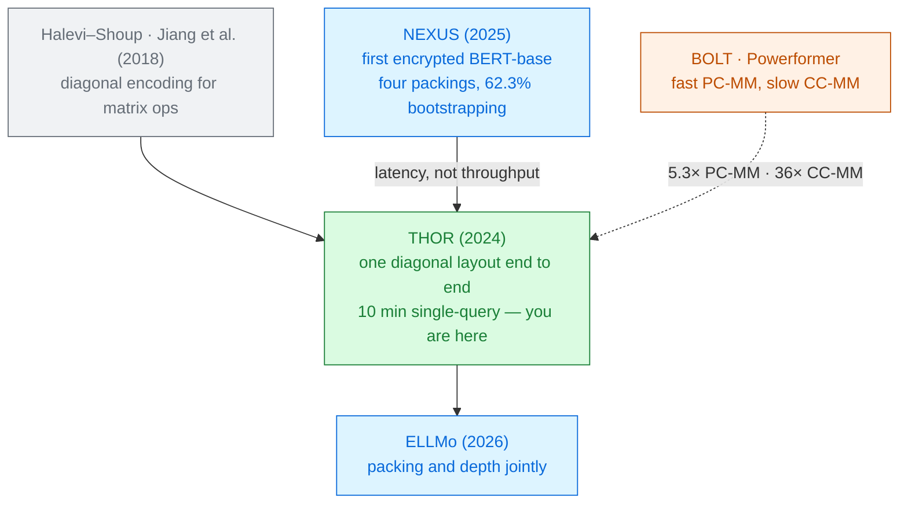

# THOR

Jungho Moon · Dongwoo Yoo · Xiaoqian Jiang · Miran Kim 
Hanyang University · Desilo · Yonsei University · UTHealth Houston · 2024

[NEXUS](../nexus-2024/) proved encrypted BERT was possible and then showed that two thirds of the
bill was **bootstrapping**. THOR attacks the thing that causes bootstrapping: it stores every matrix
along its **diagonals**, which makes multiplication, packing and the non-linear layers all use the
same format — and cuts a single query from hours to **ten minutes**.

Read the <a href="../primer-fhe-transformers/">Primer</a> and <a href="../nexus-2024/">NEXUS</a> first · Module 2

---

# The problem, in plain words

a warehouse where the shelves are the wrong shape for the boxes. Every time you move stock between
aisles you must repack it — and the repacking, not the moving, is what takes all day.

<v-clicks>

- After NEXUS, the non-linear functions are no longer the bottleneck. **Matrix multiplication and
  bootstrapping are.**
- Under CKKS, the only way to move data between slots is a **rotation**, and every rotation costs a
  **key switch**. Matrix multiplication is mostly rotations.
- Worse: different operations want different layouts. Row-major suits LayerNorm; something else
  suits the matmuls. Converting between them costs rotations too — and NEXUS uses four layouts
  without explaining the transitions between them [§1].

</v-clicks>

Pick **one** layout that every operation in a transformer can use, and the conversions disappear.

---

# What you need to know first

<v-clicks>

**Diagonals, indexed two ways.** For $A \in \mathbb{R}^{a\times b}$, the $k$-th **upper** diagonal is
$\mathcal{U}_k(A)[t] = A[t \bmod a,\; k+t \bmod b]$; the $\ell$-th **lower** diagonal is
$\mathcal{L}_\ell(B)[t] = B[\ell+t \bmod b,\; t \bmod c]$ [Def. 3.1].
Both wrap around, so a matrix is exactly its set of diagonals.

**Rotation preserves inner products.** $\langle a,b\rangle = \langle \rho^r(a), \rho^r(b)\rangle$
[Lemma 3.2] — a one-line fact that the entire paper rests on.

**Two kinds of matrix multiply**, and they cost differently:
**PC-MM** (plaintext × ciphertext) for weights, **CC-MM** (ciphertext × ciphertext) for $QK^\top$
and $\alpha V$.

</v-clicks>

And the budget: THOR's parameters give **13 multiplicative levels** before a bootstrap is needed
[§7.1] — where NEXUS had 21. Everything must fit in less room.

---

# The one big idea

$$\mathcal{L}_r(AB) \;=\; \sum_{\ell} \rho^{\,r}\!\left(\mathcal{U}_{\ell-r}(A)\right) \odot \mathcal{L}_\ell(B)$$

The $r$-th diagonal of a **product** is a sum of element-wise products of **rotated diagonals** of
the factors [Prop. 3.6]. Diagonals in, diagonals out — so the layout never
has to change.

<v-clicks>

- Every operation on the right is something CKKS does natively: a rotation, a multiply, an add.
- The output is already in the same encoding as the input, so the next layer starts immediately.
- And row-wise functions work on this encoding too — the $t$-th entries of the upper diagonals are
  row $t$, rotated by $t$ [Lemma 3.5, Remark 1]. Softmax and LayerNorm need
  no repacking either.

</v-clicks>

That last bullet is the delta. Diagonal encoding for matmul was known (Halevi–Shoup, Jiang et al.
2018). Making it carry the **non-linear** layers as well is what turns it into an end-to-end system.

---

# A tiny worked example — check the identity by hand

$A = \begin{pmatrix}1&2\\3&4\end{pmatrix}$, $B = \begin{pmatrix}5&6\\7&8\end{pmatrix}$,
so $AB = \begin{pmatrix}19&22\\43&50\end{pmatrix}$.

<v-clicks>

- Diagonals of $A$: $\;\mathcal{U}_0(A)=(1,4)$, $\;\mathcal{U}_1(A)=(2,3)$.
- Diagonals of $B$: $\;\mathcal{L}_0(B)=(5,8)$, $\;\mathcal{L}_1(B)=(7,6)$.
- **$r=0$:** $(1,4)\odot(5,8) + (2,3)\odot(7,6) = (5,32)+(14,18) = \mathbf{(19,50)}$ — which is
  $\big(AB[0,0],\,AB[1,1]\big)$. ✓
- **$r=1$:** rotate first. $\rho^1(\mathcal{U}_1(A))=(3,2)$ and $\rho^1(\mathcal{U}_0(A))=(4,1)$, so
  $(3,2)\odot(5,8) + (4,1)\odot(7,6) = (15,16)+(28,6) = \mathbf{(43,22)}$ — which is
  $\big(AB[1,0],\,AB[0,1]\big)$. ✓

</v-clicks>

Two rotations, four multiplies, two adds — and a full matrix product, never leaving the diagonal
form. Scale $n$ from 2 to 768 and the shape of the computation is identical.

Worked here from Prop. 3.6; the paper illustrates n = 3 in Fig. 1 without numbers.

---

# Step 2 — fill the ciphertext

A BERT diagonal is 128 long. A ciphertext holds **32,768** slots. Encrypting one diagonal per
ciphertext wastes 99.6% of it.

<v-clicks>

- **Interlace across heads.** The $\ell$-th lower diagonals of all $H$ head matrices are woven into
  one vector: $\mathcal{L}_\ell(A)[t] = \mathcal{L}_\ell(A^{(t \bmod H)})[\lfloor t/H \rfloor]$.
  One operation now serves every head at once.

</v-clicks>

<SlotGrid :values="['h0','h1','h2','h3','h0','h1','h2','h3']" label="one ciphertext: diagonal ℓ, interlaced across 4 heads" :total-slots="32768" />

<v-clicks>

- **Then concatenate.** Several interlaced diagonals are laid end to end until the ciphertext is
  full: $\widehat{\mathcal{L}}_j(A) = (\mathcal{L}_{cj}\,|\,\mathcal{L}_{cj+1}\,|\dots)$
  [Eq. 7].
- The result: multi-head attention is not twelve computations, it is one computation on a full
  ciphertext.

</v-clicks>

---

# Step 3 — two ways to not pay for a rotation

### Rotate the plaintext instead PC-MM

<v-clicks>

- Computing $Q = XW$ from encrypted diagonals of $X$ needs $n^2$ **ciphertext** rotations
  [§6.2.1].
- Compute $Q^\top = W^\top X^\top$ instead. Now the rotations land on $W^\top$, which is
  **plaintext** — and rotating a plaintext is free.
- So THOR keeps everything **transposed** throughout the network. A change of convention, not of
  algorithm.

</v-clicks>

### Defer them CC-MM

<v-clicks>

- When both operands are encrypted, no plaintext trick is available.
- **Baby-step giant-step**: instead of rotating each input before multiplying, accumulate partial
  sums and rotate the *accumulator* once.
- Key switches for $\mathbb{R}^{m\times n}\times\mathbb{R}^{n\times n}$ drop by a factor of $2s/n$,
  where $s$ is the slot count [§1.1].

</v-clicks>

Both moves are the same idea: a rotation's cost is a key switch, so move the rotations to where
there are fewer of them, or to where they are free.

---

# Step 4 — softmax by square-and-normalize

Exponentials over a wide range are hopeless to fit directly. THOR's inputs, measured on real MRPC
data, span $[-44.19,\, 50.25]$ [§7.2.2].

<v-clicks>

- **Shrink the problem.** Divide the (shifted) scores by $\delta_1\delta_2$ so they land in a narrow
  interval, fit $e^{x}$ there with a **low-degree** polynomial, and raise the result to the
  $\delta_1$-th power. Normalise with Goldschmidt's inverse.
- **Grow it back.** Because $\text{Softmax}(2x)_i = y_i^2 / \sum_j y_j^2$, squaring and re-normalising
  **doubles the effective input range** each round. $\log \delta_2$ rounds recover the true softmax
  [Alg. 3].
- **Converge faster.** Goldschmidt's update $x(2-x)$ becomes $k_i x_i(2-k_i x_i)$ with an adaptive
  relaxation factor $k_i = 2/(1+\epsilon_i)$ — the aSOR method.

</v-clicks>

Against Cho et al. (CCS '24), which needs 7 normalize-and-square steps: THOR needs **3**, with
$\delta_0=11.805$, $\delta_1=2$, $\delta_2=4$. Since each round costs one bootstrap, that is
**8 bootstraps → 3**, and a **2.64×** speedup [Table 5].

---

# The precision this buys, and what it costs

Same task — 256 softmax operations of dimension 128 [Table 5]:

| Method | Iters | Mults | Rots | **Bootstraps** | Total | Amortised | **Precision** |
|---|---|---|---|---|---|---|---|
| Cho et al. (CCS '24) | 7 | 53 | 49 | **8** | 9.78 s | 38.2 ms | **−16.96 bits** |
| THOR | 3 | 38 | 21 | **3** | 3.70 s | 14.5 ms | **−14.19 bits** |

<v-clicks>

- The paper is candid about where the win comes from: softmax evaluation itself is *"below 3%"* of
  the runtime in **both** methods. The 2.64× is **entirely** the five bootstraps that were avoided
  [§7.2.2].
- And it is a trade, not a free lunch: THOR's answer is **2.8 bits less precise**. Fewer refresh
  rounds means less refreshing.

</v-clicks>

When you read "2.64× faster softmax" in this literature, the number is almost never about the
softmax. Count the bootstraps.

---

# Step 5 — GELU as a composition, and the depth budget

Everyone else evaluates GELU **piecewise**: three sign operations to pick a branch, then a
polynomial. THOR composes two instead — $f_2(f_1(x))$, a least-squares fit followed by a residual
correction [§5.2].

<DepthBar :total="13" :steps="[
  { label: 'THOR GELU — deg 31 ∘ deg 27, Paterson–Stockmeyer', cost: 11, expensive: true },
  { label: 'bootstrap', bootstrap: true },
]" caption="13 levels are available before bootstrapping under THOR's parameters [§7.1]" />

<v-clicks>

- THOR: **39 multiplications, depth 11**. NEXUS: **56 multiplications, depth 14**.
- Look at the bar: NEXUS's GELU would not *fit*. Depth 14 does not go into 13 levels. The
  approximation and the parameter set have to be designed together.
- The same two-step trick handles **Tanh** (two degree-15 polynomials) — needed because THOR keeps
  BERT's pooler, which [THE-X](../thex-2022/) simply deleted.

</v-clicks>

---

# Threat model

Two parties: a service provider holding a fine-tuned model, and a client. The server is
**honest-but-curious** [§6.1].

| Party | Sees | Never sees |
|---|---|---|
| Client | its own input, the final answer | the model weights |
| Server | one ciphertext, the model | the input, the answer |
| Network observer | two messages | contents |

The client computes the **embeddings itself** from the tokenised sentence, then encrypts — so the
embedding table is assumed public [§6.2]. Security rests on Ring-LWE.

A CKKS subtlety worth knowing: the scheme is vulnerable to a **key-recovery attack** when an
adversary sees decrypted approximate results, because the noise leaks the secret key. THOR is safe
*because* decryption output goes only to the key owner [§6.1] — a property
of the protocol, not of the scheme.

---

# Results — matrix multiplication, then the whole model

### Micro-benchmarks [§7.2.1]

| Operation | vs BOLT | vs Powerformer |
|---|---|---|
| PC-MM $768{\times}768 \cdot 768{\times}128$ | **5.3×** | **11.2×** |
| CC-MM $12\times(64{\times}128 \cdot 128{\times}128)$ | **36.0×** | **9.7×** |

BOLT is fast at PC-MM because it was designed for it, and slow at CC-MM because it was minimising
*depth* for an MPC setting, not time [§1.2.1].

### End to end — BERT-base, 128 tokens, one A100

<CostBars unit="s" :items="[
  { label: 'Bootstrapping', value: 337.9, note: '56.1%', highlight: true },
  { label: 'Linear layers (attention + FC)', value: 205.5, note: '34.1%' },
  { label: 'Softmax · GELU · LayerNorm · pooler', value: 58.8, note: '9.8%' },
]" caption="Table 6 — the components sum exactly to the 602.26 s (10.04 min) total" />

**10.04 minutes for one query, one GPU, no batching.** Bootstrapping is still the majority — down
from NEXUS's 62.3% to 56.1%, but not dethroned.

---

# The comparison to read carefully

THOR reports 10.04 minutes. NEXUS's headline is 37.3 seconds. Both are true.

<v-clicks>

- NEXUS's 37.3 s is **throughput**: amortised over 32 batched inputs, on **four** A100s.
- THOR reconstructs NEXUS's **latency** instead: NEXUS bootstraps before and after each LayerNorm,
  $4\times11+3 = 47$ stages; row-wise encryption of a $128\times768$ matrix makes each stage
  **128** bootstraps, so $47\times128 = 6016$ in total. At 1.02 s each in THOR's library that is
  **1.7 hours** — and since NEXUS reports bootstrapping as 62.3% of its runtime, about **2.7 hours**
  for a single prediction [§7.3.1].

</v-clicks>

Hold this loosely. It is an **estimate of someone else's system**, computed on THOR's hardware with
THOR's library, by an author with an interest in the answer. What is solid is the *structural*
claim: NEXUS is optimised for throughput and THOR for latency, and a batched amortised number
cannot be compared with a single-query number.

Always ask: is this latency or throughput? How many inputs, and how many GPUs?

---

# Results — accuracy, and a surprise

GLUE, BERT-base [Table 7]. Columns add one approximation at a time:
**G** = GELU, **LN** = LayerNorm, **S** = softmax.

| Dataset | Baseline | G | G-LN | G-LN-S | **Encrypted** |
|---|---|---|---|---|---|
| MRPC (acc) | 85.29 | 85.54 | 85.54 | **85.78** | 84.80 |
| RTE (acc) | 72.20 | 71.48 | 71.84 | 72.20 | 71.12 |
| SST-2 (acc) | 91.51 | 91.40 | 91.40 | **91.63** | 90.71 |

<v-clicks>

- The fully approximated model in **plaintext** is *better than the baseline* on two of three tasks.
  The approximations are not the problem.
- The loss — about **1 point** — appears only in the last column. The authors attribute it to
  *"computational error introduced by homomorphic operations"* rather than to approximation
  [§7.3.2].

</v-clicks>

Read the second bullet sceptically: gains of +0.27 and +0.12 on 408 and 872 test examples are
inside the noise. The safe conclusion is that the approximations are **free**, not that they help.

---

# What it costs

<v-clicks>

- **A tighter depth budget.** 13 usable levels means every operator must be redesigned to fit; a
  depth-14 GELU is simply unavailable.
- **Divisibility conditions everywhere.** $n$ divisible by $m$, slot count divisible by $nH$, $c$
  divides $m$. The packing is elegant when the dimensions cooperate.
- **Softmax precision**, traded down 2.8 bits for five fewer bootstraps.
- **A GPU.** All results are on an NVIDIA A100; there is no CPU number to compare with anyone.
- **Ten minutes**, which is still ten minutes — about $10^{4}$× a plaintext forward pass.
- **A public embedding table**, since the client computes embeddings before encrypting.

</v-clicks>

---

# What it does not solve

<v-clicks>

- **Generation.** BERT-base **encoder** only, evaluated on three classification tasks. No decoder,
  no KV cache, no autoregression.
- **Scale.** 12 layers, $d=768$, 128 tokens. No LLM, and no long-context result — CC-MM cost grows
  with the square of sequence length.
- **Bootstrapping, still.** 56.1% of the runtime. Reduced, not solved — [ELLMo](../ellmo-2026/)
  treats depth and packing as one joint problem for exactly this reason.
- **Batching.** THOR optimises single-query latency; NEXUS optimises throughput. Neither does both,
  and the paper does not report THOR's amortised cost under batching.
- **The comparison to NEXUS is reconstructed**, not measured.
- **Malicious servers**, output-side attacks, and anything about the model owner's privacy beyond
  keeping the weights on the server.

</v-clicks>

---

# Where it sits

Primer strategy <strong>A</strong> — and, like NEXUS, no retraining: the weights are a normally fine-tuned BERT.

---

# Key terms

<dl class="glossary">
<dt>Diagonal-major encoding</dt><dd>Storing a matrix as its wrapped diagonals rather than its rows or columns.</dd>
<dt>Upper / lower diagonal</dt><dd>The two indexing conventions THOR needs; a product's lower diagonals come from one factor's upper and the other's lower.</dd>
<dt>PC-MM / CC-MM</dt><dd>Plaintext-ciphertext and ciphertext-ciphertext matrix multiplication. Different costs, different tricks.</dd>
<dt>Key switching</dt><dd>The expensive step inside every rotation and every ciphertext multiply. The real unit of cost.</dd>
<dt>Baby-step giant-step</dt><dd>Restructuring a sum so rotations apply to accumulated results rather than to each input.</dd>
<dt>Multi-diagonal batched encoding</dt><dd>Interlacing the same diagonal from every attention head into one ciphertext, then concatenating to fill it.</dd>
<dt>Square-and-normalize</dt><dd>Doubling softmax's effective input range each round, using Softmax(2x) = y²/Σy².</dd>
<dt>aSOR</dt><dd>Adaptive successive over-relaxation — a tuned multiplier that makes Goldschmidt's iteration converge in fewer rounds.</dd>
<dt>Paterson–Stockmeyer</dt><dd>Evaluating a degree-d polynomial in about √d multiplications instead of d.</dd>
<dt>Liberate.FHE</dt><dd>Desilo's GPU RNS-CKKS library. THOR's runtime.</dd>
</dl>

---

# Check yourself

**1. THOR's softmax is 2.64× faster than Cho et al.'s, yet the paper says softmax is under 3% of runtime in both. How can both be true?**

<v-click>

Because the cost being measured is not arithmetic, it is **bootstrapping**. Cho's method needs seven
normalize-and-square rounds, each costing a refresh; THOR's needs three. The speedup is five
bootstraps not happening. This is the single most useful habit in reading this literature: when a
paper claims a faster operator, look for whether it changed the *depth*, not the *formula*.

</v-click>

**2. Why does THOR compute $Q^\top = W^\top X^\top$ instead of $Q = XW$?**

<v-click>

Both are the same product. But the diagonal algorithm rotates one of the operands, and in the first
form that operand is the **plaintext weight matrix** — rotating a plaintext is a free re-indexing,
while rotating a ciphertext costs a key switch. It removes $n^2$ ciphertext rotations by changing
which side is transposed.

</v-click>

**3. NEXUS reports 37.3 s and THOR reports 602 s. Is THOR slower?**

<v-click>

No — they measure different things. NEXUS's figure is amortised over 32 batched inputs on four
A100s; THOR's is one query on one A100 with no batching. THOR estimates NEXUS's single-query
latency at 2.7 hours. Neither paper reports the other's metric, so the honest statement is that
NEXUS optimises throughput, THOR optimises latency, and nobody has measured both on one machine.

</v-click>

---
layout: center
---

# Where to go next

**The system THOR is answering**
[NEXUS (2025)](../nexus-2024/) — the first encrypted BERT-base, and the source of the
62.3%-bootstrapping observation that motivates this paper.

**The next step on the same axis**
[ELLMo (2026)](../ellmo-2026/) — packing and depth optimised jointly rather than in sequence ·
[STIP (2026)](../stip-2026/) for compact packing.

**The other way to spend less on bootstrapping**
[PowerSoftmax (2024)](../power-softmax-2024/) — change the operator so it consumes less depth in the
first place.

**The interactive baselines in the micro-benchmarks**
[BOLT (2023)](../bolt-2023/) — and why a protocol tuned for low depth is not tuned for low time.

← back to <a href="../../slides/">all decks</a>

