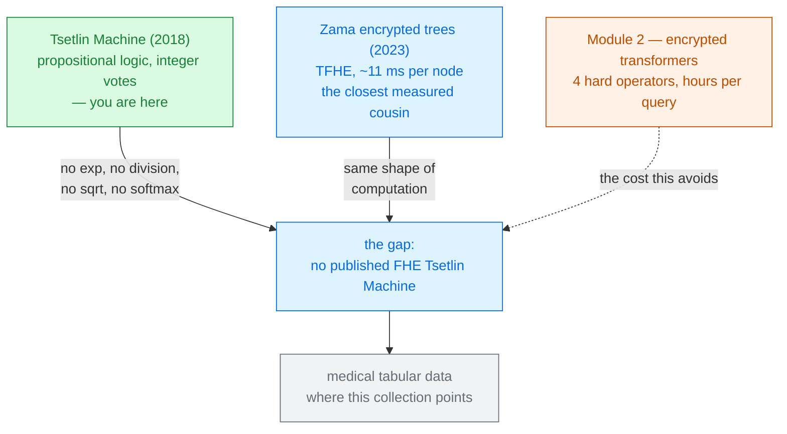

# Tsetlin Machines

<div style="font-size:1.05rem; margin-top:0.3rem">and whether FHE fits them</div>

<div style="font-size:0.9rem; margin-top:0.8rem" class="pt">
The model: Ole-Christoffer Granmo, University of Agder · <a href="https://tsetlinmachine.org/">tsetlinmachine.org</a><br>
The FHE analysis: PREMAL, 2026 — not from any paper
</div>

<div class="big-idea" style="margin-top:1.2rem; text-align:left">

A Tsetlin Machine learns **AND-rules over binary features** and adds up their votes. No exponential,
no division, no square root, no softmax — the four operators that make encrypted transformers cost
hours are **all absent by construction**.

</div>

<div class="warn" style="margin-top:0.6rem; text-align:left; font-size:0.85rem">

Nobody has published an FHE Tsetlin Machine. Slides 1–13 are established work with citations;
slides 14–23 are **our analysis**, and are marked as such.

</div>

---

# The problem, in plain words

<div class="analogy">

everything in this collection so far has been trying to teach a machine to do calculus while wearing
oven gloves. This deck asks what happens if the task is only ever addition and logic.

</div>

<v-clicks>

- The [Primer](../primer-fhe-transformers/) named **four hard operators**: softmax, LayerNorm, GELU,
  and ciphertext × ciphertext attention. Twelve decks of this collection are fights with those four.
- Every fight costs the same currency: **multiplicative depth**, and therefore **bootstrapping** —
  62% of NEXUS's runtime, 56% of THOR's, 81% of STIP's.
- So a fair question: is there a model class whose native arithmetic is **already** the arithmetic
  that FHE provides cheaply?

</v-clicks>

<div v-click class="big-idea">

There is one, it is thirty years old in its parts and eight years old as a machine, and it comes
from Norway.

</div>

---

# What you need to know first

Almost nothing — which is the point.

<v-clicks>

- **Propositional logic**: AND, OR, NOT over true/false variables. That is the entire mathematics of
  a Tsetlin Machine.
- **A learning automaton** (Mikhail Tsetlin, 1961): a finite state machine that walks up and down a
  ladder of states, and whose *action* depends only on which half of the ladder it is standing on.
  Reward it and it walks deeper into its current half; penalise it and it walks toward the middle,
  and eventually flips.
- From FHE you need only two facts: **addition of ciphertexts is nearly free**, and
  **multiplication is what costs depth**.

</v-clicks>

<div v-click class="note">

No gradients, no backpropagation, no floating point anywhere. A Tsetlin Machine is trained by a
crowd of tiny state machines each voting on one question: *should my literal be in this rule?*

</div>

---
layout: center
---

# Part 1

## What a Tsetlin Machine is

<div class="pt" style="margin-top:0.5rem; font-size:0.9rem">Established work · Granmo 2018 and after</div>

---

# The one big idea

<div class="big-idea">

A neural network learns **a weight for every feature**. A Tsetlin Machine learns **a rule made of
features** — and then learns a few hundred more rules, half of them arguing for the answer and half
against.

</div>

<div class="grid grid-cols-2 gap-5" style="margin-top:0.8rem; font-size:0.9rem">
<div>

### A neuron
$$\sigma\!\left(\textstyle\sum_k w_k x_k + b\right)$$
Real weights, a non-linearity, gradients. Every input contributes a little.

<span class="cost">Needs multiplication and a transcendental function.</span>

</div>
<div>

### A clause
$$C_j = \textstyle\bigwedge_{k \in I_j} l_k$$
A conjunction of a chosen subset of literals. It either fires or it does not.

<span class="win">Needs AND. That is all.</span>

</div>
</div>

<div v-click class="note" style="margin-top:0.4rem">

And you can **read** a clause. `IF humidity_high AND NOT temp_low THEN class=1` is the model, not an
explanation of the model. Interpretability is the reason the machine exists
<span class="src">[Granmo, arXiv:1804.01508]</span>.

</div>

---

# Step 1 — the automaton that decides one bit

Each literal in each clause has its own **Tsetlin Automaton**: a $2N$-state ladder
<span class="src">[arXiv:1804.01508, §2]</span>.

<v-clicks>

- States $1 \dots N$ mean **Exclude** this literal. States $N{+}1 \dots 2N$ mean **Include** it.
- **Reward** → step *away* from the middle, deeper into the current decision.
- **Penalty** → step *toward* the middle, and past it if you were already at the boundary.
- So a decision that keeps being useful becomes hard to dislodge; one that keeps being wrong flips
  after a few penalties. $N$ sets how much evidence it takes to change its mind.

</v-clicks>

<div v-click class="big-idea" style="margin-top:0.4rem">

This is the whole learning mechanism. A clause with 1,568 literals is 1,568 of these ladders, and a
machine with 2,000 clauses is about three million of them — each doing nothing but counting to $N$.

</div>

---

# Step 2 — literals, and why negation is free

<v-clicks>

Input is a Boolean vector: $X = (x_1,\dots,x_o) \in \{0,1\}^o$.

The **literal set** doubles it — every feature and its negation
<span class="src">[arXiv:1804.01508, §3]</span>:

$$L = \{x_1,\dots,x_o,\; \bar{x}_1,\dots,\bar{x}_o\}, \qquad \bar{x}_k = 1 - x_k$$

- That $1 - x_k$ is worth staring at. **Negation is a subtraction**, not a gate. Remember it — on
  slide 16 it is the reason encrypted NOT costs nothing.
- A clause is an AND over the literals its automata chose to include:
  $C_j(X) = \bigwedge_{l_k \in L_j} l_k$.
- Edge case worth knowing: an **empty** clause outputs 1 during learning and 0 during
  classification — so a machine that has learned nothing yet predicts nothing.

</v-clicks>

---

# Step 3 — half the clauses argue against

Clauses are given **polarity**. Half vote for the class, half vote against
<span class="src">[arXiv:1804.01508, §3]</span>:

$$\hat{y} \;=\; u\!\left(\sum_{j=1}^{n/2} C^{1}_j(X) \;-\; \sum_{j=1}^{n/2} C^{0}_j(X)\right)$$

where $u$ is the unit step.

<v-clicks>

- The positive clauses recognise the pattern; the negative clauses recognise reasons it *is not* the
  pattern. Neither alone is enough.
- This is what lets a TM represent **XOR** — which a single layer of weights famously cannot.
- The vote sum $v$ is a small integer. Not a probability, not a logit. Just a count.

</v-clicks>

<div v-click class="note" style="margin-top:0.3rem">

Multi-class works by running one such vote per class and taking the argmax. Later variants
(**Coalesced TM**) share one clause pool across all classes with per-class weights, which is how the
clause count comes down.

</div>

---

# A tiny worked example — XOR, by hand

Two features. XOR fires when they differ. Four clauses do it **exactly** — no approximation, no
training noise.

<div style="font-size:0.9rem">

Positive: $\;C_1 = x_1 \wedge \bar{x}_2$, $\;C_2 = \bar{x}_1 \wedge x_2$ &nbsp;&nbsp;|&nbsp;&nbsp;
Negative: $\;C_3 = x_1 \wedge x_2$, $\;C_4 = \bar{x}_1 \wedge \bar{x}_2$

</div>

<v-clicks>

<div style="font-size:0.86rem">

| $x_1,x_2$ | $C_1$ | $C_2$ | $C_3$ | $C_4$ | $v = C_1{+}C_2{-}C_3{-}C_4$ | $\hat y$ | XOR |
|---|---|---|---|---|---|---|---|
| 1, 0 | **1** | 0 | 0 | 0 | $+1$ | 1 | 1 ✓ |
| 0, 1 | 0 | **1** | 0 | 0 | $+1$ | 1 | 1 ✓ |
| 1, 1 | 0 | 0 | **1** | 0 | $-1$ | 0 | 0 ✓ |
| 0, 0 | 0 | 0 | 0 | **1** | $-1$ | 0 | 0 ✓ |

</div>

- Four rows, four rules, four correct answers. The model **is** the table's second-to-last column.
- Noisy XOR is the canonical TM demo, and the paper proves convergence on it
  <span class="src">[arXiv:1804.01508]</span>.

</v-clicks>

<div v-click class="big-idea" style="margin-top:0.2rem">

Hold this example. On slide 17 we run exactly it under encryption.

</div>

---

# Step 4 — how it learns, in two moves

No gradient. Each clause is told to do one of two things
<span class="src">[arXiv:1804.01508, §4]</span>:

<div class="grid grid-cols-2 gap-5" style="font-size:0.88rem">
<div>

### Type I — fight false negatives
Given to clauses when the true class is present.

<v-clicks>

- If the clause **already fires**, reinforce the literals that made it fire — and *add* more, making
  the rule more specific.
- Probabilities are governed by $s$: $P(\text{reward}) = \frac{s-1}{s}$,
  $P(\text{inaction}) = \frac{1}{s}$. Large $s$ → finer, longer rules.

</v-clicks>

</div>
<div>

### Type II — fight false positives
Given to clauses that fire when they should not.

<v-clicks>

- Penalise the *excluded* literals whose value is 0. Sooner or later one gets included — and the
  clause stops firing on this input.
- No randomness here. It is pure discrimination.

</v-clicks>

</div>
</div>

<div v-click class="big-idea" style="margin-top:0.3rem">

And a resource allocator on top. A clause is only updated with probability
$\;P = \frac{T - \text{clip}(v,-T,T)}{2T}$ — so once $T$ clauses already vote correctly for a
pattern, the rest are **left alone to learn something else**. $T$ is how the machine spreads itself
across sub-patterns.

</div>

---

# Break it — where a Tsetlin Machine stops working

<v-clicks>

- **Your data must be Boolean.** Real-valued features need thresholding, and *how* you booleanise is
  a modelling decision that lives outside the machine. Get it wrong and nothing downstream saves you.
- **Clauses grow.** Left unconstrained, large clause pools *"tend to produce clauses with many
  literals"*, which costs interpretability and power <span class="src">[arXiv:2301.08190]</span>.
- **The clause budget is the model capacity.** Too few and it underfits; too many and you have
  thousands of near-duplicate rules — the motivation for every efficiency variant since.
- **Strict AND is brittle.** One flipped bit disqualifies an entire clause from voting. That
  "all-or-nothing" rigidity *"imposes a significant scalability challenge"*
  <span class="src">[arXiv:2508.08350, §1]</span>.

</v-clicks>

<div v-click class="note" style="margin-top:0.3rem">

Each of these produced a variant: clause-size constraints, weighted and coalesced clauses, and
fuzzy-pattern clauses. The next slide is the map.

</div>

---
layout: center
---

# Part 2

## How to use one

<div class="pt" style="margin-top:0.5rem; font-size:0.9rem">Software, variants, and where the accuracy actually is</div>

---

# The variants, and which knob each one turns

<div style="font-size:0.82rem">

| Variant | What it adds | Why it matters here |
|---|---|---|
| **Convolutional TM** <span class="src">[1905.09688]</span> | clauses evaluated over image patches | 99.4% on MNIST |
| **Weighted TM** <span class="src">[1911.12607]</span> | an integer weight per clause | fewer clauses for the same accuracy |
| **Coalesced TM** | one clause pool shared by all classes | fewer clauses again |
| **Clause-size constrained** <span class="src">[2301.08190]</span> | a soft cap on literals per clause | *"accuracy with up to 80× fewer literals"* |
| **Fuzzy-Pattern TM** <span class="src">[2508.08350]</span> | a clause votes *proportionally* to how many literals matched | 1 clause per class on IMDb |
| **Regression / Autoencoder / Graph TM** | other output types and structures | beyond classification |

</div>

<div v-click class="big-idea" style="margin-top:0.4rem">

Notice what every efficiency variant optimises: **the number of clauses**, and **the number of
literals per clause**. Those two numbers are also — exactly — what an FHE implementation would pay
for. Part 3 is about that coincidence.

</div>

---

# Using one takes four lines

<div style="font-size:0.9rem">

```python
pip install pyTsetlinMachine        # github.com/cair/pyTsetlinMachine
#  or:  github.com/cair/tmu         # TMU — CUDA, Coalesced TM, autoencoder, literal budget
```

```python
from pyTsetlinMachine.tm import MultiClassTsetlinMachine

# X must be 0/1. Booleanising your data is your job, and it is the real work.
tm = MultiClassTsetlinMachine(number_of_clauses=10, T=15, s=3.9)
tm.fit(X_train, y_train, epochs=200)
y_hat = tm.predict(X_test)
```

</div>

<v-clicks>

- **Three hyperparameters**, and you have already met all three: clause count (capacity), $T$
  (how many clauses to spend per pattern), $s$ (how specific each rule becomes).
- After fitting you can **print the clauses**. `tm.ta_action(clause, literal)` tells you whether
  literal $k$ is in clause $j$ — the model in readable form.
- Granmo's free book at [tsetlinmachine.org](https://tsetlinmachine.org/) works through chapters on
  classification, convolution and composites, with notebooks.

</v-clicks>

<div v-click class="warn" style="margin-top:0.2rem">

The four lines are easy. The **booleanisation** is where the accuracy is won or lost, and no library
does it for you.

</div>

---

# Where Tsetlin Machines actually stand

<div style="font-size:0.82rem">

| Task | Tsetlin Machine | Best comparison in the paper | Verdict |
|---|---|---|---|
| MNIST | **99.4%** (Convolutional TM) <span class="src">[1905.09688]</span> | CNNs reach ~99.8% | competitive, not ahead |
| Fashion-MNIST | **94.68%** (FPTM, 8000 clauses/class) <span class="src">[2508.08350]</span> | Composite Conv. TM 93.00% | strong |
| Fashion-MNIST | **93.19%** with **20 clauses/class** | same 93.00% needed **8000** | ~400× fewer clauses |
| IMDb sentiment | **90.15%** with **1 clause/class** <span class="src">[2508.08350]</span> | Weighted CoTM 90.18% (~50 clauses) | 50× fewer, same accuracy |
| Amazon Sales, 20% label noise | **85.22%** | Graph TM 78.17%, Graph CNN 66.23% | clearly ahead |

</div>

<v-clicks>

- **Honest summary:** competitive on tabular data, images and noisy labels; **behind transformers on
  language** — IMDb at 90% is well short of a fine-tuned BERT.
- The reason to care is not raw accuracy. It is **99.4% MNIST from a model made of AND-gates**, at
  8.6 nJ per frame in silicon <span class="src">[arXiv:2501.19347]</span>.

</v-clicks>

---
layout: center
---

# Part 3

## Would FHE fit?

<div class="warn" style="max-width:30rem; margin:0.8rem auto 0; text-align:left; font-size:0.85rem">

**From here on, this is our analysis, not published work.** Two literature searches found no FHE
Tsetlin Machine. Every cost figure below is derived, and every derivation is shown.

</div>

---

# Why the question is worth asking

The primer's four hard operators, checked against a Tsetlin Machine:

<div style="font-size:0.86rem">

| The transformer's problem | Why it costs | In a Tsetlin Machine |
|---|---|---|
| **Softmax** | $\exp$ and a data-dependent division | <span class="win">absent</span> — voting is integer addition |
| **LayerNorm** | inverse square root | <span class="win">absent</span> — nothing is normalised |
| **GELU** | not a polynomial | <span class="win">absent</span> — no activation function exists |
| **Attention matmul** | ciphertext × ciphertext | <span class="win">absent</span> — the model is plaintext |

</div>

<v-clicks>

That last row is the quiet one. In the standard threat model the **server holds the model in the
clear**, so *which literals are in clause $j$* is public. A clause is an AND over a **known subset**
of encrypted bits — never an encrypted operand chosen by an encrypted index.

</v-clicks>

<div v-click class="big-idea" style="margin-top:0.3rem">

Four operators, four absences. Whatever an encrypted Tsetlin Machine costs, it is not paying any of
the bills the rest of this collection argues about.

</div>

---

# The rewrite that makes it cheap

A conjunction looks like a product, and a product of $L$ ciphertexts costs depth $\lceil \log_2 L
\rceil$. But there is a better way to say the same thing.

<v-clicks>

**Count the failures instead.** A literal *fails* when it is 0, so:

$$f_j \;=\; \sum_{k \in I_j} \bigl(1 - l_k\bigr) \qquad\text{and}\qquad C_j = 1 \iff f_j = 0$$

- $1 - l_k$ is a **plaintext-ciphertext subtraction**. Free. (Slide 7's negation, cashed in.)
- The sum is **additions only** — no multiplications, **zero multiplicative depth**.
- $C_j$ is then one univariate function of one small integer: a **table lookup**.

</v-clicks>

<div v-click class="big-idea" style="margin-top:0.3rem">

Under TFHE a table lookup on a ciphertext *is* a programmable bootstrap — one PBS per clause,
constant depth, no matter how long the clause is. Zama's decision-tree work costs about **one PBS
per tree node** <span class="src">[arXiv:2303.01254, §3.2]</span>; a clause is the same shape of
object.

</div>

---

# And the fuzzy variant costs exactly the same

The Fuzzy-Pattern TM replaces "all literals must match" with a proportional vote
<span class="src">[arXiv:2508.08350, §2]</span>:

$$\text{vote}_j \;=\; \max\Bigl(0,\; \min(|I_j|,\,L_F) - f_j\Bigr)$$

<v-clicks>

- Same $f_j$. **Same additions. Same single table lookup.** Only the table's *contents* differ:
  $T[f] = (f = 0)$ for a classic clause, $T[f] = \max(0, \text{cap} - f)$ for a fuzzy one.
- So the variant that gets IMDb down to **one clause per class** is, under FHE, no more expensive
  per clause than the strict version — and needs 50× fewer of them.
- $L_F = 1$ recovers the classical strict clause exactly, so one implementation covers both.

</v-clicks>

<div v-click class="note" style="margin-top:0.3rem">

<span class="pt">Our observation, from putting the two definitions side by side. The FPTM paper is
about accuracy and training speed on CPUs; it does not discuss encryption.</span>

</div>

---

# A tiny worked example — encrypted XOR

Slide 9's four clauses, with $\llbracket x_1 \rrbracket = \llbracket 1 \rrbracket$,
$\llbracket x_2 \rrbracket = \llbracket 0 \rrbracket$ encrypted.

<v-clicks>

**Literals — subtractions only:** $\llbracket \bar x_1 \rrbracket = 1 - \llbracket 1 \rrbracket
= \llbracket 0 \rrbracket$, $\;\llbracket \bar x_2 \rrbracket = \llbracket 1 \rrbracket$

<div style="font-size:0.84rem">

| Clause | $f_j = \sum (1 - l_k)$ | | Lookup $T[f]=(f{=}0)$ |
|---|---|---|---|
| $C_1 = x_1 \wedge \bar x_2$ | $(1{-}1) + (1{-}1)$ | $=\llbracket 0 \rrbracket$ | $\llbracket 1 \rrbracket$ |
| $C_2 = \bar x_1 \wedge x_2$ | $(1{-}0) + (1{-}0)$ | $=\llbracket 2 \rrbracket$ | $\llbracket 0 \rrbracket$ |
| $C_3 = x_1 \wedge x_2$ | $(1{-}1) + (1{-}0)$ | $=\llbracket 1 \rrbracket$ | $\llbracket 0 \rrbracket$ |
| $C_4 = \bar x_1 \wedge \bar x_2$ | $(1{-}0) + (1{-}1)$ | $=\llbracket 1 \rrbracket$ | $\llbracket 0 \rrbracket$ |

</div>

$v = \llbracket 1\rrbracket + \llbracket 0\rrbracket - \llbracket 0\rrbracket - \llbracket 0\rrbracket
= \llbracket 1 \rrbracket \Rightarrow \hat y = 1$ ✓ — the same answer as slide 9.

</v-clicks>

<div v-click class="big-idea" style="margin-top:0.1rem; font-size:0.95em">

**Four table lookups, a dozen additions, not one ciphertext multiplication** — an entire classifier,
evaluated under encryption, exactly.

</div>

---

# Two routes, and the depth each one needs

<div class="grid grid-cols-2 gap-5" style="font-size:0.88rem">
<div>

### TFHE — one PBS per clause
The failure count feeds a programmable bootstrap. **Constant depth.**

Cost is set by the **bit-width** of $f_j$, which is $\lceil \log_2 (L{+}1)\rceil$ for a clause of
$L$ literals.

<div class="warn" style="font-size:0.88em">

Zama warn that a PBS *"increases exponentially for $p > 4$"* bits
<span class="src">[2303.01254, §4.1]</span>. So **short clauses are not a nicety, they are the
design constraint** — and the TM literature already has an $L$ knob for exactly that reason.

</div>

</div>
<div>

### BGV / BFV — a product tree
Multiply the literals directly. Exact integer arithmetic, depth $\lceil \log_2 L \rceil$.

<DepthBar :total="21" :steps="[
  { label: 'one Tsetlin clause, L = 30 literals', cost: 5 },
  { label: 'the rest of the machine: voting', cost: 0 },
]" caption="against NEXUS's 21 usable levels — where softmax alone spends 16, twelve times over" />

</div>
</div>

<div v-click class="big-idea" style="margin-top:0.2rem">

An entire Tsetlin Machine with 30-literal clauses fits in **5 levels**. One BERT softmax costs
**16**, and NEXUS needs 4 bootstraps per layer for 12 layers. This is not a small difference in
degree.

</div>

---

# What it would cost — an extrapolation, not a measurement

<div style="font-size:0.9rem">

**The anchor.** Zama's encrypted decision trees, TFHE via Concrete-ML, 6-bit values,
$p_{\text{error}}=0.05$, 8 CPU cores: a 57-node tree in **0.62 s**
<span class="src">[2303.01254, Table 2]</span> — about **11 ms per node**, and a node is one PBS.

</div>

<CostBars unit="s" log :items="[
  { label: 'IMDb sentiment — FPTM, 1 clause/class × 2', value: 0.022, note: '2 PBS', highlight: true },
  { label: 'Fashion-MNIST — FPTM, 20 clauses/class × 10', value: 2.2, note: '200 PBS · 93.2%', highlight: true },
  { label: 'MNIST — Convolutional CoTM, 2,500 clauses', value: 27.5, note: '98.5%', highlight: true },
  { label: 'BERT-base under NEXUS (CPU, measured)', value: 857, note: 'for comparison only' },
  { label: 'Fashion-MNIST — FPTM big, 80,000 clauses', value: 880, note: '94.7%' },
]" caption="clause counts from the cited TM papers × 11 ms/PBS. Ours, not anyone's measurement." />

<div v-click class="warn" style="margin-top:0.2rem">

Read this as an **order of magnitude, not a result**. It transfers a per-PBS cost measured on
decision trees onto clause counts measured on different hardware for a different purpose, and it
prices only the lookups — see the next slide for what it leaves out.

</div>

---

# What the estimate ignores — and it is the expensive part

<v-clicks>

- **Data movement.** Every clause reads a *different* subset of the input bits. Under SIMD packing
  that means rotations, and a rotation means a **key switch** — the single cost that
  [THOR](../thor-2024/), [ELLMo](../ellmo-2026/), [Euston](../euston-2026/) and
  [STIP](../stip-2026/) spend entire papers on. Our estimate prices none of it.
- **Booleanisation.** The client must binarise its own data, so the thresholds are either public or
  shipped to the client — the same bargain [THOR](../thor-2024/) makes with the embedding table.
- **Argmax over classes.** Return the encrypted vote counts and the client sees the margins; hide
  them and you need [NEXUS](../nexus-2024/)'s $O(\log m)$ argmax. Zama's trees simply decrypt and
  take the argmax client-side.
- **Long clauses break the cheap route.** At $L = 1200$ the failure count needs 11 bits, and an
  11-bit PBS is nothing like an 11 ms operation.
- **Training is a different problem entirely.** Type I/II feedback is a data-dependent random walk
  over three million automata. Nobody in this collection does encrypted training either.

</v-clicks>

---

# The strongest argument, and it is not speed

<div class="big-idea">

Every other model class in this collection **pays an accuracy tax to be encryptable**. A Tsetlin
Machine does not, because its native arithmetic is already the arithmetic FHE gives you exactly.

</div>

<v-clicks>

- CKKS is *approximate*: [NEXUS](../nexus-2024/) fits a degree-8 Taylor exponential and a
  piecewise GELU valid on $[-8,8]$; [THOR](../thor-2024/) trades 2.8 bits of softmax precision for
  five fewer bootstraps.
- Zama's encrypted trees quantise to 6 bits and lose *"less than 2 percentage points"*
  <span class="src">[2303.01254, §4.1]</span>.
- A Tsetlin Machine's inputs are **already** bits and its outputs are **already** small integers.
  Under BGV or BFV the encrypted answer is not close to the plaintext answer — it **is** the
  plaintext answer.

</v-clicks>

<div v-click class="note" style="margin-top:0.3rem">

Only [Yuan et al.'s permutation protocol](../secure-transformer-protocol-2023/) also claims exactness
in this collection — and it achieves it by not encrypting anything.

</div>

---

# Threat model — and an interpretability twist

| Party | Sees | Never sees |
|---|---|---|
| Client | its input, the answer, its own booleanisation | the clauses |
| Server | one ciphertext, the clauses in the clear | the input, the answer |
| Network observer | two messages | contents |

<v-clicks>

- Non-interactive: one message each way, like everything in Module 2.
- But notice a tension the transformer papers never face. A TM's selling point is that **you can
  read the rules**. Under this model the *server* reads them and the *client* gets a number — so
  encryption preserves privacy by removing the very thing that made the model attractive.
- **Unless you return the encrypted clause-firing vector.** The client decrypts *which rules fired
  on its own data* without ever learning what they say. That is interpretable private inference, it
  costs nothing extra, and as far as we can tell nobody has built it.

</v-clicks>

---

# What would actually have to be built

<v-clicks>

1. **A packing scheme for clause evaluation.** The open problem. Each clause needs its literal
   subset aligned in slots; the answer is probably a plaintext selection matrix rather than
   rotations, since the model is public.
2. **A bit-width budget tied to $L$.** Pick the clause-size cap and the PBS precision *together* —
   which is [ATLAS](../atlas-2026/)'s lesson, applied to a much smaller search space.
3. **A calibration of the anchor.** Measure one clause under Concrete-ML and replace slide 20's
   arithmetic with a number.
4. **The encrypted-argmax decision**: return vote counts, or hide them.
5. **A dataset where it matters.** Medical tabular data with Boolean or thresholded features is the
   obvious target, and it is where this whole collection points.

</v-clicks>

<div v-click class="big-idea" style="margin-top:0.3rem">

None of these is a research programme on the scale of Module 2. The honest reading is that an
encrypted Tsetlin Machine is a **term project**, not a PhD — which is itself the interesting claim.

</div>

---

# Where it sits



<div style="text-align:center; font-size:0.85rem" class="pt">
Not the primer's A, B or C — a fourth option: <strong>pick a model that never needed the approximation</strong>.
</div>

---

# Key terms

<dl class="glossary">
<dt>Tsetlin Automaton</dt><dd>A 2N-state ladder learning one binary decision from reward and penalty. Tsetlin, 1961.</dd>
<dt>Literal</dt><dd>A feature or its negation. o features give 2o literals, and negation costs one subtraction.</dd>
<dt>Clause</dt><dd>An AND of the literals its automata chose to include. The unit of both learning and cost.</dd>
<dt>Polarity</dt><dd>Half the clauses vote for the class and half against. What lets a TM represent XOR.</dd>
<dt>T (threshold)</dt><dd>How many clauses are recruited per pattern before the rest are left to learn something else.</dd>
<dt>s (specificity)</dt><dd>How many literals a clause accumulates. Larger s means finer, longer rules.</dd>
<dt>Booleanisation</dt><dd>Turning real features into bits. Outside the machine, and where accuracy is won or lost.</dd>
<dt>Failure count</dt><dd>Our rewrite: f = Σ(1 − l) over a clause's literals. Additions only, zero depth.</dd>
<dt>PBS</dt><dd>TFHE's noise refresh that also evaluates a lookup table. One per clause here.</dd>
<dt>L / L_F</dt><dd>The Fuzzy-Pattern TM's clause-size cap and fuzziness. L sets the PBS bit-width.</dd>
</dl>

---

# Check yourself

**1. A clause is an AND of up to 1,200 literals. Why does that not mean 1,200 multiplications?**

<v-click>
<div class="answer">

Because the AND can be rewritten as an **equality test on a sum**: count the literals that are 0,
and the clause fires exactly when that count is zero. The count is additions, which cost no
multiplicative depth at all, and the test is a single table lookup. What you pay instead is
**bit-width** — a count up to 1,200 needs 11 bits, and PBS cost grows sharply with precision. The
cost did not vanish; it moved from depth to precision, where the TM's own clause-size cap can
control it.

</div>
</v-click>

**2. Why is "no accuracy loss" a stronger claim here than anywhere else in this collection?**

<v-click>
<div class="answer">

Because there is nothing to approximate. CKKS systems fit polynomials to softmax and GELU; Zama's
trees quantise features to 6 bits and lose up to 2 points. A Tsetlin Machine's inputs are already
Boolean and its outputs are already small integers, so under an *exact* scheme like BGV or BFV the
encrypted result is bit-identical to the plaintext one. The tax that every other model pays for
being encryptable is, here, zero.

</div>
</v-click>

**3. Our estimate says 2.2 s for encrypted Fashion-MNIST. What is the most likely reason it is wrong?**

<v-click>
<div class="answer">

Data movement. The estimate counts table lookups and ignores getting each clause's literals into the
right ciphertext slots — and in every measured system in this collection, that alignment (rotations
and key switches) is where most of the time goes. THOR spends 56% of its runtime on bootstrapping
and a third on linear-algebra data movement. A real implementation would very likely be dominated by
a cost this analysis never prices.

</div>
</v-click>

---
layout: center
---

# Where to go next

<div style="text-align:left; max-width:37rem; margin:0 auto; font-size:0.95rem">

**The model**
[tsetlinmachine.org](https://tsetlinmachine.org/) — Granmo's free book ·
[arXiv:1804.01508](https://arxiv.org/abs/1804.01508), the original ·
[github.com/cair/tmu](https://github.com/cair/tmu) for the maintained implementation.

**The variant that matters most for this analysis**
[Fuzzy-Pattern TM, arXiv:2508.08350](https://arxiv.org/abs/2508.08350) — one clause per class, and a
clause rule that is a lookup table by construction.

**The nearest measured FHE cousin**
[Privacy-Preserving Tree-Based Inference with TFHE, arXiv:2303.01254](https://arxiv.org/abs/2303.01254)
— Zama's encrypted trees, the source of the 11 ms anchor.

**The cost this avoids**
[The Primer](../primer-fhe-transformers/) on the four hard operators ·
[NEXUS](../nexus-2024/) and [THOR](../thor-2024/) for what they cost in practice.

</div>

<div style="margin-top:1rem" class="pt">
← back to <a href="../../slides/">all decks</a>
</div>
