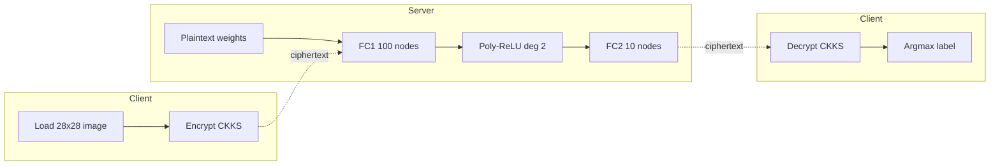
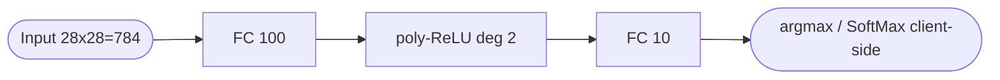
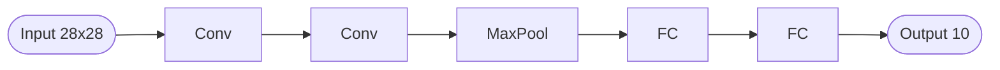
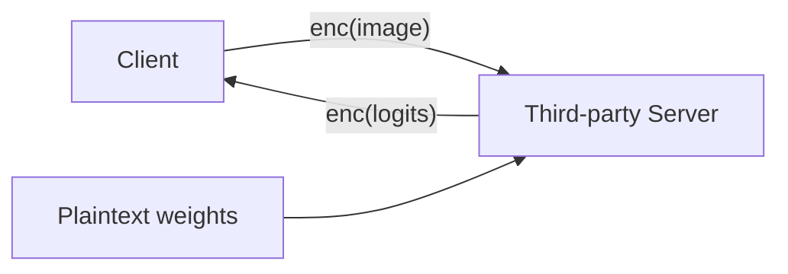

## TL;DR

Argonne National Laboratory proof-of-concept that applies Microsoft SEAL's CKKS FHE to a small fully-connected MNIST classifier, demonstrating feasibility while documenting roughly five orders of magnitude runtime overhead and large ciphertext blow-up [Abstract][§4]. The motivating application is privacy-preserving third-party analysis of proprietary reactor structural-health and nondestructive evaluation (NDE) data [§1].

## Problem and motivation

Third-party / expert analysis is cost-effective for specialised reactor structural health monitoring and nondestructive evaluation work, but exposes proprietary data to privacy risk [§1, p. 4]. The authors propose using Fully Homomorphic Encryption so a client can hand encrypted data to a third-party processor that performs ML/AI inference without ever seeing the plaintext, then returns an encrypted result for the client to decrypt [Figure 1, p. 4]. The threat model is implicit: a client/server split where the server performs operations on ciphertext only; no explicit honest-but-curious / malicious distinction is stated [§1].

## Key contributions

- Apply Microsoft SEAL's CKKS implementation to a small FCNN performing MNIST digit classification end-to-end on ciphertext [Abstract][§3].
- Document the storage blow-up of CKKS encryption: 10 standardised MNIST images grow from 68.4 KB plaintext to 2.45 GB at poly-modulus degree 8192 and 7.73 GB at 16384 [Figure 2, p. 6].
- Use a degree-2 polynomial approximation of ReLU (fit by L2-minimisation over [-20, +30]) to work around CKKS's lack of comparison / division operations [§2, p. 6-7].
- Provide a plaintext baseline comparison across FCNN, Approximated FCNN, PCA+NN, and CNN, plus a timing comparison between plaintext and HE FCNN inference [Figure 6, Figure 7, p. 10].
- Flag PCA as a feature-reduction strategy and signal future intent to apply FHE to thermal-imaging defect detection [§5].

## FHE setup

- **Scheme(s):** CKKS (Cheon-Kim-Kim-Song, approximate arithmetic) [§1, p. 4-5].
- **Library / implementation:** Microsoft SEAL [§1, p. 4].
- **Parameters:** poly-modulus degree 8192 (4 coefficients, supports ~2 multiplications) or 16384 (6 coefficients, supports ~4 multiplications) [§2, p. 6]. Security level: Not reported. Scale: Not reported.
- **Bootstrapping used:** Not reported (the paper instead limits multiplicative depth via the chosen poly-modulus degree and coefficient set) [§2].
- **Packing / encoding strategy:** Not reported.

## ML setup

- **Task:** Image classification inference on encrypted inputs (MNIST 0-9) [§3, §4].
- **Model architecture:** Small Fully-Connected Neural Network with one hidden layer of 100 nodes using ReLU, then an output layer of 10 nodes using SoftMax [Figure 4, p. 8]. A CNN variant (two conv layers, one max-pool, two FC layers) was trained in plaintext only [Figure 5, p. 8]. PCA was implemented in plaintext only [§3, p. 9]. Layer count convention here: weight-bearing layers only (hidden FC + output FC = 2).
- **Activation handling:** ReLU replaced by a degree-2 polynomial p(x) = 2.593 + 0.4752x + 0.0173x^2, fit by minimising the squared L2 difference over [-20, +30] [§2, Eq. 1-3, p. 7]. SoftMax is *not* approximated because the authors argue argmax of SoftMax equals argmax of its pre-image [§3, p. 8].
- **Operates on:** Plaintext model (weights) + encrypted data — "training of the models on the plaintext data before transferring the weights to the HE implementation" [§1, p. 5].
- **Training vs inference:** Training is plaintext; only inference runs under encryption [§1, p. 5].

## Datasets

| Dataset | Task | Size (train/test) | Modality | Notes |
|---|---|---|---|---|
| MNIST Handwritten | 10-class digit classification | 1000 train / 100 test (subset used for evaluation) | 28x28 black-and-white images | Used as proof-of-concept; "standardized" images [§4, p. 10] |

## Pipeline diagram

### Pipeline steps (text)

1. Client loads a standardised 28x28 MNIST image [§4, p. 10].
2. Client encrypts the input under CKKS using Microsoft SEAL at poly-modulus degree 8192 or 16384 [§2, p. 6].
3. Client transmits the ciphertext to the third-party server [Figure 1, p. 4].
4. Server applies the first fully-connected layer (100 nodes) using plaintext weights against the ciphertext [§3, p. 8].
5. Server applies the degree-2 polynomial approximation of ReLU element-wise; rescales / relinearises after each multiplication [§2, §3, p. 6-8].
6. Server applies the output fully-connected layer (10 nodes); SoftMax is *not* applied under encryption because argmax is preserved by the pre-image [§3, p. 8].
7. Server returns the encrypted logit vector to the client [Figure 1, p. 4].
8. Client decrypts and takes argmax to obtain the predicted digit [§3, p. 8].

## Architecture diagram

### CNN (plaintext only, for context)

CNN layer widths and kernel sizes are not specified in the text [Figure 5, p. 8]. The CNN was not converted to an FHE implementation [§3, p. 8].

## Results

| Metric | This paper | Baseline | Hardware |
|---|---|---|---|
| Plaintext FCNN accuracy (MNIST) | 83.8% | - | Not reported [Figure 6, p. 10] |
| Approximated FCNN accuracy (poly-ReLU, plaintext eval) | 76.1% (-7.7 pts vs FCNN) | 83.8% (FCNN) | Not reported [Figure 6, p. 10] |
| PCA + FCNN accuracy | 85.9% | 83.8% (FCNN) | Not reported [Figure 6, p. 10] |
| CNN accuracy (plaintext only) | 59.1% | - | Not reported [Figure 6, p. 10] |
| Plaintext FCNN inference time | 2.001x10^-3 s per image | - | Not reported [Figure 7, p. 10] |
| HE (CKKS) FCNN inference time | 295.3 s per image (~5 min) | 2.001x10^-3 s plaintext | Not reported [Figure 7, p. 10] |
| HE slowdown | ~150,000x | 1x plaintext | Not reported [§4, p. 10] |
| Storage blow-up (10 images) | 2.45 GB (N=8192) / 7.73 GB (N=16384) | 68.4 KB plaintext | Ratios 35,818x and 113,011x [Figure 2, p. 6] |

The accuracy reported for the "Approximated Neural Network" in Figure 6 is described in §4 as identical between the plaintext-poly and HE-poly runs ("we receive an identical result between the NN and Approximated NN models" referring to outputs, not accuracy) [§4, p. 10] — the 76.1% number is therefore the accuracy of the network *with* poly-ReLU, whether evaluated in plaintext or under HE.

## Limitations and assumptions

- Storage blow-up is acknowledged as unresolved: "we do not present a solution for this challenge in this paper" [§2, p. 6].
- The ~150,000x runtime slowdown for HE inference is acknowledged and flagged for future work [§4, p. 10].
- CNN was trained only in plaintext (59.1% accuracy is "mediocre"); not converted to FHE [§3, p. 8].
- PCA was implemented only in plaintext; HE version not yet built [§3, p. 9].
- Evaluation uses only 1000 training and 100 test images — a small subset of MNIST [§4, p. 10].
- Degree-2 polynomial approximation costs 7.7 accuracy points; higher orders are flagged as future work [§4, p. 10].
- Hardware (CPU/GPU, RAM, cores, threads) used for the 295.3 s timing is *not reported* — making the figure hard to compare against other CKKS work [Figure 7, p. 10].
- Threat model is not formally stated (no honest-but-curious vs malicious distinction) [§1].
- Communication cost (multi-GB ciphertexts per batch of 10 images) is noted but not analysed end-to-end [§2, p. 6].
- Multiplicative-depth budget is fixed by poly-modulus choice; the paper does not state how many multiplications the deployed FCNN actually consumes [§2, p. 6].

## Related work it compares against

The paper cites but does *not* run head-to-head benchmarks against:

- CryptoNets (Dowlin et al., 2016) [ref 12].
- Lee et al. RNS-CKKS comparison optimisation (2022) [ref 13].
- Lee et al. "Precise Approximation of CNNs for Homomorphically Encrypted Data" (2021) [ref 14].
- Lee et al. "Privacy-Preserving Machine Learning with FHE for Deep Neural Network" (2022) [ref 15].
- Chiang, "On Polynomial Approximation of Activation Function" (2022) [ref 11].

No quantitative comparison table against these systems is provided [§4-5].

## Code and artifacts

Not released. No repository URL is given in the report [§1-5].

## Extra diagrams (optional)

### Threat model

The server holds plaintext model weights; only the input/output are encrypted. No explicit adversary model is stated in the text [§1, p. 4-5].

### Activation approximation

ReLU is approximated over [-20, +30] by p(x) = 2.593 + 0.4752x + 0.0173x^2 (degree 2), fit by minimising the integrated squared error [§2, Eq. 1-3, p. 7]. See Figure 3 in paper for the visual comparison [Figure 3, p. 7].

## Open questions

- What hardware (CPU model, cores, RAM, threads) was used for the 295.3 s figure? Not reported.
- What security level corresponds to the chosen poly-modulus degrees (8192, 16384) in this SEAL configuration? Not reported.
- What is the multiplicative depth actually consumed by the deployed FCNN, and how was the coefficient chain sized? Not reported.
- Is the 76.1% "Approximated NN" accuracy the HE-evaluated accuracy or the plaintext evaluation of the poly-ReLU network? §4 implies outputs match between the two, but this is not stated explicitly.
- What batching / packing (if any) is used inside SEAL? Not reported.
- Is the 295.3 s per-image cost amortised (batched) or strictly single-sample? Not reported.
