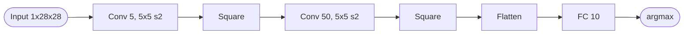
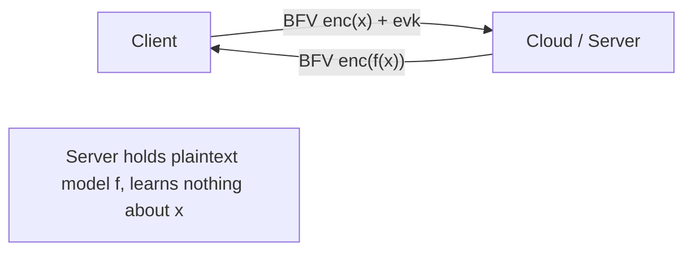

## TL;DR

HCNN is the first GPU-accelerated homomorphic CNN that runs pre-trained inference on encrypted images under the BFV scheme, classifying MNIST in 5.16 s at 99% accuracy and CIFAR-10 in 304.43 s at 77.55% accuracy, with >80-bit security [Abstract][§I.A].

## Problem and motivation

The work targets Deep Learning as a Service (DLaaS) where a cloud holds a pretrained model and a client wants predictions on sensitive inputs without leaking them to the server [§I]. The threat model is a non-interactive, single-round client/server setting: the client encrypts inputs and FHE evaluation keys, the server performs encrypted inference and returns the ciphertext, and "nothing about the input x is revealed to the cloud nor the model f to the client except what can be learned from input x and f(x)" [§I]. The paper does not explicitly name "honest-but-curious", but the construction is consistent with a passive server — no integrity or malicious-client mechanisms are described. Prior pure-FHE work (CryptoNets) needed 570 s per MNIST evaluation on CPU; the authors argue GPUs can dramatically close this gap and bring DLaaS within practical reach [§I, p. 1331].

## Key contributions

- First GPU-accelerated Homomorphic CNN (HCNN) running a pre-learned model on encrypted images [§I.A].
- Combination of optimizations: low-precision (quantized) training, careful FHE parameter/scheme choice (HPS RNS variant of BFV), and a CUDA GPU implementation called A*FV [§I.A, §IV.D].
- Two FHE-friendly CNNs: a 5-layer MNIST network with a 43-bit plaintext modulus (vs. CryptoNets' 9 training layers and 80-bit modulus), and a novel 11-layer CIFAR-10 network [§I.A].
- MNIST HCNN: 5.16 s and 99% accuracy; CIFAR-10 HCNN: 304.43 s and 77.55% accuracy, with batched packing of >8,000 images per ciphertext at no extra cost [§I.A, §V.D].
- Plaintext CRT decomposition strategy to handle CIFAR-10's 218-bit precision growth via 10 small primes (22–23 bits each) [§IV, §IV.B, Table 6].

## FHE setup

- **Scheme(s):** BFV (Brakerski-Fan-Vercauteren), levelled (no bootstrapping) [§II.A, §IV.B].
- **Library / implementation:** Two implementations — Microsoft SEAL v2.3.1 (BEHZ RNS variant) for MNIST CPU baseline, and the authors' custom GPU library "A*FV" implementing the HPS RNS variant of BFV [§IV, §IV.D, §V.E].
- **Parameters:** For MNIST, four parameter sets with N ∈ {2^13, 2^14}, log q ∈ {330, 360}, single 43-bit plaintext modulus prime (5522259017729), supporting depth 4–5 at security 76–175 bit. For CIFAR-10: N = 2^13, log q = 300, 10 plaintext-modulus primes (2424833, 2654209, 2752513, 3604481, 3735553, 4423681, 4620289, 4816897, 4882433, 5308417) giving a ~219-bit composite modulus, depth 7, 91-bit security [Table 6, p. 1337].
- **Bootstrapping used:** No — levelled BFV [§II.A].
- **Packing / encoding strategy:** SIMD batching by packing the same pixel index across many images into one ciphertext (slot count = ring dimension N), so a single network evaluation classifies up to N images simultaneously [§III.A, Fig. 1]. Scalar encoding multiplies floating-point weights/inputs by a scaling factor D and rounds [§III.A.1]. Plaintext-CRT decomposition splits a large modulus t into r small primes and runs r independent FHE instances [§III.A.2].

## ML setup

- **Task:** Image classification inference under encryption (pretrained plaintext model evaluated on encrypted inputs) [§IV].
- **Model architecture:**
  - MNIST (5 layers, Table 2): Conv (5 filters, 5x5, stride 2) → Square → Conv (50 filters, 5x5, stride 2) → Square → FC 10. Inputs scaled by 4, weights quantized to 4 bits with scale 15. Output dims by layer: 5x12x12=720, 720, 4x4x50=800, 800, 10 [Table 4, p. 1336].
  - CIFAR-10 (11 layers, Table 3): Conv 32 → Square → AvgPool → Conv 64 → Square → AvgPool → Conv 128 → Square → AvgPool → FC 256 → FC 10. Inputs scaled by 255, weights quantized to 8 bits, padding used [Table 5, p. 1337].
- **Activation handling:** Square function f(z) = z^2 (degree-2 polynomial, depth 1) used as a low-complexity approximation to ReLU, following CryptoNets [§III.B.1, §IV.C].
- **Operates on:** Plaintext model + encrypted data. The authors note encrypted-model inference is possible (replacing HMultPlain with HMult) but impractical due to cost and storage [§V.C].
- **Training vs inference:** Plaintext training (in Tensorpack with low-precision quantization via STE); only inference runs under FHE [§IV].

## Datasets

| Dataset | Task | Size (train/test) | Modality | Notes |
|---|---|---|---|---|
| MNIST [§V.B] | 10-class digit classification | 50,000 / 10,000 | Grayscale 28x28 images, pixel values 0–255 | Inputs normalized to [0,1], scaled by 4, rounded to integers |
| CIFAR-10 [§V.B] | 10-class image classification | 50,000 / 10,000 | Color 32x32x3 images, pixel values 0–255 | Inputs normalized to [0,1], padding used; weights quantized to 8 bits |

## Pipeline diagram

### Pipeline steps (text)

1. Client normalizes each image to [0,1] and applies a scalar encoding (multiply by D, round) [§III.A.1, §IV].
2. Client packs the same pixel index across up to N images into one BFV plaintext slot vector [§III.A, Fig. 1].
3. Client BFV-encrypts each pixel-vector plaintext under the public key; for CIFAR-10, the client also splits across r=10 plaintext-CRT channels [§IV.B, Table 6].
4. Server (GPU) evaluates the convolutional layers as HMultPlain (encrypted input by plaintext weight) plus HAdd [§IV.C].
5. Server applies square activation via HSquare on each ciphertext [§IV.C, Table 9].
6. For CIFAR-10, server applies average pooling as HMultPlain with constant weights 1/n [§IV.C].
7. Server evaluates remaining conv/FC layers, partitioning feature maps into GPU-memory-sized blocks where needed [§IV.D.1].
8. Server returns the final ciphertext(s) to the client.
9. Client BFV-decrypts; for CIFAR-10, applies CRT reconstruction over the 10 channels [§III.A.2, §IV.B].
10. Client unpacks the slot vector to recover per-image logits and takes argmax [§III.A].

## Architecture diagram

### MNIST HCNN (5 layers)

### CIFAR-10 HCNN (11 layers)

## Results

Headline numbers from [Table 10, Table 11, §V.D]:

| Metric | This paper | Baseline | Hardware |
|---|---|---|---|
| MNIST accuracy | 99.00% (scalar encoding) | CryptoNets 99.00%; E2DM 98.01%; FCryptoNets 98.71% | N/A |
| MNIST inference (total) | 5.16 s (A*FV, param set 1, 82-bit sec) / 5.71 s (param set 3, 175-bit sec) | CryptoNets 570 s; E2DM 28.59 s; FCryptoNets 39.10 s | V100 GPU vs. various CPUs |
| MNIST amortized per image | 0.63 ms (set 1) / 0.34 ms (set 3) | CryptoNets 69.58 ms; E2DM 450 ms; FCryptoNets 39.10 s | V100 GPU |
| MNIST inference (SEAL CPU) | 739.90 s (param set 2) / 1,563.85 s (param set 4) | — | 2x Intel Xeon Platinum (26 cores, 2.10 GHz, 187.5 GB DDR4) |
| MNIST GPU speedup vs SEAL | 138.56x (set 2) / 258.92x (set 4) | — | V100 vs CPU |
| CIFAR-10 accuracy | 77.55% (scalar encoding) / 77.80% (float) | CryptoDL 91.50% (80-bit sec); FCryptoNets 75.99% | N/A |
| CIFAR-10 inference (1 GPU) | 553.89 s per CRT channel | CryptoDL 11,686 s; FCryptoNets 22,372 s | 1x V100 |
| CIFAR-10 inference (4 GPUs) | 304.43 s per CRT channel; amortized 0.372 s/image | — | 1x V100 + 3x P100 (assumes 10 machines run the 10 CRT channels in parallel) |
| Security level | >80 bit (82–175 bit MNIST; 91 bit CIFAR-10) | CryptoNets/E2DM/CryptoDL 80-bit | — |

Hardware testbed [Table 8, p. 1339]: CPU = 2x Intel Xeon Platinum, 26 cores, 2.10 GHz, 187.5 GB DDR4, 30 GB/s. GPU cluster = 1x V100 (5120 cores, 1.380 GHz, 16 GB HBM2, 732 GB/s) + 3x P100 (3584 cores, 1.328 GHz, 16 GB HBM2 each, 900 GB/s), connected by 16 GB/s PCIe. All single-GPU experiments used the V100 card.

Per-primitive GPU speedups over SEAL (param set 4) [Table 9]: 25.38x KeyGen, 17.37x Enc, 106.20x Dec, 5.20x HAdd, 58.29x HSquare, 448.40x HMultPlain, 62.54x HMult.

## Limitations and assumptions

- Square activation hurts deep-network accuracy: the CIFAR-10 result (77.55%) is well below the plaintext SOTA (96.53%) and below CryptoDL (91.5%) at the same task [§IV, p. 1336].
- The CIFAR-10 wall-clock of 304.43 s assumes 10 separate machines run the 10 CRT channels in parallel — on a single 4-GPU machine, total work scales linearly with channel count [§V.D, p. 1340].
- The amortized per-image cost requires packing N (up to 16,384) images per ciphertext, so single-image latency at low batch sizes is not improved [§III.A, §V.D].
- Encrypted-model evaluation (replacing HMultPlain with HMult) is dismissed as impractical due to cost and per-client model encryption [§V.C].
- The 76-bit security parameter set 2 is acknowledged as below the 80-bit best practice and "not recommended" [§V.D, p. 1340].
- GPU memory was insufficient for even the first CIFAR-10 conv layer's feature map, requiring a block decomposition with CPU-GPU transfers [§IV.D.1, p. 1339].
- Threat model is implicit: no formal honest-but-curious / malicious analysis, no discussion of model-extraction or output-only side channels.
- Plaintext-CRT decomposition for CIFAR-10 multiplies storage and compute by r=10 [§III.A.2, §IV.B].
- Communication cost of shipping evaluation keys and ciphertexts is not quantified; ciphertext sizes are reported only indirectly (~1.28 MB MNIST, ~0.59 MB CIFAR-10) [§IV.D.1, p. 1339].

## Related work it compares against

CryptoNets [Dowlin et al. 2016], FHE-DiNN [Bourse et al. 2018], E2DM [Jiang et al. 2018], MiniONN [Liu et al. 2017], GAZELLE [Juvekar et al. 2018], DELPHI [Srinivasan et al. 2019], XONN [Riazi et al. 2019], Faster CryptoNets (FCryptoNets) [Chou et al. 2018], CryptoDL [Hesamifard et al. 2017] [§I.B, Table 1, Table 11].

## Code and artifacts

Not released. The paper does not provide a public repository for HCNN or the A*FV GPU library; the underlying SEAL library is open source [§IV].

## Extra diagrams (optional)

### Threat model

### Activation approximation

The paper uses the square activation f(z) = z^2 as the polynomial replacement for ReLU [§III.B.1, §IV.C]. This is degree 2 with depth 1, doubling the scaling factor each application (D_out = D_in^2) [Table 7]. No new polynomial approximation is proposed; see CryptoNets [Dowlin et al. 2016] for prior use.

## Open questions

- The CIFAR-10 "304.43 s" wall-clock implicitly assumes 10 parallel machines for the 10 CRT channels — what is the true single-machine latency? The paper reports 553.89 s for 1 CRT channel on a single V100; multiplying by 10 channels suggests ~5,539 s on a single GPU.
- Why does CIFAR-10 accuracy (77.55%) trail CryptoDL (91.5%) by so much? Is this attributable to the square activation, the 8-bit weight quantization, or the architecture choice?
- The paper does not report ciphertext sizes, encryption time, or wire bandwidth explicitly per evaluation; the comparison is server-time only.
- Is A*FV publicly available? Reproducibility hinges on this, but no link is given.
- Memory pressure for CIFAR-10 forced a block-decomposition scheme — what is the actual host-device transfer overhead in the 553.89 s figure?
