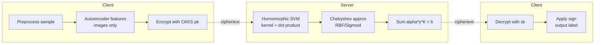
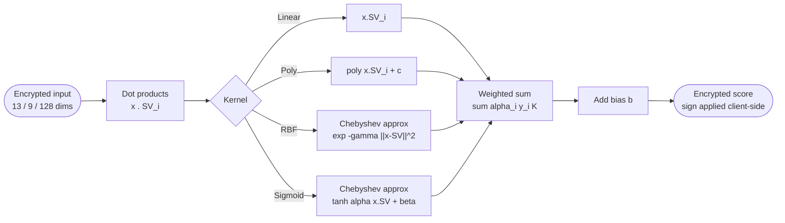
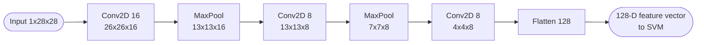
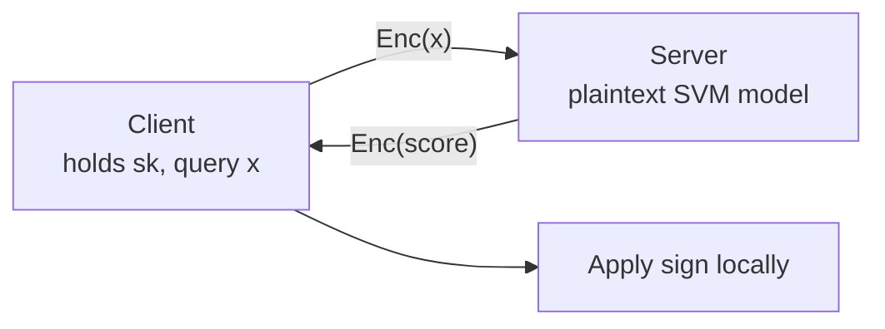

## TL;DR

The paper presents a CKKS-based framework for privacy-preserving SVM inference on encrypted medical records and medical images, supporting linear, polynomial, RBF, and Sigmoid kernels at a 128-bit security level with single-sample latencies between 0.39 s and 12.80 s [Abstract, Conclusions p. 22].

## Problem and motivation

Bioinformatics analyses on sensitive medical data (cardiology, oncology, medical imaging) need confidentiality guarantees when computation is outsourced to untrusted servers [Introduction p. 1-2]. The authors target an **honest-but-curious server** that follows the protocol but may try to learn information from encrypted data or the secret key; the server holds the SVM model in plaintext, and the client encrypts queries [§Threat model p. 8]. Client data privacy, insight privacy, insight accuracy, and unlinkability are the stated guarantees [§Threat model p. 8].

## Key contributions

- Integration of CKKS FHE with SVMs at the 128-bit security level for private pathological assessment [§Contributions p. 3].
- Support for four SVM kernels under FHE: linear, polynomial, RBF, and Sigmoid (the latter two via Chebyshev polynomial approximations) [§Contributions p. 3, §Non-linear kernel functions p. 10].
- Autoencoder-based feature extraction to compress medical images (BreastMNIST, PneumoniaMNIST) to 128-D vectors for efficient FHE-SVM evaluation [§Feature extraction p. 14, Table 3].
- Open-source CPU implementation released at https://github.com/caesaretos/svm-fhe [§Contributions p. 3, §Supporting Information p. 23].
- Empirical evaluation on four datasets (CHD, WBC, BreastMNIST, PneumoniaMNIST) with latencies in seconds and near-plaintext accuracy [§Experimental results p. 17-19].

## FHE setup

- **Scheme(s):** CKKS (Cheon-Kim-Kim-Song), leveled mode [§The CKKS scheme p. 6-7].
- **Library / implementation:** OpenFHE v1.1.1, built with multi-threading enabled [§OpenFHE library p. 11, §Experimental infrastructure p. 17].
- **Parameters:** 128-bit security level for all configurations. Ring dimension N and ciphertext modulus log2 Q per kernel/dataset [Table 5 p. 16]:
  - CHD: Linear (16k, 258); Poly (32k, 756); RBF (32k, 804); Sigmoid (65k, 892).
  - WBC: Linear (16k, 287); Poly (32k, 644); RBF (32k, 804); Sigmoid (65k, 996).
  - BreastMNIST and PneumoniaMNIST: RBF only (64k, 640).
- **Bootstrapping used:** No - leveled mode is used because the circuits fit within depth constraints [§The CKKS scheme p. 6-7].
- **Packing / encoding strategy:** SIMD batching over real-valued vectors (vectors mapped to RQ = ZQ[x]/(x^N + 1)); CKKS operates as a vector computing machine [§Homomorphic operations in CKKS p. 7].

## ML setup

- **Task:** Binary classification inference under encryption [§SVM training/inference p. 5-6, §Limitations p. 21].
- **Model architecture:** SVM (linear, polynomial, RBF, Sigmoid kernels). Decision function y = sign(Σ αi·yi·K(x, xi) + b) [Eq. (1) p. 6]. Trained with scikit-learn v1.3.0 [§Scikit-learn p. 11, §Experimental infrastructure p. 17]. For images, a CNN-based Autoencoder produces 128-D features before the SVM:
  - Encoder: Conv2D(16, 26x26x16) - MaxPool(13x13x16) - Conv2D(8, 13x13x8) - MaxPool(7x7x8) - Conv2D(8, 4x4x8) - Flatten(128).
  - Decoder: Reshape(4x4x8) - Conv2D(8) - UpSample(8x8x8) - Conv2D(8) - UpSample(16x16x8) - Conv2D(1, 28x28x1, sigmoid) [Table 3 p. 14].
- **Activation handling:** Non-polynomial kernel transcendentals (exp for RBF, tanh for Sigmoid) approximated with Chebyshev polynomials. Approximation parameters [Table 4 p. 15]:
  - CHD & WBC: exp on [-100, 0] with degree 119; tanh on [-60, 60] with degree 495.
  - BreastMNIST & PneumoniaMNIST: exp on [-10, 0] with degree 13.
- **Operates on:** Plaintext model + encrypted data (client query is encrypted; SVM parameters left unencrypted on server) [§FHSVM p. 8-9].
- **Training vs inference:** Training is done offline in plaintext via scikit-learn; only **inference** runs under encryption on the server. The final sign function is moved to the client side to avoid approximating a non-smooth function under FHE [§Homomorphic prediction p. 15-16].

## Datasets

| Dataset | Task | Size (train/test) | Modality | Notes |
|---|---|---|---|---|
| Cleveland Heart Disease (CHD) | Binary classification (disease presence) | 303 samples total, 80%/20% split | Tabular, 13 numerical features | Imbalanced; missing values present; min-max normalized [Table 1 p. 13, §Data splitting p. 15] |
| Wisconsin Breast Cancer (WBC) | Binary classification (malignant/benign) | 569 samples total, 80%/20% split | Tabular, 9 numerical features (paper says 30 features for source but Table 1 reports 9) | Imbalanced; no missing values [Table 1 p. 13]; Table 8 also lists 9 features for WBC |
| BreastMNIST | Binary classification (normal/malignant) | 780 breast ultrasound images, 70%/10%/20% train/val/test | Grayscale images resized to 28x28 | From MedMNIST; 128-D features extracted via Autoencoder [Table 2 p. 13, §Datasets p. 12-13] |
| PneumoniaMNIST | Binary classification (normal/pneumonia) | 5,856 chest X-rays, 90%/10% train + val/test | Grayscale images center-cropped and resized to 28x28 | From MedMNIST; 128-D features extracted via Autoencoder [Table 2 p. 13] |

## Pipeline diagram

### Pipeline steps (text)

1. Client preprocesses the input (min-max normalization for tabular; for medical images, run the pretrained Autoencoder encoder to obtain a 128-D feature vector) [§Data preprocessing p. 14, §Feature extraction p. 14].
2. Client encodes the resulting feature vector into a CKKS plaintext and encrypts under the public key [§FHSVM step 1 p. 9].
3. Client transmits the ciphertext to the server [§FHSVM step 2 p. 9].
4. Server evaluates the SVM decision function homomorphically: dot products with support vectors, kernel application (linear/polynomial direct; RBF/Sigmoid via Chebyshev polynomial approximation), then a weighted sum with `alpha_i * y_i` plus bias `b` [§Homomorphic prediction p. 15-16, Eq. (1) p. 6].
5. Server returns the encrypted score to the client (the sign function is **not** evaluated server-side) [§Homomorphic prediction p. 16].
6. Client decrypts and applies the sign function locally to obtain the final binary label [§Homomorphic prediction p. 16, §FHSVM step 5 p. 10].

## Architecture diagram

The deployed model under FHE is an SVM (not a neural network). The diagram below shows the homomorphic SVM evaluation graph; for image inputs an offline CNN Autoencoder produces the 128-D vector that feeds it.

### Autoencoder feature extractor (images only, plaintext, offline)

## Results

Headline numbers from the paper [Table 6 p. 18, Table 7 p. 19, Table 8 p. 20]:

| Metric | This paper | Baseline | Hardware |
|---|---|---|---|
| WBC F1 (Sigmoid kernel, encrypted) | 0.96 | Comparable to plaintext SVM | Intel Core i7-12700H, 64 GB RAM, multi-threaded OpenFHE |
| WBC F1 (RBF, encrypted) | 0.96 | Comparable to plaintext SVM | same |
| CHD F1 (Sigmoid, encrypted) | 0.75 | Comparable to plaintext SVM | same |
| BreastMNIST F1 (RBF) | 0.80 | MedMNIST auto-sklearn: 0.803 accuracy | same |
| PneumoniaMNIST F1 (RBF) | 0.85 | MedMNIST auto-sklearn: 0.855 accuracy | same |
| CHD latency (Linear) | 0.39 s | - | same |
| CHD latency (Poly) | 3.83 s | - | same |
| CHD latency (RBF) | 4.81 s | - | same |
| CHD latency (Sigmoid) | 11.23 s | - | same |
| WBC latency (Linear) | 0.52 s | - | same |
| WBC latency (RBF) | 5.73 s | Sari et al. (Paillier, Linear): 47.00 s | same |
| WBC latency (Sigmoid) | 12.80 s | - | same |
| BreastMNIST latency (RBF) | 2.09 s | - | same |
| PneumoniaMNIST latency (RBF) | 2.03 s | - | same |
| WBC RBF vs Bajard et al. [32] | 5.73 s (CPU) | 21.42 s on Statlog Heart with RBF, GPU | Authors note their CPU result outperforms [32]'s GPU result [§Performance comparison p. 20] |

Approximate plaintext-vs-encrypted gap: the paper states "no notable precision loss is observed due to the introduction of homomorphic encryption" [§Introduction p. 3], and "comparable accuracy to the unencrypted SVM prediction" [§Main findings p. 21]. Exact deltas per kernel are not tabulated.

## Limitations and assumptions

- Restricted to **binary** classification; multi-class and multi-label SVM under FHE are flagged as future work [§Limitations p. 21].
- Not tested on large-scale or high-dimensional datasets; image inputs are reduced to 128 dims via an Autoencoder before the SVM [§Feature extraction p. 14, §Limitations p. 21].
- Honest-but-curious threat model only; malicious adversaries that tamper with ciphertexts or model parameters are out of scope [§Discussion p. 21].
- SVM model parameters (support vectors, coefficients, bias) are stored in plaintext on the server; the authors acknowledge clients could potentially infer them through repeated queries but choose not to mitigate [§Threat model p. 8].
- The **sign function is computed client-side** to avoid approximating a non-smooth function under CKKS; this requires the client to receive the raw decryption of the score and assumes leaking the decision score (not just the label) to the client is acceptable [§Homomorphic prediction p. 15-16].
- Chebyshev approximation errors are unavoidable in CKKS; degrees up to 495 (tanh on CHD/WBC) drive ciphertext modulus and ring dimension up, with the Sigmoid kernel needing N = 65k [Table 4, Table 5 p. 15-16].
- CPU-only software implementation; performance could improve 2-3 orders of magnitude with hardware accelerators (GPU/FPGA/ASIC), but this is not evaluated [§Limitations p. 21-22].

## Related work it compares against

- FHSVM (Al Badawi et al., 2022) [33] - direct algorithmic predecessor; linear and polynomial kernels only.
- Bajard et al. (2019) [32] - CKKS-based SVM, GPU, 80-100-bit security, RBF/Sigmoid; this paper claims better latency on CPU at 128-bit security.
- eDiag (Zhu et al., 2016) [29] - random masking + polynomial aggregation, RBF only, PID dataset, 1.5 s.
- Zhang, Song, Zhang (2020) [30] - Okamoto-Uchiyama HE, multi-class SVM, Dermatology dataset, 5-48 s.
- Sari and Prasetya (2019) [53] - Paillier + linear SVM, WBC, 47 s.
- Huang, Wang, Zong (2022) [54] - CKKS, polynomial, CIFAR-10, 11.42 s.
- CryptoNets [20], CareNets [8] - encrypted CNN baselines (broader context, not direct SVM competitors).

## Code and artifacts

Open-source at https://github.com/caesaretos/svm-fhe [§Contributions p. 3, §Supporting Information p. 23]. License terms: "Clear terms of use and contribution guidelines" stated in repository per the paper, specific license name **Not reported** in the manuscript text.

## Extra diagrams (optional)

### Threat model

The server is honest-but-curious and never sees plaintext queries; SVM parameters are in the clear on the server [§Threat model p. 8].

### Activation approximation

Chebyshev polynomial approximations of the kernel transcendentals [Table 4 p. 15]:

- CHD & WBC: exp(x) on [-100, 0] with degree **119**; tanh(x) on [-60, 60] with degree **495**.
- BreastMNIST & PneumoniaMNIST: exp(x) on [-10, 0] with degree **13**.

See Table 4 in paper for the exact ranges and degrees.

## Open questions

- The paper reports 9 features for WBC in Table 1 (and in Table 8) but the WBC dataset's description states 30 features extracted from FNA images [§Datasets p. 12]. Which feature subset is actually used is not explicitly stated.
- No explicit per-kernel accuracy gap (encrypted vs. plaintext) is tabulated, only the qualitative claim of "comparable" performance.
- The license type of the open-source release is not stated in the manuscript text.
- Ciphertext size and end-to-end communication cost are not reported.
- Whether the Autoencoder is trained on the same medical images or on a separate corpus, and whether the encoder runs client-side or server-side, is implied to be client-side (since features are encrypted) but not explicitly stated.
