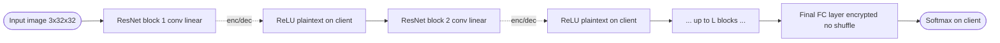
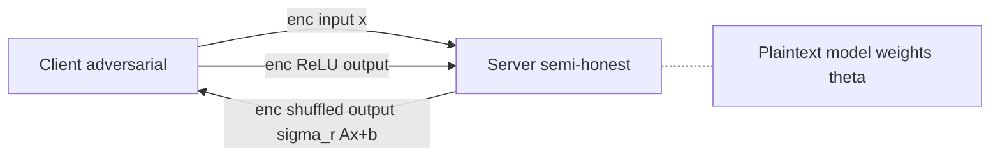

## TL;DR

SAFHIRE is a hybrid FHE inference framework that keeps linear layers (convolutions, fully connected) encrypted on the server under a TFHE-based RLWE scheme and offloads non-linearities (ReLU) to the client in plaintext, eliminating bootstrapping and polynomial approximations [Abstract, §1]. It achieves 1.5x-10.5x lower end-to-end latency than ORION at comparable accuracy, and uses randomized shuffling plus differential-privacy amplification to preserve model confidentiality despite client visibility into intermediate outputs [Abstract, §1, §5].

## Problem and motivation

End-to-end FHE-based ML inference is impractical at scale due to (1) costly bootstrapping (62%-85% of total inference time in ORION on ResNet-20/18/34) and (2) inefficient polynomial approximations of non-linearities such as ReLU [§1, Fig. 1]. The work targets ML-as-a-Service (MLaaS) deployments where clients submit sensitive inputs (e.g., medical, financial) and the server holds a proprietary model [§1]. Threat model: semi-honest (honest-but-curious) server that follows the protocol but tries to infer client inputs; adversarial clients that may send arbitrary inputs to reverse-engineer model weights; TLS-authenticated channel; side channels out of scope; explicit leakage limited to model metadata exchanged at setup and message sizes [§3].

## Key contributions

- Introduce SAFHIRE, a hybrid FHE inference framework executing linear, parameterized layers on the server under encryption while offloading non-linearities to the client in plaintext, eliminating bootstrapping and supporting exact non-linearities [§1, §4].
- Show that randomized shuffling of linear outputs preserves server-side model confidentiality, and derive amplified differential-privacy guarantees jointly from shuffling and ciphertext noise [§1, §5, Theorem 2].
- Implement SAFHIRE atop a TFHE-based RLWE scheme with targeted optimizations: high-throughput ciphertext packing and partial trace extraction, reducing key-switch pressure [§1, §2.3, §2.4, §4.4].
- Evaluate on standard CNNs (ResNet-20/18/34) and datasets (CIFAR-10/Tiny/ImageNet), demonstrating 1.5x-10.5x lower end-to-end latency, 1.53x-86.12x less server compute than ORION, with comparable accuracy [§1, §6].

## FHE setup

- **Scheme(s):** TFHE-based RLWE (Ring Learning With Errors over the torus); hybrid in the sense that server performs encrypted linear ops while client decrypts/re-encrypts each round to execute non-linearities in plaintext [§1, §2.1, §4.1]. Hybrid hand-off occurs between every linear block and its succeeding non-linearity.
- **Library / implementation:** Custom Julia implementation using NNlib.jl (ML kernels), FFTW.jl (FFTs for key-switches), Permutations.jl (shuffling); supports multi-threaded CPU and GPU [§6.1].
- **Parameters:** Three configurations indexed by accumulator precision b (Table 2) [§6.1]:
  - b = 8 bits: key size M = t^alpha = 37, RLWE noise Delta = 2^-36, D = 512, l = 3
  - b = 12 bits: M = 74, Delta = 2^-51, D = 2^12 (gamma=0) / 2^16 (gamma in [1,2]), l = 3 / 2
  - b = 16 bits: M = 55, Delta = 2^-51, D = 310, l = 5 / 4
  All parameter choices yield at least 128-bit security per Albrecht's estimator [§6.1, Table 2].
- **Bootstrapping used:** No - explicitly eliminated by client-side intermediate decryption and re-encryption [§1, §4.1, §8].
- **Packing / encoding strategy:** Fast packing of LWE ciphertexts into a single RLWE ciphertext via the homomorphic trace operator with partial trace extraction at trace level gamma in {0, 1, 2}; messages embedded as coefficients of polynomials over prime-power cyclotomic ring Phi_M [X] [§2.4, §4.3, §4.4, Table 1]. Higher gamma shifts work from server packing to client power-evaluations and uploads.

## ML setup

- **Task:** Image classification inference (single sample, end-to-end) [§6].
- **Model architecture:** ResNet-20 (0.27M params, CIFAR-10), ResNet-18 (11.2M, Tiny ImageNet), ResNet-34 (21.8M, ImageNet); for ResNet-34 on ImageNet max pooling is replaced with average pooling since the latter is linear and FHE-friendly [§6.2]. Layer count and widths beyond standard ResNets are not enumerated in the paper.
- **Activation handling:** Exact ReLU evaluated in plaintext on the client after decryption of the previous linear-layer outputs - no polynomial approximation needed [§1, §4.1, §4.5].
- **Operates on:** Plaintext model (on server) + encrypted activations (round-by-round). The model weights theta remain in plaintext on the server; client activations are encrypted under client-held key s(X); intermediate outputs are decrypted on the client between linear blocks [§3, §4.1].
- **Training vs inference:** Inference only. Quantization-aware training (A2Q+ from Colbert et al.) is performed offline; SAFHIRE itself runs no training under encryption [§3, §6.3].

## Datasets

| Dataset | Task | Size (train/test) | Modality | Notes |
|---|---|---|---|---|
| CIFAR-10 | image classification | Not reported (standard splits) | RGB images, 32x32x3 | 10 classes; used with ResNet-20 [§6.2] |
| Tiny (Tiny ImageNet) | image classification | Not reported | RGB images, 64x64x3 | Used with ResNet-18 [§6.2] |
| ImageNet | image classification | Not reported | RGB images, 224x224x3 | Used with ResNet-34; max pool replaced by avg pool [§6.2] |

## Pipeline diagram

```mermaid
flowchart LR
    subgraph Client_pre [Client: round r start]
        A[Flatten and chunk input] --> B[Power computations gamma]
        B --> C[Encrypt RLWE]
    end
    subgraph Server [Server: linear round r]
        D[Partial trace extract] --> E[Unshuffle prior perm]
        E --> F[Encrypted convolution]
        F --> G[Shuffle rows sigma_r]
        G --> H[Fast packing]
    end
    subgraph Client_post [Client: round r end]
        I[Decrypt RLWE] --> J[Plaintext ReLU]
        J --> K[Requantize for next layer]
    end
    C -. ciphertexts .-> D
    H -. packed ciphertexts .-> I
    K -. next round input .-> A
    K --> L([Softmax / argmax on final layer])
```

### Pipeline steps (text)

1. Client flattens the input image into a 1-D vector V and splits into k chunks of length N, zero-padding the last one [§4.3].
2. Client computes powers of each chunk polynomial m(X) at evaluations specific to the chosen partial-trace level gamma (gamma in {0,1,2}) [§4.3].
3. Client encrypts each chunk (and its powers if gamma > 0) under RLWE key s(X) and sends ciphertexts to the server [§4.3].
4. Server performs partial trace extraction on each ciphertext (no-op if gamma = 0) using a homomorphic factorization of the trace operator [§4.4].
5. Server applies the inverse permutation sigma_{r-1}^{-1} to undo the previous round's shuffle (identity for r = 1) [§4.4].
6. Server runs the linear layer (convolution or fully connected) homomorphically over the unpacked, unshuffled encrypted matrix [§4.4].
7. Server applies a fresh per-round random permutation sigma_r (derived from a secret per-session seed plus round counter) to shuffle rows of the output matrix [§4.4].
8. Server applies fast packing to compress t^{beta-1}(t-1) LWE ciphertexts into a single RLWE ciphertext and sends to the client [§4.4].
9. Client decrypts each packed ciphertext, extracts the designated packed positions, and concatenates them (dropping padding) to recover layer output V' [§4.5].
10. Client applies the exact activation (ReLU) element-wise in plaintext [§4.5].
11. Client requantizes outputs using per-layer scale eta: y -> clip(round(y/eta)) to the input precision of the next layer [§4.5].
12. Loop steps 1-11 for L rounds (one round per linear block bounded by a non-linearity) [§4.1].
13. After the last linear layer (no shuffling applied), client computes softmax over the logits to obtain final probabilities [§4.5, §5].

## Architecture diagram

The paper does not enumerate the per-layer ResNet structure beyond noting standard ResNet-20/18/34 (with max pool -> avg pool substitution for ResNet-34/ImageNet). The diagram below mirrors what the paper actually runs: the *generic* per-round hybrid block of which ResNet-20 has 20 stacked instances [§4.1, §6.2].

Per-layer convention: each "round" in SAFHIRE corresponds to one linear block bounded by a non-linearity; ResNet-20 has L = 20 such blocks following standard He et al. architecture [§4.1, §6.2]. For ResNet-34 on ImageNet the max-pool is replaced by avg-pool to keep operations linear [§6.2].

## Results

Headline latency comparison vs ORION (state-of-the-art CKKS baseline). Network speed assumed at 1.25 MB/s (10 Mbit/s) conservatively when computing end-to-end times [Table 3]. Best speedup per (model, precision) shown.

| Metric | This paper (SAFHIRE) | Baseline (ORION) | Hardware |
|---|---|---|---|
| E2E latency ResNet-20/CIFAR-10, b=8, gamma=2 (CPU 1-thread) | 116.2 s (9.0x speedup) | 1040.4 s | Intel Xeon E5-2690 v4 @ 2.6GHz, 56 logical cores, 925 GB RAM, 1 thread [§6.1, Table 3] |
| E2E latency ResNet-18/Tiny, b=8, gamma=2 (CPU 1-thread) | 457.2 s (10.5x speedup) | 4794.4 s | Same Xeon E5-2690 v4 server [Table 3] |
| E2E latency ResNet-34/ImageNet, b=8, gamma=2 (CPU 1-thread) | 2526.3 s (4.3x speedup) | 10819.6 s | Intel Xeon Platinum 8272L @ 2.6GHz, 104 logical cores, 2975 GB RAM [§6.1, Table 3] |
| E2E latency ResNet-20/CIFAR-10 (GPU) | 13.65 s (b=8, gamma=2) / 11.29 s compute only (b=8, gamma=0) | Not reported | NVIDIA A100-SXM4 80GB + AMD EPYC 7543, 24 cores @ 2.80GHz, 1.25 MB/s network [§6.1, §6.6] |
| Accuracy CIFAR-10 (ResNet-20) | 90.00% (16-bit) / 89.63% (12-bit) | 91.70% (ORION, SiLU) | A2Q+ quantization [§6.3, Table 4] |
| Accuracy Tiny (ResNet-18) | 53.19% (16-bit) / 53.16% (12-bit) | 57.00% (ORION, SiLU) | [Table 4] |
| Server compute speedup (multithreaded) | 1.53x-86.12x vs ORION | - | CPU multithreading 1-32 threads [§1, §6.5] |
| Communication (single inference) | Up to 499 MB (ResNet-18), up to 170 MB (ResNet-20) | Not reported | [§1] |
| Client-side share of compute (Tiny/ResNet-18) | 0.5-5.2 s vs 361.5-1141.6 s server-side | - | Server time 76x-1903x greater than client time [§6.4, Table 5] |

Additional observations: gamma = 1 emerges as a robust trade-off across network regimes; gamma = 2 helps at low bandwidth but raises upload size (e.g., from 4.2 MB to 83.9 MB on CIFAR-10 at b=16) [§6.4, Fig. 6]. Multithreading saturates around 16 threads; GPU acceleration delivers a further 14.4x over single-thread CPU for ResNet-20/CIFAR-10 at b=8, gamma=0 (162.57 s -> 11.29 s compute time) [§6.5, §6.6]. Packing dominates server time, e.g., 96.1% of compute on GPU at gamma=0, b=16 [§6.6].

## Limitations and assumptions

- Client must remain online throughout the inference request to perform intermediate decryptions and ReLUs; if offline, server caches state and resumes (slight fault-tolerance reduction) [§4.6].
- Higher communication cost than fully-server-side FHE: up to 499 MB for ResNet-18, 170 MB for ResNet-20 per single inference [§1, §4.6, Fig. 6]. The hybrid trade exchanges compute latency for communication volume - best when bandwidth is abundant [§4.6].
- Model confidentiality relies on the secrecy of per-round permutations and inability of clients to invert shuffles; the differential-privacy amplification yields a probabilistic, not absolute, guarantee, and stronger guarantees would require injecting more noise at the cost of decryption errors [§5, Remark 4].
- The threat model excludes side-channel attacks (timing, power on client hardware) [§3].
- Last-layer outputs are not shuffled (client needs to argmax over logits); thus the last layer's weight values may leak up to a permutation derived from previous-round shuffling [§5].
- TFHE scheme requires integer arithmetic and quantization-aware training (A2Q+); accuracy gap of 1.70% on CIFAR-10 and 3.81% on Tiny vs ORION's SiLU baseline (authors attribute to default A2Q+ hyperparameters) [§3, §6.3, Table 4].
- ORION baseline numbers reported only for single-threaded CPU because ORION does not support multithreaded CPU or GPU - the multithreaded/GPU speedups vs ORION are computed against a serial baseline [§6.1].

## Related work it compares against

- ORION (Ebel et al., ASPLOS 2025): CKKS-based fully-encrypted framework with single-shot multiplex packing and automated bootstrap placement - the primary head-to-head baseline [§6.1, §7].
- CryptoNets (Dowlin et al., ICML 2016): leveled FHE with square-function activation on MNIST [§7].
- CryptoDL (Hesamifard et al., 2016): polynomial-approximation training [§7].
- LoLa (Brutzkus et al., ICML 2019): optimized data layouts and alternating ciphertext representations [§7].
- CHET (Dathathri et al., PLDI 2019) and EVA (Dathathri et al., PLDI 2020): CKKS compiler stacks [§7].
- Gazelle (Juvekar et al., USENIX Security 2018): HE + garbled circuits hybrid [§7].
- Delphi (Mishra et al.) and Shechi (Smajlovic et al., USENIX Security 2025): MPC + HE hybrid systems [§7].
- HYPHEN (Lee et al.) and EncryptedLLM (de Castro et al., ICML 2025): GPU-accelerated fully-encrypted frameworks [§7].
- Zama Concrete-ML hybrid models: developer-tool baseline that allows client-plaintext layers but lacks systematic study or model-leakage mitigation [§7, Ref. 1].

## Code and artifacts

Not released. The paper describes the implementation in Julia (NNlib.jl, FFTW.jl, Permutations.jl) but does not provide a repository URL [§6.1]. License: Not reported.

## Extra diagrams (optional)

### Threat model

The semi-honest server holds plaintext model weights theta and faithfully runs the protocol but tries to learn x from messages [§3]. The client may submit arbitrary crafted inputs (e.g., basis vectors e_i, scaled probes 2*e_i) to attempt model extraction; shuffling sigma_r on rows (with secret per-session seed + round counter) prevents column reconstruction even up to permutation when both input and output shuffles are present [§5].

### Activation approximation

Not applicable: SAFHIRE evaluates exact ReLU (and softmax on the last layer) in plaintext on the client, deliberately avoiding any polynomial approximation [§1, §4.5, §8].

## Open questions

- The paper claims comparable accuracy but reports CIFAR-10 gap of 1.70% (16-bit) and 2.07% (12-bit) and Tiny gap of 3.81% (16-bit) and 3.84% (12-bit) vs ORION's SiLU baseline (Table 4) - it would be useful to know A2Q+ hyperparameter tuning impact and whether ReLU vs SiLU is the main driver.
- Communication cost in absolute terms (170-499 MB per single inference) may be prohibitive on cellular or constrained networks; the paper analyzes 0.1-300 MB/s symmetric bandwidth but not realistic mobile RTT or upload caps.
- The exact ResNet-20 / ResNet-18 / ResNet-34 layer specifications used (especially how stride/padding interact with the Toeplitz matrix expansion under FHE) are referenced but not enumerated.
- Client-side compute is reported as negligible (76x-1903x faster than server) but absolute mobile/edge feasibility (battery, real CPU time on a phone) is not measured.
- ImageNet accuracy is not reported in Table 4 - only CIFAR-10 and Tiny.
- Code/artifacts are not released, hampering independent reproducibility.
