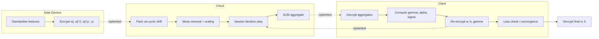
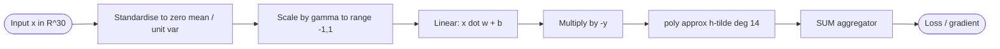
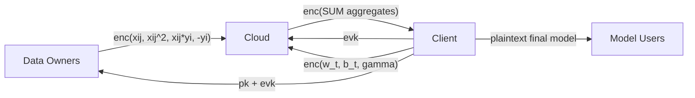

## TL;DR

The authors present a practically viable privacy-preserving training pipeline for a linear SVM using levelled CKKS in a client-assisted (CA) computation model, training a binary classifier on the Wisconsin Breast Cancer dataset (and up to 8,000 synthetic-augmented samples with 30 features) in under 45 seconds at 99.1% accuracy on a single mid-range CPU [Abstract][§4.2].

## Problem and motivation

Existing privacy-preserving ML work focuses almost exclusively on inference; training under FHE is far more compute-intensive and largely impractical [§1, §1.3.2]. The authors target the medical-research scenario where patients (Data Owners) want to contribute data to model training without revealing personal attributes or the target variable to the model-building Client, while a Cloud actor does the heavy ciphertext processing [§1.1.1]. Threat model: the Cloud has no decryption key, must not see plaintext personal data, and is trusted not to collude with the Client; trust assumptions are on par with standard cloud-hosting [§1.1.2]. Security parameters chosen for 128-bit equivalent security [§4.1].

## Key contributions

- Levelled CKKS-based FHE pipeline that makes PPML *training* (not just inference) practical on a single mid-range computer [§1.4, §4.2].
- Client-assisted computation model partitioning heavy linear work to the Cloud and flow-control / non-linear steps to the Client, minimising communication [§1.4, §3].
- Novel low-degree polynomial approximation of the hinge function via doubly integrating a Chebyshev-based approximation of the second derivative, achieving RMSE 0.0050 at multiplicative depth 4 [§3.4, Table 2].
- One-dimensional Newton iteration that combines gradient direction with parabola-based step-size selection, converging in 6–7 iterations [§3.2].
- Column-oriented SIMD packing where one ciphertext vector holds 8,192 samples for a single feature, making training-phase time invariant in sample count up to that limit [§3, §4.2.1].

## FHE setup

- **Scheme(s):** CKKS (levelled) [§2.1, §4.1]
- **Library / implementation:** Microsoft SEAL 4.0 (C/C++) accessed via SEAL-Python wrapper [§4.1].
- **Parameters:** 128-bit equivalent security; chosen to allow multiplicative depth of at least 7 (4 for the polynomial, 3 for the Newton iteration); the minimal selected parameters actually permit depth 8; ciphertext vector length 8,192 elements [§4.1]. Specific polynomial modulus / scale not numerically reported.
- **Bootstrapping used:** No — levelled FHE with bounded multiplicative depth [§2.1, §4.1].
- **Packing / encoding strategy:** SIMD batching with column-oriented packing — one ciphertext vector per feature holds up to 8,192 sample values; Data-Owner contributions are uploaded with single-slot encryptions and cyclic-shifted before SIMD summation [§3, §4.1].

## ML setup

- **Task:** Supervised binary classification training (PPML training, not inference) [§1.4, §3.2].
- **Model architecture:** Linear SVM (equivalent to a perceptron) — weight vector w of length ℓ plus bias b; decision function sign(x·w + b) [§2.2, Eq. 1]. Note: `nn_layers` is N/A because the model is not a neural network; `input_nodes = 30` reflects the 30 WBC features used in the headline result.
- **Activation handling:** Hinge loss approximated by a degree-14 polynomial built by twice-integrating a Chebyshev-based approximation of the (Dirac-like) second derivative; valid on [-1, 1] with α = 1/4 and margin η = 0.2; multiplicative depth 4 for the approximation [§3.1, §3.4, §4.2.2, Table 2].
- **Operates on:** Encrypted data (Data-Owner features and labels) with the model being learned under encryption; the Client holds parameters in ciphertext during iterations and observes only encrypted aggregate statistics returned via the SUM operator [§3].
- **Training vs inference:** Training is performed under encryption; the trained model is decrypted by the Client and used in plaintext at deployment [§1.1.2, §4.2].

## Datasets

| Dataset | Task | Size (train/test) | Modality | Notes |
|---|---|---|---|---|
| Wisconsin Breast Cancer (WBC) [60] | Binary classification (malignant vs benign) | 569 patients total, 80/20 train/test split | Tabular numerical (30 features per tumour) | Target mapped to +1 (benign), −1 (malignant); features standardised to zero mean / unit variance on upload; scalability also tested with synthetic repetitions up to 8,000 samples and up to 60 features [§4.1, §4.2.1]. |

## Pipeline diagram

### Pipeline steps (text)

1. Client generates the CKKS key triplet; publishes the public key and shares the evaluation key with the Cloud [§1.2].
2. Each Data Owner standardises their own feature values to a consistent order of magnitude and encrypts `-y_i`, `x_ij`, `x_ij^2`, and `x_ij * y_i` (single-slot ciphertexts) [§3].
3. Data Owners upload their ciphertexts directly to the Cloud [§1.2].
4. Cloud uses cyclic shifts to place each Data Owner's values in unique slots and packs them column-oriented (one feature per ciphertext vector, up to 8,192 samples per vector) [§3].
5. Cloud computes per-feature means and variances under encryption; mean-removed feature vectors are kept in the Cloud, variance is sent to the Client which derives σ [§3.1, Algorithm 2].
6. Client initialises bias b = 0 and weights proportional to feature-label covariance, then encrypts and sends them to the Cloud [§3.3].
7. Each iteration: Client sends scaling factor γ and current (w, b); Cloud computes ĉ = (-y) × (x̂·w + b), then h̃' and h̃'' polynomial applications, then summed gradient components [§3.2, Algorithm 4].
8. Cloud returns the encrypted aggregates D, H, ∆w, ∆b via the SUM protocol (Algorithm 1) [§3, Algorithm 1].
9. Client decrypts aggregates, computes step size α = D/H in plaintext, applies the Newton update, renormalises w to unit length, halves α if loss worsens, then loops [§3.2].
10. After 6–7 iterations the algorithm converges; Client decrypts the final (w, b) for plaintext deployment to Model Users [§3.2, §4.2].

## Architecture diagram

## Results

Headline accuracy on WBC matches the plaintext baseline at 99.1% on the held-out 20% test split (decrypted, evaluated in plaintext) [§4.2.2]. Total Client/Cloud processing time (without per-sample encryption) is 43.632 s, broken down as: Data Ingest 6.448 s, Model initialisation 2.194 s, Model optimisation 34.99 s; including encryption the total is 100.333 s [Table 1]. Per-Data-Owner encryption time is roughly 150 ms regardless of count [§4.2.1]. Training time is invariant in sample count up to the 8,192 SIMD-slot limit and grows linearly in the number of features (≈1.2 s/feature in training, ≈250 ms/feature in Data Ingest at WBC sample size) [§4.2.1].

| Metric | This paper | Baseline | Hardware |
|---|---|---|---|
| Accuracy on WBC | 99.1% | 99.1% (same model on plaintext) | Intel Core i7-8700 @ 3.20 GHz, 32 GB RAM, Ubuntu 21.10 [§4.1] |
| Training time (8,000 samples, 30 feats) | <45 s (w/o encryption) | Park et al. [47]: 335.45 s (9 features, 10 iters) | Single CPU, no GPU/parallelisation [§4.2, Table 3] |
| Time per iteration | 7.272 s | Park et al. [47]: 33.545 s | Same as above [Table 3] |
| Iterations to convergence | 6 | Park et al. [47]: 10 | — [Table 3] |
| Polynomial approx. RMSE on hinge/ReLU | 0.0050 (depth 4) | Chabanne et al. [13] Taylor: 0.056 (depth 3); Hesamifard et al. [28]: 0.13 (depth 1) | — [Table 2] |
| Park et al. final accuracy | — | 97–98% | — [Table 3] |
| Single-sample encrypted *inference* time | N/A — paper trains under FHE; inference is run in plaintext after decryption [§1.1.2] | — | — |

## Limitations and assumptions

- Only a linear SVM is demonstrated; the authors note this cannot handle datasets such as MNIST and that follow-up work is needed for general models [footnote 3, §5].
- Inference is **not** performed under encryption — the final model is decrypted and served in plaintext, which is explicitly part of the threat model but limits applicability when the model itself is privacy-sensitive [§1.1.2].
- The trust model requires the Cloud to be honest-but-curious and non-colluding with the Client; collusion breaks privacy [§1.1.2].
- Scalability to >8,192 samples requires additional ciphertext vectors and linear growth in training time (claimed parallelisable but not benchmarked) [§4.2.1].
- WBC results past 569 samples use synthetic repetitions of the same training data, not new samples — generalisation behaviour beyond the native dataset is not evaluated [§4.1].
- Communication volume between Client and Cloud across the 6–7 iterations is not quantified.
- The polynomial approximation is only valid on [−1, 1]; data outside this range is handled by the even-degree polynomial smoothly but is not characterised quantitatively for outlier-heavy datasets [§3.1].
- Exact CKKS polynomial modulus, coeff modulus chain, and scale values are not numerically reported [§4.1].

## Related work it compares against

CryptoNets [24], Chabanne et al. [13], Hesamifard et al. CryptoDL [29] and [28], Lee et al. (RNS-CKKS) [35], Badawi et al. (FHE SVM inference) [5], Bajard et al. [6], MP2ML / nGraph-HE [9, 10], MiniONN [37], Chameleon [51], Gazelle [32], SecureML [41], Nandakumar et al. [43], Vizitiu et al. (MORE scheme) [59], Park et al. (HE-friendly SVM training) [47], Chillotti et al. (Concrete / TFHE) [17, 18, 19].

## Code and artifacts

Not released. License: Not reported. (SEAL [55] and SEAL-Python [14] are cited as the underlying libraries.)

## Extra diagrams (optional)

### Threat model

### Activation approximation

See Figure 1 and Table 2 in paper. The hinge h(x) = max(x, 0) is approximated on [−1, 1] by twice-integrating Q(x) = α·T_n(s − (s+1)x²) where T_n is the Chebyshev polynomial of even degree n, with α = 1/4 and degree-14 final polynomial h̃, achieving RMSE 0.0050 at multiplicative depth 4 [§3.4, Table 2].

## Open questions

- Exact CKKS encryption parameter values (polynomial modulus degree, coefficient modulus chain, scale) — only the security level (128-bit), slot count (8,192), and multiplicative depth (≥7, used 8) are stated [§4.1].
- Total ciphertext communication volume between Client and Cloud across one training run.
- Whether the 99.1% accuracy was averaged across seeds / splits, or reflects a single 80/20 split.
- How robustly the polynomial range [−1, 1] holds when training on heavier-tailed real-world data versus the standardised WBC features.
- Whether the "follow-up experiments" with 8,000 synthetic-augmented samples preserve held-out accuracy (only timing is reported) [§4.1].
