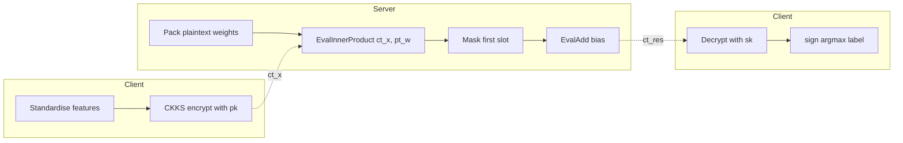
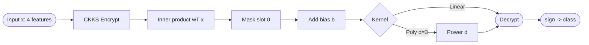
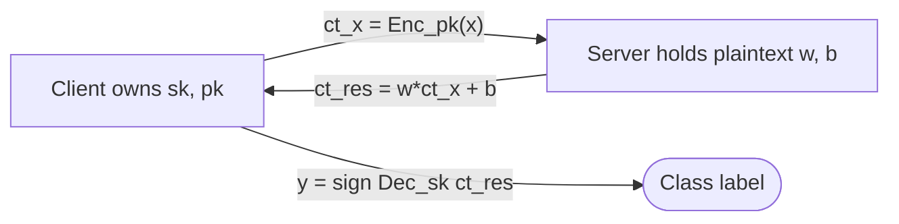

## TL;DR

The paper measures the performance overhead of running CKKS-encrypted SVM inference (both linear and polynomial kernels) on the Iris dataset using OpenFHE, sweeping multiplication depth, scaling factor, first modulus size, security level, batch size, and ring dimension [Abstract, §1]. Encrypted inference matches plaintext accuracy (96.7%) but is roughly 1,000x slower; ring dimension and modulus size dominate cost, while SVM-Linear and SVM-Poly perform similarly [Abstract, §6, §7].

## Problem and motivation

Machine learning increasingly consumes PII, and while data can be encrypted at rest and in transit, it is typically processed in plaintext. The paper applies FHE (CKKS via OpenFHE) so an SVM can be evaluated on encrypted feature vectors, and characterises the resulting overhead across multiple cryptographic parameters [§1]. The threat model is not explicitly stated, but the workflow (client-side encryption with public key, server-side encrypted inference on a plaintext-trained model, client-side decryption with private key) implies a Private Prediction-as-a-Service setting with an honest-but-curious server [§3.1, §3.4, Algorithm 1].

## Key contributions

- Apply CKKS-based FHE to both linear-kernel and polynomial-kernel SVMs through OpenFHE in a Python/scikit-learn pipeline [§1, §4].
- Provide a systematic parameter sweep over multiplication depth (1-7), scaling factor (10-50), first modulus size (20-60), security level (128/192/256-bit), batch size (128-4096), and ring dimension (2^14-2^17) [§5.1].
- Show that encrypted inference preserves classification accuracy (96.7% on Iris) versus plaintext SVM [§6, Table 4].
- Identify ring dimension and modulus size as the two main parameters driving runtime, with SVM-Linear and SVM-Poly performing similarly [Abstract, §7].

## FHE setup

- **Scheme(s):** CKKS (approximate arithmetic over complex / real numbers) [§2.7, §4].
- **Library / implementation:** OpenFHE via openfhe-python; ML side uses scikit-learn and NumPy [§4, §4.1, Table 1].
- **Parameters:** Swept across multiple configurations [§5.1]:
  - Multiplication depth D: 1 to 7
  - Scaling factor S: 10, 20, 30, 40, 50
  - First modulus size M: 20, 30, 40, 50, 60
  - Security level L: 128-bit, 192-bit, 256-bit
  - Batch size B: 128, 256, 512, 1024, 2048, 4096
  - Ring dimension N: 2^14 (16,384), 2^15 (32,768), 2^16 (65,536), 2^17 (131,072)
- **Bootstrapping used:** Not reported (paper discusses bootstrapping conceptually [§2.3] but does not state whether it was invoked; multiplication depth was bounded so likely no bootstrapping in the experiments).
- **Packing / encoding strategy:** CKKS packed plaintexts via `MakeCKKSPackedPlaintext`, with an `EvalInnerProduct` over the encrypted feature vector and plaintext weights, followed by a mask-and-multiply to extract the first slot and an `EvalAdd` of the bias [Appendix A].

## ML setup

- **Task:** Classification (encrypted inference on Iris flower species) [§4, §4.2].
- **Model architecture:** SVM with two kernels - Linear: f(x) = w^T x + b; Polynomial: f(x) = (w^T x + b)^d (degree d=3, gamma=2 per Appendix A) [§3.4, Appendix A]. Trained via scikit-learn `SVC` on plaintext data; learned weights, intercept, dual coefficients and support vectors are exported for the encrypted inference scripts [§4.1, Appendix A].
- **Activation handling:** No neural-network activations; the sign function is applied after decryption on the client [Algorithm 1, Eq. 24, Eq. 27].
- **Operates on:** Plaintext model + encrypted data (features encrypted with the client's public key; model weights/biases remain plaintext at inference - despite Algorithm 1 line 2 describing "Encrypt Model Parameters", Appendix A shows weights packed as `pt_weights` plaintext and used via `EvalInnerProduct(ct_x, pt_weights, n)`) [Appendix A, Algorithm 1].
- **Training vs inference:** Training in plaintext via scikit-learn; only inference runs under encryption [§4, §4.1].

## Datasets

| Dataset | Task | Size (train/test) | Modality | Notes |
|---|---|---|---|---|
| Iris | 3-class classification (setosa, versicolor, virginica) | 120 / 30 (80%/20% split of 150 samples) | Tabular (4 features: sepal length/width, petal length/width, cm) | Standardised to zero mean, unit variance; UCI ML Repository; Appendix B notes the same script can also be used with a `credit_approval` dataset, but reported results are on Iris [§4, §4.2, Appendix A, Appendix B] |

## Pipeline diagram

### Pipeline steps (text)

1. Train SVM-Linear and SVM-Poly on plaintext Iris data with scikit-learn; export weights, intercept, dual coefficients, and support vectors [Appendix A].
2. On the client, standardise the test feature vector and CKKS-encrypt it with the public key (`ct_x = cc.Encrypt(keys.publicKey, pt_x)`) [Appendix A].
3. Send `ct_x` to the server.
4. Server packs the plaintext weights and bias, then computes the encrypted inner product `EvalInnerProduct(ct_x, pt_weights, n)` [Appendix A, Eq. 25].
5. Server multiplies by a one-hot mask to keep the first slot, then adds the bias via `EvalAdd` [Appendix A].
6. For SVM-Poly, the decision function `(w^T x + b)^d` is evaluated under encryption [Eq. 28, Algorithm 1].
7. Send the resulting ciphertext `ct_res` back to the client.
8. Client decrypts with the secret key and applies `sign(.)` to produce the class label [Algorithm 1, Eq. 30].

## Architecture diagram

## Results

| Metric | This paper | Baseline | Hardware |
|---|---|---|---|
| Classification accuracy (encrypted SVM) | 96.7% | 96.7% (plaintext SVM) | AWS EC2 t3.medium, 2 vCPUs Intel Xeon 3.1 GHz, 4 GB RAM [Table 1, Table 4] |
| Average encrypted inference time | 0.2029 s | 0.0002 s plaintext | Same as above [Table 5, Appendix B] |
| Feature encryption time | 0.2029 s | n/a | Same [Table 5] |
| Decryption time | 0.0001 s | n/a | Same [Table 5] |
| Encrypted/plaintext slowdown | ~1,000x | - | Same [§6] |
| Scale-up vs ring dimension (SVM-Linear, D=1, S=30, M=60, L=128, B=1024) | 16K: 963.8x; 32K: 2,026.5x; 64K: 3,646.7x; 128K: 8,245.3x | - | Same [Table 6] |
| Scale-up vs ring dimension (SVM-Poly) | 16K: 910.6x; 32K: 1,851.7x; 64K: 3,935.1x; 128K: 7,716.4x | - | Same [Table 6] |
| Scale-up vs multiplication depth, SVM-Linear (D=1..7) | 1,032.8 / 1,172.7 / 1,397.2 / 1,794.5 / 2,056.4 / 2,097.5 / 2,324.5 | - | Same [Table 7] |
| Scale-up vs multiplication depth, SVM-Poly (D=1..7) | 915.2 / 1,093.3 / 1,460.5 / 1,527.7 / 1,665.7 / 1,954.9 / 2,248.4 | - | Same [Table 7] |
| AET at S=10 (degraded accuracy) | 0.817 (Linear) / 0.784 (Poly) | 0.967 plaintext | Same [Tables 2,3] |

Note: the 0.2029 s figure is the average encrypted inference time per sample reported in Appendix B (`Avg Encrypted Time: 0.2029 sec`) and Table 5; it is used here as `single_inference_seconds`.

## Limitations and assumptions

- ~1,000x slowdown vs plaintext makes real-time deployment impractical; ciphertext memory footprint is a scalability concern, especially on constrained devices [§6, Limitations and Future Work].
- Number-theoretic transform multiplication is O(n log n) and SVM matrix-vector ops are quadratic, compounding the cost [§6].
- Multiplication depth vs accuracy is a fundamental trade-off tied to the hardness of RLWE [§6].
- Only the Iris dataset (150 samples, 4 features, 3 well-separated classes) is evaluated - a toy benchmark; generalisation to higher-dimensional or harder tabular tasks is not demonstrated [§4, §4.2].
- The threat model is not explicitly defined; communication costs are not analysed.
- Algorithm 1 describes encrypting model parameters, but the actual implementation in Appendix A keeps weights and bias as plaintext packed values - the paper does not reconcile this discrepancy.
- At scaling factor S = 10, accuracy drops sharply (Linear AEA 0.817, Poly AEA 0.784) [Tables 2, 3], which the paper notes only implicitly.
- Bootstrapping is discussed conceptually but its use in the experiments is not stated.

## Related work it compares against

The paper positions itself relative to general FHE-ML literature rather than against specific encrypted-SVM baselines. Cited reference points include OpenFHE/PALISADE [§2.2], Microsoft SEAL [§2.2], the BGV/BFV [§2.6] and CKKS [§2.7] scheme papers, GWAS work by Blatt et al. via OpenFHE [§3.3], the PPaaS/PTaaS taxonomy by Iezzi et al. [§3.1], the Wood et al. FHE-for-medicine survey [§2.2, §3.1], and Bourse et al. on FHE-evaluated discretized NNs [§5]. No prior encrypted-SVM systems are directly benchmarked.

## Code and artifacts

Not released as a public repository; the paper provides Python code snippets in Appendix A (using `openfhe-python`, `scikit-learn`, `NumPy`) and references scripts `model_training.py`, `get_data.py`, `encrypted_svm_linear.py`, `encrypted_svm_poly.py` without a hosting URL [§4.1, Appendices A and B]. License not stated.

## Extra diagrams (optional)

### Threat model

## Open questions

- Is this paper the same as the near-duplicate Buchanan & Ali 2025 "Privacy-Preserving SVM" preprint, or a sibling? Based only on this .txt (titled "Privacy-aware" and posted as arXiv:2503.04652v1, 6 Mar 2025), it cannot be confirmed; the slug `buchanan-2025-svm-pa` (Privacy-aware) distinguishes it from a potential `buchanan-2025-svm-pp` (Privacy-Preserving) - the two preprints may be different drafts of the same work and should be cross-checked.
- Algorithm 1 says model parameters are encrypted, but Appendix A keeps weights and bias in plaintext - which path was actually measured?
- Was bootstrapping enabled at any depth, or were all D values within the unbootstrapped budget?
- The polynomial kernel uses degree d = 3 (Appendix A) but inference for SVM-Poly is only ~1x-2x slower than SVM-Linear at the same depth - is the kernel power being evaluated under encryption, or is the comparison effectively measuring the same inner-product circuit?
- The threat model (honest-but-curious? collusion?) is never made explicit.
- Communication cost (ciphertext size shipped between client and server) is not reported.
