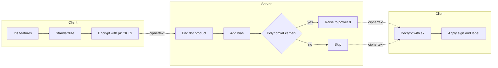
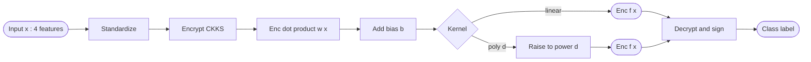
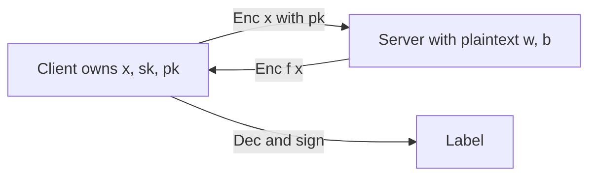

## TL;DR

The authors evaluate the performance overhead of CKKS-encrypted SVM inference (linear and polynomial kernels) using OpenFHE on the Iris dataset, finding that ring dimension and first-modulus size are the dominant cost factors while classification accuracy (96.7%) is preserved versus plaintext [§6, §7].

## Problem and motivation

ML pipelines often expose personally identifiable information (PII) during in-process computation, even when data are encrypted at rest and in transit [§1]. The paper targets this gap by running SVM inference directly over CKKS-encrypted feature vectors, so the cloud-side classifier never sees plaintext. The threat model is implicit and consistent with standard FHE inference: the server is honest-but-curious (no collusion or malicious-client discussion is given in the text).

## Key contributions

- Implement a privacy-preserving SVM (linear and polynomial kernels) on CKKS via OpenFHE [§1].
- Sweep six encryption parameters (multiplicative depth, scaling factor, first modulus size, security level, batch size, ring dimension) and report execution-time impact [§5.1, §6].
- Identify ring dimension and first modulus size as the dominant performance levers; show accuracy is preserved at 96.7% across configurations [§7].

## FHE setup

- **Scheme(s):** CKKS (approximate arithmetic over real numbers) [§4]
- **Library / implementation:** OpenFHE (openfhe-python bindings) [§4.1.1]
- **Parameters:** multiplicative depth D in {1..7}; scaling factor S in {10, 20, 30, 40, 50}; first modulus size M in {20, 30, 40, 50, 60}; security level L in {128, 192, 256}-bit; batch size B in {128, 256, 512, 1024, 2048, 4096}; ring dimension N in {2^14, 2^15, 2^16, 2^17} = {16384, 32768, 65536, 131072} [§5.1]
- **Bootstrapping used:** Not reported (discussed conceptually; not stated whether enabled in the depth-1..7 experiments)
- **Packing / encoding strategy:** CKKS SIMD batch slots (batch-size parameter swept); details of vector-to-slot mapping not reported

## ML setup

- **Task:** Encrypted multiclass classification (inference only; training is plaintext) [§4, §5]
- **Model architecture:** SVM with linear kernel (`f(x) = w^T x + b`) and polynomial kernel (`f(x) = (w^T x + b)^d`) [§3.3, Eqs. 16, 19]; weights trained with scikit-learn on plaintext then exported.
- **Activation handling:** Final `sign(...)` is performed after decryption on the client side [Algorithm 1, line 12]; no nonlinearity is approximated inside ciphertexts.
- **Operates on:** Encrypted feature vector; model weights are described as encrypted in Algorithm 1 (`c_w <- Enc(w, pk)`, `c_b <- Enc(b, pk)`) [Algorithm 1, lines 2-4]. The text elsewhere says weights/intercepts are exported plaintext from sklearn before inference [§3.3], so the two descriptions are slightly inconsistent.
- **Training vs inference:** Training runs in plaintext via scikit-learn; only inference is run under FHE [§3.3, §4].

## Datasets

| Dataset | Task | Size (train/test) | Modality | Notes |
|---|---|---|---|---|
| Iris (UCI) | 3-class classification | 120 train / 30 test (80/20 split) | Tabular, 4 features (sepal length/width, petal length/width) | Standardized to zero mean, unit variance; 150 samples, 3 balanced classes [§4.2.1, §4.2.2] |

## Pipeline diagram

### Pipeline steps (text)

1. Train SVM (linear or polynomial) on plaintext Iris data with scikit-learn; export weights w and bias b [§3.3, §4].
2. Client standardizes the test feature vector x and CKKS-encrypts it with the public key pk (Eq. 15) [Algorithm 1, line 1].
3. Server computes the encrypted decision function: `Enc(w^T x + b)` for linear, or `Enc((w^T x + b)^d)` for polynomial [Algorithm 1, lines 5-10].
4. Server returns the resulting ciphertext c_f to the client.
5. Client decrypts c_f with the private key sk to recover f(x) (Eq. 22) [Algorithm 1, line 11].
6. Client applies `sign(f(x))` and maps to the predicted class label (Eq. 23) [Algorithm 1, line 12].

## Architecture diagram

## Results

Headline: encrypted accuracy matches plaintext exactly at 96.7% on Iris; encrypted single-sample inference is around 1000x slower than plaintext on the t3.medium instance, with ring dimension being the dominant scaling factor [§6.1.1, §6.1.2, §6.1.4].

| Metric | This paper | Baseline | Hardware |
|---|---|---|---|
| Encrypted accuracy (SVM, Iris) | 96.7% | 96.7% (plaintext SVM) | AWS EC2 t3.medium, 2 vCPU Intel Xeon 3.1 GHz, 4 GB RAM [§4.1.3] |
| Feature encryption time | 0.2029 s | - | t3.medium [Table 5] |
| Encrypted inference time | 0.2029 s | 0.0002 s (plaintext) | t3.medium [Table 5] |
| Decryption time | 0.0001 s | - | t3.medium [Table 5] |
| Encrypted inference scale-up (linear, MD=1..7, N=16384) | 1032.8 -> 2324.5 (ratio vs plaintext) | 1.0 | t3.medium [Table 7] |
| Encrypted inference scale-up (poly, MD=1..7, N=16384) | 915.2 -> 2248.4 | 1.0 | t3.medium [Table 7] |
| Encrypted inference time vs ring dim (poly, MD=1) | 915.2 s (N=16384) -> 7716.4 s (N=131072) | - | t3.medium; reported as "training time" in §7 but corresponds to the AET/scale-up rows in Tables 2-3 and 6 [§7, Table 6] |
| Accuracy with scaling factor S=10 | 81.7% (linear) / 78.4% (poly) | 96.7% plaintext | Drops only at S=10; recovers at S>=20 [Tables 2, 3] |

Note: Tables 2 and 3 report Average Encryption Time (AET) per configuration in seconds, but it is not stated whether AET is per ciphertext, per test sample, or for the full 30-sample test set. The single-inference figure of 0.2029 s used in `comparison.single_inference_seconds` is taken from Table 5 (Runtime analysis) [§6.1.2, Table 5].

## Limitations and assumptions

- Single tiny dataset (Iris, 150 samples, 4 features) [§4.1, §4.2.1] - claims about parameter scaling do not necessarily generalize to high-dimensional inputs.
- Encrypted inference is ~1000x slower than plaintext, which the authors flag as a barrier to real-time use [§6.1.2, §6.2.5].
- Memory overhead is discussed qualitatively but not measured ("memory consumption is not explicitly tabulated") [§6 bullet on Memory Use].
- Algorithm 1 lists weights and bias as encrypted, but §3.3 describes them as plaintext exports from sklearn - the actual operating mode (enc-data + plain-model vs both encrypted) is ambiguous.
- Bootstrapping behaviour under depth 1..7 is not explicitly stated; whether noise is exhausted at higher D is not directly addressed.
- Hardware is a 2-vCPU t3.medium with 4 GB RAM; no GPU/FPGA acceleration was evaluated, though discussed as future work [§6.2.5].

## Related work it compares against

The paper does not benchmark numerically against other FHE-SVM systems. It positions itself relative to: Iezzi et al. (PPaaS/PTaaS taxonomy) [§3.1, ref 12]; Wood et al. (HE-for-ML survey) [§3.1, ref 9]; Blatt et al. (GWAS via OpenFHE, chi-squared and logistic regression) [§3.2, ref 13]; Cheon et al. (CKKS) [ref 6]; Brakerski-Vaikuntanathan (RLWE) [ref 5]; and Gentry (original FHE) [refs 3, 11].

## Code and artifacts

Available at https://github.com/openfheorg/education/tree/main/examples/FHE_SVM_Examples (accessed 20 May 2025) [Data Availability Statement]. License: not stated in the text.

## Extra diagrams (optional)

### Threat model

The paper does not formally state honest-but-curious, malicious, or collusion assumptions; the diagram reflects the implicit model where the server performs the homomorphic decision function and never sees plaintext features or the private key.

## Open questions

- Is AET (Tables 2, 3) per-sample, per-batch, or per-test-set? The 0.2029 s in Table 5 vs the 0.6-5.1 s in Table 2 for the same baseline configuration (MD=1, N=16384) are not reconciled in the text.
- Does Algorithm 1 reflect the actual implementation (encrypted weights), or is the operating mode encrypted-data + plaintext-model as §3.3 implies?
- Why does Table 2 row 1 report AET=0.643458 s while the very similar row 16 (same parameters) reports 0.641 s and Table 5 reports 0.2029 s? Are these different measurement scopes?
- Why does the conclusion call the 915.2 -> 7716.4 s figure a "training time" when the paper otherwise frames training as plaintext-only?
- Memory footprint vs ring dimension is mentioned but never quantified.
