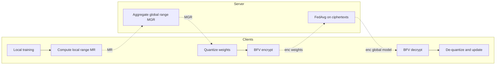
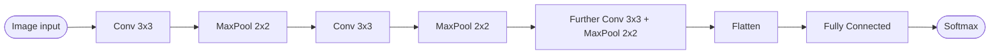
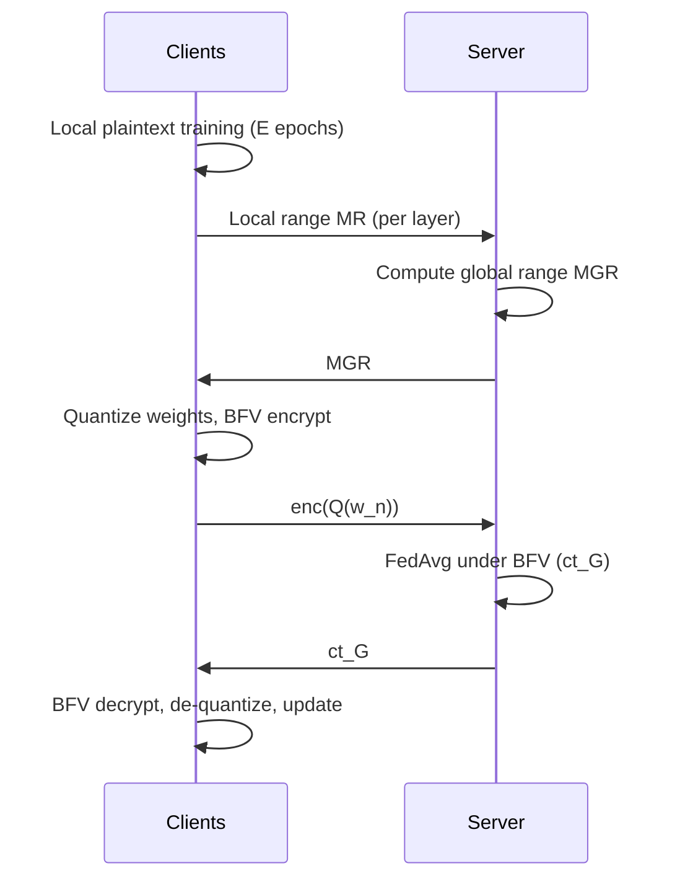

## TL;DR

The paper proposes a privacy-preserving federated learning (PPFL) protocol that applies a Dynamic Range Evaluation Layer-for-Layer (DREL) quantization to local model weights so they can be encrypted with the integer-friendly BFV scheme at 192-bit security, drastically reducing encryption, decryption, aggregation time and ciphertext size versus Paillier and CKKS while preserving FedAvg accuracy [Abstract][§I].

## Problem and motivation

Federated learning protects raw data but local weight/gradient sharing is still vulnerable to reversal model and membership inference attacks [§I]. Existing PPFL-HE schemes either incur high communication overhead (gradient-based protocols), or use Paillier/CKKS which are computationally heavy on real-valued weights at high security levels [§I][§II]. The threat model assumes an honest-but-curious server interested in model and data, and honest clients with limited resources [§III-C].

## Key contributions

- An efficient PPFL-HE method using a DREL quantization strategy plus BFV (192-bit security) to encrypt and aggregate weights [§I].
- Improved trade-off between computational and communication overhead vs prior PPFL-HE work; quantization preserves sums for FedAvg aggregation [§I][§II-D].
- Ablation and comparative analysis (vs Paillier/CKKS-based PPFL-HE and No-PPFL) and BFV security analysis [§I][§V][§V-F].

## FHE setup

- **Scheme(s):** BFV (Brakerski/Fan-Vercauteren), with Paillier and CKKS as comparison baselines [§III-A][§V-C].
- **Library / implementation:** Not reported.
- **Parameters:** Security level 192 bits (comparable to AES-192) [§I][§VI]. Specific polynomial modulus degree and plaintext modulus values listed in Table 3 but actual numeric values are not extracted in the source text [§V-C].
- **Bootstrapping used:** Not reported (BFV described as FHE based on RLWE) [§III-A].
- **Packing / encoding strategy:** Weights are quantized layer-by-layer to signed r-bit integers (r = 16 in the paper) via DREL before BFV encryption; details of SIMD batching not reported [§IV-A][§IV-B].

## ML setup

- **Task:** Federated learning training round (encrypted aggregation of locally trained model weights) [§IV].
- **Model architecture:** Three CNN models (CNN-2, CNN-3, CNN-6) with 3x3 convolutional layers followed by 2x2 max pooling, plus a feedforward neural network (FNN) for Sent140 (Embedding -> Flatten -> 2 Fully Connected Layers) [§V-B]. Per-model parameter counts in Table 2 (not transcribed).
- **Activation handling:** Not reported (no polynomial approximation needed because only the aggregation step is run under FHE, not inference).
- **Operates on:** Encrypted local weights aggregated by the server with FedAvg; training itself is plaintext on each client [§IV-C].
- **Training vs inference:** Aggregation of weights is encrypted (federated round); local training and local inference are plaintext.

## Datasets

| Dataset | Task | Size (train/test) | Modality | Notes |
|---|---|---|---|---|
| CIFAR-10 | Image classification | Not reported in text | Images | 5 clients, equal split [§V-A][§V-C] |
| MNIST | Image classification | Not reported in text | Images | 5 clients [§V-A][§V-C] |
| Fashion MNIST (FMNIST) | Image classification | Not reported in text | Images | 5 clients [§V-A][§V-C] |
| SVHN | Image classification | Not reported in text | Images | 5 clients [§V-A][§V-C] |
| Sent140 (LEAF) | Sentiment classification | Not reported in text | Text (tokenized) | 10 clients [§V-A][§V-C] |

## Pipeline diagram

### Pipeline steps (text)

1. Key generation center distributes BFV public/secret keys and parameters to clients; server gets context only [§IV-C].
2. Server selects clients to start the FL round [§IV-B].
3. Each client trains its local model for E epochs on local data [§IV-C].
4. Each client computes per-layer min/max ranges MR via DREL and sends them to the server [§IV-A][§IV-C].
5. Server chains all MR into MGR and computes the global per-layer range [alpha_G, beta_G]; sends back to clients [§IV-A].
6. Clients quantize weights to signed r-bit integers using the global range and encrypt with BFV [§IV-B][§IV-C].
7. Clients send ciphertext weights to the server [§IV-C].
8. Server aggregates ciphertexts with FedAvg under BFV homomorphism [§IV-C].
9. Clients receive encrypted global model, decrypt, de-quantize, and update local model [§IV-B][§IV-C].
10. Steps repeat for each FL round (number of communication rounds = 2*K because of the extra DREL exchange) [§V-D].

## Architecture diagram

The paper uses several architectures; exact widths and parameter counts are listed in the paper's Table 2 (not transcribed in source text). Schematic for the image-based CNN family:

### FNN (Sent140)

## Results

Accuracy and overhead reported after 15 FL training rounds, 5 clients for image datasets, 10 for Sent140, 30 local epochs with early stopping patience 5 [§V-C][§V-D].

| Metric | This paper | Baseline | Hardware |
|---|---|---|---|
| Accuracy delta vs No-PPFL | +0.24% (CIFAR-10), +0.08% (MNIST), +0.20% (Sent140), 0% (SVHN), +0.12% on FMNIST [§V-D] | No-PPFL FedAvg | AMD Threadripper 1920 8-core, Titan RTX 24GB, 64GB RAM [§V-C] |
| Worst-case accuracy loss vs CKKS | 0.39% (FMNIST); best 0.01% (MNIST) [§V-D] | CKKS-based PPFL-HE | same |
| Encryption time reduction | 72-76.62% vs CKKS; 99.92-99.98% vs Paillier [§V-D] | CKKS / Paillier PPFL-HE | same |
| Decryption time reduction | 50.77-67.02% vs CKKS; 99.84-99.96% vs Paillier [§V-D] | CKKS / Paillier | same |
| Aggregation time reduction | 73.08-80.34% vs CKKS; 89.92-94.16% vs Paillier [§V-D] | CKKS / Paillier | same |
| Average encryption time saving (Abstract/Conclusion) | 99.95% vs Paillier; 73.79% vs CKKS [Abstract][§VI] | Paillier / CKKS | same |
| Average decryption time saving | 99.90% vs Paillier; 55.13% vs CKKS [Abstract][§VI] | Paillier / CKKS | same |
| Ciphertext size reduction (CNN-3) | 75.36% vs CKKS; 9.34% vs Paillier [§V-D][§VI] | Paillier / CKKS | same |
| Ciphertext size reduction (CNN-6) | 74.98% vs CKKS; 2.11% vs Paillier [§V-D] | Paillier / CKKS | same |
| FL rounds to convergence | High accuracy by round 4 (CIFAR-10), round 3 (SVHN), round 1 (MNIST/FMNIST/Sent140); communication rounds = 2*K [§V-D] | Gradient-protection PPFL-HE (much higher) | same |
| Quantization error rate | ~1.94e-5 with r=16 [§IV-B]; lower median/IQR than no-DREL [§V-E] | Fixed-range quantization [-1,1] | same |

Note: single-sample inference is not the workload — this is a federated training paper. Per-round latency components are reported but a single encrypted inference time is not applicable; comparison.single_inference_seconds is "N/A".

## Limitations and assumptions

- Threat model assumes honest clients and an honest-but-curious server; sharing the per-layer range MR could leak information to a curious adversarial server — authors flag adding Differential Privacy as future work [§VI].
- Ciphertext-size advantage of BFV+DREL diminishes for small models: Paillier produces smaller ciphertext on CNN-2 and FNN (low parameter counts) [§V-D].
- Number of communication rounds doubles to 2*K because of the DREL exchange, although still far fewer than gradient-protection baselines [§V-D].
- Specific BFV polynomial modulus and plaintext modulus values are in Table 3, not transcribed in the source text used for this summary.
- Library / implementation not stated in the extracted text.
- Authors acknowledge ciphertext size remains a challenge for deep models with millions of parameters [§VI].

## Related work it compares against

- BatchCrypt (CKKS-based gradient batching, USENIX ATC 2020) [§II-A][Ref 23].
- Hao et al. BGV-based PPFL [Ref 2][§II-A].
- Zhang Y. et al. compressed-sensing PPFL [Ref 13][§II-B].
- He C. et al. improved Paillier PPFL [Ref 24][§II-B].
- Lyu et al. stochastic quantization PPFL [Ref 25][§II-C].
- Chen et al. multiplicative symmetric quantization with dACIQ [Ref 26][§II-C].
- Tian et al. and Han et al. adaptive/heterogeneous quantization PPFL [Refs 27, 28][§II-C].

## Code and artifacts

Not released (no repository URL stated in the extracted text).

## Extra diagrams (optional)

### Threat model

### Federated round

### Activation approximation

Not applicable — the FHE workload is FedAvg-style weight summation, so no nonlinearities are evaluated under encryption.

## Open questions

- Concrete BFV parameter set (polynomial modulus degree, plaintext modulus) used at 192-bit security — listed in Table 3 of the paper but not in the transcribed text.
- Exact per-model parameter counts (Table 2) and per-dataset train/test split sizes.
- Which HE library was used (SEAL, OpenFHE, Lattigo, etc.) — not stated in the extracted text.
- How DREL behaves with non-IID and adversarial clients beyond the experiments shown.
- Whether the shared MR ranges leak exploitable information in stronger threat models; authors propose DP as future mitigation [§VI].
