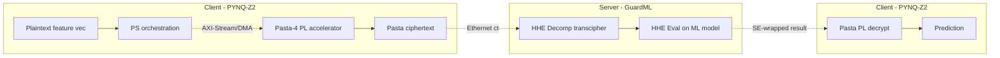
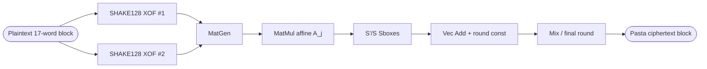

## TL;DR

HHEML is an end-to-end hardware-accelerated hybrid-homomorphic-encryption (HHE) framework targeting edge devices: a PYNQ-Z2 FPGA runs a pipelined Pasta symmetric cipher on the client, encrypted blocks are shipped over Ethernet to a server that transciphers them to FHE (via GuardML) and runs encrypted inference, cutting client-side latency from 356 ms to 6.5 ms on MNIST [§Abstract, §VI.B].

## Problem and motivation

Pure FHE-based PPML imposes prohibitive computational and ciphertext-expansion overhead on resource-constrained IoT/edge clients [§I]. HHE mitigates this by using a lightweight, FHE-friendly symmetric cipher (Pasta) on the client and transciphering to FHE on the server [§I]. Prior HHE work is either software-only (high client latency) or hardware-only without integration into a complete PPML pipeline; HHEML targets that gap with a co-designed FPGA + Ethernet + FHE-server flow [§II.C]. Threat model: the computation server is untrusted (honest-but-curious is implied by the FHE-PPML setting); the client exclusively holds the secret key [§I].

## Key contributions

- An FPGA-based HHE acceleration framework integrating symmetric encryption with FHE compatibility for edge devices [§I].
- A hardware implementation of the Pasta (Pasta-4) cipher with a dual-XOF pipelined permutation, supporting both encryption and decryption through a shared AXI-Stream wrapper [§IV.B, §V.E].
- System-level evaluation inside a complete PPML pipeline using GuardML on the server, with Ethernet-based offloading and DMA-coupled PS-PL transfers [§IV.A, §V.D].
- Claimed first design to integrate an end-to-end HHE framework with hardware acceleration [§Abstract].

## FHE setup

- **Scheme(s):** Hybrid HE. Client-side symmetric cipher: Pasta-4 [§IV.B]. Server-side FHE: the GuardML stack handles transciphering ("HHE Decomp") and homomorphic evaluation [§IV.A, Fig. 2]; the specific underlying FHE scheme inside GuardML is not restated.
- **Library / implementation:** Custom Verilog/HLS Pasta accelerator on Xilinx PYNQ-Z2, synthesized with Vivado 2022.1; PYNQ Python APIs drive DMA; GuardML on the server [§VI.A].
- **Parameters:** Pasta operates over a finite field F_p with 32-bit words; state x ∈ F_p^{2t}, t-word halves, Pasta-4 uses r = 4 rounds [§III.E, §III.A]; SHAKE128 is the XOF [§III.E, §V.A]. Concrete FHE parameters (poly degree, modulus, security level) are not reported.
- **Bootstrapping used:** Not reported.
- **Packing / encoding strategy:** Plaintexts are streamed in 17-word (32-bit) packets per encryption round into the Pasta core [§IV.B, §V.A]; an MNIST image is encoded as 784 32-bit words [§VI.A].

## ML setup

- **Task:** Encrypted inference on MNIST (the paper benchmarks the cryptographic pipeline rather than presenting a new model) [§VI.A].
- **Model architecture:** Not reported in detail — the server reuses the GuardML inference stack ("Machine Learning Model" block in Fig. 2) [§IV.A]. No layer-by-layer specification is given.
- **Activation handling:** Not reported. Related work [24] is cited for polynomial approximation but is not used here.
- **Operates on:** Plaintext model + encrypted data (standard FHE inference-as-a-service) [§I, §IV.A].
- **Training vs inference:** Inference only; results are re-encoded as symmetric ciphertexts, returned to the client, and decrypted in hardware [§IV.A].

## Datasets

| Dataset | Task | Size (train/test) | Modality | Notes |
|---|---|---|---|---|
| MNIST | Image classification (encrypted inference benchmark) | Not reported | 28x28 grayscale images | Encoded into 784-word plaintext blocks of 32-bit words [§VI.A] |

## Pipeline diagram

### Pipeline steps (text)

1. PS collects a plaintext feature vector (e.g., an MNIST image as 784 32-bit words) [§IV.A, §VI.A].
2. PS streams the data to the PL Pasta-4 accelerator over AXI4-Stream with DMA [§IV.B, §V.D].
3. PL generates the SHAKE128 keystream with two parallel XOF modules and masks the plaintext in 17-word packets per round, producing a Pasta ciphertext [§V.A, §V.E].
4. PS transmits the Pasta ciphertext plus the (SE-protected) symmetric key over Ethernet to the server [§IV.B].
5. Server's GuardML "HHE Decomp" transciphers Pasta ciphertext into FHE ciphertext [§IV.A, Fig. 2].
6. Server runs homomorphic evaluation of the ML model on the FHE ciphertext [§IV.A].
7. Server re-encodes the encrypted result as a symmetric ciphertext and returns it to the client [§IV.A].
8. PL decrypts the returned ciphertext in hardware to produce the final prediction [§IV.A].

## Architecture diagram

The paper does not specify the server-side ML model architecture; it reuses the GuardML inference stack [§IV.A, §VI.B]. The HHEML hardware datapath itself is shown below in lieu of an NN diagram.

## Results

| Metric | This paper | Baseline | Hardware |
|---|---|---|---|
| 1-round encryption | 34.3 µs | 66.1 µs (Pasta on Edge) | PYNQ-Z2 @ 75 MHz [Table I] |
| MNIST encryption | 1,553.4 µs | 3,106.7 µs (Pasta on Edge) | PYNQ-Z2 @ 75 MHz [Table I] |
| Rounds per MNIST image | 24 | 47 (single-XOF) | — [Table II] |
| Relative throughput | 1.95x | 1.00x (single-XOF) | PYNQ-Z2 [Table II] |
| Client internal comm | 6.5 ms | — | PYNQ-Z2 [Table III] |
| Client to server comm | 0.4 ms | 356 ms (GuardML SW) | Ethernet LAN [Table III] |
| Total client-side latency | 6.9 ms | 356 ms (GuardML) | — [Table III] |
| Server-side decomp (MNIST) | 9,397.5 s | 9,397.5 s (unchanged) | Intel i7-10750H @ 2.6 GHz, 16 GB RAM [Table IV] |
| Server-side eval (MNIST) | 54.9 s | 54.9 s (unchanged) | Intel i7-10750H @ 2.6 GHz, 16 GB RAM [Table IV] |
| Power (client) | 1.505 W | 1.2 W (Pasta on Edge) | PYNQ-Z2 [Table I] |
| LUTs / FFs / DSP / BRAM | 34,419 / 18,372 / 64 / 2 | 23,736 / 11,132 / 64 / 0 | PYNQ-Z2 [Table I] |
| Headline accuracy | Not reported | Not reported | — |

Note: per the template rules, the paper only reports server-side end-to-end transciphering + evaluation totals (9,397.5 s + 54.9 s for MNIST batch processing) without a per-image FHE inference number, so `single_inference_seconds: N/A`.

## Limitations and assumptions

- No ML accuracy is reported; the contribution is purely cryptographic/system-level acceleration [§VI].
- Server-side latency is dominated by transciphering (9,397.5 s) and evaluation (54.9 s) and is unchanged by HHEML — only client-side cost is reduced [§VI.B, Table IV].
- FHE scheme parameters, security level, and ciphertext sizes are not reported.
- Evaluated only on MNIST; no harder vision or medical workloads are run end-to-end.
- Assumes a LAN setting between FPGA client and server; WAN behaviour is not characterized [§VI.B].
- Server is assumed untrusted but the precise threat model (honest-but-curious vs malicious) is not formally stated [§I].
- Pasta-4 design is inherited from Pasta on Edge; novelty over [19] is mainly the dual-XOF pipeline plus end-to-end integration [§V.A, §V.E].

## Related work it compares against

- Pasta on Edge (Aikata et al., DATE 2025) — direct FPGA baseline [§II.A, §V.A, Table I].
- GuardML (Frimpong et al., 2024) — software HHE baseline and reused server-side stack [§II.B, §VI.A, Tables III–IV].
- Pasta cipher (Dobraunig et al., 2023); Masta; Elisabeth; SoK on FHE-friendly ciphers [§II.A, §II.B].
- FHE hardware accelerators: CraterLake, REED, SHARP, Aloha-HE, Cheddar, Phantom, TensorFHE, Presto [§II.A].
- PPML predecessors: CryptoNets, LoLa, Falcon, Cheetah [§II.B].

## Code and artifacts

Not released (no repository URL provided in the paper).

## Open questions

- What FHE scheme/parameters does the GuardML backend instantiate (CKKS? BFV? BGV?), and at what security level?
- What model architecture is actually evaluated on MNIST, and what is its plaintext vs encrypted accuracy?
- Why is server-side transciphering so expensive (~9,397 s for MNIST) and is that per-image, per-batch, or for the whole test set? The paper labels it "Server-side Decomp (s)" without specifying granularity [Table IV].
- Does the 6.5 ms client-side number include the FPGA-side decryption of the returned result, or only the outgoing encryption path?
- Power numbers compare an FPGA implementation to an ASIC-evaluated baseline [§VI.B]; an apples-to-apples FPGA-vs-FPGA power comparison is missing.
