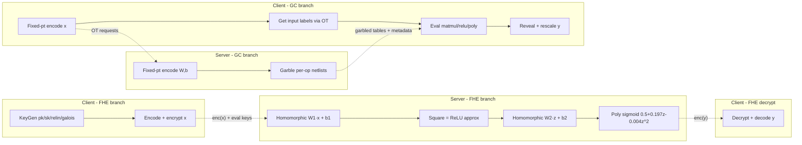
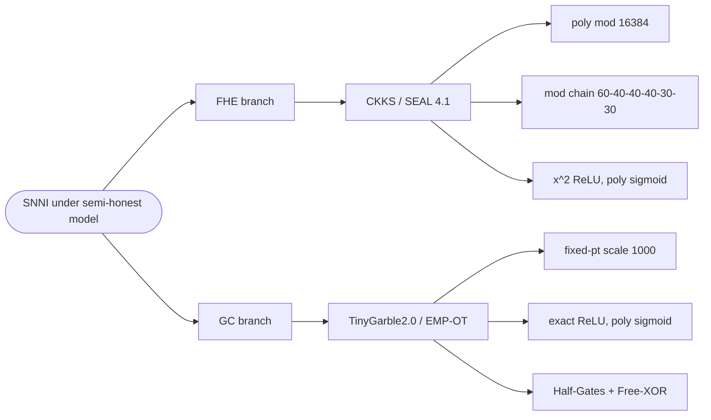
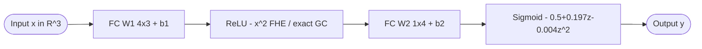
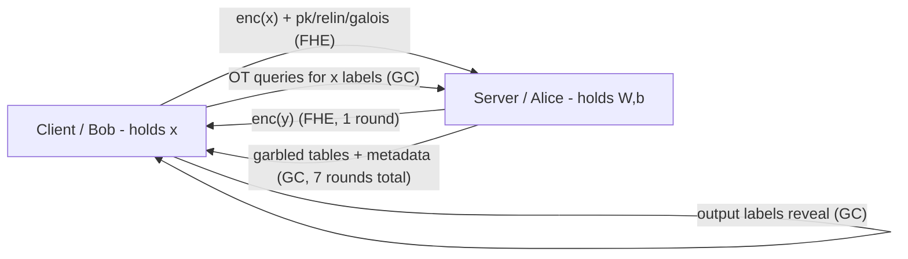

## TL;DR

A UNT master's thesis that implements the *same* two-layer feedforward neural network (3-4-1) under both CKKS FHE (Microsoft SEAL) and Garbled Circuits (TinyGarble2.0), then benchmarks them on a shared VM under a unified NetIO instrumentation [Abstract][§1.4]. Results show GC is roughly 130× faster and ~95× more memory-efficient than CKKS for this micro-network, while FHE is the only paradigm that delivers true non-interactive inference and hides model structure [§5.7, Table 5.2].

## Problem and motivation

Privacy-Preserving Machine Learning (PPML) for ML-as-a-Service must protect *both* the client's input and the server's proprietary model parameters during inference [§1.1]. Two cryptographic paradigms dominate the space — Fully Homomorphic Encryption (FHE) and Garbled Circuits (GC) — but the PPML literature lacks system-level, apples-to-apples comparisons under identical model, input, and threat-model assumptions [§3.1.1, §3.1.3]. The thesis fills that gap. Threat model: semi-honest (honest-but-curious) two-party setting, no trusted hardware, no collusion or side channels, channels assumed TLS-protected [§1.2].

## Key contributions

- A unified benchmarking harness that extends the EMP-toolkit's NetIO with byte and round counters, used identically for both protocols [§1.4, §4.2.3].
- System-level side-by-side evaluation of SEAL-CKKS (FHE) and TinyGarble2.0 (GC) running the *same* 2-layer NN, *same* input vectors, *same* semi-honest threat model — addressing a gap explicitly flagged in two recent surveys [§1.4, §3.1.3].
- Practical-tradeoff analysis covering round-trip time, peak memory (MaxRSS via getrusage), communication volume + rounds, and inference-output deviation versus a plaintext baseline [§4.2, §5.2-§5.5].
- Reproducible implementations released as open source [§4.4.4, ref 68].
- Discussion of scalability limits: CKKS multiplicative-depth budget vs GC's linear circuit-size growth, plus the model-structure leak in GC and a Universal-Circuits mitigation sketch [§5.6].

## FHE setup

- **Scheme(s):** CKKS (Cheon-Kim-Kim-Song, approximate arithmetic over reals) [§2.3.5, §4.4].
- **Library / implementation:** Microsoft SEAL v4.1.0, statically linked, C++ [§5.1.2].
- **Parameters:** polynomial modulus degree 16384; coefficient modulus chain [60, 40, 40, 40, 30, 30] (240 bits used out of the 438-bit budget); initial scale 2^30; 128-bit security implied via SEAL defaults [§4.4.4, §5.1.5, Table 4.2].
- **Bootstrapping used:** No — leveled CKKS, supports approximately 5-6 multiplicative levels under the chosen chain [§5.6.2].
- **Packing / encoding strategy:** Input vector x ∈ R^3 encoded into a CKKS ciphertext with 8192 slots, first three slots used, rest zero-padded; matrix-vector products via element-wise multiply + rotate-and-sum (Galois keys) [§4.4.4 step 2-3].

## ML setup

- **Task:** Secure Neural Network Inference (SNNI) on a fixed pre-trained model, single sample per run [§4.1, §5.1.4].
- **Model architecture:** 2-layer feedforward NN: input R^3 → FC W1∈R^{4×3} + b1 → activation → FC W2∈R^{1×4} + b2 → activation → output. Hidden layer of 4 neurons [§4.4.1, §5.1.3].
- **Activation handling:** FHE: ReLU is approximated by x^2 [§4.4.1, ref 33]; sigmoid by the degree-2 polynomial σ(z) ≈ 0.5 + 0.197z − 0.004z^2 (simplification of Chen et al.'s degree-3 form) [§2.5.2, §4.4.1, ref 45]. GC: ReLU uses *exact* native gate-level max(0,x); sigmoid uses the same degree-2 polynomial (no native exp/LUT support) [§4.5.1].
- **Operates on:** Plaintext model + encrypted data (FHE branch); private inputs encoded as garbled labels, model parameters encoded as Boolean-circuit inputs by the garbler (GC branch) [§4.4.2, §4.5.2].
- **Training vs inference:** Inference only; model parameters are fixed and hardcoded across runs (W1, b1, W2, b2 explicitly listed) [§5.1.3].

## Datasets

| Dataset | Task | Size (train/test) | Modality | Notes |
|---|---|---|---|---|
| Synthetic 3-d input vectors | Functional output check vs plaintext | 11 hand-chosen input vectors (e.g. [1.0,2.0,3.0]) | Tabular / vector | No real dataset; inputs hardcoded to remove I/O noise and isolate protocol cost [§5.1.4, Table 5.1] |

## Pipeline diagram

### Pipeline steps (text)

1. (FHE) Client generates CKKS public, secret, relinearization, and Galois keys, then encrypts the input vector x into a single ciphertext (8192 slots, first 3 used) [§4.4.4 step 1-2].
2. (FHE) Client sends enc(x) + public/relin/Galois keys to the server in one batch (~151.5 MiB total) [§5.4.2].
3. (FHE) Server homomorphically evaluates each row of W1: multiply, rotate-and-sum, add b1 [§4.4.4 step 3].
4. (FHE) Server squares the result to approximate ReLU, then applies the second FC layer (W2, b2), then the degree-2 polynomial sigmoid; rescaling + modulus switching are applied as required by SEAL [§4.4.4 step 4-5, §4.6.2].
5. (FHE) Server returns the output ciphertext; client decrypts and decodes [§4.4.4 step 6].
6. (GC) Server encodes W1, W2, b1, b2 as fixed-point integers (scale 1000) and registers them as ALICE inputs via TG_int_init() [§4.5.4 step 1].
7. (GC) Server garbles each precompiled netlist (matmul, relu, divscale, polynomial blocks) and streams the garbled tables to the client; client obtains its input labels via Oblivious Transfer [§4.5.4 step 2-3, §5.4.2].
8. (GC) Client sequentially evaluates each garbled sub-circuit using sequential_2pc_exec_sh(), passing intermediate label wires between stages [§4.5.4 step 3-4, §4.6.3].
9. (GC) Final output labels are revealed and rescaled back to floating point client-side [§4.5.4 step 5].

## Architecture diagram

The paper compares two cryptographic *systems* running the same NN. The taxonomy diagram below shows the FHE-vs-GC split as well as the shared 2-layer model.

### FHE-vs-GC system taxonomy

### Shared 2-layer NN

## Results

Headline numbers from §5.2-§5.5 and the summary Table 5.2 [p. 64].

| Metric | This paper (FHE / GC) | Plaintext baseline | Hardware |
|---|---|---|---|
| Mean round-trip time | FHE 5.07723 s (×20912); GC 0.03909 s (×161) | 0.00024 s | Proxmox VM, 8 vCPUs x86_64-v2 + AES-NI, 32 GB RAM, Ubuntu 24.04 [§5.1.1, Fig 5.1] |
| Peak memory (MaxRSS) | FHE 1053.75 MB Alice / 705 MB Bob (×182); GC 11.15 MB (×2) | 5.78 MB | Same as above [§5.3.2, Fig 5.2] |
| Total data sent | FHE ≈ 151.2 MiB (≈158.81 MB in Table 5.2); GC ≈ 268.8 KiB - 3.5 MiB (≈3.94 MB in Table 5.2) | 28 B | Same as above [§5.4.2, Fig 5.3, Table 5.2] |
| Communication rounds | FHE 1 (non-interactive); GC 7 (6 OT + 1 reveal) | n/a | [§5.4.2] |
| Max abs output deviation vs plaintext (11 inputs) | FHE 121.69%; GC 23.46% | 0% | [Table 5.1] |
| Slowdown vs plaintext (round-trip) | FHE ×20912; GC ×161 | ×1 | [§5.2.2] |

Note: `single_inference_seconds` in the front matter is the FHE end-to-end mean (5.07723 s); the GC counterpart is 0.03909 s. The comparison table's `single_inference_hardware` describes the shared VM.

## Limitations and assumptions

- Toy network: 3 inputs, single hidden layer of width 4, single output — chosen for tractability, not realism. The authors flag that scaling to deeper or convolutional models is left to future work [§5.6.2, §6.2].
- Output-deviation numbers (up to 121.69% for FHE) suggest the approximations are *not* accuracy-preserving on every input; no real-dataset accuracy is reported because there is no real dataset [§5.5.2, Table 5.1].
- Single sample per run: CKKS SIMD batching is *not* exploited, so the reported per-inference FHE cost is pessimistic relative to what batched throughput would deliver [§5.2.3, §5.6.2].
- Virtualised hardware (Proxmox VM, x86_64-v2) — no native CPU baseline; timing variance acknowledged [§5.1.1, §5.2.1].
- Semi-honest only; malicious-secure variants and side-channel resistance explicitly out of scope [§1.2].
- GC leaks the model *structure* (number of layers, activation choice) through the sequence of netlists exchanged; only the parameter *values* are hidden [§5.6.1].

## Related work it compares against

The thesis positions itself against survey-level prior work and prior frameworks rather than reproducing their numbers:

- SecureML [49], CHET [50], ABY [51] — generic SFE frameworks that the thesis argues lack apples-to-apples FHE-vs-GC comparisons [§3.1.1].
- TinyGarble / TinyGarble2.0 [44, 29, 30] — the underlying GC framework, reused without modification [§3.1.4, §4.5].
- Microsoft SEAL + CKKS [27, 28] — the underlying FHE library and scheme [§4.4].
- CryptoNets [33] — source of the x^2 ReLU approximation [§4.4.1].
- Chen et al. [45] — source of the polynomial-sigmoid approximation [§2.5.2, §4.4.1].
- Mann et al. survey "Towards Practical Secure NN Inference" [13] and Chandran's "Security and Privacy in ML" [12] — explicitly cited as flagging the benchmarking gap this thesis addresses [§3.1.3].
- Secure-transformer line (Sigma [52], Iron [53], MPCFormer [54], CrypTen [55], SecureGPT [56], East [57]) — surveyed but not benchmarked against [§3.1.2].
- PFE work (Mohassel-Sadeghian [58], Bingöl et al. [59], Holz et al. [61], Lipmaa et al. [64], Valiant UC [63], Felsen SGX [19]) — discussed as related but not implemented [§3.2-§3.3, Table 3.1].

## Code and artifacts

- Main implementation repo: <https://github.com/kalyancheerla/snni-fhe-gc> — "complete two-layer neural network implementations using Microsoft SEAL (CKKS) and TinyGarble2.0, with benchmarking support for runtime, memory, and communication" [ref 68].
- Modified EMP-tool fork with NetIO instrumentation: <https://github.com/kalyancheerla/emp-tool> [ref 26].
- License: Not reported.

## Extra diagrams (optional)

### Threat model

### Federated round

N/A — this is a 2-party client/server inference setting, not a federated-learning paper.

### Activation approximation

- ReLU: FHE branch uses x^2 (CryptoNets-style); preserves non-negativity but diverges for |x| ≫ 1. GC branch uses *exact* max(0,x) implemented with native gate-level operations [§2.5.2, §4.4.1, §4.5.1, Fig 2.3].
- Sigmoid: both branches use σ(z) ≈ 0.5 + 0.197z − 0.004z^2 — a degree-2 simplification of Chen et al.'s degree-3 minimax fit [§2.5.2, §4.4.1, §4.5.1, Fig 2.4]. Authors note this trades precision for evaluation cost.

## Open questions

- This filename is the sole-author "Cheerla 2025 — Comparison of FHE and Garbled Circuits approaches" — the M.S. thesis at UNT (74 pp., July 2025) [front matter, p. ii]. PREMAL also tracks a near-duplicate "Cheerla et al. 2025 — Garbled Circuit Techniques" paper; the relationship is presumably thesis-vs-conference-paper but I have not read the other artifact to confirm scope overlap.
- No real-dataset accuracy is reported, so the very large FHE output deviations (up to 121.69%) are hard to translate into a classification-accuracy loss. Would benefit from re-running on MNIST or similar.
- The Table 5.2 totals (3.94 MB GC, 158.81 MB FHE) differ slightly from the Figure 5.3 numbers (3.5 MiB / 151.2 MiB) — not reconciled in text; likely Alice+Bob totals vs single-party plot.
- SEAL/CKKS 128-bit security is implied via "default coefficient modulus settings" but never stated as the security parameter the author selected [§4.4.4, footnote on p. 36].
- Why the FHE memory for Alice (1053.75 MB) is higher than for Bob (705 MB) is mentioned but not fully decomposed beyond "evaluator state, temporary ciphertexts" [§5.3.2].
