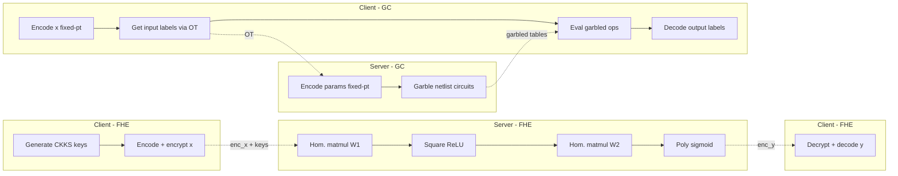
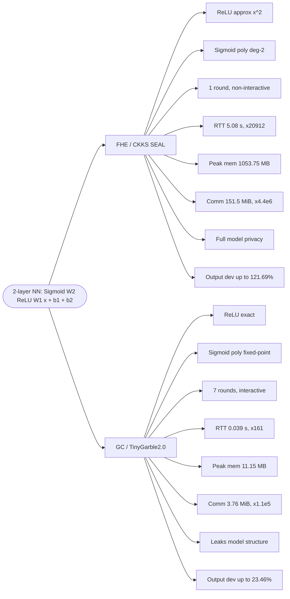
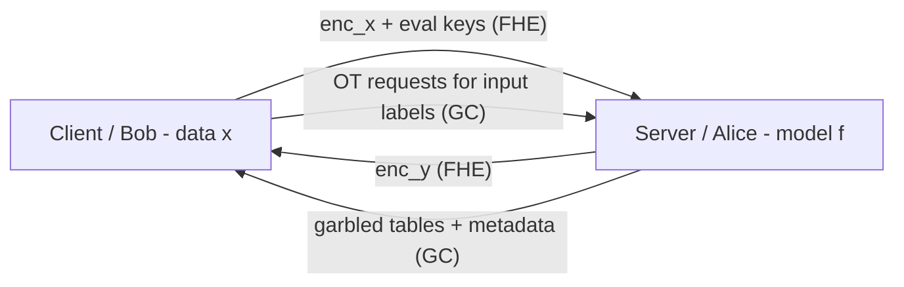

## TL;DR

The paper benchmarks a fixed-parameter two-layer feed-forward neural network under both FHE (Microsoft SEAL with CKKS) and Garbled Circuits (TinyGarble2.0), comparing round-trip time, memory, communication volume, rounds, and output deviation against a plaintext baseline on a single VM [§I, §IV]. GC is faster and far lighter on memory but interactive and leaks model structure; FHE is non-interactive and preserves full model privacy but ~20,912x slower than plaintext [§IV-A, §V].

## Problem and motivation

PPML for two-party inference: a Client holds private input x and a Server holds a pre-trained model f(x); the Client must learn y=f(x) without disclosing x, while the Server's parameters must remain confidential [§I]. Threat model is semi-honest (honest-but-curious) for both parties in both the FHE and GC settings [§I]. The paper targets the gap that prior frameworks (SecureML, CHET, ABY, Sigma, Iron, MPCFormer, CrypTen, SecureGPT, East) focus on protocol optimization or hybrid MPC for large models and rarely give a fine-grained, like-for-like FHE vs GC comparison under a shared task and environment [§II].

## Key contributions

- Evaluation of FHE-based (SEAL-CKKS) and GC-based (TinyGarble2.0) implementations using the same neural network architecture [§I].
- Analysis of practical trade-offs of FHE and GC protocols in terms of interactivity and approximation effects on model outputs [§I].
- Unified system-level comparison across round-trip time, peak memory, communication overhead, communication rounds, and output deviation under identical hardware [§IV].
- Discussion of privacy guarantees (model-structure leakage in GC vs full model confidentiality in FHE) and scalability extrapolation to deeper networks [§IV-E, §IV-F].

## FHE setup

- **Scheme(s):** CKKS (leveled) [§III-B].
- **Library / implementation:** Microsoft SEAL v4.1.0 [§III-B, §IV].
- **Parameters:** polynomial modulus degree 2^14 = 16384; coefficient modulus chain [60, 40, 40, 40, 30, 30] totaling 240 bits (within 438-bit limit); initial scale 2^30 giving ~6–8 decimal digits per level; supports up to 5 multiplication levels; 128-bit security [§III-B, Table II].
- **Bootstrapping used:** No (leveled CKKS) [§III-B].
- **Packing / encoding strategy:** 8192 slots available but only the first three populated with input values; the rest padded with zeros (no SIMD batching exploited) [§III-B, §IV-A].

## ML setup

- **Task:** Inference (binary/scalar output via sigmoid) on a 3-dimensional input vector [§III-A, §III-B].
- **Model architecture:** y = Sigmoid(W2 · ReLU(W1 x + b1) + b2) — two-layer feed-forward NN with fixed parameters [§III-A]. Input dim 3; hidden/output widths not explicitly reported.
- **Activation handling:** Under FHE: ReLU replaced by z → z^2 (square); sigmoid approximated by 0.5 + 0.197z − 0.004z^2 [§III-A, Table I, Appendix B]. Under GC: ReLU kept exact via conditional branching; sigmoid uses the same low-degree polynomial in fixed-point [Table I, §III-C].
- **Operates on:** plaintext model + encrypted data (FHE); GC garbles model as Boolean circuit while Client supplies inputs via OT [§III-B, §III-C].
- **Training vs inference:** Inference only; weights pre-set as fixed parameters [§III-A].

## Datasets

| Dataset | Task | Size (train/test) | Modality | Notes |
|---|---|---|---|---|
| Synthetic 3-dim input vectors | Inference benchmarking | 12 input vectors used for deviation scatter plot (Fig. 7); each measurement repeated five times | Tabular / numeric vector | Inputs chosen randomly to span a diverse set of activation patterns and stress-test non-linearities [§IV-D] |

## Pipeline diagram

### Pipeline steps (text)

FHE path:
1. Client generates CKKS public, secret, relinearization, and Galois keys [§III-B, Alg. 1].
2. Client encodes input x ∈ R^3 (padded into 8192 slots) and encrypts to ciphertext enc_x [§III-B].
3. Client sends enc_x and evaluation keys to Server [§III-B].
4. Server performs row-wise plaintext-ciphertext multiply, slot rotations and additions to realize matrix-vector product, adds b1 [§III-B].
5. Server applies ReLU ≈ z^2 [§III-B, Alg. 1].
6. Server multiplies by W2, adds b2, then applies sigmoid ≈ 0.5 + 0.197z − 0.004z^2 [§III-B].
7. Server returns enc_y; Client decrypts and decodes to recover y [§III-B].

GC path:
1. Server scales floats (e.g., by 1000) to signed integers and encodes W1, W2, b1, b2 as Alice inputs [§III-C, Alg. 2].
2. Server generates input labels for all (client + server) inputs and exchanges Bob's input labels with Client via Oblivious Transfer [§III-C, Fig. 3].
3. For each operation (add, mult, divscale, matmul, etc.) Server loads a precompiled netlist, garbles it, and sends garbled tables + metadata to Client [§III-C, Alg. 2].
4. Client evaluates each operation sequentially using TinyGarble2.0's sequential_2pc_exec_sh(), forwarding output labels into the next layer [§III-C].
5. Final output labels exchanged with decoding table; Client reveals and decodes to float [§III-C, Fig. 3].

## Architecture diagram

This is a comparison paper; the diagram below depicts the comparison axes between FHE (SEAL-CKKS) and GC (TinyGarble2.0) for the shared 2-layer NN.

## Results

All experiments on a Proxmox VM (Ubuntu 24.04 64-bit, 8 vCPUs x86_64-v2 with AES-NI, 32 GB RAM) hosted on an Intel i5-10400T bare-metal machine; both Client and Server on the same VM to minimize network overhead; each benchmark repeated five times with no observed variance [§IV].

| Metric | Plaintext | GC (TinyGarble2.0) | FHE (SEAL-CKKS) |
|---|---|---|---|
| Mean round-trip time | 0.00024 s (0.24 ms) | 0.03909 s (×161 vs plain) | 5.07723 s (×20,912 vs plain) [§IV-A, Fig. 4] |
| Peak memory (MaxRSS) | ~5.6 MB (×1 baseline) | ~11.15 MB (×2) | 1053.75 MB server / 705 MB client (×182) [§IV-B, Fig. 5] |
| Total communication | 0.027 KiB (Alice) / 0.008 KiB (Bob) | 3,538.8 KiB Alice + 268.8 KiB Bob ≈ 3.76 MiB (×1.1e5) | 256.1 KiB Bob + ciphertext/keys total ~151.5 MiB → 154,825.7 KiB (×4.4e6) [§IV-C, Fig. 6] |
| Communication rounds | N/A | 7 (6 OT + 1 reveal) | 1 [§IV-C] |
| Output deviation vs plaintext (worst case) | 0% | 23.46% | 121.69% [§IV-D, Fig. 7] |

Extrapolation note: under CKKS, setup dominates (~4.8 s) and each additional layer adds ~0.02 s, so 5–10 layer CNNs would land in the 20–60 s range under comparable parameters [§IV-F]. GC adds ~1.7 MiB per layer; 5–10 layer GC inference projected at 8.5–17 MiB one-way per inference [§IV-F].

## Limitations and assumptions

- Semi-honest adversary only — no malicious-security guarantees [§I].
- Both parties run on the same VM; network latency is essentially zero, so reported RTT captures computation overhead, not real WAN/LAN behaviour [§IV].
- Only a 2-layer fixed-parameter feed-forward NN is benchmarked; no convolutional or deeper models actually run, only extrapolation [§III-A, §IV-F].
- CKKS used without bootstrapping; deep networks would exhaust the noise budget [§IV-E].
- CKKS slot batching (SIMD) not exploited — only 3 of 8192 slots populated, exaggerating per-inference cost [§III-B, §IV-A, §IV-E].
- GC leaks model structure (number of layers, high-level topology) via the sequence of garbled tables and metadata [§IV-E].
- FHE output deviation up to 121.69% is large — driven by compounded polynomial approximation + rescaling errors [§IV-D].
- ChatGPT-4 used to revise Sections 3 and 4 for typos and grammar (acknowledged) [Acknowledgement].

## Related work it compares against

SecureML [12], CHET [13], ABY [14], Sigma [15], Iron [16], MPCFormer [17], CrypTen [18], SecureGPT [19], East [20], CryptoNets [24], Hesamifard et al. PPMLaaS [3], Mann et al. survey [7], Chandran survey [6], Rahman et al. FHE-library benchmarks [21], Zhu et al. HElib/SEAL/OpenFHE CNN comparison [22], FLUENT [23], Rosulek & Roy half-gates [32].

## Code and artifacts

Public GitHub repository: https://github.com/kalyancheerla/snni-fhe-gc — two-layer NN implementations under Microsoft SEAL (CKKS) and TinyGarble2.0 with benchmarking for runtime, memory, and communication; accessed 2025-04-23 [§III-C, ref 28]. A modified EMP-tool with communication-stat instrumentation is also released: https://github.com/kalyancheerla/emp-tool [ref 31]. License not stated in the paper.

## Extra diagrams (optional)

### Threat model

Both parties semi-honest (honest-but-curious): follow protocol but may attempt to learn extra information from messages [§I].

### Activation approximation

ReLU is approximated by x^2 under FHE — preserves non-negativity but diverges sharply for |x| > 1 (Fig. 8) [Appendix B]. Sigmoid is approximated by 0.5 + 0.197x − 0.004x^2 under both FHE and GC — retains S-shape for small inputs but diverges for large positive values (Fig. 9) [Appendix B, Table I].

## Open questions

- This paper (Cheerla, Ben Othmane, Morozov — IEEE SecDev 2025) appears to be the conference/published version of the sole-author master's thesis "Comparison of fully homomorphic encryption and garbled circuits approaches in privacy-preserving machine learning" by Kalyan Cheerla, University of North Texas, 2025 (cited as ref [26] in this paper). The two should be treated as related but distinct entries — the thesis likely contains more detail.
- Exact hidden-layer width (output dimension of W1, input dimension of W2) is not stated in the paper.
- The plaintext peak-memory baseline value is not stated explicitly (only the multiplier ×1 and bar in Fig. 5).
- No accuracy on a real dataset is reported — only percentage deviation from plaintext on synthetic vectors; classification accuracy is therefore N/A.
- Whether the GC RTT of 39 ms includes the OT round latency in a true cross-machine setting is unclear (both parties co-located on a single VM).
