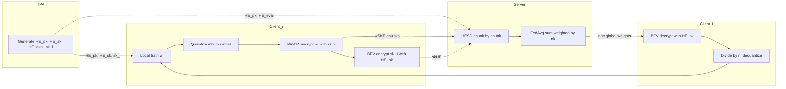
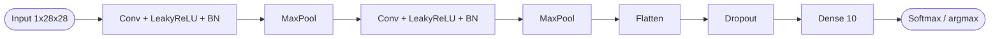
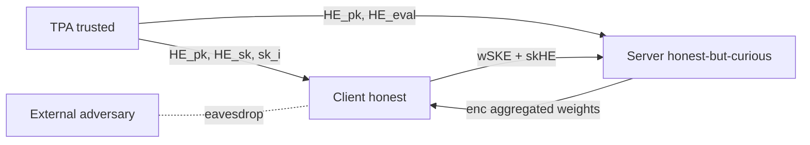
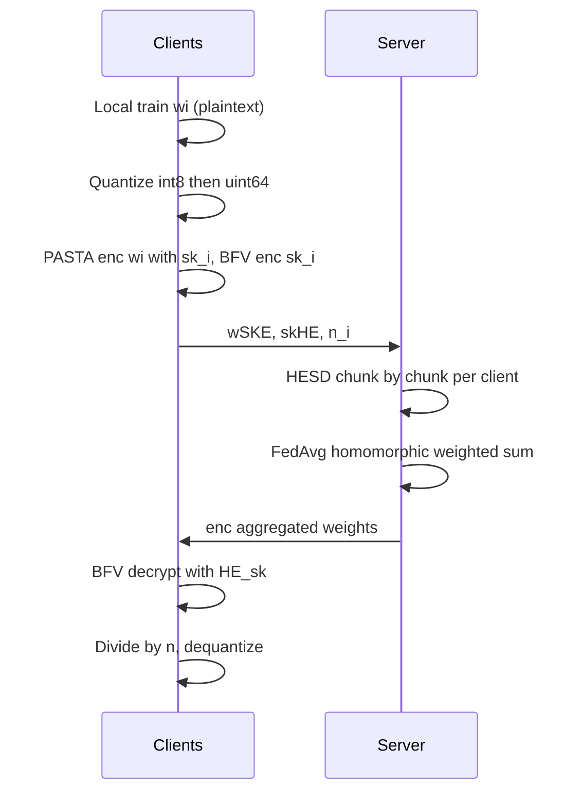

## TL;DR

The paper presents the first end-to-end Hybrid Homomorphic Encryption (HHE) framework for Federated Learning, pairing the PASTA symmetric stream cipher with the BFV FHE scheme on top of the Flower FL framework, achieving 97.6% accuracy on IID MNIST while shrinking client upload bandwidth by over 2000x compared to a pure-BFV baseline [Abstract][§6.3].

## Problem and motivation

Federated Learning ostensibly preserves privacy by keeping raw data on-device, but model updates leak information via gradient inversion, membership inference, and property inference attacks [§1][§2.1]. Pure FHE protects updates but suffers from ciphertext expansion and large algebraic depth, making it prohibitive for resource-constrained IoT clients [§1]. The authors target cross-device FL with an honest-but-curious server, fully honest clients, no collusion, and a trusted setup phase via a Third-Party Authority (TPA) [§4.2].

## Key contributions

- First end-to-end HHE-FL framework combining the PASTA stream cipher with the BFV FHE scheme, integrated into the Flower ecosystem [§1].
- Single-key distribution strategy plus a homomorphic-evaluation routine enabling secure FedAvg aggregation with minimal client encryption/communication cost [§1][§4.1].
- Chunk-based Homomorphic Evaluation of Symmetric Decryption (HESD) routine that converts PASTA ciphertexts to BFV ciphertexts on the server [Algorithm 1][§5].
- Experimental evaluation on IID MNIST with 12 clients and 10 rounds: 97.6% accuracy (vs 98.9% plaintext), 2000x lower client upload, 1.4x faster client runtime than pure BFV [§1][§6.3].

## FHE setup

- **Scheme(s):** Hybrid HE: PASTA (symmetric stream cipher over F_p with p a 16-bit prime) combined with BFV (FHE) [§2.3][§5].
- **Library / implementation:** PASTA via the ISEC TU Graz open-source hybrid-HE C++ framework; BFV via Microsoft SEAL; Python/C++ bridge through pybind11; Flower for FL orchestration; TenSEAL used for the pure-BFV baseline [§5][§6.1].
- **Parameters:** Plaintext modulus = 65537 (q = 2^16 + 1); polynomial degree modulus = 16384; security level = 128-bit; plaintext size = 128 bits; ciphertext size = 128 bits; symmetric key size = 256 bits [Table 1].
- **Bootstrapping used:** Not reported.
- **Packing / encoding strategy:** Chunk-based encryption of the quantized weight vector; int8 scale quantization (clip to [-α, α] with α = 5, scale = 127/α), then conversion to uint64 for PASTA input [§5, Algorithm 2].

## ML setup

- **Task:** Federated training round (secure aggregation of model weight updates). Training itself runs in plaintext on each client; encryption is applied to the resulting weight updates before transmission [§5, §6.3].
- **Model architecture:** CNN based on Gaurav Sharma's "MNIST CNN with 8k parameters": two convolutional layers, each followed by LeakyReLU + batch normalization, with max-pooling after each conv; flatten; dropout; final dense layer with 10 outputs; approximately 8000 trainable parameters [§6.1].
- **Activation handling:** LeakyReLU runs in plaintext during local training; no polynomial approximation needed because no homomorphic forward/backward pass is performed [§6.1].
- **Operates on:** Encrypted client weight updates aggregated on the server (FedAvg). The server never sees plaintext updates; clients hold both HE_sk and their symmetric key sk_i [§4.1].
- **Training vs inference:** Local training is plaintext; only the aggregation (sum of weighted updates) runs under encryption on the server; division by n is deferred to clients because BFV lacks exact division [§5].

## Datasets

| Dataset | Task | Size (train/test) | Modality | Notes |
|---|---|---|---|---|
| MNIST | 10-class digit classification | 60000 train / 10000 test | 28x28 grayscale images | IID partitioned across 12 clients via Flower's IidPartitioner; per-client 80/20 train/test split; 20% of local training set reserved for early-stopping validation [§6.1] |

## Pipeline diagram

### Pipeline steps (text)

1. Setup: TPA generates (HE_pk, HE_sk, HE_eval) and a unique symmetric key sk_i for each client; sends (HE_pk, HE_eval) to the server and (HE_pk, HE_sk, sk_i) to each client; server initializes the global model weights [§4.1].
2. Clients receive global weights (plaintext in round 1, BFV-encrypted in later rounds and decrypted with HE_sk) [§4.1].
3. Each client trains its local model in plaintext using LeakyReLU activations [§6.1].
4. Client quantizes weights from float32 to int8 (scale = 127/α, α = 5) and converts to uint64 for PASTA [Algorithm 2].
5. Client encrypts the quantized weight vector chunk-by-chunk with PASTA (sk_i), producing w_SKE; encrypts sk_i with HE_pk producing sk_HE; sends (w_SKE, sk_HE, n_i) to the server [§4.1, Algorithm 2].
6. Server performs chunk-based HESD: homomorphically evaluates PASTA decryption on each w_SKE chunk using sk_HE, yielding BFV ciphertexts [Algorithm 1].
7. Server runs FedAvg: multiplies each BFV-encrypted weight vector by n_k and homomorphically sums across clients; division by n is deferred to clients [§5].
8. Server sends the aggregated BFV ciphertexts to the next round's clients [§4.1].
9. Clients decrypt with HE_sk, convert uint64 back to int64 (adjusting for modulus wrap), divide by n in float32, and dequantize by dividing by scale factor [Algorithm 3].
10. Clients evaluate locally on the test set and return accuracy/loss/sample count to the server for the Server Evaluation phase [§4.1].

## Architecture diagram

## Results

| Metric | This paper (PASTA+BFV) | Plaintext FL | Pure BFV | Hardware |
|---|---|---|---|---|
| Accuracy | 97.6% (text) / 97.39% (Table 2) | 98.93% / 99.00% | 98.04% / 98.21% | Google Colab T4 High-RAM (NVIDIA T4 GPU, Intel Xeon @ 2.20GHz, 51GB RAM) [§6.1, §6.3, Table 2] |
| Loss | 0.0962 | 0.0360 | 0.0702 | Same [Table 2] |
| Precision / Recall / F1 | 97.50 / 97.39 / 97.39 (%) | 99.00 / 99.00 / 99.00 | 98.23 / 98.21 / 98.21 | Same [Table 2] |
| Client upload cost | ~2000x lower than pure BFV | N/A | 2000x higher than HHE | Same [§6.3, Fig. 6a] |
| Client encryption time | 0.32867 s | N/A | 3.18009 s | Same [Fig. 7a] |
| Client decryption time | 0.42206 s | N/A | 2.90076 s | Same [Fig. 7a] |
| Client training time | 10.70805 s | 10.70805 s | 10.70805 s | Same [Fig. 7a] |
| Client total runtime | 12.53394 s | N/A | 17.86406 s (~1.4x slower) | Same [Fig. 7a] |
| Server aggregation (HESD) per client (8000 params) | 1451 s | N/A | N/A (BFV server agg only 0.0929 s) | Same; HESD ~1.7x faster on local Intel Core i7-11370H, 16GB RAM [§6.3, Fig. 7b] |
| Server total runtime per round (4 clients) | 5804.2174 s (HESD per round ~1.6122 h) | N/A | 0.0929 s | Same; ~62478x slower than pure BFV; ~15621x average per-client overhead [§6.3, Fig. 7b, §7] |

## Limitations and assumptions

- Server computational cost increases ~15621x per client during aggregation due to the cost of homomorphic evaluation of the PASTA decryption circuit; flagged for future work [Abstract, §7].
- BFV lacks real-number division, so weighted averaging by n must be performed by clients post-decryption — the authors note this as a potential privacy issue (clients see un-normalized aggregates) [§7].
- Plaintext modulus q = 2^16 + 1 caps the product (quantized weight x batches x clients) to < 2^16 + 1, constraining valid configurations to 2^(x1+x2) <= 2^8 (batches x clients) [§6.2].
- Trust assumptions: trusted Setup Phase, fully honest clients, honest-but-curious server, no client-server collusion, external adversaries cannot disrupt or inject [§4.2]; no defence against malicious clients (single malicious client can decrypt honest clients' sk via shared HE_sk) [§4.2].
- Only IID MNIST evaluated, with N=12 clients and 10 rounds — non-IID and larger-scale settings not tested [§6.3, §7].
- Quantization to int8 is applied to weight updates and contributes to the accuracy drop [§6.3].
- Pure-BFV baseline failed (out-of-memory) from round 3 onwards in Colab (~48.5GB of 51GB); HHE completed all rounds, but baseline numbers may therefore be partial [§6.3].
- Runtimes are inflated by Colab's Intel Xeon @ 2.20GHz (~1.7x slower than the authors' local i7-11370H for HESD) [§6.3].

## Related work it compares against

- xMK-CKKS (Ma et al. [23]) and ftxMK-CKKS (Zhang et al. [42]) — multi-key CKKS for FedAvg [§3].
- Hijazi et al. [18] — decentralized FL with FHE and cosine-similarity clustering [§3].
- Duy et al. [12] — semi-decentralized FL with blockchain, shared key distribution, and DP [§3].
- Xu et al. [38] — CKKS + Threshold Secret Sharing with FedSGD [§3].
- Fontela-Romero et al. [14], Tan et al. [36] — non-FedAvg aggregation under HE [§3].
- PASTA cipher (Dobraunig et al. [10]); compared in lineage to RASTA [9] and DASTA [17] [§2.3].
- TenSEAL-backed pure-BFV FL as the primary head-to-head baseline in experiments [§6.1].
- Flower-based HE integration by Catalfamo et al. [6] [§5].

## Code and artifacts

Not released. The prototype builds on the ISEC TU Graz open-source `hybrid-HE-framework` (https://github.com/isec-tugraz/hybrid-HE-framework), Microsoft SEAL (BFV), TenSEAL, Flower, and pybind11; no project-specific repository URL is reported in the paper [§5, §6.1].

## Extra diagrams (optional)

### Threat model

### Federated round

## Open questions

- Why does the text say HHE accuracy is 97.6% (Abstract, §6.3) while Table 2 reports 97.39%? Likely a snapshot at a different round, but not clarified.
- Exact PASTA parameters (number of rounds, state size) are not stated in the paper text; only that PASTA operates over F_p with p a 16-bit prime [§2.3].
- BFV ring degree is 16384 [Table 1] but specific coefficient modulus bit budget and noise budget are not reported.
- Single-sample inference latency is not measured — the work targets the secure-aggregation round, not encrypted inference, so the comparison table's `single_inference_seconds` is N/A.
- How does HESD time scale beyond 8000 parameters? Figure 8 suggests linear growth, but no large-model number is provided.
- No non-IID, dropout, or adversarial-client experiments — authors flag these for future work [§7].
