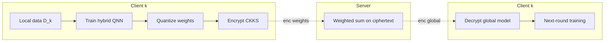
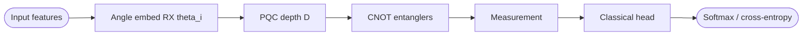
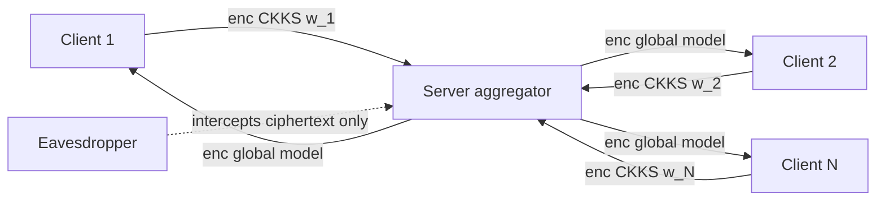
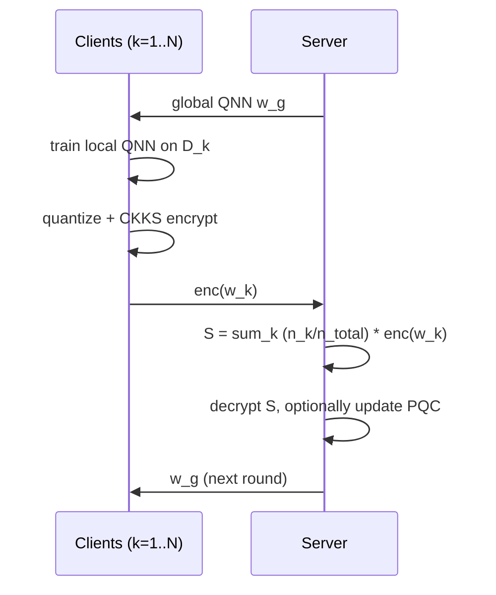

## TL;DR

The paper proposes FHE-FedQNN, a federated learning scheme where each client trains a hybrid classical-plus-quantum neural network locally and uploads CKKS-encrypted, quantized weights to a server that homomorphically aggregates them; on CIFAR-10, Brain MRI, and PCOS the FHE overhead costs only ~1–2% accuracy vs. non-encrypted FedQNN, and in one case (PCOS) accuracy improved by 4% [§4, Table 1].

## Problem and motivation

Federated learning (FL) keeps raw data local but the messages between clients and server may be intercepted, allowing reconstruction of private data; this is acute in healthcare [§1, p. 2]. The authors target this eavesdropping threat by adding a "quantum-safe" FHE layer on top of FL while simultaneously leveraging quantum layers to accelerate local computation on resource-constrained clients [§1, §3]. Threat model is implicit: server is untrusted to see plaintext weights, and message channels may be intercepted; FHE protects model updates in transit and during aggregation [§1, p. 2; Fig. 1 caption, p. 4].

## Key contributions

- Instantiates FHE on a federated quantum neural network (FedQNN), combining classical and quantum layers under CKKS encryption [Abstract; §6].
- Provides Algorithm 1: a full QFL-with-FHE protocol using CKKS context, Galois keys for rotations, per-client quantize+encrypt, server-side weighted-sum aggregation, decrypt, and PQC update [§3, Algorithm 1].
- Benchmarks FHE-FedQNN vs. standard FedQNN and FHE-FedNN vs. FedNN on three datasets (CIFAR-10, Brain MRI, PCOS) over 20 rounds × 20 clients × 10 epochs/round [§4, Table 1].
- Empirically shows FHE adds only ~1–2% test-accuracy cost in most cases and can even help (4% gain on PCOS), suggesting FHE-induced noise may aid generalization in some regimes [§4, p. 5].
- Open-source implementation released at the project repo [§5].

## FHE setup

- **Scheme(s):** CKKS [§3, Algorithm 1, line 8].
- **Library / implementation:** Not reported explicitly in the text (CKKS context and Galois-key API suggest TenSEAL/SEAL/OpenFHE family, but the paper does not name it).
- **Parameters:** Polynomial degree, ciphertext modulus, scale, and security level — Not reported in the text.
- **Bootstrapping used:** Not reported.
- **Packing / encoding strategy:** Galois keys generated for rotations [Algorithm 1, line 9]; SIMD packing implied but not specified.

## ML setup

- **Task:** Federated training of a classification model; one full FL round is described (client training → encrypt → server aggregation → distribute) [§3, Algorithm 1].
- **Model architecture:** Hybrid model with classical layers plus a variational Parameterized Quantum Circuit (PQC) of depth D with gate set G [§3.1]. The illustrative PQC encodes input via angle embedding RX(θ_i), applies parameterized rotations and CNOT entanglers, and measures to get classical outputs trained with cross-entropy loss [Fig. 2 caption, p. 4]. Number of qubits matches the number of classes: 6 qubits for CIFAR-10 (10 classes), 4 qubits for Brain MRI (4 classes), 2 qubits for PCOS (2 classes) [§4, p. 5]. Layer-by-layer widths are not reported.
- **Activation handling:** Not explicitly discussed — quantum measurement provides the nonlinearity; classical-layer activations are not specified, and no polynomial-approximation choices are reported.
- **Operates on:** Encrypted model updates with plaintext local data on each client (training happens on plaintext, then weights are quantized and encrypted; aggregation is on ciphertext) [§3].
- **Training vs inference:** Training (federated) — local training is plaintext; cross-client aggregation is under FHE.

## Datasets

| Dataset | Task | Size (train/test) | Modality | Notes |
|---|---|---|---|---|
| CIFAR-10 [46] | 10-class image classification | 48k / 12k | Images | Batch size 128; 6 qubits used [§4] |
| Brain MRI [47] | 4-class tumor classification | 5.7k / 1.3k | Medical images | Batch size 32; 4 qubits used [§4] |
| PCOS [48] | 2-class classification (polycystic ovary syndrome) | 2.56k / 0.64k | Medical images | Batch size 32; 2 qubits used [§4] |

## Pipeline diagram

### Pipeline steps (text)

1. Server generates a CKKS context and Galois keys; initialize global QNN with depth D and gate set G [Algorithm 1, lines 8–10].
2. Each client k prepares its dataset D_k and trains its local hybrid QNN starting from the global model [Algorithm 1, lines 13–14].
3. Each client quantizes its trained weights to a fixed precision, then encrypts them under CKKS, and sends ciphertext to the server [Algorithm 1, line 15; §3.1].
4. Server homomorphically accumulates a weighted sum S = Σ_k w_k^enc · (n_k / n_total), where n_k is client k's data size [Algorithm 1, lines 19–24].
5. Server decrypts S to obtain the new global model w_g [Algorithm 1, line 26].
6. Server optionally adjusts PQC depth/gates (OptimizePQC) before broadcast [Algorithm 1, line 29; §3.2].
7. Server sends w_g back to every client [Algorithm 1, lines 31–33].
8. Repeat from step 2 until convergence [Algorithm 1, line 34].

## Architecture diagram

Hybrid classical + quantum classifier; exact classical-layer widths are not specified in the text, so the diagram shows the PQC structure given in Fig. 2 of the paper.

## Results

Each model trained 20 rounds × 20 clients × 10 epochs/round [Table 1 caption]. Hardware is not reported.

| Metric | This paper (FHE-FedQNN) | Baseline (FedQNN) | Hardware |
|---|---|---|---|
| CIFAR-10 test acc. | 70.12% | 72.16% | Not reported |
| Brain MRI test acc. | 88.75% | 89.71% | Not reported |
| PCOS test acc. | 70.15% | 66.19% | Not reported |
| CIFAR-10 training time | 156.5 min | 151.5 min | Not reported |
| Brain MRI training time | 116.5 min | 110.6 min | Not reported |
| PCOS training time | 87.2 min | 70.9 min | Not reported |
| CIFAR-10 test loss | 1.240 | 1.202 | — |
| Brain MRI test loss | 0.360 | 0.338 | — |
| PCOS test loss | 1.09 | 0.611 | — |

Comparable classical-only FHE-FedNN vs. FedNN numbers are also reported [Table 1]. Per-sample encrypted inference latency is not reported.

## Limitations and assumptions

- Current quantum hardware is small; the authors mitigate by simulating quantum circuits classically (e.g., tensor networks), which is "only practical until a certain scale" [§5].
- FHE noise can amplify test loss (visible on CIFAR-10 and PCOS rows of Table 1) even when accuracy is close [§4, p. 6].
- Barren-plateau phenomena in PQC training are flagged as a future-work concern [§5].
- Hardware (CPU/GPU, RAM, cores) for timing measurements is not reported, so the training-time numbers are not directly comparable to other systems.
- CKKS parameters, security level, polynomial degree, and quantization bit-width are not reported in the text.
- Threat model is not formally stated; trust assumptions on the server's secret-key handling (the algorithm has the server perform Decrypt(S, secret_key), Algorithm 1 line 26) are not discussed.

## Related work it compares against

- FedQNN [33] and FedNN baselines (own ablations, Table 1).
- Conceptually positioned against: FL + FHE for healthcare [24–28], FL + FHE efficiency surveys [29, 30], Quantum FL [16, 33], Quantum FL with quantum data [34], Federated quanvolutional networks [36], QFL on encrypted weights — CryptoQFL [40], QFL surveys/challenges [19, 41].

## Code and artifacts

Open source at https://github.com/elucidator8918/QFL-MLNCP-NeurIPS [§5]. License: Not reported in the text.

## Extra diagrams (optional)

### Threat model

### Federated round

## Open questions

- Which FHE library is used (TenSEAL, OpenFHE, SEAL, Lattigo)? The paper references a CKKS context and Galois keys but does not say.
- What CKKS parameters (poly modulus degree, scale, multiplicative depth, security level) and what fixed-precision quantization are used?
- Where does the secret key live? Algorithm 1 line 26 has the server decrypt — is this a trusted third party, or is the protocol effectively assuming a non-colluding aggregator? This contradicts a strict "server never sees plaintext" reading.
- Per-round and per-sample encrypted-aggregation latency are not separated from local quantum-simulation time.
- Hardware platform for the 70.9–156.5 min training runs is not specified.
