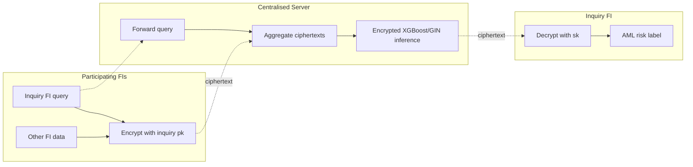
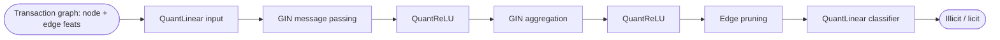
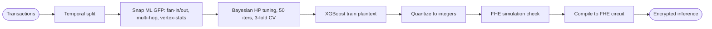
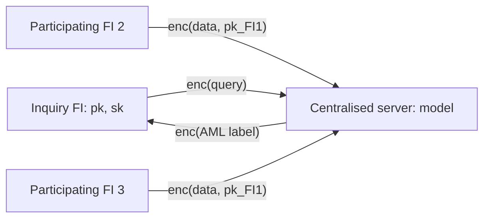

## TL;DR

The paper proposes two TFHE-based pipelines (via Zama Concrete ML) for collaborative anti-money-laundering detection: (i) an exploratory privacy-preserving GIN-based GNN pipeline using QAT and pruning, and (ii) a fully-working XGBoost pipeline enriched with Snap ML Graph Feature Preprocessor (GFP) features that retains >99% accuracy under encryption on the AMLworld HI-Small dataset [Abstract, §6.4].

## Problem and motivation

Money laundering is estimated at 2–5% of global GDP with only 1% seized [§1.1, p. 2]. Financial institutions operate AML in data silos due to GDPR-like regulations and bank-secrecy laws, preventing cross-institution and cross-border transaction graph modeling that criminals exploit [§1.1, p. 2]. The paper proposes a TFHE-based collaborative architecture in which participating FIs encrypt data under the inquiring FI's public key; a centralised server runs encrypted ML inference and returns encrypted results [§3.5, p. 8]. Threat model: a centralised server performing inference on data contributed (encrypted) by multiple banks; only the inquiring FI holds the secret key, aligning with the Singapore Banking Act prohibition on disclosing Customer Information [§3.5, p. 8].

## Key contributions

- Proposed collaborative privacy-preserving AML solution architecture using FHE across multiple financial institutions [§1.2, §3.5].
- First exploration of a TFHE-compatible GNN (GIN) pipeline for AML using Concrete ML, with quantization-aware training (Brevitas) and edge pruning [§1.2, §4].
- Novel TFHE-compatible XGBoost pipeline that integrates Snap ML's Graph Feature Preprocessor (GFP) to inject fan-in/fan-out, multi-hop and vertex-statistics features [§1.2, §5].
- Empirical study with incrementally added graph features on balanced and imbalanced AMLworld HI-Small subsets, comparing clear vs FHE inference [§6].
- Open-source release of project code [§1.2, footnote 1].

## FHE setup

- **Scheme(s):** TFHE (Fully Homomorphic Encryption over the Torus), via Zama's TFHE-Concrete with programmable bootstrapping (PBS) [§3.2, §3.3].
- **Library / implementation:** Concrete ML v1.4.1 on top of Concrete; Brevitas for PyTorch QAT; PyTorch Geometric for the GIN; ONNX as the model interchange [§3.3, §3.4, §6.2].
- **Parameters:** Not reported (polynomial degree, ciphertext modulus, scale, and explicit security level are not stated).
- **Bootstrapping used:** Yes; programmable bootstrapping (PBS) is the core mechanism, replacing plaintext bits with a lookup-table function during bootstrapping [§3.2, p. 6].
- **Packing / encoding strategy:** Not reported (handled internally by Concrete ML / MLIR compiler [§4.4]).

## ML setup

- **Task:** Binary classification of illicit vs licit transactions for AML, encrypted inference (training is plaintext) [§5.4].
- **Model architecture:**
  - **GIN (GNN):** Graph Isomorphism Network message-passing GNN, adapted from prior AML studies [§4.1]; uses iterative aggregation inspired by Weisfeiler-Lehman; layer counts/widths not stated explicitly in the text. Pipeline: select baseline → quantize → prune → train via Concrete ML → compile to FHE circuit → encrypted inference [§4].
  - **XGBoost-GFP:** Plaintext-trained XGBoost (tuned with 50-iteration Bayesian optimization, 3-fold CV) consuming base transaction features plus GFP-extracted single-hop, multi-hop and vertex-statistics features over an 86,400 s window [§5.2, §6.3].
- **Activation handling:** GNN replaces `Linear` with `QuantLinear` and ReLU with `QuantReLU` (Brevitas) under QAT; weights and accumulator bit-widths are reduced [§4.2]. XGBoost has no activations (tree ensemble).
- **Operates on:** Plaintext model + encrypted data (server has the model, FIs encrypt inputs) [§3.5, §5.4].
- **Training vs inference:** Training is plaintext; only inference is encrypted under TFHE [§5.4].

## Datasets

| Dataset | Task | Size (train/test) | Modality | Notes |
|---|---|---|---|---|
| AMLworld HI-Small (Altman et al. 2023) | AML binary classification | Downsized; temporal split (Not reported splits) | Financial transaction graph | Synthetic, 370 money-laundering pattern groups (fan-in, fan-out, gather-scatter, cycles) [§6.1] |
| Modified AML Dataset 1 | Balanced AML | 15,230 accounts, 10,354 transactions; 50% illicit | Transaction graph | Undersampled from HI-Small [§6.1] |
| Modified AML Dataset 2 | Imbalanced AML | 9,070 accounts, 5,491 transactions; 5.72% illicit | Transaction graph | Random-sampled from HI-Small [§6.1] |

## Pipeline diagram

### Pipeline steps (text)

1. Inquiry FI initiates an AML query and sends it to the centralised server [§3.5].
2. Server forwards the query to participating FIs [§3.5].
3. Each FI encrypts its relevant transaction data with the inquiry FI's TFHE public key (shared once) [§3.5].
4. Server consolidates ciphertexts and runs encrypted inference using the trained XGBoost-GFP (or, prospectively, GIN) model [§3.5].
5. Encrypted result is returned to the inquiry FI, which decrypts with its secret key to obtain the AML label [§3.5].

## Architecture diagram

### GIN GNN (TFHE target)

Notes: exact layer count and hidden widths are not stated in the text; QAT layers and bit-widths are configured per-layer in Brevitas [§4.2]. Compilation to FHE failed in places because Concrete ML lacked the ONNX `ScatterElements` operator; a custom implementation was attempted but `NumpyModule → QuantizedModule` conversion remained incomplete [§4.4].

### XGBoost-GFP (deployed TFHE pipeline)

## Results

Hardware for all numbers below: Intel Xeon CPU E5-1630 v4 @ 3.70 GHz, 8 cores, Linux; Concrete ML 1.4.1 (CPU only) [§6.2].

| Metric | This paper | Baseline | Hardware |
|---|---|---|---|
| Accuracy (balanced, basic feats), clear / FHE | 0.9972 / 0.9972 | — | Xeon E5-1630 v4 [§6.4 Table 3] |
| F1 (balanced, basic), clear / FHE | 0.9978 / 0.9978 | — | Xeon E5-1630 v4 |
| F1 (imbalanced, basic) | 0.3056 (clear = FHE) | — | Xeon E5-1630 v4 [§6.5 Table 5] |
| F1 (imbalanced, +single-hop GFP) | 0.3867 (clear = FHE) | basic 0.3056 (+8 pts) | Xeon E5-1630 v4 |
| Avg batch inference (balanced, basic) | 1009.0963 s FHE vs 0.008414 s clear | — | Xeon E5-1630 v4 [§6.4 Table 4] |
| Total inference (balanced, basic) | 20,181.93 s FHE vs 0.1683 s clear (≈119,926×) | — | Xeon E5-1630 v4 |
| Avg batch inference (imbalanced, +multi-hop) | 34.13 s FHE vs 0.00227 s clear | — | Xeon E5-1630 v4 [§6.5 Table 6] |
| FHE / clear time ratio | 15,038× – 165,917× across feature sets | — | Xeon E5-1630 v4 |

Headline accuracy delta vs plaintext: 0 (Concrete-TFHE quantized XGBoost matches plaintext to 4 decimals across all four metrics on both datasets) [§6.4 Table 3, §6.5 Table 5].

Single-sample latency on a per-input basis is not separately reported — only batch averages and totals; not enough information is given to safely derive a per-sample second value, so `single_inference_seconds` is `N/A` in the comparison block.

## Limitations and assumptions

- **GNN pipeline did not fully compile to FHE:** Concrete ML lacked the ONNX `ScatterElements` operator; a custom implementation was added but `NumpyModule → QuantizedModule` conversion remained unresolved [§4.4]. Only the XGBoost pipeline was end-to-end FHE-functional.
- **Massive FHE overhead:** total encrypted inference is 15,000× – 165,000× slower than plaintext [§6.4 Table 4, §6.5 Table 6]; authors flag this trade-off as a key open problem [§6.4, §7].
- **Datasets are downsized synthetic data:** AMLworld HI-Small was undersampled (15k / 9k accounts) due to FHE compute cost [§6.1]; results may not extrapolate to production-scale graphs.
- **No GPU support** in Concrete ML at time of writing [§6.2].
- **FHE security parameters (poly degree, modulus, security level) are not reported.**
- **No multi-party key-generation protocol described:** the architecture assumes the inquiry FI's pk is "securely shared once" [§3.5], but how trust is established between participating FIs is not detailed.
- **Threat model is implicit honest-but-curious server**; collusion and malicious-FI scenarios are not analysed.

## Related work it compares against

CryptoNets [Dowlin et al.], HCNN [Badawi et al.], LoLa [Brutzkus et al.], ResNet-20 RNS-CKKS with bootstrapping [Lee et al.], CryptoGCN [Ran et al.]; AML modelling baselines from Altman et al., Egressy et al., Blanuša et al. (GFP) [§2.2, §2.3].

## Code and artifacts

Released: https://github.com/fabecode/GraphML-FHE [§1.2, footnote 1]. License not stated in the paper text.

## Extra diagrams (optional)

### Threat model

## Open questions

- What is the actual GIN depth / hidden dimensionality used in the experiments? (Not stated in §4.1.)
- What TFHE/Concrete security parameters (LWE dimension, noise, polynomial degree) were used?
- Why does inference time *decrease* as graph-feature complexity grows on the imbalanced dataset [§6.5 Table 6]? The authors flag this as needing further investigation.
- How is the inquiry FI's public key distributed and revoked across institutions in practice?
- Would a deeper GIN (once `ScatterElements` is supported) match or exceed XGBoost-GFP under FHE?
