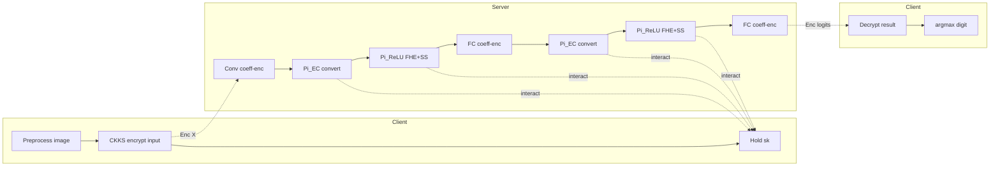
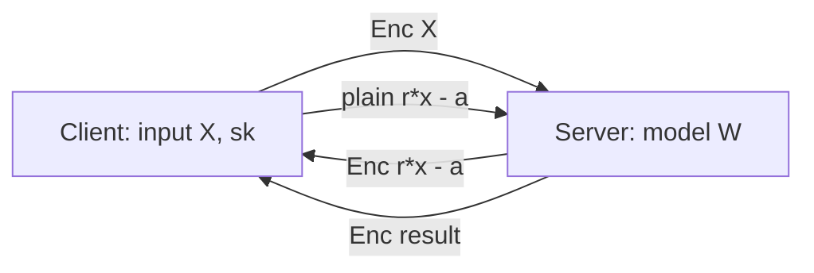

## TL;DR

Swift is a two-party (2PC) secure neural-network inference scheme that combines CKKS fully homomorphic encryption with secret sharing: FHE (coefficient encoding) handles convolutions and fully-connected layers locally on the server, and a new FHE+SS protocol handles ReLU and max pooling exactly without garbled circuits or oblivious transfer [Abstract, §I]. On the Chameleon 3-layer MNIST CNN, Swift reports 1.9x end-to-end speed-up over Cheetah (USENIX 2022) under WAN [§I, §V-C].

## Problem and motivation

Two-party neural-network inference must keep the client's input hidden from the server and the server's model hidden from the client. Existing hybrid frameworks (Cheetah, CrypTFlow2) handle linear layers efficiently with HE but rely on garbled circuits or oblivious-transfer Millionaire protocols for ReLU/max pooling; these incur high communication and O(log p)-round interactions [§I, §II-A]. Pure-FHE alternatives need polynomial ReLU approximations and expensive bootstrapping [§IV-C]. Threat model: two-party, semi-honest, one party corrupted; network structure is not hidden; the channel is assumed authenticated and untampered [§IV-A].

## Key contributions

- New ReLU and max-pooling protocols that integrate FHE with secret sharing, replacing GC/OT-based comparison; 7.2x (LAN) / 7.4x (WAN) faster ReLU and 4.5x (LAN) / 13.3x (WAN) faster max pooling than Cheetah [§I, §V-C].
- Use of coefficient encoding for linear functions (no rotation, no interaction) and SIMD encoding for the new non-linear protocols, plus an efficient encoding-conversion protocol (Pi_EC) between the two ciphertext formats [§I, §IV-C].
- End-to-end 2PC-NN inference on MNIST showing 1.7x (LAN) / 1.9x (WAN) speed-up over Cheetah [§I, §V-C].
- Avoids time-consuming bootstrapping by exploiting re-encryption-after-decryption inside the non-linear protocols [§IV-C].

## FHE setup

- **Scheme(s):** CKKS (RNS-CKKS) [§III-A]
- **Library / implementation:** Microsoft SEAL; linear-function code references the open-source Cheetah implementation; Swift itself is C++ built with gcc 11.2.0 on Ubuntu 20.04 [§V-A]
- **Parameters:** polynomial degree n = 4096; coefficient modulus approximately 2^60 x 2^49 (60 low bits for ciphertexts, 49 high bits for key projections); 128-bit security; encoded x, r, r' kept to <= 20 bits to avoid overflow [§IV-B, §V-C]
- **Bootstrapping used:** no — replaced by re-encryption inside Pi_ReLU / Pi_CMP / Pi_EC [§IV-C]
- **Packing / encoding strategy:** hybrid — coefficient encoding for convolution/FC (a la Cheetah/BumbleBee), SIMD encoding for ReLU (packs n/2 = 2048 elements per ciphertext), with Pi_EC converting between the two formats [§IV-C, §V-C]

## ML setup

- **Task:** classification inference on encrypted client input
- **Model architecture:** 3-layer CNN derived from Chameleon [6] — Conv (5x5 kernel, stride 2, 5 output maps) -> ReLU -> FC (720 -> 100) -> ReLU -> FC (100 -> 10) [§V-A]
- **Activation handling:** ReLU and max pooling computed exactly via the proposed FHE+SS protocols Pi_ReLU and Pi_CMP/Pi_MP (no polynomial approximation) [§IV-B, §IV-C]
- **Operates on:** plaintext model on the server + encrypted input from the client (server holds W, client holds encrypted X) [§IV-A, §IV-C]
- **Training vs inference:** inference only (pre-trained model)

## Datasets

| Dataset | Task | Size (train/test) | Modality | Notes |
|---|---|---|---|---|
| MNIST | Handwritten-digit classification | Not reported | 28x28 grayscale images | Standard MNIST; used to evaluate end-to-end 2PC inference latency vs Cheetah [§V-A] |

## Pipeline diagram

### Pipeline steps (text)

1. Client generates a CKKS key pair, encodes the 28x28 input under coefficient encoding, encrypts with the public key, and sends Enc(X) to the server [§IV-B, §IV-C].
2. Server homomorphically computes the first convolution Enc(Z) = W * Enc(X) locally, without interaction [§IV-C].
3. Server and client run Pi_EC to convert the coefficient-encoded conv output into a SIMD-encoded ciphertext [§IV-C].
4. Server and client run Pi_ReLU (two online rounds: server sends Enc(r*x - a); client decrypts and returns plain r*x - a) to obtain Enc(ReLU(Z)) under SIMD encoding [§IV-B].
5. Server converts the SIMD result back to coefficient encoding (Pi_EC) and runs the FC 720 -> 100 as a single homomorphic multiplication [§IV-C].
6. Repeat Pi_EC and Pi_ReLU for the second activation, then run the final FC 100 -> 10 locally on the server [§V-A].
7. Server returns the encrypted 10-d logit ciphertext to the client; client decrypts and takes argmax for the predicted digit.

## Architecture diagram

Note: the paper also evaluates a stand-alone max-pooling protocol Pi_MP (2x2 window) in benchmarks, but the Chameleon-derived MNIST CNN it runs end-to-end does not include a max-pool layer — only two ReLUs [§V-A].

## Results

End-to-end timings are reported relative to Cheetah (the paper's tables giving absolute seconds are figures and not present as text in the OCR). All numbers below are from the body text [§I, §V-C].

| Metric | This paper (Swift) | Baseline (Cheetah) | Hardware |
|---|---|---|---|
| ReLU end-to-end, LAN | 7.2x faster | 1.0x | 2x 16-core AMD EPYC 3.2GHz, 128GB RAM, single thread, 10Gbps / 0.3ms RTT |
| ReLU end-to-end, WAN | 7.4x faster | 1.0x | same CPU, 100Mbps / 40ms RTT |
| Max pooling, LAN | 4.5x faster | 1.0x | same |
| Max pooling, WAN | 13.3x faster | 1.0x | same |
| MNIST CNN end-to-end, LAN | 1.7x faster | 1.0x | same |
| MNIST CNN end-to-end, WAN | 1.9x faster | 1.0x | same |
| Pi_EC encoding conversion, WAN | ~29 ms (batch 2^10) | seconds (NeuJeans, IDFT-based) | same [§V-C] |
| ReLU communication per comparison | 6 log q bits (~0.05 MB for ReLU-1000) | 1.68 MB (Gazelle GC); 2.0 MB / 0.9 MB (MP2ML GC / GMW) | n/a [§V-B] |
| Multiplicative depth per ReLU | 1 (2 incl. next linear) | 2 (3 incl. next linear) for HeFUN | n/a [§V-B] |
| Inference accuracy on MNIST | Not reported | Not reported | n/a |

## Limitations and assumptions

- Semi-honest threat model only; malicious clients can launch model-extraction attacks via crafted queries, which Swift does not defend against [§IV-C].
- Only MNIST is evaluated; the authors note that with n/2 = 2048 SIMD slots and only 100 ReLU nodes per layer, most slots are wasted, and large networks are deferred to future work [§V-C].
- Network structure (layer count, kernel sizes) is leaked; only weights and inputs are protected [§IV-A].
- Coefficient-modulus budget caps encoded operands at ~20 bits to prevent overflow during r*x, restricting numerical range [§IV-B].
- No absolute end-to-end latency or classification accuracy is reported in the body text; only multiplicative speed-ups vs Cheetah and a 29 ms encoding-conversion cost are given [§V-C].
- Communication channel is assumed authenticated and untamperable [§IV-A].

## Related work it compares against

Cheetah (USENIX 2022) — primary baseline; CrypTFlow2; Gazelle; MP2ML (ABY: GC + GMW); HeFUN (random-masking FHE ReLU); NeuJeans (DFT-based encoding conversion); BumbleBee (dense ciphertext packing); CryptoNets; Chameleon (source of the MNIST CNN architecture); nGraph-HE2; MiniONN; SecureML; DeepSecure; XONN [§II, §IV-C, §V-B].

## Code and artifacts

Not released (no repository URL is given in the paper text; the implementation references Cheetah's open-source linear-function code under SEAL) [§V-A].

## Extra diagrams (optional)

### Threat model

Two-party, semi-honest; one party may be corrupted but follows the protocol; channel is authenticated [§IV-A].

## Open questions

- What are the absolute end-to-end wall-clock seconds for one MNIST inference under Swift? The body text only reports multiplicative speed-ups vs Cheetah; absolute numbers live in Tables III/V/VI/VII, which were not present as text in the OCR.
- What is the classification accuracy on MNIST and is there any accuracy delta vs the plaintext Chameleon CNN? Not reported in the body.
- How does Swift scale to deeper networks (ResNet-20, CIFAR-10) where polynomial-ReLU + bootstrapping competitors have published numbers? Authors explicitly leave this to future work [§V-C].
- Is there a public Swift artifact / reproduction harness, beyond the referenced Cheetah linear-function code?
