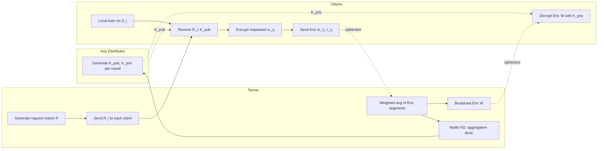
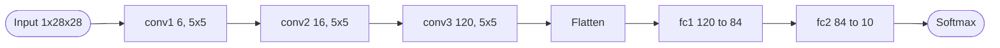
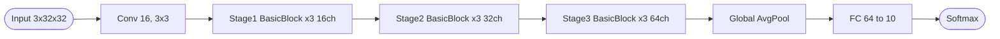
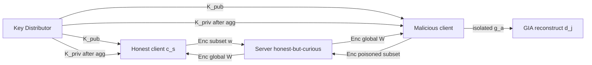
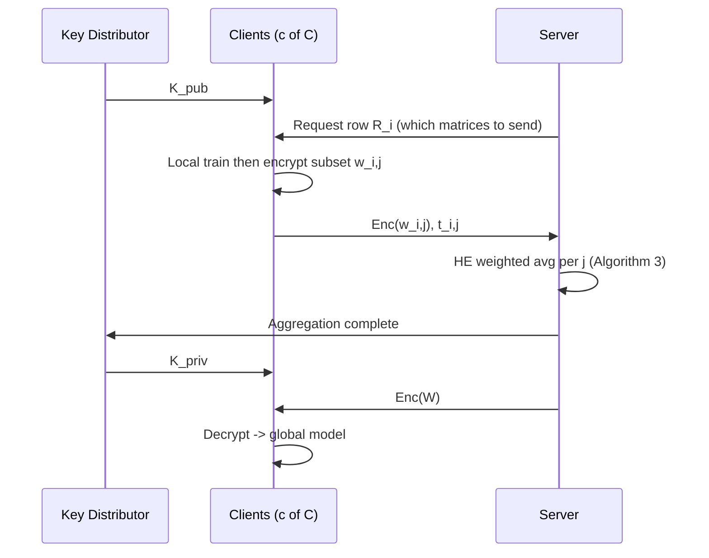

## TL;DR

BlindFL is a federated learning protocol that has each client encrypt and send only a random subset of its local parameter matrices (Client Model Segmentation, CMS) under single-key CKKS before server-side weighted averaging, cutting server aggregation time roughly in half while degrading neither model accuracy nor security against an honest-but-curious server, and additionally raising the cost of state-of-the-art malicious-client gradient-inversion attacks [§Abstract, §7].

## Problem and motivation

Standard federated learning leaks training data through gradient-inversion attacks (GIAs); FHE-based FL hides updates from the server but is expensive, and existing single-key FHE-FL schemes do not defend against malicious *clients* inside the federation, who can poison the decrypted global model to isolate per-sample gradients and reconstruct private data [§1, §2.3, §5]. Threat model: a malicious adversary A with white-box access to either the server or a subset c of C clients, with knowledge of the data distribution's mean/std; the paper focuses on the c-of-C compromised-clients case, since FHE already provably blocks server-side attacks for single-key schemes [§2.3, §5].

## Key contributions

- BlindFL: a PPFL architecture combining CKKS FHE with Client Model Segmentation (CMS), in which each client encrypts and sends only a server-requested subset of its parameter matrices [§1, §4].
- Request/response matrix algorithms (Algorithms 1, 2, 3) that guarantee at least p client matrices contribute to every global matrix while keeping per-client workload roughly M*p/c matrices [§4.1].
- A key-distributor (KD) node that mints a fresh CKKS public/private key pair per round so old keys cannot decrypt prior in-flight ciphertexts [§4.2, Protocol 1].
- Theoretical argument (via the Mo et al. per-layer sensitivity metric) that GIA sensitivity scales linearly with n/N submitted layers, with empirics showing an even steeper exponentially-decaying GIA success rate [§5, §6.6].
- Empirical demonstration that BlindFL roughly halves server aggregation time vs FHE-only FedAvg on both MNIST/LeNet-5 and CIFAR-10/ResNet-20 with <0.3 pp / <1.3 pp accuracy loss [§6.4, Tables 4-7].

## FHE setup

- **Scheme(s):** CKKS (approximate, fixed-point-friendly) [§6.1]
- **Library / implementation:** Pyfhel, which wraps Microsoft SEAL [§6, §6.1, refs 18, 35]
- **Parameters:** scheme CKKS; polynomial modulus degree n = 2^14 = 16,384; scale = 2^20; qi sizes = [60, 40, 40, 60]; 128-bit security target; one multiplicative depth needed for the w_i,j * t_i,j step [§6.1]
- **Bootstrapping used:** No — leveled scheme; only one homomorphic multiply per aggregation [§6.1]
- **Packing / encoding strategy:** Each parameter matrix is individually CKKS-encrypted; parameter matrices exceeding the 2 GB protobuf limit are split into n uniformly sized slices before encryption [§6]

## ML setup

- **Task:** Federated aggregation round (server-side weighted FedAvg under encryption); local training and inference are in plaintext at each client [§2.1, §4]
- **Model architecture:** Two use cases — LeNet-5 on MNIST with 10 parameter matrices / 545,546 params / 2,183,464 bytes (Table 1); ResNet-20 on CIFAR-10 with 128 parameter matrices / 284,426 params [§6, Table 1, §6.5]
- **Activation handling:** Not encrypted — activations run in plaintext during local client training. No polynomial approximation needed because FHE is only applied to weights during aggregation [§4.2]
- **Operates on:** Encrypted client model segments aggregated by server; plaintext local training/inference [§4.2]
- **Training vs inference:** Federated training rounds; CKKS protects the weighted average step only [§4.2, Protocol 1]

## Datasets

| Dataset | Task | Size (train/test) | Modality | Notes |
|---|---|---|---|---|
| MNIST [7] | Digit classification | Standard split, randomly shuffled and partitioned evenly across clients | 28x28 grayscale images | LeNet-5 model; client count varied 2-10 [§6, §6.2] |
| CIFAR-10 [21] | 10-class image classification | Standard split, randomly shuffled and partitioned evenly across clients | 32x32 RGB images | ResNet-20 model; client count varied 2-10 [§6, §6.2] |

## Pipeline diagram

### Pipeline steps (text)

1. KD generates a fresh CKKS keypair (K_pub, K_priv) for the round and shares K_pub with all participating clients [§4.2, Protocol 1].
2. Server runs Generate-Request-Matrix(M, c, p) to choose, per client, which parameter matrices to submit such that every global matrix receives at least p contributions [§4.1, Algorithm 1].
3. Each of c selected clients trains locally, then encrypts only the requested parameter matrices w_i,j (and reports per-class example counts t_i,j) under K_pub [§4.1, §4.2, Protocol 1].
4. Clients send Enc(w_i,j), t_i,j, and K_pub to the server [Protocol 1, step 10].
5. Server homomorphically computes W_j = sum_i (w_i,j * t_i,j) / sum_i t_i,j for every global matrix j [§4.1, Algorithm 3].
6. Server signals the KD that aggregation is finished; KD releases K_priv to each client [Protocol 1, step 12].
7. Server broadcasts Enc(W) to all C clients, who decrypt with K_priv to obtain the updated global model [Protocol 1, steps 14-16].
8. Repeat for the next round with a new keypair (experiments use 50 rounds) [§6.4].

## Architecture diagram

Two models are used; both run plaintext locally and only their parameter matrices traverse FHE.

### LeNet-5 (MNIST)

Parameter matrices per Table 1: conv1.weight/bias, conv2.weight/bias, conv3.weight/bias, fc1.weight/bias, fc2.weight/bias — 10 matrices, 545,546 params, 2,183,464 bytes [§6, Table 1].

### ResNet-20 (CIFAR-10)

ResNet-20 from He et al. [11], 128 parameter matrices, 284,426 parameters total [§6, §6.5].

## Results

Headline accuracies (5-trial avg, 50 rounds, 10 clients):

| Metric | This paper (BlindFL: FHE+CMS) | FL+FHE only | Standard FL | FL+CMS only | Hardware |
|---|---|---|---|---|---|
| MNIST acc (LeNet-5, p=3) | 98.53% | 98.82% | 98.71% | 98.56% | c5.18xlarge (72 vCPU, 144 GiB) [§6, Table 5] |
| MNIST round aggregation time | 49.94 s | 139.18 s | 1.80 s | 0.65 s | same [Table 5] |
| MNIST acc (LeNet-5, 5 matrices) | 98.66% | 98.82% | 98.79% | 98.72% | c5.18xlarge [Table 4] |
| MNIST round aggregation time (5 matrices) | 75.97 s | 139.14 s | 1.80 s | 1.00 s | same [Table 4] |
| CIFAR-10 acc (ResNet-20, 30% matrices) | 77.53% | 78.57% | 79.50% | 77.20% | c5.24xlarge (96 vCPU, 192 GiB) [Table 6] |
| CIFAR-10 round aggregation time (30%) | 102.31 s | 275.91 s | 12.42 s | 4.43 s | same [Table 6] |
| CIFAR-10 acc (ResNet-20, 50% matrices) | 78.69% | 79.42% | 79.92% | 79.14% | c5.24xlarge [Table 7] |
| CIFAR-10 round aggregation time (50%) | 153.65 s | 276.79 s | 12.43 s | 6.76 s | same [Table 7] |
| Per-client data sent, MNIST 5 layers | 29,888 KB | 29,888 KB (FHE) / 1,091 KB no-FHE | — | — | [Table 8] |
| Per-client data sent, CIFAR-10 50% | 61,350 KB | — | — | — | [Table 9] |

Vary-client-count headline (Table 2, 50 rounds, p = ceil(n/2)): MNIST stays at 98.70-98.81% across 2-10 clients; CIFAR-10 stays 76.35-78.74% [§6.2, Table 2].

GIA defense (§6.6, Figures 11/13): as the number n of layers in the attacked gradient drops, PSNR and SSIM of the GIA reconstruction decay exponentially on both MNIST and CIFAR-10; the authors recommend r = n/N <= 2/3 for meaningful client-to-client protection.

Note: the paper reports server-side *aggregation* latency per round, not single-sample inference latency — inference happens in plaintext at clients. comparison.single_inference_seconds is therefore N/A.

## Limitations and assumptions

- Per-client transmission grows substantially under FHE: 1 plaintext LeNet-5 layer averages 218 KB but ~5,977 KB encrypted (Table 8); CIFAR-10 100% encryption blows up from 1,154 KB to 122,701 KB (Table 9). CMS reduces the *fraction* of layers sent, but the absolute per-ciphertext cost is still very high [§6.5, §7].
- The KD must be trusted: it sees both keys each round, and the server is trusted to honestly signal aggregation completion [§4.2, Protocol 1].
- Single-key FHE: any client who receives K_priv can decrypt other clients' segments in flight; the paper mitigates this only by rotating keys each round, not by per-client keys [§4.2, §7 future work].
- Local activations and training run in plaintext on clients, so privacy guarantees apply only to transmitted weights and aggregation, not to a compromised client's local memory [§4.2].
- Hardware is unusually generous (72-96 vCPU AWS instances with 144-192 GiB RAM); the latency numbers will not translate to true edge devices [§6].
- Encryption, decryption, and network transfer time are excluded from the reported aggregation timings ("Encryption, decryption, and transfer time are not taken into consideration") [§6.4].
- CMS protection is statistical/expected-value based on the Mo et al. sensitivity metric; the empirical decay is steeper than theory predicts but the analysis assumes identically distributed per-layer sensitivities [§5].
- No baseline accuracy comparison to multi-key FHE schemes or to FedML-HE's selective-encryption baseline beyond qualitative discussion [§3].

## Related work it compares against

Positions against FedAvg (McMahan et al.) [27]; Phong et al. additively-HE deep learning [32]; FheFL (Rahulamathavan et al.) [33]; FedML-HE (Jin et al., selective encryption that sacrifices fully-encrypted aggregation) [20]; Sebert et al. FHE+DP [37]; Hu et al. segmented gossip (decentralized inspiration for CMS) [14]; Flower FL framework [22]; Pyfhel / Microsoft SEAL [18, 35]. Attacks compared against: Geiping et al. GIA [10] and Wei et al. malicious-client gradient inversion [40].

## Code and artifacts

Not released — no repository URL is given in the paper; license not stated.

## Extra diagrams (optional)

### Threat model

Server: honest-but-curious, sees only ciphertexts (single-key FHE provably safe). Malicious clients: poison their submitted segments to isolate target-class gradients in the decrypted global update; CMS limits how much of the gradient any one update can influence and how much they can observe [§2.3, §5].

### Federated round

### Activation approximation

N/A. Activations are not under FHE in BlindFL — they execute in plaintext during local client training; only the FedAvg weighted sum is homomorphic [§4.2].

## Open questions

- How much does end-to-end wall-clock time (including per-round CKKS key generation, encryption, decryption, and the up-to-~123 MB ciphertext transfer per client) actually grow vs the reported server-aggregation-only numbers?
- Is the KD a realistic deployment assumption, and what is the security story if KD colludes with one client or with the server?
- Does the exponentially-decaying GIA-success curve hold for transformer/large-model architectures, or is it an artifact of small CNNs?
- The paper's recommended r <= 2/3 plus p = C/2 leaves c >= p/r >= 3C/4 clients having to submit per round — how does scheduling work if some clients drop out mid-round?
- Communication-cost figures (Tables 8-9) exclude key transfer; is bandwidth-per-round reproducible on commodity edge hardware rather than 72-96 vCPU AWS instances?
