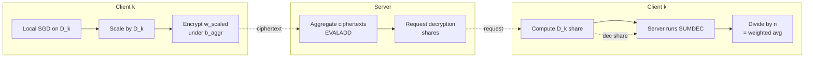
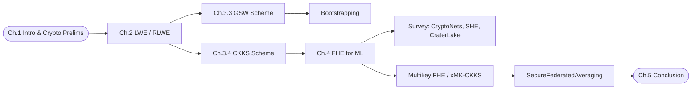
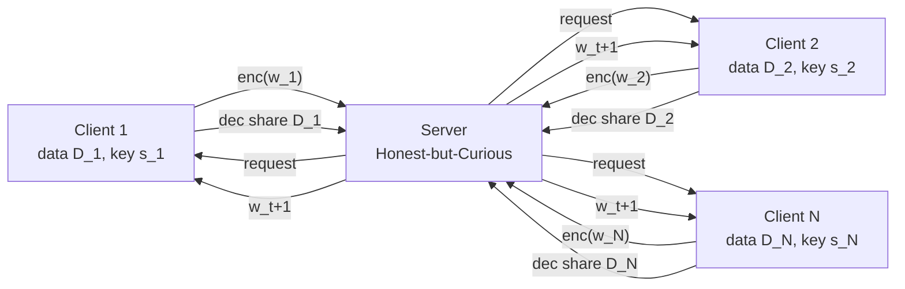
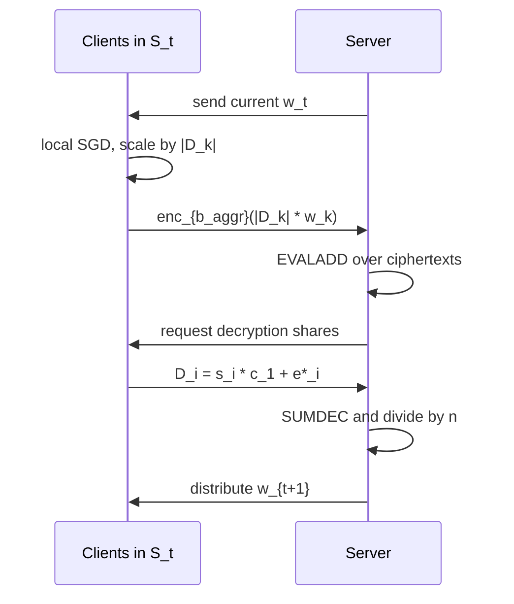

## TL;DR

A Harvard undergraduate honors thesis (March 20, 2023) that gives a from-first-principles exposition of FHE, covering LWE/RLWE, the GSW and CKKS schemes, and a survey of FHE-based privacy-preserving machine learning. Its single technical contribution is a modified xMK-CKKS-based "SecureFederatedAveraging" protocol that supports weighted averaging and client subsampling [§4.3.3].

## Problem and motivation

Machine learning services on personal data conflict with privacy demands and regulation (HIPAA, GDPR), and patient reluctance further limits genetic studies [§1, p. 5; §4.0.1, p. 49]. FHE resolves this by enabling computation on ciphertexts. The thesis targets a "mathematically mature student with no background in cryptography, number theory, and/or machine learning" and aims to take such a reader to the research frontier [§1.1, p. 6]. The threat model assumed throughout for ML applications is **Honest-but-Curious** servers [§4, p. 49].

## Key contributions

- A complete, self-contained exposition of FHE from LWE/RLWE through bootstrapping, GSW, and CKKS [§§2–3].
- A pedagogical worked example of GSW encryption, decryption, NAND, and bootstrappability [§3.3].
- Detailed walk-through of CKKS encoding, encryption, and homomorphic add/mult with noise-growth proofs [§3.4].
- Survey of FHE-based ML, covering CryptoNets, Faster CryptoNets, SHE, CraterLake, and medical applications (tumor classification, GWAS, heart-attack prediction, ECG monitoring) [§4.2].
- A modified multikey-CKKS federated-learning protocol (SecureFederatedAveraging) supporting weighted averaging over differently-sized client datasets and subsampling of clients per round [§4.3.3, p. 60].

## FHE setup

- **Scheme(s):** GSW (LWE-based, bit-level) and CKKS (RLWE-based, approximate); xMK-CKKS multikey variant from [MNSL21] used in the federated protocol [§3.3, §3.4, §4.3.3].
- **Library / implementation:** Not reported (thesis is theoretical; no implementation reported).
- **Parameters:** Symbolic only. GSW parameters: modulus `q`, dimension `n`, error distribution `χ`, bound `B` [Def. 3.3.1]. CKKS parameters: power-of-two `M`, ciphertext modulus, scale, error distributions [Def. 3.4.2]. No concrete bit-security level or polynomial degree is given.
- **Bootstrapping used:** Discussed conceptually. GSW is shown bootstrappable (Theorem 3.3.4) [§3.3.3]. CKKS bootstrapping is mentioned via [CHK+18] but not implemented [§3.4].
- **Packing / encoding strategy:** CKKS SIMD encoding into the canonical embedding of `R = Z[X]/(X^N+1)` is derived in detail [§3.4.1]. Cited limit: CKKS ciphertexts hold up to 65,536 plaintext elements [§4.2, p. 54].

## ML setup

- **Task:** Survey covers inference (CryptoNets, Faster CryptoNets, SHE, HCNN-style tumor classification), training (SHE), and federated training [§4.2, §4.3]. The thesis's own protocol targets a **federated-round** with weighted averaging [§4.3.3].
- **Model architecture:** No single architecture. Background section describes generic fully-connected networks, CNNs, convolutional filters, and pooling [§4.1, pp. 50–52]. Surveyed CryptoNets uses a small CNN on MNIST [§4.2.1, p. 55].
- **Activation handling:** Section 4.2 reviews polynomial activations and their tradeoffs: division, ReLU, max/min, tanh, sigmoid, softmax are FHE-unfriendly; CryptoNets uses `f(x) = x^2`; later works use low-degree polynomial approximations of ReLU; SHE computes exact ReLU and max-pooling via TFHE [§4.2, pp. 54–55; §4.2.1, pp. 55–56].
- **Operates on:** Surveyed protocols are mostly plaintext model + encrypted data. The xMK-CKKS federated protocol operates on encrypted model updates from each client [§4.3.3].
- **Training vs inference:** Both are surveyed. The thesis's protocol is a **training**-time federated aggregation round.

## Datasets

| Dataset | Task | Size (train/test) | Modality | Notes |
|---|---|---|---|---|
| MNIST | Handwritten-digit classification | Not reported | 28x28 grayscale images | Mentioned only as the benchmark for CryptoNets/SHE; not used directly in the thesis [§4.2.1, p. 55] |
| Tumor genetic data | Tumor classification | Not reported | Genetic | Referenced from [HPC+22]; "millions of genetic datapoints", limited to CKKS ciphertexts of 65,536 elements [§4.2, p. 54] |
| Chest X-rays / COVID-19 | Classification | Not reported | Medical imaging | Referenced from [WCK+22] as motivation for federated learning [§4.3, p. 56] |

## Pipeline diagram

### Pipeline steps (text)

1. Setup phase: server samples public parameter `a`; each client runs CKKS key-gen to produce `(s_i, b_i)`; server publishes aggregate public key `b_aggr = Σ b_i` [Def. 4.3.2, p. 58].
2. In round `t`, server selects random subset `S_t` of clients (size at least 2 to prevent single-client leakage) [§4.3.3, p. 60].
3. Each chosen client runs batched SGD on its local data `D_k` for `E` epochs and scales the resulting weights by `|D_k|` [Alg. 2, p. 60].
4. Client encrypts scaled weights under `b_aggr` and sends ciphertext to server.
5. Server homomorphically adds the ciphertexts via `EVALADD` to obtain `c_+`.
6. Each client computes a partial decryption share `D_i = s_i · c_1 + e*_i` and sends to server.
7. Server runs `SUMDEC(c_+, D_1, ..., D_N)` and divides by `n = Σ|D_k|` to obtain weighted-average global weights [Alg. 2, p. 60].
8. Server distributes new weights `w_{t+1}` to clients and repeats.

## Architecture diagram

This is a thesis/survey, so the "architecture" is the chapter taxonomy of the document rather than a neural network.

## Results

The thesis reports no original empirical numbers. It cites results from surveyed works:

| Metric | This paper | Baseline | Hardware |
|---|---|---|---|
| Original empirical results | None reported | — | — |
| CryptoNets accuracy (cited) | 98.95% on MNIST, >50,000 images/hour | Plaintext SOTA at the time: 99.79% [WZZ+13] | Not reported [§4.2.1, p. 55] |
| [CdWM+17] accuracy (cited) | 99.3% on MNIST | CryptoNets 98.95% | Not reported [§4.2.1, p. 55] |
| SHE accuracy (cited) | 99.77% on MNIST in half CryptoNets' time; shallower variant 99.54% in <4% of CryptoNets time | CryptoNets | Not reported [§4.2.1, p. 55] |
| CraterLake (cited) | ~10x speedup over CPU on CKKS ops | Standard CPU CKKS | Hardware accelerator [§4.2.1, p. 55] |

## Limitations and assumptions

- The proposed federated protocol guarantees correctness only in the **Honest-but-Curious** setting; malicious clients sending fake weights would corrupt the model, and defending against this is "beyond the scope of this work" [§4.3.3, p. 60].
- xMK-CKKS is only **MK-partially homomorphic** (addition only), since the federated averaging protocol doesn't need multiplications [§4.3.3, p. 58].
- Requires a minimum of 2 clients per round; otherwise a single client's weights would be revealed [§4.3.3, p. 61].
- The thesis is theoretical: no implementation, no concrete parameter sets, no security bit estimates, no measured runtimes.
- CKKS approximation error means the trained model differs slightly from a non-encrypted equivalent [§4.3.3, p. 60].
- Cited general FHE-ML limits: division cannot be done practically [GLN12]; CKKS ciphertext capacity limits dataset size (65,536 elements per ciphertext) [§4.2, p. 54].

## Related work it compares against

Surveys and positions against, but does not benchmark experimentally:

- **ML Confidential** [GLN12] — BFV with simple linear classifiers
- **CryptoNets** [GBDL+16] — first FHE CNN, `x^2` activation
- **[CdWM+17]** — poly-approx ReLU
- **Faster CryptoNets** [CBL+18]
- **SHE** [LJ19] — TFHE, exact ReLU and max-pool
- **CraterLake** [SFK+22] — hardware accelerator for CKKS
- **HCNN-style tumor classification** [HPC+22]
- **Medical FHE** [BLN14, PKA+14, KHB+20, KWN20]
- **Federated learning** [MMR+17] (FederatedAveraging) and inference attacks [MSCS18]
- **Multikey FHE** [LATV13, PS16, BP16, CM22, CDKS19, CCS19]
- **xMK-CKKS federated protocol** [MNSL21] (basis for the thesis's modified protocol)
- **PrivFT text classification** [BHM+20]

## Code and artifacts

Not released. No implementation is described in the thesis.

## Extra diagrams (optional)

### Threat model

The server is Honest-but-Curious; clients do not reveal data or local weights to each other or the server [§4, p. 49; §4.3.3, p. 60–61].

### Federated round

One round of SecureFederatedAveraging from Algorithm 2 [§4.3.3, p. 60].

## Open questions

- No concrete parameter sets (polynomial degree `N`, modulus `q`, noise distributions) are given for xMK-CKKS, so practical security/efficiency tradeoffs cannot be evaluated from the thesis alone.
- The thesis does not analyze communication cost of the decryption-share round trip, which is a load-bearing concern for real federated deployments.
- No empirical comparison of the modified weighted-averaging protocol against the original [MNSL21] scheme.
- How would the protocol be extended to malicious-client settings (e.g., via zero-knowledge proofs of correct local training)? Explicitly out of scope.
