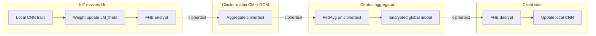
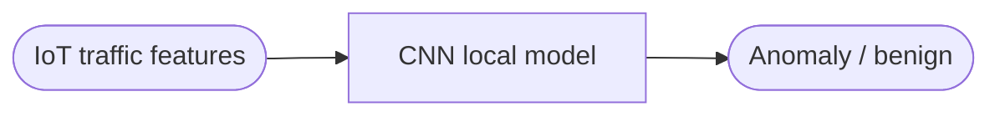
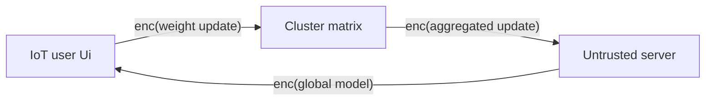

## TL;DR

The paper proposes four federated-learning protocol variants (OUCM, OECM, MUCM, MECM) that combine FHE with user-clustering on the N-BaIoT IoT botnet dataset, reporting communication-overhead reductions of 80.15–89.98% and up to a 70.38% latency reduction over a baseline FL approach while preserving accuracy around 0.997 for three of the four variants [Abstract; §VI].

## Problem and motivation

IoT-enabled smart cities exchange large volumes of sensitive sensor data and are vulnerable to attacks; pure FL transmits model parameters over insecure channels which can leak information [§I, pp. 4289–4290]. The authors target this leakage by encrypting model updates with FHE so the central server aggregates ciphertexts and never sees plaintext weights [§I, p. 4290; §III]. Threat model is implicit: the central aggregation server (and the network) is untrusted to view weights, while users keep their secret keys locally; clustering aims to reduce the amount of data transmitted between users and the server [§II, p. 4291; §III, p. 4291].

## Key contributions

- A secure FL approach for IoT-enabled smart cities that integrates FHE with FedAvg aggregation [§I, contribution 1].
- A flexible cluster-based design that yields four interchangeable scenarios (OUCM, OECM, MUCM, MECM) selectable per use case [§I, contribution 2; §III-A].
- Empirical evaluation on the benchmark N-BaIoT IoT dataset across five device types, plus a case study on the WUSTL-EHMS-2020 medical-IoT dataset [§I, contributions 3–4; §IV; §V].
- Quantified reductions in communication overhead (80.15–89.98%) and a latency reduction of up to 70.38% versus the baseline FL approach [Abstract; §VI].

## FHE setup

- **Scheme(s):** "FHE algorithm" used to encrypt model weights; specific FHE scheme (CKKS / BFV / BGV / TFHE) is not stated in the body of the paper [§III-A].
- **Library / implementation:** Not reported; experiments are implemented in Anaconda Python 3.9.12 [§IV-A].
- **Parameters:** Polynomial degree, ciphertext modulus, scale, and security level — Not reported.
- **Bootstrapping used:** Not reported.
- **Packing / encoding strategy:** Not reported; weights are batched into a "global cluster matrix" or per-cluster matrix before encryption [§III-A, Approaches 1–4].

## ML setup

- **Task:** Federated training and binary anomaly / intrusion detection on IoT network traffic; per-round encrypted aggregation of local model updates [§III; §IV].
- **Model architecture:** A convolutional neural network (CNN) is used as the local model on each user [§III-A, Approach 1, p. 4293]. Layer-by-layer structure (filter counts, kernel sizes, depth) is not specified in the text.
- **Activation handling:** Not reported; activations are never explicitly approximated under FHE because only the *weight updates* (LM_θᵢ(t+1) − LM_θᵢ(t)) are encrypted and homomorphically averaged at the server — forward and backward passes run locally on plaintext data [§III, p. 4291; Algorithms 1–4].
- **Operates on:** Plaintext model + plaintext data locally; encrypted weight updates / cluster matrices for the FedAvg aggregation step on the server [§III-A].
- **Training vs inference:** Federated training; the only homomorphic operation is the weighted average (FedAvg) of encrypted weight updates [Algorithms 1–4, §III-A].

## Datasets

| Dataset | Task | Size (train/test) | Modality | Notes |
|---|---|---|---|---|
| N-BaIoT [34] | IoT botnet / anomaly detection | Not reported explicitly (split into Dtrain/Dtest [Algorithms 1–4]) | Network traffic from five device types — baby monitor (IoT_1), doorbells (IoT_2), thermostat (IoT_3), security cameras (IoT_4), webcam (IoT_5) | Benchmark from UCI ML repository [§IV, p. 4295] |
| WUSTL-EHMS-2020 [41] | Intrusion + injection-attack detection in Internet of Medical Things | 14,272 benign + 2,046 attack samples [§V, p. 4298] | Hybrid: 35 network-flow metrics + 8 patient biometric features (44 features total) | Case study; man-in-the-middle (spoofing) and data-injection attacks [§V] |

## Pipeline diagram



### Pipeline steps (text)

1. Randomly distribute the N users into K clusters using function f(U, K) [§III-A, definitions & initialization].
2. Each user Ui trains its local CNN on its private dataset Di starting from the current global parameters GM_θ(t) [§III-A, local training].
3. Compute the weight update LM_θi(t+1) = LM_θi(t+1) − LM_θi(t) [Algorithms 1–4, line 7].
4. Depending on the variant, encrypt either (a) the whole global cluster matrix GCM after collecting plaintext updates (OUCM), (b) each user's update before sending (OECM), (c) per-cluster matrices CMr (MUCM), or (d) per-user updates routed into per-cluster matrices (MECM) [§III-A, Approaches 1–4].
5. Transmit ciphertexts to the central server [Algorithms 1–4, "Send … ⇒ server"].
6. Server runs FedAvg homomorphically: GM = (1/N) Σ Enc_*, without decrypting [§III-A; Algorithms 1–4, line 11/12].
7. Server returns the (encrypted) updated global model GM to all users [Algorithms 1–4].
8. Each user decrypts with its FHE secret key and overwrites its local model: LMi = Dec_FHE(GM) [Algorithms 1–4, line 13].
9. Repeat for T rounds (30 epochs in experiments, 100 users, 5 clusters) [§IV-A, p. 4296].

## Architecture diagram



Layer-by-layer details (number of conv layers, filter counts, kernel sizes, FC widths, activation functions) are not reported in the paper text; the model is referred to only as "a convolutional neural network (CNN) algorithm" [§III-A, Approach 1, p. 4293].

## Results

Reported headline numbers (averages across five N-BaIoT device subsets):

| Metric | Baseline FL | OUCM | OECM | MUCM | MECM | Hardware |
|---|---|---|---|---|---|---|
| Accuracy (avg) | 0.996–0.998 [Table III] | 0.911 (range 0.840–0.985) [Table IV] | 0.997 (0.997–0.998) [Table V] | 0.998 (0.997–0.998) [Table VI] | 0.997 (0.995–0.998) [Table VII] | 2× AMD EPYC 7742, 128 cores / 256 threads, 256 GB RAM [§IV-A] |
| F1-score | high (text) | 0.949 avg (0.912–0.992) [Table IV] | 0.998 avg (0.998–0.999) [Table V] | high (text) [Table VI] | high (text) [Table VII] | same |
| Latency (s per epoch) | 168–220 [§IV-A baseline] | 144–197 [§IV-A OUCM] | 170–221 [§IV-A OECM] | 37–91 [§IV-A MUCM] | ~170–224 [§IV-A MECM] | same |
| Comm overhead (total) | 104 MB [§IV-A baseline] | 1.04 MB [§IV-A OUCM] | 2.06 MB [§IV-A OECM] | 1.2875 MB [§IV-A MUCM] | 2.06 MB [§IV-A MECM] | same |
| Comm-overhead reduction vs baseline | — | 89.98% | 80.15% | 87.71% | 80.15% | [§VI, conclusion] |

The MUCM variant gives the headline latency reduction of 70.38% (37–91 s vs 168–220 s baseline) [Abstract; §IV-A]. MECM has the lowest security cost and best WUSTL-EHMS-2020 case-study accuracy/F1, but higher latency than MUCM [§IV-B; §V; Fig. 8; Table IX].

## Limitations and assumptions

- The specific FHE scheme, library, polynomial degree, security level and ciphertext-modulus parameters are never stated, so the cryptographic security claim cannot be reproduced from the paper alone [§III-A; §IV].
- Only encrypted aggregation is FHE: local CNN forward/backward passes run on plaintext data, so FHE here protects only weight transmission and aggregation, not training itself [§III, p. 4291].
- Latency per epoch is 37–224 s on a 128-core / 256-thread server with 256 GB RAM — heavy hardware compared with realistic IoT-edge deployment; the authors do not run on actual constrained IoT devices [§IV-A, p. 4295].
- OUCM's accuracy drops markedly (avg 0.911 vs baseline ~0.997), which the authors attribute to the encrypted aggregation step and flag as needing improvement [§IV-A, OUCM, p. 4296].
- The CNN architecture itself is unspecified, making the accuracy numbers hard to compare with prior IoT-FL work [§III-A; §IV].
- The fixed setup (30 epochs, 100 users, 5 clusters, learning rate 0.01, momentum 0.9) is small-scale and homogeneous; non-IID data and scalability are not evaluated [§IV-A, p. 4296].
- Future work flagged: optimize encryption/decryption overhead, evaluate on larger / more diverse datasets, compare to differential privacy and secure multiparty computation [§VI].

## Related work it compares against

- FedAvg / federated averaging — McMahan et al. [5].
- Paillier federated multilayer perceptron (PFMLP) — Fang and Qian [26].
- Weighted FedAvg + HE masking for IoT healthcare — Zhang et al. [27].
- BPFL (blockchain + Multi-Krum + HE) — Wang et al. [28].
- Non-FL/non-encrypted IoT intrusion detection — Khan & Mailewa [36], Kim et al. [37].
- Federated deep learning for zero-day botnet attacks — Popoola et al. [38].
- Memory-efficient federated IDS for IoT — Zakariyya et al. [39]; ransomware FL — Teshome [40].
- The case study reuses the WUSTL-EHMS-2020 framework of Hady et al. [41] and the safety-score metric of Salman et al. [32].

## Code and artifacts

Public GitHub repository: https://github.com/Artifitialleap-MBZUAI/Secure-Federated-Learning-with-Fully-Homomorphic-Encryption-for-IoT-Communications [Abstract; §III-A end]. License not reported.

## Extra diagrams (optional)

### Threat model



### Federated round

```mermaid
sequenceDiagram
    participant U as Users (CNN clients)
    participant CM as Cluster matrix
    participant S as Server (aggregator)
    U->>U: Local CNN train; compute LM_theta(t+1) - LM_theta(t)
    U->>CM: Send weight update (encrypted or plaintext, per variant)
    CM->>S: Send (encrypted) cluster matrix
    S->>S: FedAvg over ciphertexts: GM = (1/N) sum Enc_*
    S->>U: Return encrypted global model GM
    U->>U: Decrypt and update local CNN
```

### Activation approximation

Not applicable — activations run locally on plaintext during CNN training; only the weight-update aggregation is homomorphic [§III, p. 4291].

## Open questions

- Which FHE scheme is actually used (CKKS for real-valued weights would be natural for FedAvg, but BFV/BGV are not ruled out)? Which library and security level?
- What is the exact CNN architecture, and how are the weight tensors flattened into ciphertext slots / packed?
- How does accuracy degrade with realistic non-IID data partitioning across IoT users?
- What is the per-round cryptographic latency and ciphertext size, separate from the per-epoch wall-clock figures reported?
- Why does OUCM lose ~9 accuracy points versus the other three variants, when only the ordering of "aggregate then encrypt" vs "encrypt then aggregate" changes?
