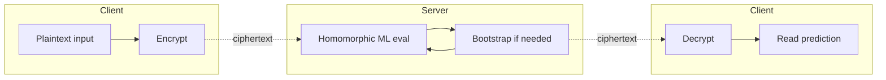
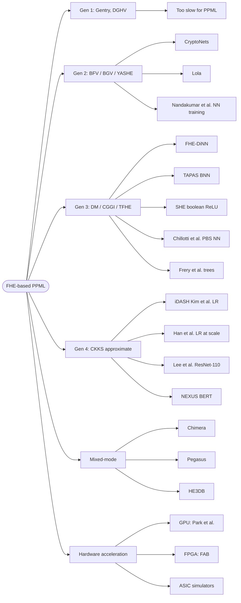

## TL;DR

A short survey by Cheng Hong (Ant Group) that organizes recent FHE-based privacy-preserving machine learning (PPML) work by the four "generations" of FHE schemes plus mixed-mode and hardware-acceleration efforts, aimed at helping practitioners pick a method for a given model/data combination [§1, p. 1-2].

## Problem and motivation

FHE allows computation on encrypted data without decryption and is a candidate technology to protect data confidentiality during ML training or inference [§1, p. 1]. But "there are many kinds of available FHE schemes and way more FHE-based solutions in the literature, and they are still fast evolving, making it difficult to get a complete view" [Abstract, p. 1]. The article tries to answer: given a model X and data Y, which FHE-based PPML method should I pick and what efficiency should I expect? [§1, p. 1-2]. Threat model is not explicitly formalized; the survey notes that FHE-based PPML is "a fully noninteractive procedure run on the server side", contrasting it with interactive MPC approaches [footnote 1, p. 2].

## Key contributions

- Adopts Gentry's four-generation taxonomy of FHE schemes (1st: ideal-lattice / DGHV; 2nd: RLWE-based BFV/BGV; 3rd: DM/FHEW & CGGI/TFHE; 4th: CKKS approximate) and maps representative PPML works to each generation [§1, p. 2].
- Reviews 2nd-generation PPML inference (CryptoNets, Lola) and training (Nandakumar et al.) [§2, p. 2-3].
- Reviews 3rd-generation CGGI-based works including FHE-DiNN, TAPAS, SHE, and Zama's PBS-based works for NN inference (Chillotti et al.) and tree-based inference (Frery et al.) [§3, p. 3-4].
- Reviews 4th-generation CKKS works, including iDASH competition winners, large-scale logistic regression training (Han et al.), ResNet-110 inference (Lee et al.), and Transformer (BERT-base) inference via NEXUS [§4, p. 4].
- Reviews mixed-mode FHE frameworks: Chimera, Pegasus, HE3DB [§5, p. 5].
- Surveys GPU, FPGA, and ASIC hardware accelerators for FHE [§6, p. 5].

## FHE setup

- **Scheme(s):** Surveys all four generations: 1st-gen (Gentry [2], DGHV [9]); 2nd-gen RLWE-based BFV, BGV, YASHE; 3rd-gen DM/FHEW and CGGI/TFHE; 4th-gen CKKS; and mixed-mode (Chimera, Pegasus, HE3DB) [§1-§5, p. 2-5].
- **Library / implementation:** Not specified at the survey level; cites Zama's Concrete-ML announcement [25] and references various original works' implementations.
- **Parameters:** Not reported (survey level).
- **Bootstrapping used:** Discussed as a discriminator across generations: 2nd-gen typically avoids it (depth-bounded), 3rd-gen features "fast bootstrapping" and Programmable Bootstrapping (PBS) for look-up tables, 4th-gen CKKS supports more efficient bootstrapping than BFV/BGV [§3, §4.2, p. 3-4].
- **Packing / encoding strategy:** Discusses SIMD packing [10] enabled by 2nd-gen and CKKS, CRT-based plaintext encoding (CryptoNets), bitwise encoding (Nandakumar et al., SHE), and image-tailored compact SIMD packing (Lee et al. for ResNet) [§2, §3.1, §4.2, p. 2-4].

## ML setup

- **Task:** Primarily inference (CNN, BNN, DiNN, ResNet, Transformer, tree-based, K-means), with a few training works (logistic regression, simple NN training) [§2-§4, p. 2-4].
- **Model architecture:** Surveyed; includes 5-layer CNNs (CryptoNets, Lola, TAPAS), single-hidden-layer 30-100 neuron nets (FHE-DiNN), 20/50/100-layer NNs on MNIST (Chillotti et al.), ResNet up to ResNet-110 (Lee et al.), BERT-base 128 tokens (NEXUS), decision trees / random forests / GBDT (Frery et al.), and logistic regression (Kim et al., Han et al.) [§2-§4, p. 2-4].
- **Activation handling:** Survey notes the central problem — non-polynomial activations (ReLU, sigmoid, softmax) are FHE-unfriendly. Reviewed approaches: square activation (CryptoNets, Lola); discretized integer activations (FHE-DiNN); binary activations (TAPAS); boolean-gate ReLU via CGGI (SHE); PBS look-up tables for ReLU (Chillotti et al.); 5–7-degree polynomial sigmoid (Kim et al.); 3-degree Taylor sigmoid (Han et al.); >20-degree polynomial ReLU (Lee et al.); low-degree (2–3) poly ReLU via NAS (Park et al.) [§2-§4, §6, p. 2-5].
- **Operates on:** Various — most works do encrypted-input/plaintext-model inference; a few works do training on encrypted data.
- **Training vs inference:** Survey covers both; training is "significantly greater challenge compared to inference" [§2, p. 3].

## Datasets

| Dataset | Task | Size (train/test) | Modality | Notes |
|---|---|---|---|---|
| MNIST | Image classification | Not reported (survey) | Images | Used by CryptoNets, FHE-DiNN, TAPAS, Chillotti et al. [§2, §3, p. 2-4] |
| CIFAR-10 | Image classification | Not reported | Images | Used by Lola, Lee et al. ResNet-110, Park et al. GPU ResNet-20 [§2, §4.2, §6, p. 3-5] |
| iDASH2017 gene dataset | Logistic regression training | 1579 samples × 18 features | Tabular / genomics | Kim et al. trained in 6 minutes via CKKS [§4.1, p. 4] |
| iDASH2018 SNPs | p-value / multi-model training | Not reported | Tabular / genomics | Won by CKKS-based teams [§4.1, p. 4] |
| Han et al. logistic regression set | LR training | 422,108 samples × 200 features | Tabular | 200 iterations in 1060 minutes [§4.2, p. 4] |
| FAB FPGA LR set | LR training | 11,982 samples × 196 features | Tabular | Trained in 0.1 s on FPGA [§6, p. 5] |
| BERT-base input | Transformer inference | 128 tokens | NLP | NEXUS, 1103 s end-to-end [§4.2, p. 4] |

## Pipeline diagram

Generic FHE-PPML server-side ciphertext flow the survey contrasts against interactive MPC [§1 footnote, p. 2].

### Pipeline steps (text)

1. Client encrypts input data with public key (pixel-wise, bitwise, or SIMD-packed depending on scheme) [§2, p. 2].
2. Server runs homomorphic inference or training on the chosen ML model, with no decryption [§1, p. 1].
3. Server optionally bootstraps to refresh ciphertext noise (3rd-gen fast bootstrap / PBS, or 4th-gen CKKS bootstrap) [§3, §4.2, p. 3-4].
4. Server returns the encrypted result.
5. Client decrypts with the secret key.

## Architecture diagram

Taxonomy of the survey: FHE generations and the representative PPML works mapped to each, plus mixed-mode and hardware-acceleration branches [§1-§6, p. 2-5].

## Results

Headline numbers reported in the survey for the works it cites. Hardware is given where the survey states it; otherwise "Not reported".

| Metric | This paper | Baseline | Hardware |
|---|---|---|---|
| CryptoNets MNIST throughput | 4096 images in 200 s, 99% accuracy [§2, p. 3] | — | Not reported |
| Lola speedup vs CryptoNets | >90× faster, supports CIFAR-10 [§2, p. 3] | CryptoNets | Not reported |
| Nandakumar et al. NN training | 1.5 days for 3-layer model on minibatch of 60 images [§2, p. 3] | — | Not reported |
| FHE-DiNN MNIST inference | ~1 image / second [§3.1, p. 3] | — | Not reported |
| TAPAS BNN inference | Hours per inference [§3.1, p. 3] | FHE-DiNN | Not reported |
| SHE latency | 3-5× higher than Lola, better accuracy (lossless ReLU) [§3.1, p. 3] | Lola | Not reported |
| Chillotti et al. 100-layer MNIST | "Tens of seconds" [§3.2, p. 3-4] | — | AWS cloud server |
| Zama Concrete-ML rounding optimization [25] | >10× faster than [23]; ~2% accuracy drop on MNIST [§3.2, p. 4] | Chillotti et al. [23] | Not reported |
| Frery et al. tree (depth 5) | Within 5 s; sub-second possible; accuracy matches plaintext [§3.2, p. 4] | — | Not reported |
| Kim et al. CKKS LR (iDASH2017) | 6 min on 1579×18 [§4.1, p. 4] | BFV/BGV: tens-to-hundreds of min | Not reported |
| Han et al. CKKS LR at scale | 1060 min for 200 iterations on 422,108×200 [§4.2, p. 4] | — | Not reported |
| Lee et al. ResNet-110 (CKKS) | ~13,000 s per CIFAR-10 image; 75% in bootstrap; accuracy ~ plaintext [§4.2, p. 4] | — | Not reported |
| NEXUS BERT-base inference | 1103 s for 128 tokens [§4.2, p. 4] | — | Not reported |
| Pegasus arbitrary functions | 1-2 s; PBS accuracy <8-bit limit [§5, p. 5] | Chimera | Not reported |
| Park et al. GPU ResNet-20 (CIFAR-10) | 8.5 s; 267× over CPU [31]; 1.4 s with low-deg poly ReLU NAS [§6, p. 5] | CPU CKKS [31] | NVIDIA A100 |
| FAB FPGA LR | 0.1 s training on 11,982×196; 370× over CPU [§6, p. 5] | CPU | Xilinx Vivado FPGA @ 300 MHz |

## Limitations and assumptions

- The author explicitly notes the survey is not exhaustive: works are "(possibly subjectively) pick[ed]" as "representative" rather than complete due to space limits [§1, p. 2].
- 1st-generation FHE is "too slow to support PPML applications" and is essentially skipped [§1, p. 2].
- The conclusion flags that despite progress, "there is still a long way to go before FHE can efficiently support more complex tasks such as Imagenet classification" [§7, p. 5].
- Most reported ASIC accelerators "were mostly evaluated on simulators rather than real chips" [§6, p. 5].
- Threat model is left informal; communication and key-management costs are not analyzed.
- Many reported numbers in the survey lack hardware context (CPU model, cores, RAM), so cross-paper comparisons are approximate.

## Related work it compares against

The article positions itself against MPC-based PPML surveys (Ng & Chow, SoK [15]) and against the FHE accelerator survey by Zhang et al. [43]. Within FHE, it discusses CryptoNets, Lola, FHE-DiNN, TAPAS, SHE, Chillotti et al., Frery et al., Kim et al., Han et al., Lee et al., NEXUS, Chimera, Pegasus, HE3DB, Park et al., FAB, HEAX, FPT, CHAM, TensorFHE [§2-§6, p. 2-5].

## Code and artifacts

Not released (this is a survey article). Zama's Concrete-ML announcement is cited as a public artifact for [25] (https://www.zama.ai/post/making-fhe-faster-for-ml-beating-our-previous-paper-benchmarks-with-concrete-ml) [§3.2, p. 4]. iDASH competition site cited: http://www.humangenomeprivacy.org [§4.1, p. 4].

## Extra diagrams (optional)

### Threat model

The survey contrasts this non-interactive FHE flow against MPC-style interactive protocols [§1 footnote 1, p. 2].

## Open questions

- The survey gives wall-clock numbers but rarely matched hardware context — a normalized cross-paper benchmark remains an open community task [§6, p. 5].
- The author concludes that "hardware-software co-optimization would be the key point" but does not commit to a specific recommendation for picking a scheme given model X and data Y [§7, p. 5].
- Practical security parameter choices, ciphertext sizes, and key-distribution overhead across the surveyed works are not tabulated.
- The survey does not cover differential-privacy hybrids or federated-learning + FHE, which are adjacent and increasingly relevant.
