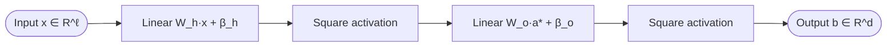

## TL;DR

Hong et al. construct the first fully encrypted, non-interactive functional-encryption (FE) protocol for ML inference: a new "LinEnc-QFE" quadratic FE scheme whose encryption algorithm is a *linear* function of the message, enabling iterative `Enc ∘ f` composition so that intermediate layers stay ciphertext and the client never has to come back online [§1.1, §3.1]. They instantiate a 2-layer quadratic neural network on Iris and Breast Cancer and prove security against malicious adversaries [§4, §5.3].

## Problem and motivation

Existing FHE- and MPC-based PPML protocols either require the client to be online during computation (MPC) or require the client to decrypt the final result (FHE), making applications such as server-side spam filtering impractical [§1]. FE-based PPML avoids interaction but prior FE schemes only support inner-product or quadratic functions, so prior FE-PPML works are "partially encrypted" — the first layer is encrypted, later layers run in cleartext. Carpov et al. [7] showed that such cleartext intermediates leak input information [§1]. The threat model is **malicious** adversaries: the evaluator and other clients may deviate arbitrarily and collude, yet must learn nothing beyond `F(x₀)` [§4.1, Definition 1].

## Key contributions

- First "fully encrypted" FE-based PPML protocol with **zero client interactions** during inference [§1.1, Table 1].
- New private-key quadratic FE scheme **LinEnc-QFE** whose encryption is a linear function of the message, allowing functional keys of the form `fk_{Enc ∘ f}` and therefore iterative composition that keeps intermediates encrypted [§3.1, §3.2].
- Security in the **malicious model** via randomizing linear functions `h_i, h_i^{-1}` on functional keys and `γ, γ^{-1}` on the message [§1.1, §4].
- A working implementation on Iris and Breast Cancer 2-layer quadratic NNs, with experimental benchmarks [§5.3].
- Open-source code at https://github.com/swanhong/fully-encrypted-ml/ [§1.1, §5.1].

## FHE setup

- **Scheme(s):** This is a **functional-encryption** protocol, not FHE. Two FE primitives are combined: a DCR-based public-key inner-product FE (`pkIPFE`) from Agrawal et al. [1], and a new private-key quadratic FE called **LinEnc-QFE** built on Musciagna's QFE [29] [§2.2, §3.2].
- **Library / implementation:** Custom implementation (referenced github repo); the complexity comparison uses Charm library [2] timings for [37], and authors' own E = 321 ms per `Z*_{N²}` exponentiation [§5.2, Table 4].
- **Parameters:** 128-bit security; `N = p·q` with `p, q` 3072-bit primes (so `N` is 6144 bits, working group `Z*_{N²}`); secret integers sampled in a 12288-bit space [§5.1]. `Q_i = 2ℓ_i + 1` ciphertext bound per layer, `k = 1`, `L = O(log ℓ_{i+1})` [§5.1, §5.2].
- **Bootstrapping used:** Not applicable (no FHE; depth is handled by FE composition `Enc ∘ f`, but the LinEnc-QFE is only `Q`-ciphertext bounded so randomness budgets are managed via the additional `h_i, γ` masks [§4, Remark 4]).
- **Packing / encoding strategy:** Coefficient vectors over `Z_N`; messages scaled to integers via factor `S = 2³⁰` to handle real-valued NN weights [§5.3]; matrix Kronecker products `(x‖1) ⊗ (x‖1)` encode quadratic functions [§3.2, §3.4]; ciphertexts decomposed via `Decomp_L` to bound entry sizes for iterated composition [§3.4].

## ML setup

- **Task:** Encrypted **inference** (classification) on tabular UCI data [§5.3].
- **Model architecture:** 2-layer fully-connected **Quadratic Neural Network (QNN)**: input dim `ℓ` → hidden layer of `u = 4` units with quadratic activation → output layer of `d` units with quadratic activation. Iris uses `(ℓ, u, d) = (4, 4, 3)`; Breast Cancer uses `(9, 4, 2)` [§5.3].
- **Activation handling:** Native **square** activation (`(⟨W_i, x⟩ + β_i)²`), not a poly-approximated ReLU — the network is designed quadratic so the FE protocol's quadratic functionality matches exactly [§5.3].
- **Operates on:** Plaintext (server-held) model + encrypted client data; functional keys for the model are issued by a trusted Key Distributor [§4.1, Fig. 8].
- **Training vs inference:** Inference only; training is plaintext on the data owner side, the trained QNN weights are provided to the evaluator [§5.3].

## Datasets

| Dataset | Task | Size (train/test) | Modality | Notes |
|---|---|---|---|---|
| Iris (UCI) | 3-class classification | Not reported | Tabular | ℓ = 4 features, scaled by `S = 2³⁰`; cross-entropy training loss [§5.3] |
| Breast Cancer (UCI) | 2-class classification | Not reported | Tabular | ℓ = 9 features, scaled by `S = 2³⁰` [§5.3] |
| Synthetic toy | Benchmark of two-layer protocol | N/A | Random vectors `Z_N^ℓ` for `ℓ = 1..6` | Used in Table 3 micro-benchmarks [§5.1] |

## Pipeline diagram

Non-interactive flow: the client encrypts once and goes offline; the evaluator obtains the final plaintext result without contacting the client again.

```mermaid
flowchart LR
    subgraph KD [Key Distributor]
        K1[Sample pk, msk] --> K2[Sample γ, h_i]
        K2 --> K3[Issue fk_Enc∘f_i, fk_f_E]
    end
    subgraph Client
        C1[Input x] --> C2[Encrypt γ&#40;x&#41; with pkIPFE]
    end
    subgraph Evaluator
        E1[Receive ct_γ&#40;x&#41;] --> E2[Dec fk_1: ct of h_1∘f_1&#40;x&#41;]
        E2 --> E3[Dec fk_2: ct of h_2∘f_2∘f_1&#40;x&#41;]
        E3 --> E4[Dec fk_E: plaintext F&#40;x&#41;]
    end
    K1 -. pk, γ .-> C1
    K3 -. functional keys .-> E1
    C2 -. ct_γ&#40;x&#41; .-> E1
    E4 --> O([Inference result])
```

### Pipeline steps (text)

1. The Key Distributor runs `Setup → (pk, msk)` and samples random invertible linear maps `(γ, γ⁻¹)` and `(h_i, h_i⁻¹)` per layer; ships `pk` and `γ` to the client [§1.2, step 1].
2. The client computes `ct_{γ(x)} ← Enc(pk, γ(x))` using `pkIPFE` and sends a single ciphertext to the evaluator, then goes offline [§1.2, step 2; §4].
3. The evaluator submits the trained model `f_1, …, f_E` (quadratic functions) to the Key Distributor [§1.2, step 3].
4. The Key Distributor produces functional keys `fk_i ← KeyGen(msk, Enc ∘ F_i)` for intermediate layers (with `F_i = h_i ∘ f_i ∘ h_{i-1}⁻¹`) and `fk_E ← KeyGen(msk, f_E ∘ h_{E-1}⁻¹)` for the output layer; sends keys to the evaluator [§1.2, step 4].
5. The evaluator iteratively decrypts: `ct_{h_i ∘ f_i ∘ ⋯ ∘ f_1(x)} ← Dec(fk_i, ct_{prev})`, each output remaining a LinEnc-QFE ciphertext [§1.2, step 5; §3.4].
6. Final-layer decryption with `fk_E` returns `f_E ∘ ⋯ ∘ f_1(x)` in plaintext; the client is never contacted again [§1.2, step 5; §6].

## Architecture diagram

The 2-layer Quadratic Neural Network the paper actually evaluates (Iris uses `ℓ=4, d=3`; Breast Cancer uses `ℓ=9, d=2`; both share hidden width `u=4`) [§5.3].

## Results

Reported on Intel Xeon Silver 4208 @ 2.10 GHz, 30 GB RAM, Linux [§5]. Per-input inference times (one sample) and the per-party costs are below [Table 5, p. 21]. The evaluator's `Dec` step is the per-inference latency in plaintext-output terms; `KeyGen` is a one-time per-model cost (paid by the Key Distributor).

| Metric | This paper | Baseline | Hardware |
|---|---|---|---|
| Inference accuracy error vs plaintext (Iris, Breast Cancer) | < 10⁻⁷ (real-number error after `S=2³⁰` integer scaling) [§5.3] | Plaintext QNN | Xeon Silver 4208 |
| Per-inference Dec time (Iris, ℓ=4, u=4, d=3) | 1.11 h ≈ 3996 s [Table 5] | — | Xeon Silver 4208, 30 GB RAM |
| Per-inference Dec time (Breast Cancer, ℓ=9, u=4, d=2) | 3.32 h ≈ 11952 s [Table 5] | — | Xeon Silver 4208, 30 GB RAM |
| Per-inference Enc time (client, Iris / Breast) | 0.93 s / 1.13 s [Table 5] | — | Xeon Silver 4208 |
| KeyGen (one-time per model, Iris / Breast) | 1.05 h / 3.61 h [Table 5] | — | Xeon Silver 4208 |
| Setup (Iris / Breast) | 1.47 s / 4.92 s [Table 5] | — | Xeon Silver 4208 |
| Toy two-layer protocol Dec @ ℓ=6 | 4.02 h [Table 3] | — | Xeon Silver 4208 |
| Group exponentiation cost `E` | ≈ 321 ms / op [§5.2] | Pairing-based [37]: `E₁=E₂=16 ms`, `P=22 ms` (Charm) | Xeon Silver 4208 |
| Classification accuracy | Not reported | — | — |

The headline accuracy figure (classification accuracy of the QNN) is **not reported**; the paper only reports that the encrypted inference output matches the plaintext QNN's output to within `10⁻⁷` [§5.3]. The `single_inference_seconds` in the front matter records the Breast Cancer Dec time (3.32 h).

## Limitations and assumptions

- **Trusted Key Distributor (third party)** required to hold `msk` and generate functional keys for each model `F_l` and each composition `Enc ∘ f_{l,i}` [§4.1, §4 Fig. 8]. The protocol is "non-interactive" between client and evaluator but assumes this KD.
- **Per-inference latency is hours, not seconds**: 1.11 h (Iris) and 3.32 h (Breast Cancer) for a single inference — the authors explicitly call out that exponentiations on 12288-bit-sampled integers in the DCR group are ~10⁶× slower than the multiplications used by other protocols [§5.1, §6].
- **Q-ciphertext-bounded LinEnc-QFE**: the new FE scheme is only secure for an a-priori-bounded number of ciphertext queries `Q = 2ℓ_i + 1` per layer [§3.2, §3.3, §5.1].
- **Only quadratic activations** — arbitrary functions are claimed via composition of quadratic polynomials, but in practice the demonstrated model is a 2-layer QNN with `x²` activations [§5.3, §6].
- **No classification-accuracy numbers** on Iris or Breast Cancer; only an output-error bound `<10⁻⁷` vs plaintext [§5.3].
- **Small input dimensions** (ℓ ≤ 9 in experiments; toy benchmark only goes to ℓ = 6 [Table 3]); scaling to image-sized inputs is not demonstrated.
- **Last layer reveals plaintext** to the evaluator by construction — the evaluator learns `F(x)` in cleartext, which is the desired behaviour for "non-interactive" but means evaluator-side label leakage is by design [§1.2, §4].

## Related work it compares against

- **FHE-based PPML:** CryptoNets [13], CryptoDL [16], ML Confidential [15], HomoPAI [20], Liu et al. logistic regression [24] [§1, Table 1].
- **MPC-based PPML:** SecureML [28], ABY2.0 [31], ABY3 [27], CrypTFlow [19], CryptGPU [39], Chameleon [34], SecureNN [40], AdamInPrivate [5], FalconN [41], BLAZE [32] [Table 1].
- **FE-based PPML (the direct competitors):** Ligier et al. (IPFE + Extremely Randomized Trees) [22], Xu et al. (IPFE, 5-layer NN, partial) [44], Sans et al. (QFE, 2-layer NN, partial) [11], Ryffel et al. (QFE, 2-layer NN, partial) [37]. This is the only entry in Table 2 with "Fully Encrypted = ✓" [Table 2].
- **Attack motivation:** Carpov et al. [7] showed leakage from cleartext intermediates in partial FE-PPML [§1].

## Code and artifacts

Repository: https://github.com/swanhong/fully-encrypted-ml/ [§1.1, §5.1]. License: Not reported.

## Extra diagrams (optional)

### Threat model

Three parties; security holds against a malicious adversary that may corrupt the evaluator and the non-honest clients `{C_j}_{j≥1}`. The honest client `C_0` is the input owner [§4.1].

```mermaid
flowchart LR
    KD[Key Distributor - trusted] -- pk, γ --> C0[Honest client C₀]
    KD -- fk_Enc∘f_i, fk_f_E --> E[Evaluator - possibly malicious]
    C0 -- ct_γ&#40;x₀&#41; --> E
    Cj[Other clients C_j - possibly malicious + colluding] -- ct_x_j --> E
    E --> R([F&#40;x₀&#41; in plaintext])
```

## Open questions

- What is the **classification accuracy** of the trained QNN on Iris / Breast Cancer? The paper only reports closeness to plaintext output (`<10⁻⁷`), not test-set accuracy [§5.3].
- How does the protocol scale to inputs of dimension > 9, given that complexity is `O(ℓ_i² ℓ_{i+1} log ℓ_{i+1}) · E` exponentiations per intermediate layer with `E ≈ 321 ms` [§5.2]?
- What does the **ciphertext / functional-key size** look like in bytes? The paper gives dimensions (`6m + 3Q + 8` per column, decomposed by `L`) but no byte-level numbers [§3.4].
- How is the **Key Distributor instantiated** in practice — is it expected to be a hardware enclave, a separate organization, threshold-shared? Not discussed [§4.1].
- Could deeper networks (more than 2 quadratic layers) be evaluated in practice, given each composition costs a full `KeyGen` round and `Dec` time grows with the layer count? Only the 2-layer case is benchmarked [§5.3, Table 5].

