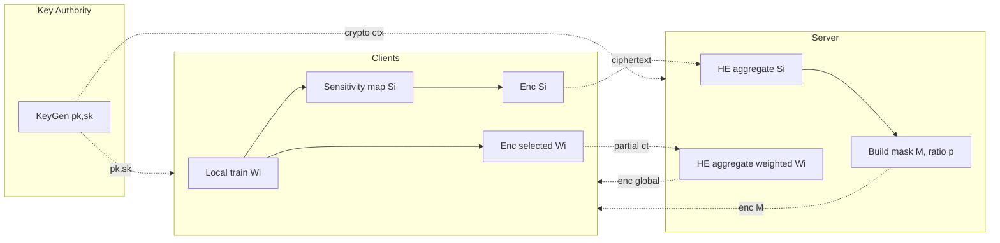
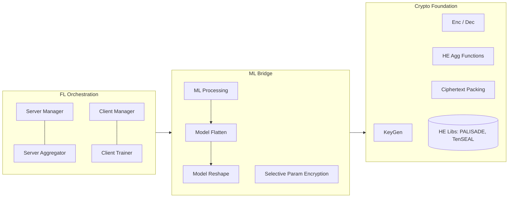
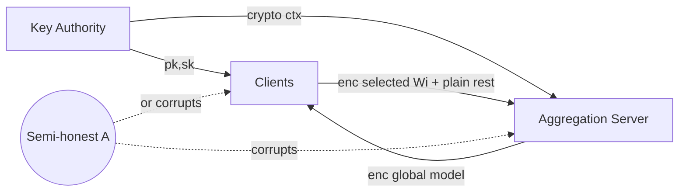
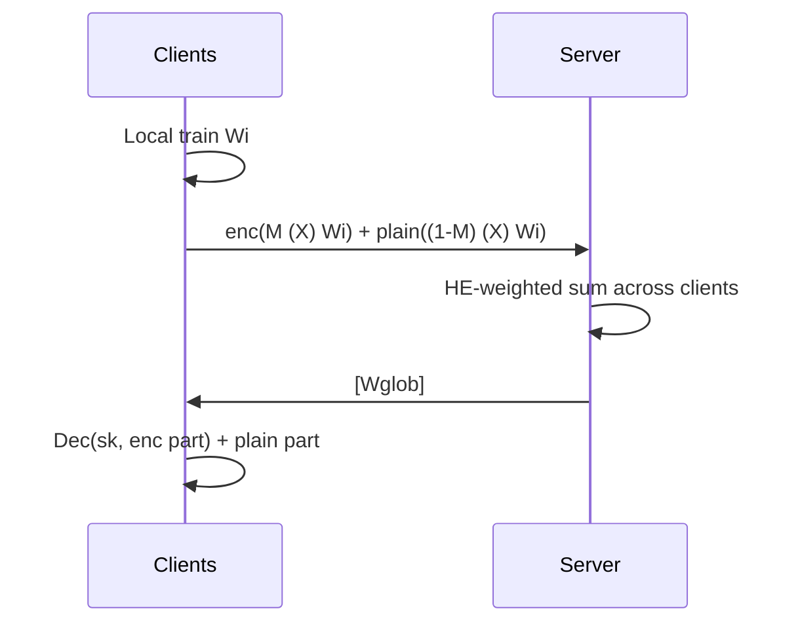

## TL;DR

FedML-HE is the first practical CKKS-based homomorphic-encryption federated learning system that, by encrypting only the most privacy-sensitive parameters ("Selective Parameter Encryption"), cuts HE overhead roughly 10x for ResNet-50 and up to 40x for BERT while keeping exact aggregation [Abstract][§1].

## Problem and motivation

Standard federated learning leaks information because plaintext local model updates received by the aggregation server can be inverted to reconstruct training data [§1, Fig.1]. Differential privacy degrades accuracy and secure aggregation needs synchronization and is fragile to client dropout [Table 1]. HE-FL preserves exact gradients and is dropout-resilient but introduces ~15x computation/communication overhead, making it infeasible for foundation models [§1].

Threat model: a semi-honest adversary A that may corrupt either the aggregation server or any subset of clients (but not both simultaneously, in the single-key setup) [Definition 3.1, §2.2]. A threshold variant covers server+up to n-k client corruption [Definition 3.2]. No collusion is assumed between the trusted key authority and the aggregation server [§B].

## Key contributions

- First practical HE-based FL system supporting encryption key management, encrypted FL platform deployment, optimization, and foundation-model federated training [§1 contributions].
- Selective Parameter Encryption: encrypt only the top-p% most privacy-sensitive parameters, identified via a sensitivity-based privacy map, to dramatically reduce HE overhead [§2.4, Fig.4].
- Theoretical privacy analysis: full HE achieves 0-differential-privacy; sensitive selection achieves (1-p)^2 J vs random selection's (1-p) J [Theorem 3.11, Remarks 3.12-3.14].
- System framework with three layers (Crypto Foundation / ML Bridge / FL Orchestration) supporting pluggable HE libraries and a deployment platform across cloud/edge [§2.5, Fig.6].
- Empirical: ~10x reduction for ResNet-50, ~40x for BERT; top-10% selection on LeNet defeats DLG attacks where random selection needs 42.5% [§4.2.2, Abstract].

## FHE setup

- **Scheme(s):** CKKS (chosen because FL model parameters are non-integer) [§A.2].
- **Library / implementation:** PALISADE (default) and TenSEAL; threshold variant uses PALISADE's Shamir-secret-sharing-based threshold protocol [§4.1, §B].
- **Parameters:** multiplicative depth 1, scaling factor bit-digit 52, packing batch size 4096, security level 128-bit (default) [§4.1].
- **Bootstrapping used:** No (only depth-1 multiplications required for aggregation weighting) [§2.3].
- **Packing / encoding strategy:** SIMD batching with 4096-slot ciphertexts; model tensors flattened to 1D then packed [§4.1, Table 3].

## ML setup

- **Task:** federated-round (HE-protected FedAvg secure aggregation). Training itself runs in plaintext locally on each client; only the per-round upload/aggregation is encrypted [§2.3, Algorithm 1].
- **Model architecture:** Framework-level — evaluated on Linear, TimeSeries Transformer, MLP (2 FC), LeNet, RNN (2 LSTM + 1 FC), CNN (2 Conv + 2 FC), MobileNet, ResNet-18/34/50, GroupViT, Vision Transformer, BERT, and Llama-2 7B [Table 4].
- **Activation handling:** N/A — activations run in plaintext locally; HE only sees parameter aggregation, not forward passes [§2.3].
- **Operates on:** encrypted-model-updates + plaintext server aggregation weights (default). Server homomorphically sums weighted ciphertexts of selected parameters; the remainder is aggregated in plaintext under the same protocol [§2.3 equation for Wglob].
- **Training vs inference:** federated training; encryption surrounds model-update aggregation only [§2.3].

## Datasets

| Dataset | Task | Size (train/test) | Modality | Notes |
|---|---|---|---|---|
| CIFAR-100 | Image classification (used to compute LeNet sensitivity & for DLG attack evaluation) | Not reported | Images | Used for parameter sensitivity map and gradient-inversion attack evaluation [§4.2.2]. |
| wikitext | Language modeling (BERT inversion attack evaluation) | Not reported | Text | Used to evaluate Language Model Inversion Attacks defense [§4.2.2, Fig.10]. |

(System overheads are benchmarked on models without specifying downstream datasets [Table 4].)

## Pipeline diagram

### Pipeline steps (text)

1. Key Authority runs HE.KeyGen(lambda) and distributes (pk, sk) to clients and crypto context to the server [Algorithm 1, §2.3].
2. Each client computes a local sensitivity map Si over its dataset Di using gradient sensitivity w.r.t. input [§2.4 Step 1].
3. Clients encrypt Si and send [[Si]] to the server [Algorithm 1].
4. Server homomorphically aggregates the sensitivity maps into a global privacy map and selects the top-p ratio of parameters as the encryption mask M [§2.4 Step 2].
5. Clients decrypt M (round 1) and use it to selectively encrypt the most sensitive parameters of their trained model Wi; the rest is sent in plaintext [Algorithm 1].
6. Server aggregates: [Wglob] = sum_i alpha_i [[M (X) Wi]] + sum_i alpha_i ((1-M) (X) Wi) [§2.3 equation].
7. Clients receive [Wglob], decrypt the encrypted portion using sk, recombine with the plaintext portion, and proceed to the next training round [Algorithm 1].

## Architecture diagram

FedML-HE is a federated training **system**, not a single-model FHE inference pipeline. The diagram below shows the framework's three-layer software stack [§2.5, Fig.6].

## Results

Headline overhead reductions and accuracy.

| Metric | This paper | Baseline | Hardware |
|---|---|---|---|
| ResNet-50 HE-FL time (1 round, 3 clients) | 46.672 s (vanilla full-encrypt); ~10x reduction via selective encryption (Abstract, §1) | Plaintext 5.379 s [Table 4] | Intel i7-7700 8-core 3.60GHz, 32 GB RAM, Tesla T4, Ubuntu 18.04.6 [§4.1] |
| BERT HE-FL time | 136.914 s (vanilla full-encrypt); up to ~40x reduction via selective + parameter-efficiency (Abstract) | Plaintext 19.674 s [Table 4] | Same as above |
| Llama-2 (7B) HE-FL time | 13067.154 s | Plaintext 2423.976 s (5.39x ratio) [Table 4] | Same as above |
| ViT @ 10% selective encryption | 30.874 s, 844.49 MB | Full encryption 112.504 s, 5.35 GB [Table 7] | Same as above |
| CNN (2 Conv + 2 FC) model-test accuracy delta | -1.85% to +0.32% across packing/scaling configs [Table 6] | Plaintext baseline | Same as above |
| Defense vs DLG on LeNet/CIFAR-100 | Top-10% sensitive encryption suffices [§4.2.2] | Random selection needs 42.5% [§4.2.2] | Same as above |
| Defense vs LM inversion on BERT/wikitext | 30% selective beats 75% random (accuracy 0.0820 vs 0.1973) [Fig.10] | — | Same as above |
| FedML-HE (PALISADE) vs NVIDIA FLARE (CNN, 3 clients) | 2.456 s, 105.72 MB (vanilla); 0.874 s, 16.37 MB with opt | FLARE TenSEAL 2.826 s, 129.75 MB; IBMFL 3.955 s, 86.58 MB [Table 8] | Same as above |

## Limitations and assumptions

- Authors flag: quantitative/theoretical privacy-vs-overhead-vs-utility trade-off analysis vs DP and secure aggregation is left to future work [§6].
- Threshold-HE performance in FL is admittedly suboptimal and listed as future work [§6].
- Decentralized variants (multi-key HE, proxy re-encryption) are not implemented yet [§B, §6].
- Assumes no collusion between the trusted key authority server and the aggregation server [§B] — load-bearing.
- Single-key default lets a malicious server colluding with any client decrypt benign clients' updates [§2.2].
- Sensitivity map depends on client data; with heterogeneous distributions the global aggregated map may not be optimal (mitigated by HE-aggregating local maps) [§2.4 Step 2].
- Selective Parameter Encryption is empirical/heuristic; (1-p)^2 J DP equivalence relies on a uniform-sensitivity assumption ∆f ~ U(0,1) [§3.3].
- Communication ratios stay ~16x even with selective encryption on small models because of CKKS packing-batch-size floor of 4096 slots [§D.2, §4.1].
- Llama-2 still costs >13000 s/round and 417 GB ciphertexts even with vanilla setup — selective encryption's scalability at this size is not fully demonstrated end-to-end [Table 4].

## Related work it compares against

- NVIDIA FLARE (TenSEAL/SEAL backend) [Roth et al., 2022] [Table 8].
- IBMFL (HELayers/SEAL backend) [IBM, 2022] [Table 8].
- BatchCrypt [Zhang et al., 2020], FLASHE [Jiang et al., 2021], multi-key HE-FL [Ma et al., 2022], Du et al. 2023 — discussed as Paillier-based or generic HE prior work [§5].
- Differential privacy FL [Truex et al., 2019a; Byrd & Polychroniadou, 2020] and secure aggregation [Bonawitz et al., 2017; LightSecAgg, So et al., 2022] — compared qualitatively [Table 1, §5].
- Privacy attacks evaluated against: DLG [Zhu et al., 2019], Decepticon-style LM inversion [Fowl et al., 2022] [§4.2.2].

## Code and artifacts

Not released (no explicit repository link given in the paper text). FedML Inc. is the corresponding institution and the paper describes a "Deploy Anywhere" platform [§C.2], but no public URL is provided in the .txt.

## Extra diagrams (optional)

### Threat model

A may corrupt the server or any subset of clients, but not both simultaneously under the single-key setup [Def. 3.1]. No collusion between KA and S [§B].

### Federated round

## Open questions

- What exact public repository (if any) hosts FedML-HE? The text does not give a URL — only fedml.ai correspondence.
- How is the LeNet/BERT downstream FL accuracy (not just defense MSSSIM/ROUGE) reported with selective encryption? Only CNN test-accuracy deltas are tabulated [Table 6].
- How is the sensitivity-map computation itself protected, given Si depends on local data? Encrypting Si helps, but a malicious server with a few corrupted clients could potentially learn aggregate sensitivity distributions.
- Concrete end-to-end Llama-2 selective-encryption numbers (only vanilla full-encrypt is tabulated [Table 4]).
- Is the 40x BERT reduction figure with selective encryption alone or combined with LoRA-style parameter efficiency [Hu et al., 2021, Table 5]?
