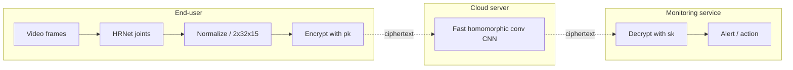
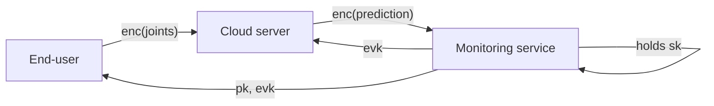

## TL;DR

HEAR and Fast-HEAR perform secure CNN-based human action recognition over skeleton joints under CKKS, achieving 86.21% sensitivity / 99.14% specificity in fall detection with 1.2–2.4 s single-inference latency, while delivering 613x speedup over LoLa and 3.1x throughput over nGraph-HE2 [Abstract; Results].

## Problem and motivation

Cloud-based remote action recognition (fall/seizure detection, "aging in place") is blocked by privacy concerns over uploading video [§Intro]. The authors propose secure inference on encrypted skeleton joints under FHE so the cloud never sees raw data. Threat model: all parties are semi-honest (honest-but-curious); the HE scheme is IND-CPA under RLWE; secure authenticated channels between parties; the monitoring service provider does not collude with the cloud; CKKS is used in a setting where decrypted plaintexts are revealed only to the secret-key owner, so the system is secure against the key-retrieval attack [§Methods, Threat model].

## Key contributions

- An FHE-compatible CNN for skeleton action recognition designed for low-depth circuits with low-degree (quadratic) activations [§Innovation].
- A fast homomorphic multi-channel convolution operation ("merge-and-conquer") that fuses sparsely packed ciphertexts of pooled output channels into a single ciphertext via concatenated kernels, exploiting non-valid SIMD entries [§Innovation; Fig. 2].
- A level-aware encoding strategy that represents weight parameters as plaintext polynomials with minimum coefficient sizes, reducing encoding time and memory by an order of magnitude [§Innovation].
- Maintenance of row-major tensor layout throughout, avoiding data-layout switching [§Innovation].
- Two end-to-end systems, HEAR and Fast-HEAR, achieving state-of-the-art latency and throughput compared to LoLa and nGraph-HE2 [§Comparison to prior work].

## FHE setup

- **Scheme(s):** CKKS (RNS variant) [§Algorithmic and cryptographic optimizations].
- **Library / implementation:** Microsoft SEAL v3.4, modified [§Experimental setting].
- **Parameters:** 128-bit security against known LWE attacks per the LWE estimator and HE security standard white paper; full parameters in Supplementary Table 2 [§Experimental setting].
- **Bootstrapping used:** Not reported (low-depth circuit avoids the need).
- **Packing / encoding strategy:** SIMD batching with row-major vectorization; ciphertext packing fits multiple input ciphertexts into one via the load number nP (nP = 2^(t−1) for the t-th 1D-CNN conv layer, 2^(2(t−1)) for 2D-CNN); level-aware plaintext polynomial encoding [§Innovation; §Fast homomorphic convolutions].

## ML setup

- **Task:** Inference — classification of human actions (fall vs activities of daily living) on encrypted skeleton joints [§Dataset].
- **Model architecture:** 3 convolutional layers (each Conv → BN → activation → downsampling) followed by a global average pool and a fully connected (FC) layer with softmax [§Network architecture]. Two configurations: CNN-64 and CNN-128 (filters in first conv layer), each as 1D or 2D variants. Filters double when feature-map size halves (ResNet design rule). Filter size 3x3 (2D) or 3 (1D), stride 1, same padding. Layer count convention: 3 weight-bearing Conv + 1 FC = 4.
- **Activation handling:** ReLU replaced with a trainable quadratic polynomial; coefficients adjusted during training [§Network architecture].
- **Operates on:** plaintext model + encrypted data.
- **Training vs inference:** Training in plaintext; only inference runs under encryption [§Overview of HEAR].

## Datasets

| Dataset | Task | Size (train/test) | Modality | Notes |
|---|---|---|---|---|
| J-HMDB (ADLs) | action recognition (9 classes: clap, jump, pick, pour, run, sit, stand, walk, wave) | merged train 70% (84 falls + 1346 non-falls) / test 30% (29 falls + 579 non-falls) | skeleton joints (15 joints/frame, 32 frames) | HRNet (pretrained on MPII) extracts joints; ~94 ms/frame on V100 GPU; min-max normalized; tensor 2x32x15 [§Dataset] |
| URFD | fall detection | (included in merged) | skeleton joints | UR Fall Detection dataset [§Dataset] |
| Multicam | fall detection | (included in merged) | skeleton joints | Multiple cameras fall dataset [§Dataset] |

## Pipeline diagram

### Pipeline steps (text)

1. Monitoring service provider generates CKKS keys (sk, pk, evk) and shares pk with end-users and evk with the cloud [Fig. 1].
2. End-user captures video; HRNet extracts 15 joint locations per frame [§Dataset].
3. Joints from 32 selected frames are arranged into a 2x32x15 tensor and min-max normalized [§Data preprocessing].
4. Tensor is row-major vectorized, zero-padded to a power-of-two, optionally interlaced with copies, and encrypted under CKKS [§Data encryption].
5. Cloud runs the CNN homomorphically using fast multi-channel convolutions, quadratic activation, average pooling via slot rotations, and a packed FC layer [§Non-convolutional layers].
6. Cloud returns a single ciphertext containing predicted class scores [§Time requirement].
7. Monitoring service decrypts and triggers alerts on detected falls or seizures [Fig. 1].

## Architecture diagram

### 2D-CNN-128 (the FHE-evaluated network)

```mermaid
flowchart LR
    I([Input 2x32x15]) --> C1[Conv2D 128, 3x3]
    C1 --> B1[BN]
    B1 --> A1[square act]
    A1 --> P1[AvgPool 2x2]
    P1 --> C2[Conv2D 256, 3x3]
    C2 --> B2[BN]
    B2 --> A2[square act]
    A2 --> P2[AvgPool 2x2]
    P2 --> C3[Conv2D 512, 3x3]
    C3 --> B3[BN]
    B3 --> A3[square act]
    A3 --> GP[Global AvgPool]
    GP --> FC[FC 10]
    FC --> O([Softmax])
```

Adjacent linear layers (bias + BN + scaling of avg-pool) are collapsed into the activation polynomial during training, so under FHE each "collapsed layer" is a single SIMD polynomial evaluation [§Non-convolutional layers].

## Results

| Metric | This paper | Baseline | Hardware |
|---|---|---|---|
| Sensitivity (fall detection) | 86.21% | 86.21% (plaintext) | Intel Xeon Platinum 8268 2.9 GHz, 16-thread [§Experimental setting] |
| Specificity | 99.14% | 99.14% (plaintext) | same |
| F1-score | 84.75% | matches plaintext | same |
| Accuracy degradation vs plaintext | 0.16–0.17% on CNN-128 | — | same |
| Single inference latency (HEAR, 2D-CNN avg) | 7.1 s | — | same |
| Single inference latency (Fast-HEAR, 2D-CNN-128) | 2.419 s | HEAR: 7.073 s (3x speedup) | same |
| Single inference latency (Fast-HEAR, small net) | 1.2 s | — | same |
| Latency speedup vs LoLa | 613x avg | LoLa: 15.4 min / sample | same |
| Throughput vs nGraph-HE2 | 3.1x avg | nGraph-HE2: 608 preds in 1.2 h on 2D-CNN-128 | same |
| Memory vs nGraph-HE2 / LoLa | 97.8–98.5% less | nGraph-HE2 ~376 GB; LoLa ~547 GB avg | same |
| Encryption rate | 22–25 ms/sample (1.34–1.54 s for 608 samples) | nGraph-HE2: 19 ms/sample amortized; LoLa: 74 ms/sample | same |
| Decryption | 1.6 ms | — | same |
| Ciphertext sizes | input ~1.4–1.6 MB; output ~0.13 MB | — | same |
| Throughput on 2D-CNN-128 | ~1500 predictions/hour (3600/2.4) | — | same |

## Limitations and assumptions

- Semi-honest threat model; assumes no collusion between monitoring service and cloud [§Threat model].
- Plaintext model is sent to the cloud — model IP is not protected (authors flag this as future work) [§Discussion].
- CNN under FHE was manually designed and heavily hand-optimized; no automatic compiler from a generic CNN [§Discussion].
- Wide but shallow CNN; authors note that improving sensitivity may require deeper/wider models that have not been evaluated yet [§Discussion].
- Pre-inference skeleton extraction (HRNet) runs in plaintext on the client and dominates client-side cost: ~3.008 s to build a 32-frame tensor on a V100 GPU [§Dataset].
- Hardware is a 16-thread Xeon Platinum 8268; latency on lower-end clients would differ.
- Class imbalance: only 84/1346 fall vs non-fall in train; small absolute fall counts in test (29).

## Related work it compares against

- CryptoNets (Gilad-Bachrach et al.) [§Comparison].
- nGraph-HE / nGraph-HE2 (Boemer et al.) [§Comparison].
- LoLa (Brutzkus et al.) [§Comparison].
- SHE (TFHE-based, Lou & Jiang) [§Related work].
- CHET, EVA (FHE compilers) [§Related work].
- GAZELLE, MiniONN (HE+MPC hybrids) [§Discussion of MPC].

## Code and artifacts

Code available at https://github.com/K-miran/HEAR [§Code availability]. License: not reported in the text. Datasets publicly available (J-HMDB, URFD, Multicam, MPII).

## Extra diagrams (optional)

### Threat model

### Activation approximation

ReLU is replaced with a trainable quadratic polynomial whose coefficients are learned during plaintext training (degree 2, no explicit range reported) [§Network architecture]. See also the level-aware encoding (Supplementary Fig. 1).

## Open questions

- Exact CKKS parameters (polynomial degree N, ciphertext modulus chain, scale Δ) are deferred to Supplementary Table 2, not in the main text read here.
- Whether the FC width (number of output classes) is 10 vs 9+1 is inferred from the 9 ADL classes plus "fall"; the paper does not state the FC output size explicitly in the main text.
- The breakdown of which inference time (1.2 s vs 2.4 s) corresponds to CNN-64 vs CNN-128 is given as "small net" vs "large net" — assumed to be 1D-CNN/2D-CNN-128 here.
- Layer count convention (3 Conv + 1 FC = 4) excludes BN, activation, and pooling layers, which the paper collapses into a single polynomial evaluation.
