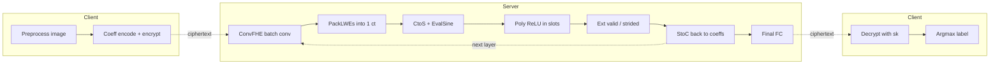
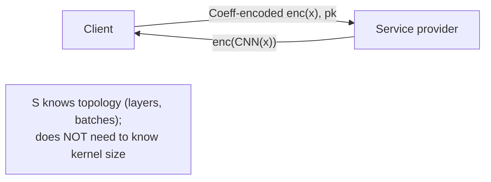

## TL;DR

ConvFHE packs each input image and kernel into the coefficients of a single CKKS plaintext polynomial so that a convolution becomes one ciphertext multiplication whose cost is independent of kernel width [§IV-B]. Combined with a modified bootstrapping that switches between coefficient and slot domains, the method evaluates a 20-layer CNN in 398 s for 94.0% on CIFAR-10 and reduces a part of an 18-layer ImageNet network by 48.1% [§I, §V-B].

## Problem and motivation

FHE-based secure inference offers the strongest privacy properties (one round, no extra interaction) but prior work was confined to shallow, narrow networks with square activations because deep CNNs require bootstrapping at every layer and per-convolution cost scales with `k^2` rotations under standard vector encoding [§I, §II-B]. The threat model assumes a client outsourcing CNN inference to an honest-but-curious service provider; semantic security of CKKS hides everything except input size; the model structure (layers, batches) is assumed known to the evaluator, but the kernel size need not be [§IV-D].

## Key contributions

- Concise polynomial-coefficient representation: a single 2D convolution becomes one plaintext-polynomial multiplication in `R = Z[X]/(X^N+1)` with no rotations [§IV-B, Proposition 1].
- BatchConv (Algorithm 1) plus a generalized PackLWEs (Algorithm 2) pack `N` convolution outputs into one ciphertext, costing `B` mults and `2(B-1)` mults + `B-1` rotations to pack [§IV-B].
- Convolutional layer pipeline that interleaves bootstrapping with the coefficient/slot switch so convolutions run in the coefficient domain and ReLU runs in the slot domain [§IV-C, Fig. 4].
- 12-46x speedup on single convolutions for kernel widths 3-7; 13-83% layer-level reduction [§V-A].
- 18.9% / 48.1% end-to-end reduction over Vector-Encoding baseline on Plain-20 (CIFAR-10/100) and a part of Plain-18 (ImageNet) respectively, and 5x faster than prior FHE works at equal or higher accuracy on CIFAR [§I, §V-B].
- Shows that wider/larger-kernel/shallower CNNs are favourable under this scheme (constant in kernel size) [§V-B, Table IV].

## FHE setup

- **Scheme(s):** CKKS (full-RNS variant [40]); method also applicable to BGV and B/FV for hybrid PPML approaches [Appendix D].
- **Library / implementation:** Lattigo v2.4.0 [§V, ref. 43].
- **Parameters:** `N = 2^16`, scaling factor `Delta = 2^30` (with `2^21` for valid-value extraction in strided convs), key-switching modulus `(log p_j) = 61 x 5`, secret-key sparsity `h = 192`, 128-bit security [§V-A, Table II].
- **Bootstrapping used:** yes, at every convolutional layer; bootstrapping pipeline (CtoS, EvalSine, StoC) modified so StoC operates on a lower-level ciphertext [§IV-C, Fig. 4].
- **Packing / encoding strategy:** novel coefficient encoding `Cf-Ecd`/`Cf-Dcd` packing `N` real numbers directly into polynomial coefficients (vs. CKKS standard `N/2` complex slots); sparse packing via `I(X^{2^s})` when total size is smaller than `N` [§IV-A, §IV-B Remark 5].

## ML setup

- **Task:** image classification under encrypted inference.
- **Model architecture:** Plain-20 CNN of He et al. [44] for CIFAR-10/100: one initial conv block (Conv0) + three blocks (Conv1, Conv2, Conv3) of 6 conv layers each + 1 FC; first layer of Conv2/Conv3 is strided (stride 2) [§V-B, Appendix E, Table VII]. Plain-18 used for ImageNet (only the final 8 layers run under FHE, using the Deep Representation protocol [19]; these 8 layers hold >=91% of parameters) [§V-B]. Variants explored over depth {8, 14, 20}, wideness {1, 2, 3}, kernel widths {3, 5, 7} [§V-B].
- **Activation handling:** ReLU approximated as `(x + x * sign(x))/2` where `sign(x)` is approximated by composition `f_3(f_2(f_1(x)))` of low-degree polynomials (degrees 7, 7, 13) from Lee et al. [42], achieving 10-bit precision on `[-1, 1]`; consumes 10 multiplicative depth total; inputs scaled into `[-B, B]` (B = 32 or 64 in experiments) using batch-normalization stats [§IV-C, Appendix B].
- **Operates on:** plaintext model + encrypted data (standard outsourced inference); method also supports encrypted model + encrypted data setting [§IV-D].
- **Training vs inference:** inference only under FHE; models trained in plaintext following [45].

## Datasets

| Dataset | Task | Size (train/test) | Modality | Notes |
|---|---|---|---|---|
| CIFAR-10 [48] | 10-class classification | 50K / 10K | 32x32x3 RGB images | Used to evaluate full Plain-20 CNN and variants under FHE [§V-B, Appendix E] |
| CIFAR-100 [48] | 100-class classification | 50K / 10K | 32x32x3 RGB images | Same architecture as CIFAR-10 [§V-B, Appendix E] |
| ImageNet (ILSVRC 2012) [49] | 1000-class classification | 1.28M / 50K val / 100K test | 224x224x3 (after cropping) | Only the final 8 layers of Plain-18 evaluated under FHE (Deep Representation method [19]); some results over 2000 samples only (marked dagger in Table IV) [§V-B, Appendix E] |

## Pipeline diagram

### Pipeline steps (text)

1. Client coefficient-encodes the input image into polynomial coefficients of `R` and CKKS-encrypts under public key [§IV-A].
2. Server runs ConvFHE BatchConv: each convolution becomes one ciphertext mult with no rotations, and outputs are packed into a single ciphertext via generalized PackLWEs [§IV-B, Alg. 1-2].
3. Bootstrapping's CtoS + EvalSine step re-encodes the coefficient-domain output into CKKS slot ciphertexts [§IV-C].
4. Composite-polynomial ReLU (deg-13 via `f_3 o f_2 o f_1`) is evaluated component-wise in slots [§IV-C, Appendix B].
5. Ext step extracts valid (and strided) output positions in the slot domain using one multiply + at most `w/2` rotations [§IV-C, Appendix C, Table V].
6. StoC re-encodes the activated tensor back to the coefficient domain so the next ConvFHE conv can consume it; this is the only bootstrapping per layer [§IV-C, Fig. 4].
7. Repeat for each convolutional layer (every layer is bootstrapped) [§V-B].
8. Final fully-connected layer produces an encrypted logit vector returned to the client [Appendix E, Table VII].
9. Client decrypts and applies argmax.

## Architecture diagram

Plain-20 with wideness `omega` and kernel `k`; widths shown for `omega=1, k=3` (the original CIFAR-10 net) [Appendix E, Table VII].

```mermaid
flowchart LR
    I([Input 3x32x32]) --> C0[Conv0 k x k x 16]
    C0 --> B1[BN + polyReLU]
    B1 --> CB1["Conv1 block (k x k x 16) x 6"]
    CB1 --> S2[Strided conv k x k x 32]
    S2 --> CB2["Conv2 block (k x k x 32) x 5"]
    CB2 --> S3[Strided conv k x k x 64]
    S3 --> CB3["Conv3 block (k x k x 64) x 5"]
    CB3 --> GAP[Global avg pool]
    GAP --> FC[FC -> 10 or 100]
    FC --> O([Argmax])
```

For ImageNet, Plain-18 has the same shape with different block sizes; only the final 8 layers (Conv3/Conv4 + FC, >=91% of params) run under FHE [§V-B, Appendix E].

## Results

| Metric | This paper | Baseline | Hardware |
|---|---|---|---|
| CIFAR-10 accuracy, k3-d20-w1 (Plain-20) | 91.31% | 91.31% plain CNN (no FHE) [44] | AMD EPYC 7402P, 1 thread [§V] |
| CIFAR-10 best accuracy (k7-d20-w3) | 94.00% | 91.5% prior FHE [29] at 2271 s | same |
| CIFAR-10 latency at 92.0% | 255 s | 2271 s @ 91.3% [29], 10602 s [28] (64 threads) | same vs. prior-work hw [§II-B, §V-B] |
| CIFAR-10 latency at 94.0% (k7-d20-w3) | 398 s | n/a (state-of-art) | same |
| CIFAR-100 best accuracy | 73.5% | n/a | same |
| Plain-20 CIFAR-10/100 timing reduction over Vector-Encoding baseline | -18.9% | Vector Encoding ([15], [29] estimated favourably) | same [§V-B, Table III] |
| Part of Plain-18 ImageNet (final 8 layers) timing reduction | -48.1% | Vector-Encoding baseline | same [§V-B, Table III] |
| Single conv speedup (k=3 / 5 / 7) | ~12x / ~25x / ~46x faster | Vector-Encoding baseline | same [§V-A, Fig. 5] |
| Conv-layer-with-bootstrap reduction | 13% - 83% | Vector Encoding | same [§V-A, Fig. 6] |
| Communication cost (input ciphertext for CIFAR-10 net) | ~2 MB | ~110 MB best hybrid [34] for 32-layer CNN; 123 MB SHE [27] | [§II-B, §II-C] |
| ReLU approximation precision | 10-bit on `[-1, 1]` | square activation in prior CKKS-only deep nets | [§IV-C, Appendix B] |

Single-inference time used in the comparison table: 398 s (Plain-20 variant `k7-d20-w3` reaching 94.0% on CIFAR-10) [§I, §V-B, Table IV].

## Limitations and assumptions

- Every convolutional layer triggers a full CKKS bootstrap; bootstrapping dominates layer cost and depth budget [§IV-C, §V-A].
- ReLU precision is 10-bit on `[-1, 1]`; inputs must be scaled into `[-B, B]` using BN statistics, sacrificing some precision (`B * 2^-alpha`) [§IV-C, Appendix B]. Authors note average precision was >=8-bit because most activations lie near 0.
- For ImageNet, only the final 8 layers run under FHE via the Deep Representation protocol [19]; early layers are computed in plaintext by the client, so the privacy claim there is partial [§V-B].
- The 18-layer ImageNet result (k5 variant) is reported on 2000 test samples only (dagger marks in Table IV); other results use the full test set [§V-B, Table IV].
- Baseline timings on CIFAR-10/100 for the Vector-Encoding method are *favourably estimated* by summing per-layer convolutions rather than re-implemented end-to-end [§V-B footnote 7]; [29]'s code and bootstrapping are not public [footnote 4].
- Single-threaded benchmarks on an AMD EPYC 7402P; no GPU acceleration is reported, though authors point to >100x potential speedup with GPU FHE [46], [47] [§VI].
- Computing party is assumed to know the model topology (depth, batches), as in prior work; the kernel size, uniquely, need not be revealed [§IV-D].
- Hybrid scheme (Appendix D) yields larger ciphertext degree `N' = 2^13` vs. `N = 2^12` of [34]; ours has higher computation cost per ciphertext but 2-20x lower communication when `w^2 << N`.

## Related work it compares against

CryptoNets [9], CryptoDL [11], Faster CryptoNets [12], nGraph-HE / nGraph-HE2 [13], [14] (high-throughput); Gazelle [15], CHET [16], EVA / EVA improved [17], [18], LoLa [19], Falcon [20] (low-latency); TFHE-based Bourse et al. [23], Chillotti et al. [24], SHE [27]; deep-CNN CKKS works Lee et al. [28], [29]; hybrid PPML CrypTFlow2 [31], Delphi [32], APAS [33], Cheetah [34]; ENSEI [21], Fourier-FALCON [22]; secure human action recognition [30].

## Code and artifacts

Source available: https://anonymous.4open.science/r/optimal_conv-BD07 [§V footnote 5]. License: not reported.

## Extra diagrams (optional)

### Threat model

Single-round, non-interactive secure inference under semantic security of CKKS; honest-but-curious server [§IV-D].

### Activation approximation

Composite polynomial approximation of `sign(x)` from Lee et al. [42]:
- `f_1(x) = 10.8541842577442 x - 62.2833925211098 x^3 + 114.369227820443 x^5 - 62.8023496973074 x^7`
- `f_2(x) = 4.13976170985111 x - 5.84997640211679 x^3 + 2.94376255659280 x^5 - 0.454530437460152 x^7`
- `f_3(x) = 3.29956739043733 x - 7.84227260291355 x^3 + 12.8907764115564 x^5 - 12.4917112584486 x^7 + 6.94167991428074 x^9 - 2.04298067399942 x^11 + 0.246407138926031 x^13`

Then `ReLU(x) ~= (x + x * f_3(f_2(f_1(x)))) / 2`, max error `2^-10` on `[-1, 1]`; multiplicative-depth budget = 3 + 3 + 4 = 10 [Appendix B].

## Open questions

- The 398 s headline is for `k7-d20-w3` on CIFAR-10; how does latency scale on Plain-18 *fully* under FHE (not just final 8 layers) on ImageNet? Not reported.
- Memory profile per layer is partly described ("<=100 GB used" [§V]); peak memory per single inference and ciphertext sizes per layer are not broken down.
- The baseline's end-to-end timing is estimated by summing per-layer convs (footnote 7); a re-implementation might shift the 18.9% / 48.1% numbers somewhat.
- GPU port is mentioned as future work [§VI] but no measurements.
- License of the released artifact is not stated.
