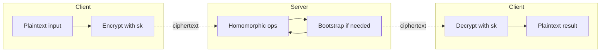
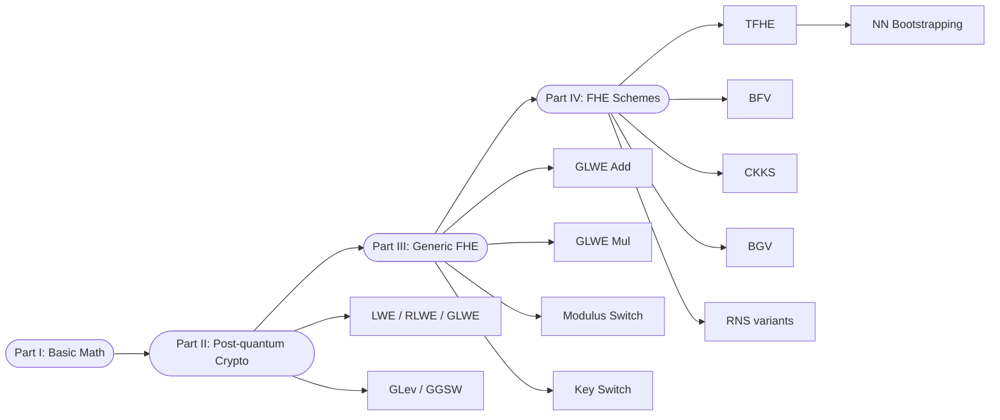
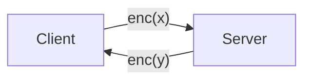

## TL;DR

A self-contained beginner-level textbook that derives the four mainstream FHE schemes (TFHE, BFV, CKKS, BGV) and their RNS variants from underlying number-theory, lattice-cryptography, and generic GLWE primitives, with an accompanying Python demo library for educational use [Preface, §D-7].

## Problem and motivation

The work targets newcomers to FHE who need a single source that bridges the gap from undergraduate number theory and linear algebra to the modern lattice-based homomorphic encryption schemes used for privacy-preserving ML and confidential computing [Preface, p. 1]. The motivating use-case for FHE is privacy-preserving machine learning, where a server processes a client's data in encrypted form through an ML model and learns neither the input features nor the inference results — only the client decrypts the output with its secret key [Preface, p. 1]. Additional motivating applications listed are confidential blockchain / smart contracts, secure outsourced analytics, encrypted database queries, privacy-preserving search, and FHE-assisted multi-party digital signatures [Preface, p. 1]. No threat model is formalised — the threat model is implicit in the underlying LWE/RLWE hardness assumptions developed in Part II [§B-1].

## Key contributions

- A four-part curriculum that builds up to the four mainstream FHE schemes: Part I number-theoretic background, Part II lattice cryptography (LWE/RLWE/GLWE/GLev/GGSW), Part III generic GLWE-level FHE primitives, Part IV the four schemes TFHE, BFV, CKKS, BGV [Preface, p. 1].
- Worked derivations and noise analyses for ciphertext-to-ciphertext addition, ciphertext-to-plaintext addition, ciphertext-to-plaintext multiplication, ciphertext-to-ciphertext multiplication, modulus switching, key switching, and rotation in each scheme [§C-1 to §C-5, §D-1 to §D-4].
- A unified side-by-side scheme comparison covering hard-problem basis, unit data type, plaintext space, secret key, ciphertext, noise, scaling factor, encryption and decryption formulas, ciphertext modulus, and every homomorphic operation [§D-6, Tables 7-17].
- A treatment of bootstrapping for all four schemes: TFHE programmable / gate / neural-network bootstrapping, BFV digit-extraction bootstrapping, CKKS modulus bootstrapping with CoeffToSlot / EvalExp / SlotToCoeff, and BGV modulus bootstrapping [§D-1.8, §D-2.11, §D-3.13, §D-4.11].
- A chapter on RNS-variant FHE: FastBConv, SmallMont, ModRaiseRNS, ModDropRNS, ModSwitchRNS, RNS decryption, and how RNS is applied to each operation and each scheme's bootstrapping [§D-5].
- An open-source Python demo library implementing TFHE, BFV, CKKS, BGV for educational use [§D-7, p. 255].

## FHE setup

- **Scheme(s):** Generic GLWE / LWE / RLWE / GLev / GGSW (Part II–III), then TFHE, BFV, CKKS, BGV, and their RNS variants (Part IV) [§B-1 to §D-5].
- **Library / implementation:** Author-provided Python demo library covering TFHE, BFV, CKKS, BGV, available at https://github.com/fhetextbook/fhe-textbook [§D-7, p. 255].
- **Parameters:** Generic symbolic parameters throughout — ring degree n (power of 2), plaintext modulus t, ciphertext modulus q, secret key distribution (TFHE: vector over {0,1}; BFV/CKKS/BGV: ternary polynomial over Z3 = {-1,0,1}), Gaussian noise distribution chi [§D-6, Tables 9-12]. No concrete security-level numbers are pinned for any worked example.
- **Bootstrapping used:** All four schemes — TFHE noise / programmable / gate / NN bootstrapping [§D-1.8]; BFV digit-extraction bootstrapping [§D-2.11]; CKKS modulus bootstrapping [§D-3.13]; BGV modulus bootstrapping [§D-4.11]. The textbook compares the three modulus-bootstrapping flows in [§D-4.11.2].
- **Packing / encoding strategy:** BFV single-value and batch encoding (Encoding1 / Encoding2) [§D-2.1, §D-2.2]; CKKS canonical embedding via Vandermonde of cyclotomic roots, including sparse packing [§D-3.1, §D-3.12]; BGV encoding [§D-4.1]; homomorphic rotation of slot vectors is derived for BFV / CKKS / BGV [§D-2.9, §D-3.9, §D-4.10].

## ML setup

- **Task:** N/A — textbook. The closest applied content is one subsection illustrating how TFHE neuron-level operations and programmable bootstrapping can implement a generic deep-network forward pass [§D-1.8.11, p. 130].
- **Model architecture:** N/A. The neural-network illustration shows a generic neuron y = sum(xi * wi) + b followed by an activation f(y), with f realised as TFHE programmable bootstrapping; no specific architecture, dataset, or layer count is pinned [§D-1.8.11, Figures 14-15].
- **Activation handling:** Generic discussion only. Non-linear activations (sin, ReLU, sigmoid, tanh) are described as evaluable via TFHE programmable bootstrapping that maps an encrypted input through an arbitrary function table [§D-1.8.11, p. 130]. CKKS is named as the scheme suitable for machine learning because it tolerates tiny approximation errors [§D-2, p. 133; §A-15 Lagrange interpolation; §A-14 Taylor series]. No polynomial-approximation degrees or training-aware fitting are reported.
- **Operates on:** N/A — the textbook describes the general FHE client/server pattern (plaintext model on the server, encrypted data from the client, encrypted result returned to the client) in the Preface but does not run any concrete protocol [Preface, p. 1].
- **Training vs inference:** N/A — inference-style flow is sketched but no training procedure under encryption is presented.

## Datasets

| Dataset | Task | Size (train/test) | Modality | Notes |
|---|---|---|---|---|
| N/A | N/A | N/A | N/A | Textbook — no empirical datasets are used; worked examples are small symbolic / numeric toy inputs (e.g., polynomial coefficients, integer vectors) [throughout]. |

## Pipeline diagram

End-to-end ciphertext flow as described in the Preface and the neural-networks bootstrapping subsection [Preface; §D-1.8.11].

### Pipeline steps (text)

1. Client encrypts the input under the secret key using one of TFHE / BFV / CKKS / BGV [Preface, p. 1].
2. Server runs homomorphic additions and multiplications on the ciphertext (ciphertext-to-ciphertext or ciphertext-to-plaintext), optionally invoking modulus switching, key switching, and rotation primitives [§C-1 to §C-5].
3. Server invokes scheme-specific bootstrapping whenever the noise budget or modulus chain is exhausted, refreshing the ciphertext for further computation [§D-1.8, §D-2.11, §D-3.13, §D-4.11].
4. Server returns the resulting ciphertext to the client [Preface, p. 1].
5. Client decrypts with the secret key and recovers the plaintext result [Preface, p. 1; §D-6 Table 16].

## Architecture diagram

Topical (chapter-level) structure of the textbook itself, since there is no trained ML architecture.

## Results

No empirical results — the textbook contains derivations, worked numeric toy examples, and a side-by-side analytical comparison of the four schemes [§D-6, Tables 7-17].

| Metric | This paper | Baseline | Hardware |
|---|---|---|---|
| Accuracy | N/A | N/A | N/A |
| Latency / throughput | N/A | N/A | N/A |
| Ciphertext size | N/A | N/A | N/A |

The substantive cross-scheme comparison is qualitative: hard-problem basis (TFHE = LWE; BFV / CKKS / BGV = RLWE), unit data type (TFHE = vector; others = polynomial), plaintext spaces, ciphertext layout, scaling-factor placement, encryption / decryption formulas, ciphertext-modulus structure (single q for TFHE / BFV; L-level modulus chain for CKKS / BGV), and bootstrapping mechanism [§D-6, Tables 7-17].

## Limitations and assumptions

- No security-level / parameter-set recommendations are pinned (no concrete 128-bit parameter tables are given) [§D-6].
- No timing, memory, or ciphertext-size measurements — the demo library is explicitly for education, not performance [§D-7, p. 255].
- The neural-network application is sketched (one subsection, two figures) and not instantiated on any architecture or dataset [§D-1.8.11].
- The hardness assumptions of LWE / RLWE are stated but their post-quantum security argument is not derived formally [§B-1].
- Some niche topics (e.g., multi-key FHE, threshold FHE, scheme-switching, advanced packing schemes such as channel packing for CNNs) are out of scope.

## Related work it compares against

Not applicable in the empirical sense. The textbook positions itself relative to prior tutorial / reference material via its reference list, including Joye's "Guide to FHE over the Discretized Torus" [Ref 11], the Zama TFHE Deep Dive series by Chillotti [Refs 7-10], Fan-Vercauteren's somewhat-practical FHE paper [Ref 13], Geelen-Vercauteren bootstrapping for BGV/BFV [Ref 14], Halevi-Shoup HElib bootstrapping [Ref 15], Cheon et al. CKKS bootstrapping [Ref 18], the RNS-CKKS variant [Ref 26], and the full RNS variant of FV / BFV by Bajard et al. [Ref 24] [§References, pp. 256-257].

## Code and artifacts

Python demo FHE library covering TFHE, BFV, CKKS, BGV for educational purposes — https://github.com/fhetextbook/fhe-textbook [§D-7, p. 255]. License not stated in the textbook text.

## Extra diagrams (optional)

### Threat model

Not formalised — only the general FHE client / server pattern is described in the Preface [Preface, p. 1].

### Federated round

Not applicable.

### Activation approximation

The textbook does not introduce a new polynomial activation. It does cover the two general tools (Taylor series [§A-14], Lagrange polynomial interpolation [§A-15]) used to derive polynomial approximations of non-linear functions, and it notes that TFHE programmable bootstrapping can directly evaluate arbitrary functions including ReLU / sigmoid / sin / tanh [§D-1.8.11, p. 130].

## Open questions

- The `task` field in the front-matter controlled vocabulary (`inference` | `training` | `federated-round` | `encrypted-search`) does not cleanly cover an educational textbook. We default to `inference` here because the textbook's primary motivating application is encrypted inference [Preface, p. 1], but the vocabulary may want a new value `tutorial` (or `survey` / `reference`) for resources of this type — propose adding it.
- No concrete parameter recommendations are given for any worked scheme — readers will need a supplementary source (e.g., the HomomorphicEncryption.org standard) for production parameters.
- The neural-network bootstrapping subsection [§D-1.8.11] does not pin a network depth or activation-precision budget; whether a deep network really runs end-to-end with programmable bootstrapping is left as a forward pointer rather than demonstrated.
- License of the companion Python demo library is not stated inside the textbook text.
