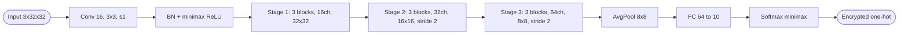

## TL;DR

The authors give the first implementation of the standard ResNet-20 on the CIFAR-10 dataset entirely under the RNS-CKKS FHE scheme with bootstrapping, using high-precision minimax polynomial approximations of ReLU and Softmax, reaching 92.43%+/-2.65% accuracy (98.43% identical to plaintext) in about 3 hours per image [Abstract][§I.A][§VI].

## Problem and motivation

Prior FHE-based PPML systems (CryptoNets, SEALion, CryptoDL, etc.) replaced non-arithmetic activations like ReLU with simple polynomials and avoided bootstrapping, so they could not run deep, standard networks and were not accurate on benchmarks beyond MNIST [Abstract][§I][§I.B.1]. The closest prior deep system, Lou and Jiang's leveled-TFHE ResNet-20, required impractically large parameters and could not exploit packing efficiently [§I][§I.B.3]. The threat model is a server-side PPML service: a client sends an FHE-encrypted image and public/evaluation keys, the server runs encrypted inference and returns the ciphertext, and the model parameters stay plaintext on the server [§I]. The paper also explicitly mitigates the model-extraction attack of Boemer et al. by evaluating Softmax under FHE rather than returning pre-Softmax logits to the client [§I.A].

## Key contributions

- First implementation of standard ResNet-20 over RNS-CKKS with bootstrapping, using SEAL 3.6.1 (with the authors' own bootstrapping added) [§I.A][§V.A].
- Use of minimax-composition polynomial approximations of ReLU (precision parameter alpha=12, three composite polynomials of degree 7, 15, 27) so pretrained plaintext weights can be reused without retraining [§II.D][§V.D].
- First homomorphic Softmax in a PPML pipeline, combining a least-squares exponential approximation, Goldschmidt division for the inverse, and a Gumbel-Softmax trick to bound the exponential's range, mitigating model-extraction attacks [§I.A][§III.C][§V.G].
- New "natural" strided convolution method for RNS-CKKS packing, using non-strided convolution plus window-filter masking and a per-tensor slot-structure parameter [§III.B][§V.C].
- Bootstrapping failure analysis: with thousands of bootstraps in one inference, sets parameters (K=17, epsilon=2^-10, Hamming weight 64) for failure probability < 2^-40 instead of the usual ~2^-23 [§V.E].
- Empirical analysis showing bootstrapping is best placed immediately after convolution (rather than after ReLU), saving 27.8% runtime [§IV][§VI.B, Table 6].

## FHE setup

- **Scheme(s):** RNS-CKKS (residue-number-system variant of CKKS) [§II.A][§V.B].
- **Library / implementation:** Microsoft SEAL 3.6.1; bootstrapping is the authors' own implementation since SEAL does not provide one [§I.A][§V.A][§V.E].
- **Parameters:** Ciphertext polynomial degree N = 2^16; secret-key Hamming weight 64; base modulus q0 = 60 bits, special modulus = 60 bits, default modulus = 50 bits; 11 levels for general operations + 13 levels for bootstrapping; max modulus 1450 bits; 111.6-bit security (computed via Cheon et al.'s hybrid dual attack) [§V.B.1, Table 2].
- **Bootstrapping used:** Yes — used many times per inference (>1000 bootstraps); CoeffToSlot/SlotToCoeff use a collapsed FFT structure of depth 2; ModReduction uses cos + two double-angle formulas + arcsin, with minimax-Remez polynomials of degree 45 for cos and degree 1 for arcsin [§V.E].
- **Packing / encoding strategy:** Sparse packing — one CIFAR-10 channel per ciphertext using only 2^10 of the 2^15 available slots, since bootstrapping a sparsely packed ciphertext is much faster and convolutions need fewer rotations; each encrypted tensor is stored as (ciphertext array, side length, slot-structure parameter, channel count) [§V.B.2][Algorithm 3].

## ML setup

- **Task:** Image classification inference on encrypted images, using plaintext pretrained weights [§I.A][§V.A].
- **Model architecture:** Standard ResNet-20 for CIFAR-10. Counting weight-bearing layers, this is one initial 3x3 Conv producing 16 channels, then three stages of basic residual blocks at 16, 32, 64 channels (each block = Conv-BN-ReLU-Conv-BN + skip), strided 3x3 convs (stride 2) at the stage transitions for downsampling, ending with an 8x8x64 tensor, global average pooling to a 64-vector, a Fully-Connected 64->10 layer, and Softmax. The encrypted pipeline replaces the plaintext model layer-for-layer (Conv, BN, ReLU, Boot, AP, FC, Softmax), differing only by inserting bootstrapping operations [§V.A, Fig. 3, Fig. 4, Table 1][§V.F].
- **Activation handling:** ReLU is computed as 0.5 * x * (1 + sign(x)); sign(x) is approximated by composing three minimax polynomials of degrees 7, 15, 27 generated by an improved multi-interval Remez algorithm at precision alpha=12, giving ~16-bit average precision; bootstrapping is performed twice per ReLU layer (mid-evaluation and at end) [§II.D][§V.D, Algorithms 5-6]. Softmax exp is approximated on [-1,1] by a degree-12 least-squares polynomial and then exponentiated to B via repeated squaring (B=64); 1/y is approximated via 16 Goldschmidt iterations on (0, 2R] with R=10^4; Gumbel-Softmax with lambda=4 keeps inputs in range [§III.C][§V.G, Algorithm 8].
- **Operates on:** Plaintext model parameters + encrypted input data [§I.A][§V.A].
- **Training vs inference:** Inference only under encryption. Training is performed in plaintext (32x32 mini-batches, cross-entropy, He initialization, no dropout, learning rate 0.001 decayed at 80 and 120 epochs, shift+mirror augmentation), reaching 91.89% on the 10,000 plaintext CIFAR-10 test images [§V.A][§VI.A]. Layer count convention: total ResNet-20 weight-bearing layers (19 Conv + 1 FC) [§V.A, Table 1].

## Datasets

| Dataset | Task | Size (train/test) | Modality | Notes |
|---|---|---|---|---|
| CIFAR-10 | 10-class image classification | Standard split; tested on 10,000 plaintext images; agreement/accuracy under encryption measured on 383 encrypted images with 95% CIs | 32x32x3 RGB images | Mean-subtracted, shift + horizontal-mirror augmentation during plaintext training [§V.A][§VI.A][§VI.B] |

## Pipeline diagram

```mermaid
flowchart LR
    subgraph Client
        A[CIFAR-10 image] --> B[Mean subtract]
        B --> C[Encode + Encrypt CKKS]
    end
    subgraph Server
        D[Conv + BN]
        D --> E[Bootstrap]
        E --> F[ReLU minimax]
        F --> G[Residual blocks x3 stages]
        G --> H[AvgPool 8x8]
        H --> I[FC 64 to 10]
        I --> J[Softmax minimax]
    end
    subgraph Client_dec [Client]
        K[Decrypt with sk] --> L[Argmax label]
    end
    C -. ciphertext .-> D
    J -. ciphertext .-> K
```

### Pipeline steps (text)

1. Client preprocesses the 32x32x3 image, subtracts the training-set pixel mean [§VI.A].
2. Client packs each channel into one ciphertext using 2^10 sparse slots and encrypts under RNS-CKKS [§V.B.2, Algorithm 3].
3. Client uploads ciphertexts plus evaluation keys to the server [§I].
4. Server applies the first Conv + BN (homomorphic addition + scalar multiplication) [§V.C, Algorithm 4].
5. Server bootstraps immediately after each Conv to refresh levels (placement saves 27.8% vs after-ReLU) [§IV][§VI.B, Table 6].
6. Server evaluates ReLU as 0.5 x (1 + sign(x)) using the deg-7/15/27 minimax composite polynomials, with two extra bootstraps per ReLU layer [§V.D, Algorithm 6].
7. Server iterates Conv-BN-Boot-ReLU through three residual stages (16/32/64 channels), using stride-2 convolutions with window-filter masking at stage transitions [§III.B][§V.C].
8. Server performs average pooling over each 8x8 channel via log-step rotation-adds, producing a length-64 vector across ciphertexts [§V.F, Algorithm 7].
9. Server applies the FC 64 -> 10 layer (no rotations needed because pooling output is already separated across ciphertexts) [§V.F].
10. Server evaluates Softmax: divide by B=64, apply deg-12 exp approximation, square log(B/lambda) times, Gumbel-Softmax with lambda=4, then 16 Goldschmidt division steps for the inverse, with bootstrapping inserted before Softmax, before the inverse, and after 8 Goldschmidt iterations [§V.G, Algorithm 8].
11. Server returns the encrypted one-hot vector; client decrypts and reads the argmax label [§V.G][§I].

## Architecture diagram

## Results

| Metric | This paper | Baseline | Hardware |
|---|---|---|---|
| Encrypted-data classification accuracy on CIFAR-10 | 92.43% +/- 2.65% (95% CI, 383 encrypted images) | Plaintext ResNet-20 on same model: 92.95% +/- 2.56%; original published ResNet-20: 91.89% | Dual Intel Xeon Platinum 8280, 112 cores, 172 GB RAM [§VI.A-B] |
| Agreement ratio with plaintext ResNet-20 | 98.43% +/- 1.25% | n/a | Same [§VI.B, Table 4] |
| End-to-end inference latency (single image) | "about 3 h" per image (~10,800 s) | n/a (no prior FHE ResNet-20 with bootstrapping) | Dual Xeon Platinum 8280 (112 cores), one thread per channel via OpenMP, 172 GB RAM [§VI.A][§VI.B, Table 5] |
| Bootstrapping placement | 27.8% runtime reduction when Boot is after Conv rather than after ReLU | After-ReLU baseline | Same [§VI.B, Table 6] |
| Best HE-friendly CNN baseline on CIFAR-10 (prior word-wise FHE work) | n/a | 91.5% accuracy [20] | Different setups [§I.B.1] |
| Security level | 111.6-bit (hybrid dual attack [29]) | 128-bit standard target | n/a [§V.B.1][§VI.C.2] |

## Limitations and assumptions

- ~3 h per single image is "somewhat large for practical use"; the authors call for GPU/FPGA/ASIC acceleration [§VI.C.1].
- 111.6-bit security is below the conventional 128-bit target; raising it is a parameter change but increases runtime [§VI.C.2].
- Only one image is processed per ciphertext — batched packing (which RNS-CKKS supports) is left as future work [§VI.C.1].
- Model parameters stay plaintext on the server, so the threat model assumes the server is trusted to keep the model and acts honest-but-curious on input data (not stated explicitly) [§I].
- Bootstrapping failure is non-zero by construction; the authors must hand-tune K and epsilon for failure < 2^-40 across >1000 bootstraps per inference [§V.E].
- The model was trained only once (no averaging over seeds), so accuracy comparisons carry the noise of a single run [§VI.C.3].
- Approximation precision (16-bit) was tuned empirically by repeating the full encrypted simulation; the maximum observed activation magnitude (37.1) is treated as bounded by 40 with "very high probability" rather than proved [§V.B.3].

## Related work it compares against

- Lou and Jiang's leveled-TFHE ResNet-20 / ResNet-18 (SHE) [1] — the closest prior deep FHE system [§I][§I.B.3].
- HE-friendly networks: CryptoNets, Faster CryptoNets, SEALion, HCNN (Badawi et al.), CryptoDL [16]-[20]; best CIFAR-10 result among them was 91.5% [§I.B.1].
- Hybrid FHE+MPC systems: Gazelle (Juvekar et al.), Cheetah, nGraph-HE, nGraph-HE2, MP2ML [15], [21]-[24] — referenced as model-leaky alternatives [§I.B.2][§I.A].
- Bootstrapping algorithm prior work: Cheon et al. [6], Chen et al. [7], Han and Ki [8], Bossuat et al. [9], Lee et al. [10], Jung et al. [11] [§II.C][§V.E].
- Gazelle's convolution method [21] is reused as the inner kernel for non-strided and (after modification) strided convolution [§III.B][§V.C].

## Code and artifacts

Not released — the paper does not link a repository. The implementation is described as built on top of Microsoft SEAL 3.6.1 with the authors' own bootstrapping module added [§I.A][§V.A].

## Extra diagrams (optional)

### Threat model

### Activation approximation

ReLU(x) = 0.5 * x * (1 + sign(x)). sign(x) is the composition p2 o p1 o p0 of three minimax polynomials of degree 7, 15, 27 over symmetric intervals around 0, with alpha=12 (i.e., precision 2^-12 on |x| in [2^-12, 1]). Average precision is ~16 bits; bootstrapping is invoked twice per ReLU layer [§V.D, Algorithms 5-6]. See also Section II-D and reference [14].

## Open questions

- Exact end-to-end memory peak: the abstract says "172 GB" while §VI.A also says 172 GB used out of a 512 GB machine; how this scales with N=2^16 vs smaller polynomial degrees is not detailed [§Abstract][§VI.A].
- Per-layer level budget table is not given in the .txt extract — readers must reconstruct from §V which 11 + 13 levels are consumed where.
- The agreement-ratio metric is reported only on 383 encrypted images; the gap between 92.43% (encrypted) and 92.95% (plaintext on the same model) is within the 95% CI overlap, so the encrypted accuracy is statistically indistinguishable from plaintext on this sample [§VI.B, Table 4].
- No latency comparison to Lou and Jiang's TFHE ResNet-20 [1] is given in the extracted text.
