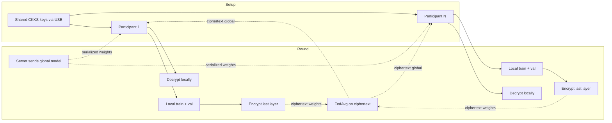
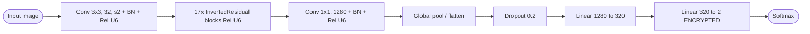
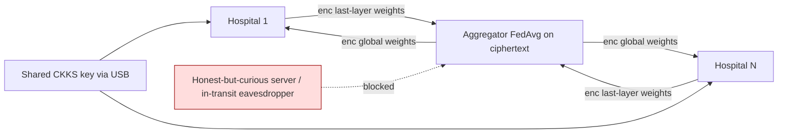
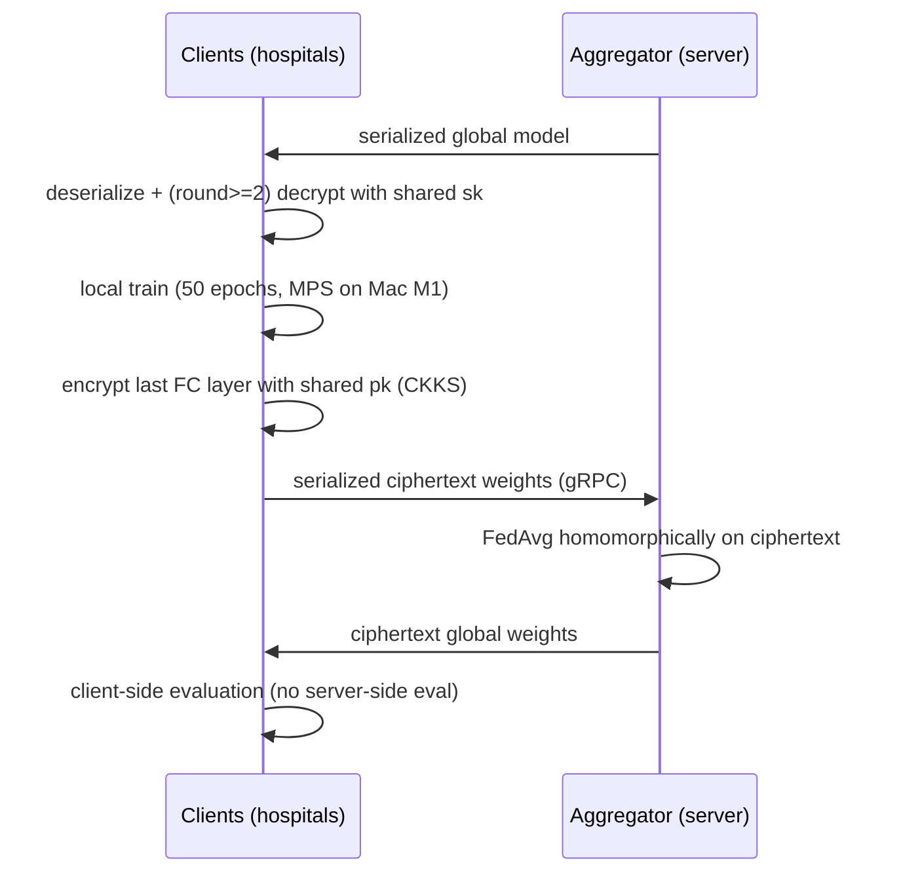

## TL;DR

The paper integrates Fully Homomorphic Encryption (CKKS via TenSEAL) into a Flower-based federated learning pipeline that trains a MobileNetV2 binary classifier on private Belgian mammograms; due to FHE memory constraints, only the last layer's weights are encrypted before transmission to the aggregator [Abstract][§VI-C]. It reports comparable ROC behaviour to the plaintext FL baseline while exposing serialization/memory as the dominant practical bottleneck [§VI-D][§VII].

## Problem and motivation

Medical AI development is constrained by GDPR, data scarcity, class imbalance and risk of leaking patient information [§I]. Federated learning helps with data locality but is still vulnerable to membership/attribute/model-inversion/gradient-leakage/property/data-reconstruction inference attacks and to model-poisoning attacks during weight exchange [§I-B]. The threat model assumes participants are benevolent (they share a common FHE private key used to encrypt aggregator-bound weights) and that the central server should not see plaintext weights — FHE is added on top of FL to block server-side and in-transit inference attacks [§III]. They explicitly note that if a participant is malicious or the shared private key is compromised, encrypted results are no longer secure [§III].

## Key contributions

- End-to-end federated learning pipeline integrating FHE (CKKS) between participants and the central server, applied to a private Belgian mammogram dataset [§VII].
- Pragmatic "encrypt only the last (critical) layer" design driven by serialization and RAM limits of TenSEAL on commodity hardware [§VI-C][§VII].
- Empirical mapping of CKKS key parameters (poly_modulus_degree, bits_scale, coeff_mod_bit_sizes, extrema) to encryption time, number of encryptable values, and memory cost (Table I, Fig. 8–10) [§VI-A][§VI-B][§VI-C].
- Accuracy / ROC comparison of FL with vs. without HE across batch sizes; finding that HE-induced noise can act as a regularizer and sometimes improve accuracy [§VI-D].
- Discussion of alternatives (SMPC, TEEs, differential privacy, per-round key rotation, knowledge distillation, bootstrapped CKKS) as future work [§VII].

## FHE setup

- **Scheme(s):** CKKS (real-number approximate arithmetic); TenSEAL also exposes BFV but the work uses CKKS for weight encryption [§I-C][§IV-B].
- **Library / implementation:** TenSEAL 0.3.14 (OpenMined), built on Microsoft SEAL [§IV-B].
- **Parameters:** "Heavy key" (bolded first row): poly_modulus_degree = 2^15 = 32768, coeff_mod_bit_sizes = [60, 40×8, 60], bits_scale = 40, supporting ~12000 encryptable values per tensor with ~301 s encryption time (Table I) [§VI-A]. A "lighter key" variant is also used (second bolded row). Galois keys are generated for ciphertext rotation; small N (1024/2048) is avoided because SEAL won't issue Galois keys there [§IV-B][§IV-end]. Security levels available are 128/192/256-bit classical or quantum; the paper does not state which level is used in experiments [§IV-end].
- **Bootstrapping used:** No. Authors note that a bootstrapped CKKS variant could be more efficient and is future work [§VII].
- **Packing / encoding strategy:** Tensor-level CKKS encoding of the last-layer weights; serialization (per-tensor) is identified as the binding limit — TenSEAL's serializer errored beyond 6424 values per tensor at the chosen key size [§VI-C].

## ML setup

- **Task:** Federated binary classification (malignant vs. benign mammographic lesion); FHE protects the per-round weight upload, not the data or the forward pass [§III][§V-A].
- **Model architecture:** MobileNetV2 pre-trained on ImageNet, with the original 1000-way classifier replaced by `Linear(1280 → 320) → Linear(320 → 2) → Softmax` for binary use (Listing 2) [§V-A]. Feature extractor: Conv2dNormActivation (3×3, stride 2, 32 filters, BN, ReLU6) + 17 InvertedResidual blocks + final 1×1 Conv2dNormActivation to 1280 filters; ReLU6 throughout [§V-A].
- **Activation handling:** None under FHE — activations run in plaintext because only the final FC layer's weights are encrypted post-training, not the forward pass [§IV-B][§VI-C]. The paper notes that to encrypt training/inference one would need polynomial approximations under CKKS, or switch to TFHE [§IV-B].
- **Operates on:** Encrypted model weights (last layer) + plaintext data, exchanged per FL round; aggregation is performed homomorphically on ciphertext weights using FedAvg, without server-side decryption [§III].
- **Training vs inference:** Training is plaintext on each client; only the cross-round weight transmission and FedAvg aggregation involve FHE. There is no server-side global evaluation phase because the server cannot decrypt [§III].

## Datasets

| Dataset | Task | Size (train/test) | Modality | Notes |
|---|---|---|---|---|
| Private Belgian hospital mammograms (with UMONS / Helora) | Binary classification (malignant vs. benign, biopsy-confirmed) | Not reported | Mammographic images (positive/negative classes, masses and microcalcifications) | Annotated by Dr Salvatore Murgo (Helora); prospective study; anonymized [§I-D][§V-B][Acknowledgement] |

## Pipeline diagram

### Pipeline steps (text)

1. Generate one shared CKKS key set and distribute it physically (USB) or over an out-of-band channel to all hospital participants [§III].
2. Server initializes the global MobileNetV2 and serializes (gRPC) a copy to each selected participant [§III].
3. Each participant deserializes weights and, if they arrive as ciphertext (rounds ≥ 2), decrypts with the locally held private key before loading into the local model [§III].
4. Client trains locally for the configured number of epochs (50 in the main experiments) with MPS-accelerated PyTorch on a Mac M1 [§V-C].
5. Client encrypts the last FC layer's weights with TenSEAL/CKKS using the shared public key, then serializes and uploads to the server [§III][§VI-C].
6. Server deserializes ciphertexts and performs FedAvg homomorphically (no decryption); server-side evaluation is intentionally omitted because it would require the private key [§III].
7. Server returns the aggregated ciphertext global weights to each participant for the next round [§III].
8. Each participant performs the round's evaluation locally after decryption (the global model is only ever evaluated client-side) [§III].

## Architecture diagram

## Results

Headline accuracy (3 rounds, 3 clients, classic FL vs. FL+HE), Table II [§VI-D]:

| Metric | This paper (with HE) | Baseline (FL, no HE) | Hardware |
|---|---|---|---|
| Accuracy, batch 16 | 73.2% | 70.6% | Mac M1, 32 GB RAM (160 GB w/ swap), CPU FHE [§V-C] |
| Accuracy, batch 32 | 87.4% | 73.8% | same |
| Accuracy, batch 64 | 82.5% | 83.4% | same |
| Micro-avg ROC, batch 64 | −7% vs no-HE | reference | same [§VI-D, Fig. 11] |
| Micro-avg ROC, batch 32 | +8% vs no-HE | reference | same [§VI-D, Fig. 12] |
| Encryption time, ~12000-value tensor, heavy key (2^15, [60,40×8,60], scale 40) | 301 s | — | Mac M1 CPU [Table I] |
| Encryption time, single-value tensor at same key | < 0.1 s | — | Mac M1 CPU [Table I, §VI] |
| Max encryptable values (lightest key in Table I) | 683000 | — | — [§VI-A] |
| Max serializable values per tensor (TenSEAL limit at chosen key) | 6424 | — | — [§VI-C] |
| Memory for ~6000-value encrypted tensor | ~4 GB | — | — [§VI-C, Fig. 10] |
| Total round-trip overhead vs plaintext FL | +28 min (20 clients, 15 rounds, 10 epochs) | reference | Mac M1 [§VI-B, Fig. 9] |
| Encrypting 4 layers vs 1 (heavy key, batch 16) | 67% micro-ROC @ 11 epochs / 81% @ 50 epochs | 71% / 79% (1 layer encrypted) | Mac M1 [§VI-D end] |

No single-image encrypted inference latency is reported (inference is plaintext on the client), so `single_inference_seconds: N/A` in the comparison block [§III][§VI].

## Limitations and assumptions

- Memory is the hard constraint: even with 160 GB swap on a 32 GB Mac M1, the authors cannot encrypt more than the last layer of MobileNetV2; the server would also need to hold all clients' ciphertexts simultaneously [§VI-C].
- Serialization (gRPC, TenSEAL's tensor serializer) — not raw encryption — dominates wall-clock time and caps per-tensor size at 6424 values for the chosen key [§VI-B][§VI-C][§VII].
- TenSEAL on Mac M1 has no GPU/MPS acceleration for FHE; all encryption runs on CPU [§V-C].
- A single shared CKKS private key is distributed to all participants — compromise of any participant or the in-use server-side key buffer leaks the whole scheme; per-round key rotation is only suggested as future work [§III][§VII].
- No server-side evaluation is possible by design, removing a standard FL convergence-monitoring tool [§III].
- The private mammogram dataset's size, class balance, and split are not reported, making accuracy numbers hard to position against public benchmarks [§V-B].
- ROC results disagree across batch sizes (HE helps at batch 32, hurts at batch 64) and the authors attribute this in part to HE noise acting as regularization — a small-N effect that isn't statistically tested [§VI-D].
- Reported security level (128/192/256-bit) for the chosen TenSEAL parameters is not stated [§IV-end].

## Related work it compares against

Federated learning for breast cancer: Nguyen Tan et al. [43], Jiménez-Sánchez et al. [30], Li et al. [33] (FL + HE on BreakHis). Privacy in medical FL: Kaissis et al. [31] (multi-layer secure FL architecture), Adnan et al. [4] (FL + differential privacy on histopathology), Hosseini et al. [23] (cluster-based SMPC FL). FHE schemes referenced for context: Gentry [21], DGHV, BGV, BFV [19], GSW, CKKS [15], TFHE [16]. No quantitative head-to-head benchmark against these systems is provided [§II].

## Code and artifacts

Not released.

## Extra diagrams (optional)

### Threat model

### Federated round

## Open questions

- Exact size, class balance and train/val/test split of the private Belgian mammogram dataset are not stated [§V-B].
- The security level (e.g., 128-bit) achieved by the "heavy" and "lighter" CKKS keys is not pinned down [§IV-end].
- How aggregation handles ciphertext-rescaling drift across 15+ rounds without bootstrapping is not detailed [§VII flags bootstrapping as future work].
- Communication cost (ciphertext payload size on the wire, not just serialization time) is not quantified [§VI-B].
- Whether the +14% accuracy jump at batch 32 (HE vs no-HE) is reproducible or an artifact of 3 clients × 3 rounds is not analysed statistically [§VI-D, Table II].
