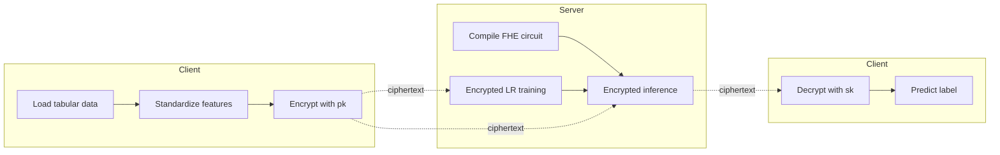
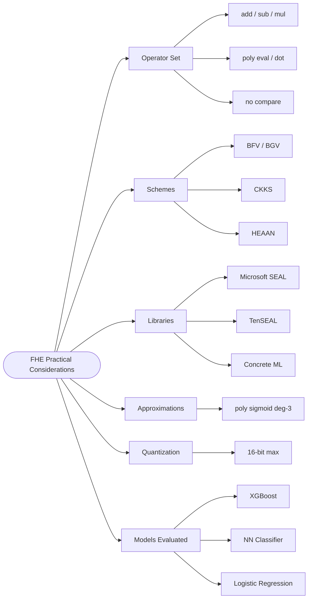
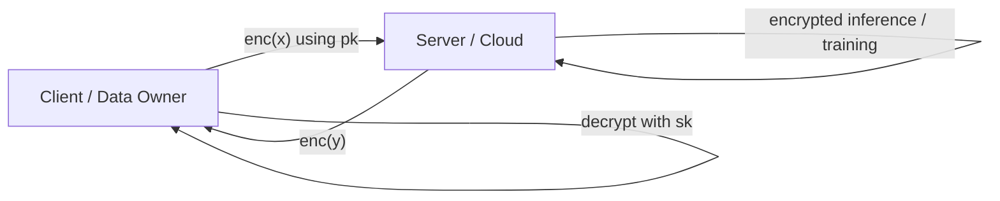

## TL;DR

A practical study that benchmarks XGBoost, a neural network classifier, and logistic regression under FHE using TenSEAL and Concrete ML on the Kaggle breast cancer dataset, showing FHE preserves privacy but causes severe latency blow-ups (up to ~2,260 s test time) and accuracy losses (up to -32.45% for NN) due to quantization [§IV].

## Problem and motivation

ML pipelines often run on cloud or HPC servers, but the underlying data (e.g. medical, financial) is private. FHE allows training/inference directly on ciphertexts so the server never sees plaintext, yet adoption is hindered by performance and operator-support limits [§I]. The paper investigates the *practical* cost of FHE: which operators are supported, how to approximate sigmoid, what slowdown and accuracy loss to expect, and which libraries are usable today [§I, §III]. Threat model is the standard client/server honest-but-curious cloud setting where the server holds the encrypted data and model and only the client owns the secret key [§I, Fig. 2].

## Key contributions

- Catalogues the FHE operator set (add, sub, mul, neg, square, exp, dot, polynomial eval, matmul) and explains where ML algorithms hit walls (comparisons, sigmoid) [§I].
- Derives logistic regression's gradient and shows how to substitute the sigmoid with a degree-3 polynomial approximation `0.5 + 0.197 * theta^T x - 0.004 * (theta^T x)^3` [§I-A].
- Surveys related techniques: SEAL (BFV/BGV/CKKS), TenSEAL, Concrete ML, order-preserving encryption, differential privacy, random masking, HEAAN [§II].
- Empirically compares XGBoost, NN, and Logistic Regression under encrypted vs plaintext settings on a real medical dataset [§IV, Tables II-IV].
- Identifies quantization as the dominant accuracy-loss factor for FHE-converted models, especially deep NNs [§IV].

## FHE setup

- **Scheme(s):** BFV, BGV, CKKS (via Microsoft SEAL backends); HEAAN discussed. Concrete ML uses TFHE-style approach under the hood (not explicit in text) [§II].
- **Library / implementation:** TenSEAL (BFV + CKKS, on top of Microsoft SEAL) and Concrete ML (Zama) [§II, §III].
- **Parameters:** Concrete ML quantization width = 16 bits (current maximum supported) [§IV]. Other crypto parameters not reported.
- **Bootstrapping used:** Not reported.
- **Packing / encoding strategy:** Not reported (TenSEAL handles tensor packing internally).

## ML setup

- **Task:** Binary classification (benign vs malignant) — both inference on encrypted test data and (for logistic regression) training on encrypted data [§III-C, §III-D].
- **Model architecture:** Three models compared — XGBoost (trees), a Concrete ML Neural Network Classifier (architecture details not reported), and Logistic Regression. Logistic regression is the only model that supports direct training on encrypted data in Concrete ML [§IV].
- **Activation handling:** Sigmoid approximated by `h(x) ~= 0.5 + 0.197 * theta^T x - 0.004 * (theta^T x)^3` [§I-A]. NN activations not specified; Concrete ML handles quantization automatically.
- **Operates on:** Mostly *plaintext-trained model + encrypted data* for XGBoost and NN; *encrypted data + encrypted training* for Logistic Regression [§III-C, §IV].
- **Training vs inference:** Both. XGBoost and NN run encrypted inference only; logistic regression runs both encrypted training and encrypted inference [§IV].

## Datasets

| Dataset | Task | Size (train/test) | Modality | Notes |
|---|---|---|---|---|
| Kaggle Breast Cancer [28] | Binary classification (benign/malignant) | 357 benign + 212 malignant samples (total 569; split not reported) | Tabular | 32 features reduced to 10 via Random Forest feature importance (100 trees); features standardized to mean 0, var 1 [§III-B] |

## Pipeline diagram

### Pipeline steps (text)

1. Client loads the breast cancer CSV and runs Random Forest feature selection to keep the top 10 features [§III-B].
2. Client standardizes selected features (mean 0, variance 1) [§III-B].
3. Client encrypts feature vectors with the public key under TenSEAL/Concrete ML [§I].
4. For XGBoost and NN: plaintext model is compiled by Concrete ML into an FHE circuit (graph build, bit-width calc, key generation) [§IV].
5. For Logistic Regression: training runs directly on ciphertexts using the degree-3 polynomial sigmoid approximation [§I-A, §IV].
6. Server executes the encrypted operation graph on ciphertext inputs [§IV].
7. Encrypted predictions return to client, who decrypts with the secret key [§I, Fig. 2].

## Architecture diagram

The paper is a practical evaluation across three model families rather than a single NN design. The diagram below depicts the paper's taxonomy of practical considerations.

## Results

| Metric | This paper | Baseline | Hardware |
|---|---|---|---|
| XGBoost train time (plain) | 12.66 s | scikit-learn baseline | Colab, TPU V2-8, 11.24/334.56 GB RAM [§III-E] |
| XGBoost compile to FHE | 0.66 s (Concrete ML) | - | same |
| XGBoost test time (encrypted) | 94.57 s | 0.01 s plaintext | same |
| XGBoost accuracy | 91.23% encrypted = 91.23% Concrete ML | 92.98% scikit-learn | same |
| XGBoost encrypted test (alt run) | 2,259.50 s | - | same [§IV text] |
| NN Classifier train time | 63.17 s | 63.17 s scikit-learn | same |
| NN test time (encrypted) | 253.88 s (Table III) / 1983.6 s (text) | 0.01 s plaintext | same |
| NN accuracy (encrypted) | 95.61% (Table III) / 60.53% (text) | 96.49% scikit-learn | same |
| Logistic Regression train (encrypted) | 113.04 s | 0.01 s plaintext | same |
| Logistic Regression test (encrypted) | 0.80 s | 0.01 s plaintext | same |
| Logistic Regression accuracy | 87.72% encrypted | 92.98% plaintext (-5.36%) | same [Table IV] |

Note: Table III and the paragraph text disagree on NN test time and accuracy (Table III: 253.88 s, 95.61%; text: 1983.6 s, 60.53%). Both numbers are recorded above verbatim from the paper [§IV].

## Limitations and assumptions

- Quantization is the dominant source of accuracy loss; capped at 16 bits in Concrete ML, which especially hurts deep NNs [§IV].
- FHE does not support comparisons natively, which prevents native tree-based training and forces "compile after plaintext training" workflows [§IV, §V].
- Only logistic regression supports *direct* encrypted training in Concrete ML at the time of writing [§IV].
- No standardized API across HE libraries; complexity in hyperparameter tuning [§V].
- Crypto parameters (poly modulus degree, security level, scale) are not reported, limiting reproducibility.
- Internal inconsistency in NN results (Table III vs paragraph text) noted above.
- Dataset is small (569 samples), tabular, low-dimensional after FS (10 features); scalability to larger problems not evaluated [§III-B].
- Training/test split not reported.

## Related work it compares against

Microsoft SEAL [7]; BFV [8]; BGV [9]; CKKS [10]; TenSEAL [11]; Concrete ML (Zama) [12]; HEAAN [23-27]; order-preserving encryption [13-15]; differential privacy [16-19]; random masking [20-22]; Chen et al. logistic regression over encrypted data [6].

## Code and artifacts

Not released. Experiments were conducted in Google Colab notebooks; no public repo URL is mentioned [§III, §V].

## Extra diagrams (optional)

### Threat model

Honest-but-curious server; only the client holds the secret key; server never needs the public key for inference per [§I].

### Activation approximation

Sigmoid is replaced by a degree-3 polynomial used in [6]: `h(x) ~= 0.5 + 0.197 * theta^T x - 0.004 * (theta^T x)^3` [§I-A]. See paper for the full derivation of the logistic regression gradient under this approximation.

## Open questions

- What CKKS/BFV polynomial modulus degree, ciphertext modulus, and security level were used? Not reported.
- Why does Table III (95.61%, 253.88 s) disagree with the paragraph text (60.53%, 1983.6 s) for the NN classifier? Likely two different runs/configurations but the paper does not clarify.
- What is the NN architecture (layers, widths, activations)? Not reported beyond "Neural Network Classifier" from Concrete ML.
- What is the train/test split for the 569-sample dataset?
- Was the FHE circuit single-threaded? The "TPU V2-8" runtime label is unusual for FHE workloads (which are typically CPU-bound) and is not clarified.
