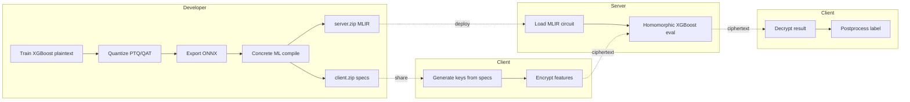
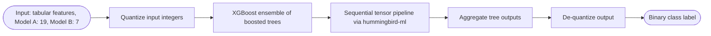
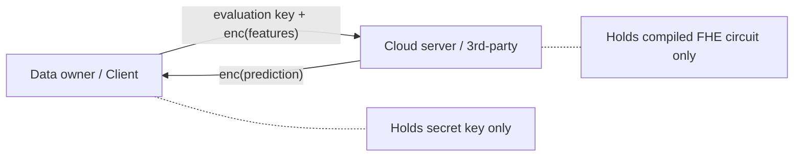

## TL;DR

The authors test Zama Concrete ML (TFHE) on two real-world XGBoost binary classifiers, measuring conversion time, encrypted inference latency, ciphertext expansion, and prediction agreement with plaintext models, and report that FHE is mature enough for production but adds a ~10^6 latency factor and up to 7x data expansion [Abstract, §III-C, §V].

## Problem and motivation

Companies offloading ML training and inference to third-party cloud services must entrust sensitive data (personal, corporate, governmental, health, financial) to providers; encryption today only protects data in transit, not in use [§I]. The paper evaluates whether FHE-based ML is now practical enough to keep data encrypted during cloud inference, addressing GDPR/CCPA compliance concerns [§I]. Threat model: third-party cloud provider that processes data which would otherwise be in plaintext at the server; only the data owner holds the secret key [§I, §II].

## Key contributions

- Practical evaluation of Zama Concrete ML on two real-world binary classifiers (Random Forest and XGBoost) drawn from production use cases [§III].
- Quantification of FHE overhead: ONNX conversion time, circuit compilation time, plaintext vs encrypted inference latency, ciphertext size, and evaluation-key size [§III-C].
- Documentation of a critical adoption pitfall: hummingbird-ml struggles to convert Random Forest models, motivating a switch to XGBoost [§III-A].
- Readiness and feasibility analysis covering adoption overhead, performance downgrade, deployment complexity, and key-management burden [§IV].
- Empirical evidence that agreement between FHE and plaintext predictions is highly sensitive to quantization tuning (99% on Model A vs 22% on Model B) [§III-C, §VI].

## FHE setup

- **Scheme(s):** TFHE (Fully Homomorphic Encryption over the Torus) [§II]
- **Library / implementation:** Zama Concrete ML, built on the Zama Concrete TFHE compiler; conversion via hummingbird-ml; intermediate representation in MLIR [§II, §III-A]
- **Parameters:** 128-bit security; evaluation key sets noted to "easily exceed 300 MB" at 128-bit security [§IV-C]. Polynomial degree N and modulus q referenced generically (ring R_q) but specific numeric values are Not reported [§II].
- **Bootstrapping used:** Yes — TFHE's core technique to control noise growth; the paper highlights TFHE's focus on reducing bootstrapping overhead [§II]
- **Packing / encoding strategy:** Input vector v of real numbers encoded as a polynomial m in R_q, combined with a key to produce ciphertext [v] [§II]. Quantization (QAT or PTQ) converts inputs, weights, and intermediate values to integer equivalents before circuit compilation [§II].

## ML setup

- **Task:** Binary classification (inference only) on tabular data [§III]
- **Model architecture:** Two production XGBoost binary classifiers (referred to as Model A and Model B). Model A: 19 input features; Model B: 7 input features. An initial Random Forest version was retrained as XGBoost because hummingbird-ml handles boosting trees more efficiently [§III-A, §III-C]. No neural network architecture is used — these are tree ensembles, so layer counts and activations are N/A.
- **Activation handling:** N/A — tree-based models; nonlinearity is in tree splits, mapped to TFHE programmable bootstrapping by Concrete ML's compiler [§II, §III-A]
- **Operates on:** plaintext model + encrypted data (server holds the compiled FHE circuit; client encrypts inputs and decrypts outputs) [§II, §III-B]
- **Training vs inference:** Inference under encryption; training done on plaintext data [§II, §III]

## Datasets

| Dataset | Task | Size (train/test) | Modality | Notes |
|---|---|---|---|---|
| Proprietary use-case dataset (Model A) | Binary classification | Trained on >1M records; evaluated on 3000 records | Tabular, 19 features | Real-world production use case [§III, §III-C] |
| Proprietary use-case dataset (Model B) | Binary classification | Trained on >1M records; evaluated on 3000 records | Tabular, 7 features | Real-world production use case; FHE/plaintext agreement only 22% [§III-C] |

## Pipeline diagram

### Pipeline steps (text)

1. Train an XGBoost binary classifier on plaintext data with scikit-learn / PyTorch-compatible APIs [§II].
2. Quantize the model (Post-Training Quantization, or Quantization-Aware Training) so weights and activations are integers [§II].
3. Export to ONNX format via hummingbird-ml [§III-A].
4. Compile with Concrete ML's TFHE compiler to MLIR, producing `server.zip` (compiled circuit, architecture-specific) and `client.zip` (`client.specs.json` for key generation and `serialized_processing.json` for pre/post-processing) [§III-A].
5. Deploy `server.zip` to the inference server (AMD EPYC, 96 vCPUs, 192 GiB) and distribute `client.zip` to the client [§III-B].
6. Client generates secret + evaluation keys from `client.specs.json` and ships the evaluation key plus the encrypted input vector to the server [§III-B, §IV-C].
7. Server runs the homomorphic XGBoost circuit on the ciphertext with the evaluation key [§II, §III-B].
8. Server returns the encrypted result; client decrypts and de-quantizes to obtain the label [§II, §III-B].

## Architecture diagram

Note: the paper does not disclose the number of trees, tree depth, or other XGBoost hyperparameters — Not reported. The diagram reflects the conceptual conversion pipeline that hummingbird-ml and Concrete ML produce, where boosted trees are represented as a "sequential pipeline" of tensor operations [§III-A].

## Results

The paper reports qualitative ratios rather than raw seconds for individual inference. Key reported numbers [§III-C, §V]:

| Metric | This paper | Baseline | Hardware |
|---|---|---|---|
| FHE vs plaintext inference time ratio | ~10^6 increase | 1x (plaintext) | AMD EPYC 3rd-gen, 96 vCPUs, 192 GiB RAM [§III] |
| Encrypted data size vs plaintext | up to 7x larger | 1x | Same [§III-C, §V] |
| Evaluation key size (128-bit security) | "easily exceed 300 MB" | N/A | Same [§IV-C] |
| Prediction agreement plaintext vs FHE (Model A, 19 features) | 99% overlap | — | Same [§III-C] |
| Prediction agreement plaintext vs FHE (Model B, 7 features) | 22% overlap | — | Same [§III-C] |
| ONNX conversion + circuit compilation (post-XGBoost switch) | "a few dozen seconds" | — | Same; single-threaded, one vCPU [§III-A] |
| ONNX conversion (Random Forest first attempt) | Aborted — excessively long | — | Same [§III-A] |
| Evaluation dataset for latency measurements | 3000 records | — | Same [§III-C] |

Single-sample encrypted latency in seconds is Not reported (only the ~10^6 ratio is given without a paired plaintext base time); listed as N/A in the comparison block.

## Limitations and assumptions

- ~10^6 latency overhead vs plaintext, plus encryption, decryption, and upload time on top of computation [§IV-B].
- Encrypted data up to 7x larger than plaintext, raising network transfer costs [§III-C, §V].
- Evaluation key sets can exceed 300 MB at 128-bit security; secure storage, distribution, and rotation strain infrastructure, especially in resource-constrained settings [§IV-C].
- Compiled `server.zip` is architecture-specific (x86 circuit will not run on ARM) [§III-A].
- ONNX conversion is single-threaded (one vCPU), limiting build-time parallelism [§III-A].
- Random Forest models could not be practically converted to ONNX via hummingbird-ml; switching to XGBoost was required [§III-A].
- Model B's 22% agreement with the plaintext model after FHE conversion is unexplained and persisted after retraining; sensitivity of quantization to input-data morphology flagged as future work [§III-C, §VI].
- Only 3000 records evaluated for latency/agreement metrics, on a single high-end server; broader hardware/dataset sweeps deferred [§III-C, §VI].
- The paper does not report raw seconds for one encrypted inference, polynomial degree N, modulus q, or XGBoost hyperparameters — only ratios and qualitative figures.

## Related work it compares against

- Gentry's original FHE scheme (2009) [§I, ref 4].
- GSW (Gentry-Sahai-Waters) schemes and "ring variant" that TFHE generalizes [§II, ref 10].
- TFHE (Chillotti et al.) as the underlying scheme [§II, ref 3].
- Zama Concrete ML framework as the system under evaluation, not as a baseline [§II, ref 2].
- hummingbird-ml as the conversion backend [§III-A, ref 9].
No direct quantitative comparison to other FHE-ML systems (CryptoNets, nGraph-HE, Gazelle, etc.) is performed; the baseline is the same model run in plaintext on the same hardware [§III-C].

## Code and artifacts

Not released. The paper does not link to a public repository for the evaluation pipeline or the (proprietary) datasets [§III, §V].

## Extra diagrams (optional)

### Threat model

The cloud server is treated as untrusted with respect to data confidentiality; it never sees plaintext features or labels, only ciphertexts and the evaluation key [§I, §II, §III-B].

## Open questions

- What is the absolute single-sample encrypted inference time in seconds? The paper only reports the ~10^6 ratio without a paired plaintext baseline number.
- Why did Model B (7 features) collapse to 22% agreement while Model A (19 features) kept 99%? Is it the quantization bit budget, input distribution, tree structure, or PTQ vs QAT?
- What polynomial degree N, ciphertext modulus q, and quantization bit-width were used for each model?
- How many trees and what max depth did the XGBoost ensembles have? This drives circuit size and bootstrapping count.
- Was QAT or PTQ used for each model? The paper describes both options but does not clearly state which produced the reported results.
